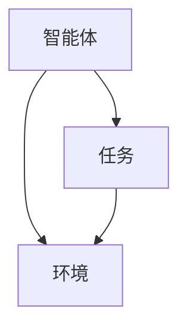
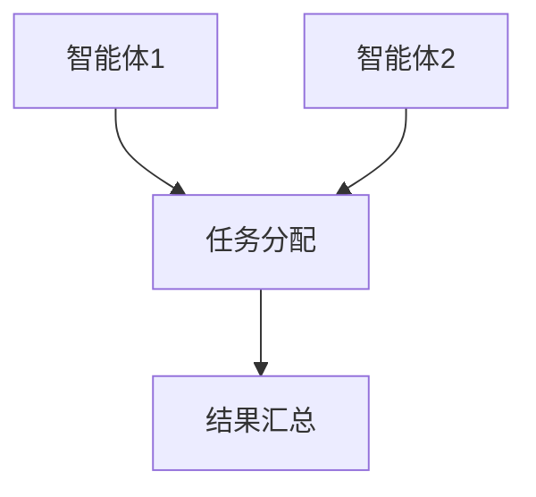
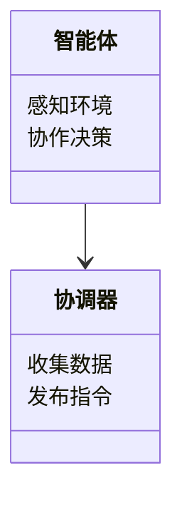
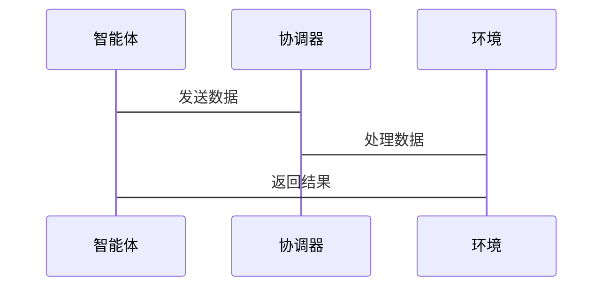

                 


# 多智能体系统实现智能化行业比较分析

> 关键词：多智能体系统，智能化行业，分布式计算，协作算法，系统架构

> 摘要：本文深入分析了多智能体系统在不同行业中的实现与应用，探讨了其核心概念、算法原理、系统架构，并通过具体案例展示了其在智能制造、交通管理等领域的实际应用。文章旨在为技术从业者提供理论支持与实践指导，帮助他们在实际项目中更好地应用多智能体系统。

---

## 第一部分：多智能体系统背景与核心概念

### 第1章：多智能体系统概述

#### 1.1 多智能体系统的基本概念

**多智能体系统（Multi-Agent System, MAS）**是由多个智能体（Agent）组成的分布式系统，这些智能体通过协作完成特定任务。智能体是具有感知、决策、执行能力的实体，能够独立工作并与其他智能体或环境交互。

**MAS的特点**包括：
- **分布性**：智能体独立运行，不依赖中心节点。
- **协作性**：智能体之间通过通信和协调完成任务。
- **反应性**：能够实时感知环境变化并做出响应。
- **自主性**：每个智能体都有自主决策的能力。

**MAS的应用领域**广泛，包括智能制造、智能交通、智能家居、金融交易等领域。每个行业对MAS的需求和实现方式有所不同，本文将重点分析这些差异。

---

### 第2章：多智能体系统的应用领域

#### 2.1 制造业中的多智能体系统

在制造业中，MAS常用于生产优化和设备管理。例如，工厂中的传感器、机器人和控制系统可以作为智能体，实时监控生产状态并协作解决问题。

**案例分析**：某汽车制造厂使用MAS优化生产线。传感器智能体监控设备状态，机器人智能体负责零件装配，系统智能体协调整个生产流程。通过MAS，工厂实现了高效生产调度和资源优化。

#### 2.2 交通系统中的多智能体系统

在交通领域，MAS用于智能交通管理。例如，信号灯智能体协调车流，自动驾驶汽车智能体实时决策行驶路线，交通监控系统智能体整合数据。

**案例分析**：某城市交通管理系统采用MAS实现智能调度。信号灯智能体根据车流量调整绿灯时长，自动驾驶汽车智能体规划最优路径，监控系统智能体整合交通数据并预测拥堵点。

#### 2.3 智能家居中的多智能体系统

在智能家居中，MAS用于设备协作。例如，智能音箱、智能灯泡、智能门锁等设备作为智能体，通过物联网平台协作完成用户指令。

**案例分析**：用户通过语音指令开启灯光，智能音箱智能体接收指令后，通过物联网平台通知智能灯泡智能体执行操作。整个过程实现了设备间的无缝协作。

---

## 第二部分：多智能体系统的核心概念与联系

### 第3章：多智能体系统的实体关系分析

#### 3.1 实体关系图

在MAS中，智能体与环境、任务以及其他智能体之间存在复杂的交互关系。以下是一个简单的实体关系图：



图中，智能体（Agent）与任务（Task）和环境（Environment）交互，任务由环境触发，智能体协作完成任务。

#### 3.2 行业对比分析表

以下是不同行业MAS的特点对比：

| 行业       | 特点                           | 智能体类型       | 应用场景               |
|------------|--------------------------------|------------------|-----------------------|
| 制造业     | 高效生产，设备协作             | 传感器、机器人   | 生产线优化、设备监控   |
| 交通       | 实时调度，减少拥堵             | 车辆、信号灯     | 智能交通管理           |
| 智能家居   | 用户驱动，设备协作             | 智能音箱、灯泡   | 家庭自动化、便捷控制   |

通过对比可以看出，不同行业的MAS实现方式和应用场景存在显著差异。

---

## 第三部分：多智能体系统的算法原理

### 第4章：多智能体系统的核心算法

#### 4.1 分布式计算算法

MAS的分布式计算是其核心之一。分布式计算算法通过将任务分解到多个智能体，实现并行处理和负载均衡。

**算法流程图**如下：



#### 4.2 协作算法实现

协作算法是MAS的关键，用于智能体之间的协调与通信。以下是协作算法的Python实现示例：

```python
def collaborate_agents(agents):
    coordinator = Coordinator()
    for agent in agents:
        data = agent.sense_environment()
        coordinator.receive_data(data)
    result = coordinator.process_data()
    return result
```

**算法原理**：每个智能体感知环境数据，通过协调器汇总数据，协调器处理后返回结果。

#### 4.3 一致性算法

一致性算法用于保证多个智能体之间的数据一致。常用的一致性算法包括Paxos和Raft。

**一致性算法公式**：

$$ \text{一致性条件}：\forall i, x_i \text{的值相同} $$

---

## 第四部分：系统分析与架构设计

### 第5章：多智能体系统的架构设计

#### 5.1 问题场景分析

以智能制造为例，生产线上的机器人、传感器和控制系统需要协作完成生产任务。问题场景包括设备故障、生产优化、库存管理等。

#### 5.2 系统功能设计

以下是系统的功能模块设计：



**系统架构设计**：采用分层架构，包括感知层、决策层和执行层。

#### 5.3 系统接口设计

系统接口设计包括智能体与协调器的交互接口、协调器与环境的交互接口等。

**系统交互流程图**：



---

## 第五部分：项目实战

### 第6章：多智能体系统的项目实战

#### 6.1 智能制造项目

**环境安装**：安装Python、ROS（机器人操作系统）、MQTT协议库。

**核心代码实现**：

```python
import rospy
from std_msgs.msg import String

class Agent:
    def __init__(self, name):
        self.name = name
        self.publisher = rospy.Publisher('/' + name, String, queue_size=10)
    
    def send_message(self, message):
        self.publisher.publish(message)

def main():
    rospy.init_node('agent_node')
    agent = Agent('robot1')
    agent.send_message('start production')

if __name__ == '__main__':
    main()
```

**代码解读**：该代码实现了一个简单的智能体，通过ROS发布消息，启动生产流程。

---

## 第六部分：最佳实践与小结

### 第7章：多智能体系统的最佳实践

#### 7.1 小结

多智能体系统在不同行业中的应用具有显著差异，需要根据具体需求设计系统的架构和算法。本文通过案例分析和理论探讨，为技术从业者提供了理论支持与实践指导。

#### 7.2 注意事项

- 确保智能体之间的通信效率。
- 处理智能体之间的冲突与协调问题。
- 定期更新系统以适应环境变化。

#### 7.3 拓展阅读

建议读者深入研究分布式系统、一致性算法和多智能体协作算法，以更好地应用MAS技术。

---

## 附录

### 附录A：常用工具与库

- **Python库**：ROS、MQTT、ZMQ。
- **开发框架**：Django、Flask。
- **算法库**：scikit-learn、TensorFlow。

### 附录B：代码示例

```python
import rospy
from std_msgs.msg import String

class Agent:
    def __init__(self, name):
        self.name = name
        self.publisher = rospy.Publisher('/' + name, String, queue_size=10)
    
    def send_message(self, message):
        self.publisher.publish(message)

def main():
    rospy.init_node('agent_node')
    agent = Agent('robot1')
    agent.send_message('start production')

if __name__ == '__main__':
    main()
```

---

以上是《多智能体系统实现智能化行业比较分析》的完整目录和内容概要。希望本文能为读者提供深入的理论支持与实践指导。

