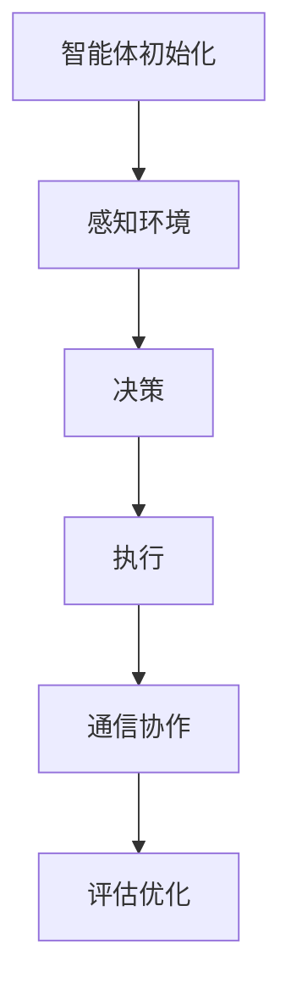
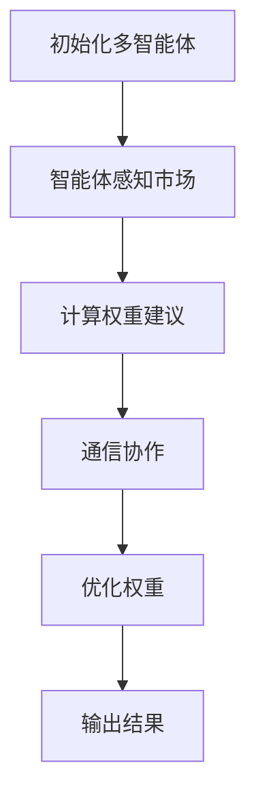
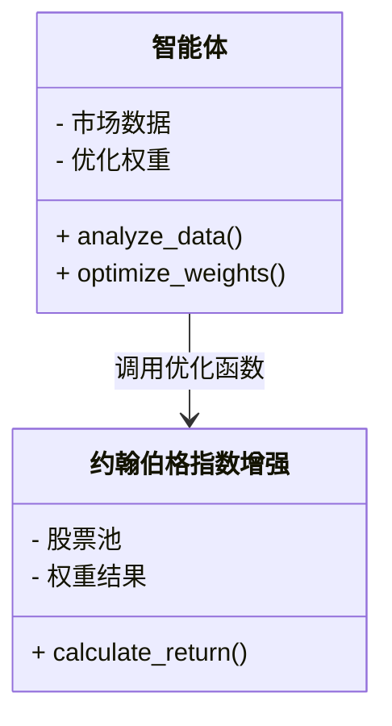
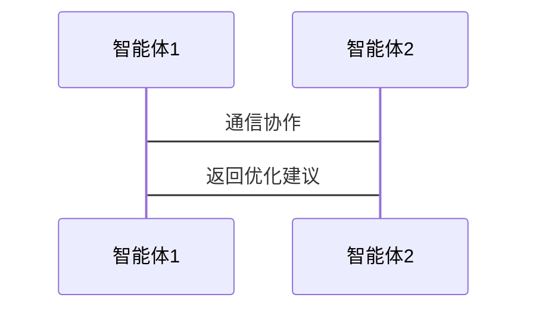

                 


# 多智能体系统实现约翰伯格指数增强

## 关键词：多智能体系统，指数增强，约翰伯格，算法原理，系统架构

## 摘要：本文探讨了多智能体系统在实现约翰伯格指数增强中的应用，从系统背景、核心概念、算法原理、系统架构到项目实战，全面分析了多智能体系统如何通过协作优化来提升指数增强的效果。

---

# 第一部分: 多智能体系统与约翰伯格指数增强的背景介绍

## 第1章: 多智能体系统与约翰伯格指数增强的背景介绍

### 1.1 多智能体系统的定义与特点

#### 1.1.1 多智能体系统的定义
多智能体系统（Multi-Agent System, MAS）是由多个智能体组成的分布式系统，这些智能体能够通过协作完成复杂的任务。智能体是具有感知、决策、推理和执行能力的实体。

#### 1.1.2 多智能体系统的核心特点
- **自主性**：每个智能体都能独立决策。
- **反应性**：智能体能实时感知环境并做出反应。
- **协作性**：多个智能体协同工作，共同完成任务。
- **分布性**：系统由多个分散的智能体组成，无集中控制节点。

#### 1.1.3 多智能体系统的应用场景
- 机器人协作
- 自动驾驶
- 分布式计算
- 金融投资

### 1.2 约翰伯格指数增强的背景与目标

#### 1.2.1 约翰伯格指数增强的定义
约翰伯格指数增强是一种投资策略，通过优化权重来增强指数的表现，同时控制风险。其核心目标是超越基准指数的收益。

#### 1.2.2 约翰伯格指数增强的目标
- 提高投资组合的收益
- 控制风险
- 适应市场变化

#### 1.2.3 约翰伯格指数增强的应用场景
- 机构投资
- 资产管理
- 基金管理

### 1.3 多智能体系统与约翰伯格指数增强的结合

#### 1.3.1 问题背景与问题描述
传统指数增强方法依赖单一模型，难以适应复杂市场环境。多智能体系统通过分布式协作，能够更好地捕捉市场机会。

#### 1.3.2 多智能体系统在指数增强中的作用
- 分散风险
- 提高决策效率
- 实时适应市场变化

#### 1.3.3 系统的边界与外延
- 边界：多智能体系统与外部市场的接口。
- 外延：扩展到其他金融领域。

### 1.4 本章小结
本章介绍了多智能体系统的定义、特点及其应用场景，详细阐述了约翰伯格指数增强的目标和应用场景，并探讨了多智能体系统在指数增强中的作用。

---

## 第2章: 多智能体系统与约翰伯格指数增强的核心概念与联系

### 2.1 多智能体系统的原理

#### 2.1.1 多智能体系统的组成要素
- **智能体**：独立决策的单元。
- **环境**：智能体所处的外部世界。
- **通信机制**：智能体之间交换信息的方式。
- **协作机制**：智能体协同工作的规则。

#### 2.1.2 多智能体系统的通信机制
- **直接通信**：智能体之间直接交换信息。
- **间接通信**：通过中间媒介传递信息。

#### 2.1.3 多智能体系统的协作机制
- **任务分配**：智能体根据能力分配任务。
- **协调同步**：智能体协同完成任务。
- **冲突解决**：处理协作中的冲突。

### 2.2 约翰伯格指数增强的原理

#### 2.2.1 约翰伯格指数增强的数学模型
约翰伯格指数增强的优化目标是最大化收益，同时最小化与基准指数的偏离风险。

公式：
$$ \text{收益} = \sum_{i=1}^n w_i r_i $$
$$ \text{风险} = \sum_{i=1}^n w_i^2 \sigma_i^2 $$

优化目标：
$$ \max \text{收益} - \lambda \text{风险} $$

#### 2.2.2 约翰伯格指数增强的优化目标
- 最大化收益
- 最小化风险
- 保持与基准指数的相似性

#### 2.2.3 约翰伯格指数增强的实现方法
- 使用优化算法（如遗传算法）调整权重。
- 实时监控市场变化，动态调整权重。

### 2.3 多智能体系统与约翰伯格指数增强的对比分析

#### 2.3.1 核心概念对比
| 对比项       | 多智能体系统                     | 约翰伯格指数增强                 |
|--------------|----------------------------------|----------------------------------|
| 核心目标     | 协作完成任务                   | 优化权重以增强收益               |
| 实现方式     | 分布式协作                     | 数学优化                        |
| 应用场景     | 多领域                         | 金融投资                        |

#### 2.3.2 特征对比
- 多智能体系统强调协作和分布，而约翰伯格指数增强强调优化和风险控制。
- 多智能体系统适用于多种场景，而约翰伯格指数增强专注于金融领域。

#### 2.3.3 应用场景对比
- 多智能体系统应用于复杂任务，而约翰伯格指数增强应用于投资策略。

### 2.4 本章小结
本章分析了多智能体系统和约翰伯格指数增强的核心概念，通过对比明确了它们的差异与联系，为后续实现奠定了基础。

---

## 第3章: 多智能体系统与约翰伯格指数增强的算法原理

### 3.1 多智能体系统的算法原理

#### 3.1.1 多智能体系统的算法流程
1. 初始化智能体。
2. 智能体感知环境。
3. 智能体决策并执行。
4. 通信协作。
5. 评估结果并优化。

流程图：


#### 3.1.2 多智能体系统的通信协议
- 基于消息传递的协议。
- 使用中间件进行通信。

#### 3.1.3 多智能体系统的协作算法
- 分布式协作算法。
- 基于共识的协作机制。

### 3.2 约翰伯格指数增强的算法原理

#### 3.2.1 约翰伯格指数增强的数学模型
优化目标：
$$ \max \sum_{i=1}^n w_i r_i - \lambda \sum_{i=1}^n w_i^2 \sigma_i^2 $$
约束条件：
$$ \sum_{i=1}^n w_i = 1 $$

#### 3.2.2 约翰伯格指数增强的优化算法
- 使用拉格朗日乘数法求解优化问题。
- 通过遗传算法或粒子群算法优化权重。

#### 3.2.3 约翰伯格指数增强的实现步骤
1. 数据收集与预处理。
2. 构建优化模型。
3. 确定优化参数。
4. 实现优化算法。
5. 验证与测试。

### 3.3 多智能体系统与约翰伯格指数增强的结合算法

#### 3.3.1 算法流程图


#### 3.3.2 算法实现步骤
1. 初始化多个智能体。
2. 每个智能体分析市场数据。
3. 智能体之间通信，共享信息。
4. 协作优化权重。
5. 输出优化后的权重。

### 3.4 本章小结
本章详细讲解了多智能体系统和约翰伯格指数增强的算法原理，并通过流程图展示了它们的结合方式，为后续系统设计奠定了基础。

---

## 第4章: 多智能体系统与约翰伯格指数增强的系统分析与架构设计

### 4.1 系统分析

#### 4.1.1 问题场景介绍
在金融投资中，市场环境复杂多变，单靠传统优化方法难以适应。多智能体系统通过协作，能够更好地捕捉市场机会。

#### 4.1.2 系统功能需求分析
- 数据采集与处理。
- 智能体协作优化。
- 权重优化与输出。

#### 4.1.3 系统性能需求分析
- 响应时间：实时处理。
- 可扩展性：支持多个智能体。

### 4.2 系统架构设计

#### 4.2.1 领域模型设计（使用 Mermaid 类图）


#### 4.2.2 系统架构设计（使用 Mermaid 架构图）


### 4.3 系统接口设计

#### 4.3.1 系统接口设计
- 智能体间的通信接口。
- 优化算法的调用接口。

#### 4.3.2 系统交互设计（使用 Mermaid 序列图）


### 4.4 本章小结
本章通过对系统的分析与架构设计，明确了多智能体系统和约翰伯格指数增强的协作关系，并设计了系统的架构和接口。

---

## 第5章: 多智能体系统与约翰伯格指数增强的项目实战

### 5.1 环境安装

#### 5.1.1 安装Python
- 安装Anaconda或Miniconda。
- 配置环境变量。

#### 5.1.2 安装依赖库
- 使用pip安装numpy、pandas、scipy等库。

#### 5.1.3 安装框架
- 使用RabbitMQ或ZeroMQ进行通信。

### 5.2 系统核心实现源代码

#### 5.2.1 智能体类
```python
class Agent:
    def __init__(self, id):
        self.id = id
        self.data = None
        self.weight = None

    def analyze_data(self):
        # 数据分析逻辑
        pass

    def optimize_weights(self):
        # 权重优化逻辑
        pass

    def communicate(self, other_agent):
        # 通信逻辑
        pass
```

#### 5.2.2 约翰伯格指数增强类
```python
class JohnBurgeEnhancement:
    def __init__(self, stock_pool):
        self.stock_pool = stock_pool
        self.weights = None

    def calculate_return(self, weights):
        # 计算收益
        pass

    def optimize(self):
        # 使用优化算法求解
        pass
```

### 5.3 代码应用解读与分析

#### 5.3.1 智能体的初始化与协作
```python
agent1 = Agent(1)
agent2 = Agent(2)
agent1.communicate(agent2)
```

#### 5.3.2 权重优化与输出
```python
jb = JohnBurgeEnhancement(stock_pool)
jb.optimize()
print(jb.weights)
```

### 5.4 实际案例分析

#### 5.4.1 数据收集与预处理
收集股票数据，进行清洗和特征提取。

#### 5.4.2 系统实现与测试
运行系统，测试优化结果。

#### 5.4.3 结果分析与总结
分析优化后的收益和风险，总结系统的优缺点。

### 5.5 本章小结
本章通过实际案例展示了多智能体系统与约翰伯格指数增强的实现过程，并对结果进行了分析。

---

## 第6章: 多智能体系统与约翰伯格指数增强的最佳实践 tips

### 6.1 小结
- 多智能体系统通过协作优化，能够提升指数增强的效果。
- 约翰伯格指数增强通过优化权重，能够实现收益与风险的平衡。

### 6.2 注意事项
- 确保智能体之间的通信高效可靠。
- 定期更新优化算法以适应市场变化。
- 注意风险控制，避免过度优化。

### 6.3 拓展阅读
- 《Multi-Agent Systems》
- 《John Bogle's New Investment Guide》

### 6.4 本章小结
本章总结了实现多智能体系统与约翰伯格指数增强的最佳实践，提供了注意事项和拓展阅读的方向。

---

## 附录

### 附录A: 参考文献
- 参考文献1：Bacon, R. D. (2008). *The Strategic Value of Systematic Investing*.
- 参考文献2：Hoggatt, S. (2000). *Building a CAPM-based Index*.

### 附录B: 索引
- 多智能体系统：第1章、第2章、第3章。
- 约翰伯格指数增强：第1章、第2章、第3章。

---

# 结语
通过本文的详细分析，读者可以深入了解多智能体系统与约翰伯格指数增强的结合方式，并通过实际案例掌握其实现方法。希望本文能为相关领域的研究和实践提供有价值的参考。

