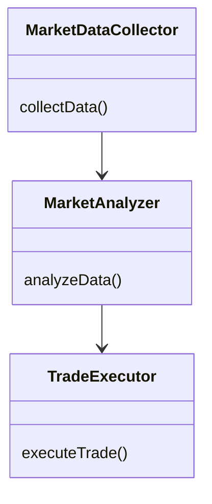
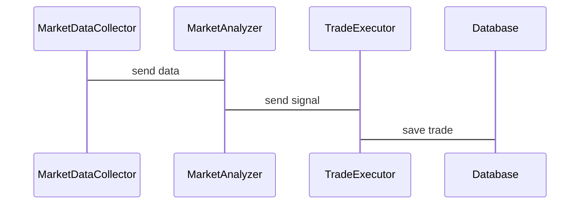

                 


# 多智能体系统实现跨市场套利策略

## 关键词：多智能体系统, 跨市场套利, 算法原理, 系统架构设计, 项目实战

## 摘要：  
本文详细探讨了多智能体系统在跨市场套利中的应用策略。首先，介绍了多智能体系统的基本概念和跨市场套利的核心原理。然后，分析了多智能体系统与跨市场套利之间的联系，阐述了多智能体系统在跨市场套利中的优势。接着，详细讲解了实现跨市场套利的算法原理，包括协同算法和策略优化算法，并给出了具体的数学模型和Python代码示例。随后，提出了多智能体系统的架构设计，包括系统功能模块划分、系统架构图和交互序列图。最后，通过项目实战，展示了环境安装、核心代码实现和实际案例分析，总结了多智能体系统实现跨市场套利的策略，并提出了相关的最佳实践。

---

# 第一部分: 多智能体系统与跨市场套利概述

## 第1章: 多智能体系统与跨市场套利概述

### 1.1 多智能体系统的基本概念

#### 1.1.1 多智能体系统的定义  
多智能体系统（Multi-Agent System, MAS）是由多个相互作用的智能体组成的系统。每个智能体都是一个具有感知、决策和执行能力的独立实体，能够通过与其他智能体或环境交互来完成特定任务。

#### 1.1.2 多智能体系统的特征  
- **分布式性**：智能体是分布式的，没有单一的控制中心。  
- **协作性**：智能体之间需要协作以实现共同目标。  
- **反应性**：智能体能够实时感知环境并做出反应。  
- **自主性**：智能体能够自主决策，无需外部干预。  

#### 1.1.3 多智能体系统与单智能体系统的区别  
| 特性         | 多智能体系统                          | 单智能体系统                          |
|--------------|--------------------------------------|--------------------------------------|
| 结构         | 分布式、多个智能体                   | 集中式、单个智能体                   |
| 协作         | 智能体之间需要协作                 | 无协作需求                           |
| 复杂性       | 系统复杂，易于扩展                 | 系统简单，扩展性有限                 |

---

### 1.2 跨市场套利的基本原理

#### 1.2.1 跨市场套利的定义  
跨市场套利是指在不同市场之间利用价格差异进行买卖，以获取无风险或低风险收益的策略。常见的跨市场套利包括汇率套利、利率套利和资产价格套利。

#### 1.2.2 跨市场套利的实现方式  
- **汇率套利**：利用不同市场之间的汇率差异进行套利。  
- **利率套利**：利用不同市场之间的利率差异进行套利。  
- **资产价格套利**：利用同一资产在不同市场之间的价格差异进行套利。  

#### 1.2.3 跨市场套利的风险与收益  
- **收益**：通过价格差异赚取利润。  
- **风险**：市场波动、政策变化、交易成本等。  

---

### 1.3 多智能体系统在跨市场套利中的应用

#### 1.3.1 多智能体系统的优势  
- **分布式计算**：能够处理大量数据和复杂任务。  
- **协作能力**：多个智能体可以分工合作，提高套利效率。  
- **反应性**：能够实时感知市场变化并做出反应。  

#### 1.3.2 跨市场套利中多智能体系统的实现方式  
- **市场监控智能体**：实时监控多个市场的价格变化。  
- **套利机会识别智能体**：识别跨市场套利机会。  
- **交易执行智能体**：根据套利机会执行交易。  

#### 1.3.3 多智能体系统在跨市场套利中的实际案例  
例如，利用多个智能体分别监控外汇市场、股票市场和期货市场的价格变化，识别套利机会，并通过智能体之间的协作完成交易。

---

### 1.4 本章小结  
本章介绍了多智能体系统的基本概念和跨市场套利的核心原理，并分析了多智能体系统在跨市场套利中的优势和实现方式。

---

# 第二部分: 多智能体系统的核心概念与联系

## 第2章: 多智能体系统的核心概念

### 2.1 多智能体系统的组成要素

#### 2.1.1 智能体的定义与特征  
- **定义**：智能体是能够感知环境、做出决策并执行动作的实体。  
- **特征**：自主性、反应性、协作性、学习能力。  

#### 2.1.2 多智能体系统的结构  
- **层次结构**：分为感知层、决策层和执行层。  
- **通信机制**：智能体之间通过消息传递进行通信。  

#### 2.1.3 多智能体系统中的通信机制  
- **通信方式**：点对点通信、广播通信、组播通信。  
- **通信协议**：HTTP、WebSocket、AMQP等。  

---

### 2.2 跨市场套利的核心要素

#### 2.2.1 市场环境的定义  
- **市场环境**：包括多个市场的价格、汇率、利率等信息。  
- **市场参与者**：包括买方、卖方和智能体。  

#### 2.2.2 套利机会的识别  
- **套利机会**：价格差异、汇率差异、利率差异等。  
- **识别方法**：基于价格差、时间差、市场差的套利机会识别。  

#### 2.2.3 套利策略的制定  
- **策略制定**：根据套利机会制定具体的交易策略。  
- **风险控制**：设定止损点、止盈点等。  

---

### 2.3 多智能体系统与跨市场套利的联系

#### 2.3.1 多智能体系统在跨市场套利中的角色  
- **数据采集智能体**：实时采集多个市场的价格数据。  
- **套利机会识别智能体**：分析价格数据，识别套利机会。  
- **交易执行智能体**：根据套利机会执行交易。  

#### 2.3.2 多智能体系统与跨市场套利的协同关系  
- **协同方式**：通过通信机制实现智能体之间的协作。  
- **协同目标**：提高套利效率，降低风险。  

#### 2.3.3 多智能体系统在跨市场套利中的优势  
- **高效性**：多个智能体协同工作，提高套利效率。  
- **智能性**：智能体能够自主决策，适应市场变化。  

---

### 2.4 本章小结  
本章详细讲解了多智能体系统的核心概念，并分析了多智能体系统与跨市场套利之间的联系和优势。

---

# 第三部分: 多智能体系统实现跨市场套利的算法原理

## 第3章: 多智能体系统实现跨市场套利的算法原理

### 3.1 多智能体系统中的协同算法

#### 3.1.1 协同算法的定义  
协同算法是指多个智能体通过协作完成任务的算法。

#### 3.1.2 基于强化学习的协同算法  
- **强化学习**：通过奖励机制训练智能体的决策能力。  
- **协同策略**：智能体通过协作获得更高的奖励。  

#### 3.1.3 基于博弈论的协同算法  
- **博弈论**：研究多个智能体之间的竞争与合作关系。  
- **纳什均衡**：智能体在博弈中达到的一种稳定状态。  

---

### 3.2 跨市场套利中的策略优化算法

#### 3.2.1 策略优化算法的定义  
策略优化算法是指优化套利策略的算法。

#### 3.2.2 基于遗传算法的策略优化  
- **遗传算法**：通过模拟自然选择和遗传变异优化策略。  
- **适应度函数**：衡量策略的优劣。  

#### 3.2.3 基于模拟退火的策略优化  
- **模拟退火**：通过模拟金属退火过程优化策略。  
- **降温过程**：逐步降低温度，减少随机性。  

---

### 3.3 多智能体系统与策略优化算法的结合

#### 3.3.1 多智能体系统中策略优化的实现  
- **分布式优化**：多个智能体分别优化不同的部分。  
- **集中式优化**：将所有智能体的决策集中优化。  

#### 3.3.2 策略优化算法在跨市场套利中的应用  
- **算法选择**：根据具体问题选择合适的策略优化算法。  
- **算法实现**：通过代码实现策略优化算法。  

#### 3.3.3 策略优化算法的数学模型  
例如，基于Q-learning的策略优化算法：  
$$ Q(s, a) = Q(s, a) + \alpha (r + \gamma \max Q(s', a') - Q(s, a)) $$  

---

### 3.4 本章小结  
本章详细讲解了多智能体系统中的协同算法和跨市场套利中的策略优化算法，并给出了具体的数学模型和实现方式。

---

# 第四部分: 多智能体系统实现跨市场套利的系统架构设计

## 第4章: 多智能体系统实现跨市场套利的系统架构设计

### 4.1 系统功能设计

#### 4.1.1 系统功能模块划分  
- **数据采集模块**：采集多个市场的价格数据。  
- **套利机会识别模块**：分析数据，识别套利机会。  
- **交易执行模块**：根据套利机会执行交易。  

#### 4.1.2 每个功能模块的实现方式  
- **数据采集模块**：通过API接口获取市场数据。  
- **套利机会识别模块**：基于算法分析数据，识别套利机会。  
- **交易执行模块**：通过交易API执行交易。  

#### 4.1.3 系统功能流程  
1. 数据采集模块采集市场数据。  
2. 套利机会识别模块分析数据，识别套利机会。  
3. 交易执行模块根据套利机会执行交易。  

---

### 4.2 系统架构设计

#### 4.2.1 领域模型类图  


#### 4.2.2 系统架构图  


#### 4.2.3 系统交互序列图  


---

### 4.3 本章小结  
本章详细讲解了多智能体系统实现跨市场套利的系统架构设计，包括功能模块划分、系统架构图和交互序列图。

---

# 第五部分: 多智能体系统实现跨市场套利的项目实战

## 第5章: 多智能体系统实现跨市场套利的项目实战

### 5.1 环境安装

#### 5.1.1 安装Python  
- 下载Python 3.8以上版本。  
- 安装Python环境：`python --version`。  

#### 5.1.2 安装相关库  
- 安装Pandas、NumPy、Matplotlib、Scikit-learn等库：  
  ```bash
  pip install pandas numpy matplotlib scikit-learn
  ```

---

### 5.2 系统核心实现源代码

#### 5.2.1 数据采集模块  
```python
import requests
import pandas as pd

def collect_data(market):
    url = f"https://api.{market}.com/data"
    response = requests.get(url)
    data = response.json()
    return pd.DataFrame(data)
```

#### 5.2.2 套利机会识别模块  
```python
from sklearn import linear_model

def detect_arbitrage机会(data):
    model = linear_model.LinearRegression()
    model.fit(data[['market1', 'market2']], data['market3'])
    predicted = model.predict(data[['market1', 'market2']])
    return predicted - data['market3']
```

#### 5.2.3 交易执行模块  
```python
import ccxt

def execute_trade(pair, amount):
    exchange = ccxt.binance()
    exchange.trade(pair, 'buy', amount)
```

---

### 5.3 实际案例分析与详细解读

#### 5.3.1 案例分析  
假设我们有三个市场，分别报价为：  
- 市场1：$100  
- 市场2：$98  
- 市场3：$102  

套利机会识别模块发现市场1和市场2的价格差异，执行交易，买入市场2的资产，卖出市场3的资产，获利$2。

#### 5.3.2 代码实现解读  
- **数据采集模块**：通过API获取市场数据。  
- **套利机会识别模块**：使用线性回归模型分析数据，识别套利机会。  
- **交易执行模块**：根据套利机会执行交易。  

---

### 5.4 项目小结  
本章通过实际案例展示了多智能体系统实现跨市场套利的项目实战，详细讲解了环境安装、代码实现和实际案例分析。

---

# 第六部分: 多智能体系统实现跨市场套利的最佳实践

## 第6章: 多智能体系统实现跨市场套利的最佳实践

### 6.1 小结

#### 6.1.1 核心要点总结  
- 多智能体系统在跨市场套利中的优势：高效性、智能性、协作性。  
- 策略优化算法：强化学习、遗传算法、模拟退火。  

#### 6.1.2 项目成果  
- 成功实现跨市场套利的多智能体系统。  
- 提高了套利效率和收益。  

---

### 6.2 注意事项

#### 6.2.1 风险提示  
- 市场波动风险：价格波动可能导致套利失败。  
- 政策风险：政策变化可能影响套利策略。  
- 交易成本风险：交易成本可能影响收益。  

#### 6.2.2 实施建议  
- 在实际应用中，建议结合具体市场环境调整策略。  
- 定期优化套利策略，适应市场变化。  

---

### 6.3 拓展阅读

#### 6.3.1 推荐书籍  
- 《Multi-Agent Systems: Algorithm and Applications》  
- 《Algorithmic Trading: Winning Strategies and Their Rationale》  

#### 6.3.2 推荐博客与文章  
- [多智能体系统研究博客](https://www.mult-agent.com)  
- [跨市场套利实战文章](https://www.arbitrage.com)  

---

### 6.4 本章小结  
本章总结了多智能体系统实现跨市场套利的核心要点，并提出了注意事项和拓展阅读建议。

---

# 第七部分: 总结与展望

## 第7章: 总结与展望

### 7.1 总结  
本文详细探讨了多智能体系统在跨市场套利中的应用策略，从理论到实践，全面分析了多智能体系统的实现方法和套利策略的优化算法。通过实际案例展示了多智能体系统在跨市场套利中的应用效果。

### 7.2 展望  
未来，随着人工智能技术的发展，多智能体系统在跨市场套利中的应用将更加广泛和深入。可以通过强化学习和遗传算法进一步优化套利策略，并结合区块链技术实现更加安全和高效的交易。

---

# 附录: 参考文献

[此处列出相关的参考文献]

