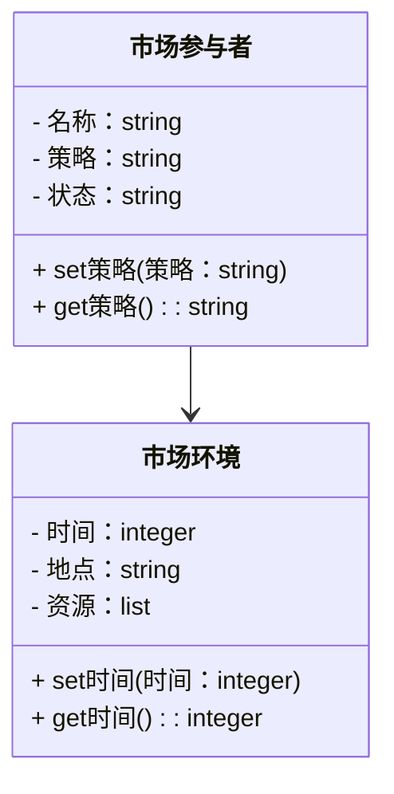
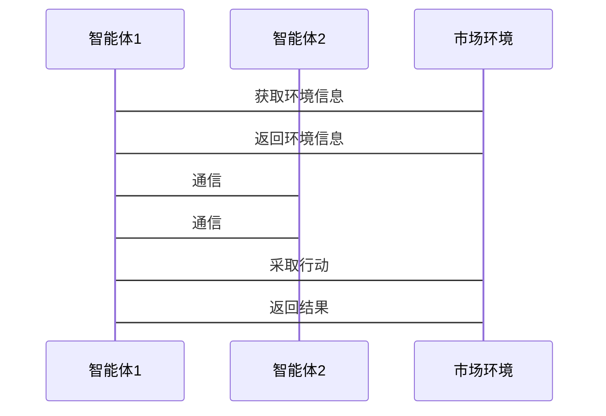

                 


# 多智能体系统模拟市场参与者行为

> 关键词：多智能体系统、市场模拟、行为建模、博弈论、强化学习、系统架构

> 摘要：本文详细探讨了多智能体系统在模拟市场参与者行为中的应用，从基本概念到复杂算法，从系统架构到实际案例，系统地介绍了如何利用多智能体技术来建模和分析市场行为，帮助读者理解市场动态并进行预测和优化。

---

## 第1章: 多智能体系统概述

### 1.1 多智能体系统的基本概念

#### 1.1.1 多智能体系统的定义
多智能体系统（Multi-Agent Systems, MAS）是由多个相互作用的智能体组成的系统，这些智能体能够感知环境、自主决策并采取行动。与单智能体系统相比，MAS强调智能体之间的协作与竞争。

#### 1.1.2 多智能体系统的特征
- **自主性**：每个智能体都具有自主决策的能力。
- **反应性**：智能体能够实时感知环境并做出反应。
- **协作性**：智能体之间可以通过通信和协作共同完成任务。
- **社会性**：智能体之间的交互类似于社会中的个体，具有复杂的社会行为。

#### 1.1.3 多智能体系统与单智能体系统的区别
单智能体系统通常处理的是单一决策问题，而多智能体系统则需要处理多个智能体之间的交互和协调问题。

### 1.2 市场模拟的背景与意义

#### 1.2.1 市场模拟的基本概念
市场模拟是指通过建模和仿真技术，模拟市场中各参与者的交互行为及其对市场整体的影响。市场模拟可以帮助我们理解市场动态、预测市场趋势，并优化市场策略。

#### 1.2.2 多智能体系统在市场模拟中的应用
- **金融市场的模拟**：如股票交易、外汇市场等。
- **拍卖市场的模拟**：如 eBay 等在线拍卖平台。
- **供应链管理**：模拟供应链中的供应商、制造商、分销商等参与者的行为。

#### 1.2.3 市场模拟的挑战与机遇
- **挑战**：市场参与者的复杂行为、信息不对称、实时决策等。
- **机遇**：通过多智能体系统可以更真实地模拟市场动态，为决策提供支持。

### 1.3 多智能体系统模拟市场行为的核心要素

#### 1.3.1 市场参与者的决策机制
市场参与者的决策机制是多智能体系统的核心，包括信息获取、决策规则和行动策略。

#### 1.3.2 市场环境的构建
市场环境的构建包括市场规则、资源分配、时间和空间等因素。

#### 1.3.3 智能体之间的交互规则
智能体之间的交互规则包括通信协议、交易规则、竞争与协作机制等。

### 1.4 本章小结
本章介绍了多智能体系统的基本概念和市场模拟的背景与意义，重点讨论了多智能体系统模拟市场行为的核心要素，为后续章节奠定了基础。

---

## 第2章: 多智能体系统的核心概念与联系

### 2.1 多智能体系统的原理

#### 2.1.1 智能体的定义与分类
- **智能体的定义**：智能体是具有感知、决策和行动能力的实体。
- **智能体的分类**：根据智能体的智能水平，可以分为反应式智能体、基于模型的智能体、效用驱动的智能体等。

#### 2.1.2 智能体的感知与行动
- **感知**：智能体通过传感器或接口获取环境信息。
- **行动**：智能体根据感知信息采取行动，如发出消息、修改状态等。

#### 2.1.3 智能体的协作与竞争
智能体之间的协作与竞争是多智能体系统的核心特征，协作可以提高系统效率，而竞争则可能导致系统复杂性增加。

### 2.2 市场参与者行为的核心要素

#### 2.2.1 市场参与者的决策机制
市场参与者的决策机制包括理性决策、基于效用的决策、基于博弈论的决策等。

#### 2.2.2 市场参与者的效用函数
效用函数是描述市场参与者偏好和决策的重要工具，常用的效用函数包括线性效用函数、指数效用函数等。

#### 2.2.3 市场参与者的策略选择
市场参与者的策略选择包括风险中性策略、风险厌恶策略、风险偏好策略等。

### 2.3 多智能体系统的ER实体关系图

```mermaid
er
actor 市场参与者
actor 智能体
actor 市场环境
```

### 2.4 本章小结
本章详细探讨了多智能体系统的原理和市场参与者行为的核心要素，通过ER实体关系图展示了系统中的主要实体及其关系。

---

## 第3章: 多智能体系统中的行为建模

### 3.1 行为建模的基本原理

#### 3.1.1 基于效用的建模方法
基于效用的建模方法通过定义效用函数来描述市场参与者的偏好和决策行为。

#### 3.1.2 基于博弈论的建模方法
基于博弈论的建模方法通过分析市场参与者的策略选择和纳什均衡来描述市场行为。

#### 3.1.3 基于强化学习的建模方法
基于强化学习的建模方法通过智能体与环境的交互来学习最优策略。

### 3.2 市场参与者行为的数学模型

#### 3.2.1 效用函数的定义与应用
效用函数的定义：
$$ U = \sum_{i=1}^{n} w_i x_i $$
其中，\( w_i \) 是第 \( i \) 个商品的权重，\( x_i \) 是第 \( i \) 个商品的数量。

#### 3.2.2 博弈论模型的数学表达
纳什均衡的定义：
$$ \text{纳什均衡} = (x^*, y^*) $$
其中，\( x^* \) 和 \( y^* \) 是两个参与者的最优策略。

### 3.3 行为建模的实现步骤

#### 3.3.1 确定市场参与者的角色
市场参与者包括买家、卖家、经纪人等。

#### 3.3.2 定义市场环境和规则
市场环境包括时间、地点、资源等，市场规则包括交易规则、价格机制等。

#### 3.3.3 设定智能体的决策规则
智能体的决策规则包括基于效用的决策、基于博弈论的决策、基于强化学习的决策等。

### 3.4 本章小结
本章详细探讨了多智能体系统中的行为建模方法，包括基于效用、博弈论和强化学习的建模方法，并给出了数学模型和实现步骤。

---

## 第4章: 多智能体系统中的市场模拟算法

### 4.1 市场模拟算法的分类

#### 4.1.1 基于规则的算法
基于规则的算法通过预定义的规则来模拟市场参与者的行为。

#### 4.1.2 基于强化学习的算法
基于强化学习的算法通过智能体与环境的交互来学习最优策略。

#### 4.1.3 基于博弈论的算法
基于博弈论的算法通过分析参与者的策略选择来模拟市场行为。

### 4.2 基于强化学习的市场模拟算法

#### 4.2.1 强化学习的基本原理
强化学习通过智能体与环境的交互来学习最优策略，智能体通过试错和奖励机制来优化策略。

#### 4.2.2 Q-learning算法的实现
Q-learning算法的实现步骤：
1. 初始化Q表。
2. 与环境交互，获取状态和奖励。
3. 更新Q表。
4. 重复上述步骤直到收敛。

#### 4.2.3 Q-learning算法的数学模型
Q-learning算法的数学模型：
$$ Q(s, a) = Q(s, a) + \alpha (r + \gamma Q(s', a') - Q(s, a)) $$

### 4.3 基于博弈论的市场模拟算法

#### 4.3.1 博弈论的基本原理
博弈论通过分析参与者的策略选择和纳什均衡来描述市场行为。

#### 4.3.2 纳什均衡的计算方法
纳什均衡的计算方法包括通过数学模型求解、通过模拟验证等。

### 4.4 本章小结
本章详细探讨了多智能体系统中的市场模拟算法，包括基于规则、强化学习和博弈论的算法，并给出了实现步骤和数学模型。

---

## 第5章: 多智能体系统的系统架构与设计

### 5.1 系统架构设计

#### 5.1.1 分层架构
多智能体系统的分层架构包括感知层、决策层、行动层等。

#### 5.1.2 分布式架构
多智能体系统的分布式架构包括分布式计算、分布式存储等。

#### 5.1.3 集中式架构
多智能体系统的集中式架构包括中央控制器、集中决策等。

### 5.2 系统功能设计

#### 5.2.1 领域模型类图
领域模型类图展示了系统中的主要类及其关系。



#### 5.2.2 系统交互流程图
系统交互流程图展示了系统中各组件的交互过程。



### 5.3 本章小结
本章详细探讨了多智能体系统的系统架构与设计，包括分层架构、分布式架构、集中式架构等，并通过领域模型类图和系统交互流程图展示了系统的整体设计。

---

## 第6章: 多智能体系统模拟市场行为的项目实战

### 6.1 项目背景与目标

#### 6.1.1 项目背景
本项目旨在通过多智能体系统模拟股票市场的参与者行为，包括投资者、经纪人等。

#### 6.1.2 项目目标
- 模拟股票市场的动态行为。
- 分析市场参与者的策略选择。
- 预测市场趋势。

### 6.2 项目环境搭建

#### 6.2.1 开发工具
- Python
- NumPy
- Matplotlib
- Scikit-learn

#### 6.2.2 系统架构
- 前端：Flask框架
- 后端：Python脚本
- 数据库：MySQL

### 6.3 核心代码实现

#### 6.3.1 智能体的定义
```python
class Agent:
    def __init__(self, name):
        self.name = name
        self.strategy = "buy"
```

#### 6.3.2 市场环境的定义
```python
class MarketEnvironment:
    def __init__(self, time, location):
        self.time = time
        self.location = location
```

#### 6.3.3 智能体的交互
```python
agent1 = Agent("投资者1")
agent2 = Agent("投资者2")
market_env = MarketEnvironment(10, "纽约")

agent1.strategy = "buy"
agent2.strategy = "sell"

print(agent1.strategy)  # 输出：buy
print(agent2.strategy)  # 输出：sell
```

### 6.4 项目小结
本章通过一个具体的项目实战，详细展示了多智能体系统模拟市场行为的实现过程，包括项目背景、环境搭建和核心代码实现。

---

## 第7章: 多智能体系统的扩展与优化

### 7.1 多智能体系统的扩展

#### 7.1.1 复杂环境的处理
复杂环境的处理包括多智能体系统的扩展、分布式计算等。

#### 7.1.2 多智能体系统的优化
多智能体系统的优化包括算法优化、系统架构优化等。

### 7.2 多智能体系统的最佳实践

#### 7.2.1 系统设计的注意事项
系统设计的注意事项包括模块化设计、可扩展性设计等。

#### 7.2.2 算法实现的注意事项
算法实现的注意事项包括算法的可解释性、算法的可扩展性等。

### 7.3 本章小结
本章详细探讨了多智能体系统的扩展与优化，包括复杂环境的处理、系统设计的注意事项和算法实现的注意事项。

---

## 第8章: 总结与展望

### 8.1 本章总结
本文详细探讨了多智能体系统模拟市场参与者行为的核心概念、算法实现和系统设计，通过具体的项目实战展示了多智能体系统的应用。

### 8.2 未来展望
未来，多智能体系统在市场模拟中的应用将更加广泛，包括更加复杂的市场环境和更加智能的算法。

---

## 参考文献

（此处列出参考文献，如书籍、论文、技术文档等）

---

## 致谢

感谢读者的耐心阅读，感谢同行的指导与支持。

---

## 附录

（此处可以列出附录，如代码、数据、图表等）

