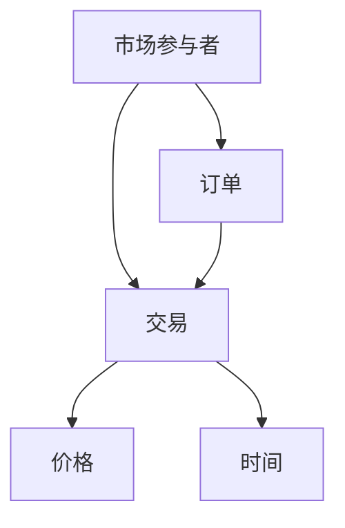
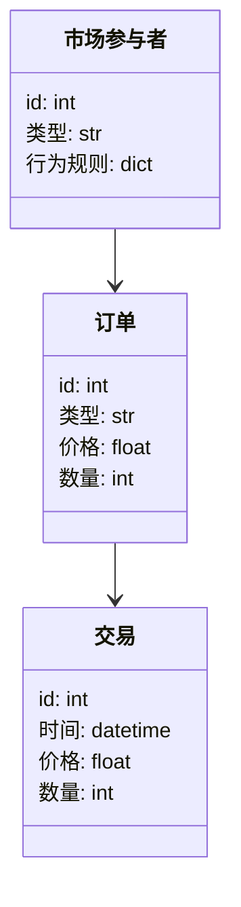
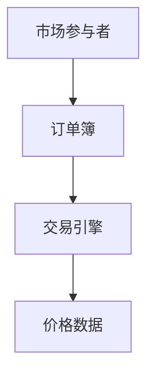
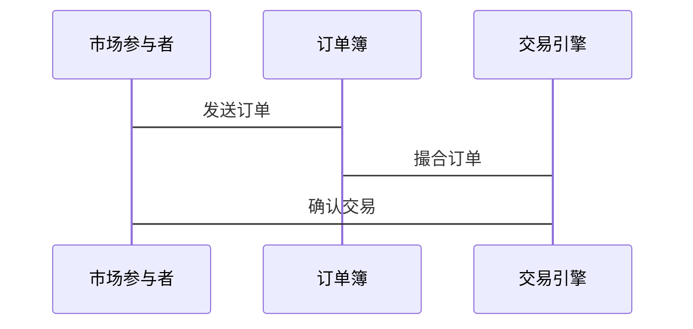

                 


# 多智能体系统模拟市场微观结构

## 关键词：多智能体系统、市场微观结构、拍卖算法、订单簿、系统架构

## 摘要：  
多智能体系统是一种模拟多个智能体在复杂环境中交互的系统，广泛应用于金融市场、交通控制、机器人协作等领域。本文重点探讨如何利用多智能体系统模拟市场微观结构，分析市场参与者的交互行为、价格形成机制以及交易过程。通过介绍多智能体系统的建模方法、核心算法和系统架构，本文旨在帮助读者理解市场微观结构的动态特性，并掌握基于多智能体系统的模拟方法。本文将结合理论分析和实际案例，详细阐述多智能体系统在市场模拟中的应用，为读者提供系统化的知识和实践指导。

---

# 第一部分: 多智能体系统与市场微观结构基础

## 第1章: 多智能体系统概述

### 1.1 多智能体系统的基本概念

#### 1.1.1 智能体的定义与特征
- 智能体（Agent）是指能够感知环境、做出决策并采取行动的实体。
- 智能体具有自主性、反应性、目标导向性和社会性的特征。
- 智能体可以分为简单反射型、基于模型的反应型、目标驱动型和实用驱动型。

#### 1.1.2 多智能体系统的组成与分类
- 多智能体系统由多个智能体和环境组成，智能体之间通过交互实现目标。
- 分为协作型、竞争型和混合型多智能体系统。
- 协作型系统中智能体合作完成任务，竞争型系统中智能体争夺资源。

#### 1.1.3 多智能体系统与单智能体系统的区别
| 特性       | 单智能体系统               | 多智能体系统               |
|------------|---------------------------|---------------------------|
| 智能体数量   | 1                         | 多                         |
| 交互复杂度   | 无或简单                   | 高                        |
| 行为协调性   | 无需协调                   | 需要协调                   |
| 应用场景     | 简单任务                   | 复杂任务                   |

### 1.2 市场微观结构的基本概念

#### 1.2.1 市场的定义与类型
- 市场是买方和卖方进行交易的场所，分为一级市场和二级市场。
- 微观结构关注市场的参与者、交易规则和价格形成机制。

#### 1.2.2 市场微观结构的核心要素
- 参与者：包括买方、卖方和中介。
- 交易规则：包括订单类型、撮合规则和价格优先规则。
- 价格形成机制：包括 auctions、order book 和 market maker 的定价策略。

#### 1.2.3 市场微观结构的动态特性
- 价格和成交量随时间变化，受参与者行为影响。
- 市场微观结构的动态特性可以通过多智能体系统模拟。

### 1.3 多智能体系统在市场模拟中的应用

#### 1.3.1 多智能体系统模拟市场的优势
- 可以模拟市场参与者的复杂行为。
- 可以分析市场结构对价格和成交量的影响。
- 可以测试市场规则的可行性。

#### 1.3.2 多智能体系统模拟市场的应用场景
- 金融市场的价格预测。
- 电子商务平台的流量模拟。
- 能源市场的供需匹配。

#### 1.3.3 多智能体系统模拟市场的研究现状
- 国内外学者已开展大量研究，但仍存在动态行为建模和系统优化的挑战。

### 1.4 本章小结
本章介绍了多智能体系统的基本概念和市场微观结构的核心要素，分析了多智能体系统在市场模拟中的优势和应用场景。

---

# 第二部分: 多智能体系统模拟市场微观结构的核心概念

## 第2章: 多智能体系统的建模与分析

### 2.1 多智能体系统的建模方法

#### 2.1.1 基于主体的建模方法
- 主体（Agent）是市场参与者的代理，具有目标和行为规则。
- 基于主体的建模方法能够捕捉市场参与者的异质性。

#### 2.1.2 基于规则的建模方法
- 基于规则的建模方法通过定义市场参与者的交互规则，模拟市场行为。
- 适用于规则明确的市场环境。

#### 2.1.3 基于模型的建模方法
- 基于模型的建模方法通过构建数学模型，模拟市场参与者的决策过程。
- 适用于复杂市场环境的模拟。

### 2.2 多智能体系统的属性特征对比

#### 2.2.1 不同建模方法的对比分析
| 建模方法     | 优点                     | 缺点                     |
|--------------|--------------------------|--------------------------|
| 基于主体     | 模拟主体异质性            | 需要定义复杂的行为规则    |
| 基于规则     | 模拟规则明确的市场         | 难以捕捉主体异质性        |
| 基于模型     | 模拟复杂市场环境           | 需要复杂的数学建模         |

#### 2.2.2 不同智能体行为的特征分析
| 智能体类型   | 行为特征                 | 应用场景                 |
|--------------|--------------------------|--------------------------|
| 竞争型       | 追求资源最大化            | 金融市场                 |
| 协作型       | 追求共同目标              | 供应链管理               |
| 混合型       | 同时具有竞争和协作特征    | 复杂市场环境             |

#### 2.2.3 不同市场结构的对比分析
| 市场结构     | 特点                     | 应用场景                 |
|--------------|--------------------------|--------------------------|
| 单一市场     | 参与者少，规则简单        | 简单市场环境             |
| 多市场       | 参与者多，规则复杂        | 复杂市场环境             |

### 2.3 多智能体系统模拟市场的ER实体关系图



### 2.4 本章小结
本章分析了多智能体系统的建模方法和市场结构特征，提出了基于主体的建模方法在市场模拟中的应用。

---

# 第三部分: 多智能体系统模拟市场微观结构的算法原理

## 第3章: 市场模拟的核心算法

### 3.1 拍卖算法

#### 3.1.1 拍卖算法的基本原理
- 拍卖是一种通过竞争确定价格和分配资源的机制。
- 拍卖算法包括单回合拍卖和多回合拍卖。

#### 3.1.2 拍卖算法的实现步骤
1. 初始化拍卖参数。
2. 收集参与者出价。
3. 根据拍卖规则确定中标者和价格。

#### 3.1.3 拍卖算法的优缺点分析
- 优点：公平、高效。
- 缺点：复杂性高、可能存在策略性行为。

#### 3.1.4 拍卖算法的Python代码实现
```python
def auction_algorithm(bids):
    max_bid = max(bids)
    winner = bids.index(max_bid)
    return winner, max_bid
```

### 3.2 订单簿处理算法

#### 3.2.1 订单簿的基本结构
- 订单簿记录所有未成交的订单，包括买入价和卖出价。

#### 3.2.2 订单簿的处理流程
1. 收集订单。
2. 根据价格和时间优先规则撮合订单。

#### 3.2.3 订单簿的优化算法
- 优化算法通过优先处理大额订单，提高撮合效率。

### 3.3 市场均衡计算算法

#### 3.3.1 市场均衡的定义
- 市场均衡是指买方需求等于卖方供给的状态。

#### 3.3.2 市场均衡的计算方法
1. 确定需求函数和供给函数。
2. 解方程组求解均衡价格和数量。

#### 3.3.3 市场均衡的收敛性分析
- 市场均衡算法的收敛性取决于需求和供给函数的单调性。

### 3.4 算法实现的Python代码示例

#### 3.4.1 拍卖算法
```python
def auction_algorithm(bids):
    max_bid = max(bids)
    winner = bids.index(max_bid)
    return winner, max_bid
```

#### 3.4.2 订单簿处理算法
```python
def order_book_matching(bids, asks):
    best_bid = max(bids)
    best_ask = min(asks)
    if best_bid >= best_ask:
        # 确定成交价格和数量
        return best_bid, best_ask
    else:
        return None
```

### 3.5 本章小结
本章详细介绍了拍卖算法、订单簿处理算法和市场均衡计算算法，为市场模拟提供了理论基础和实现方法。

---

# 第四部分: 多智能体系统模拟市场微观结构的系统设计

## 第4章: 多智能体系统模拟市场的系统架构

### 4.1 问题场景介绍
- 某金融交易平台需要模拟市场微观结构，分析价格和成交量的变化。

### 4.2 系统功能设计

#### 4.2.1 领域模型设计


#### 4.2.2 系统架构设计


### 4.3 系统实现细节

#### 4.3.1 系统接口设计
- 市场参与者接口：接收订单和交易确认。
- 订单簿接口：管理未成交订单和撮合订单。
- 交易引擎接口：处理交易并更新价格数据。

#### 4.3.2 系统交互设计


### 4.4 本章小结
本章设计了多智能体系统模拟市场的系统架构，包括领域模型、系统架构和接口设计。

---

# 第五部分: 项目实战

## 第5章: 项目实战

### 5.1 环境安装
- 安装Python和相关库（如numpy、pandas、matplotlib）。

### 5.2 系统核心实现

#### 5.2.1 市场参与者行为模拟
```python
class MarketParticipant:
    def __init__(self, id, type):
        self.id = id
        self.type = type
        self.behavior_rule = {}
```

#### 5.2.2 订单处理与撮合
```python
class Order:
    def __init__(self, id, type, price, quantity):
        self.id = id
        self.type = type
        self.price = price
        self.quantity = quantity
```

#### 5.2.3 交易引擎实现
```python
class TradingEngine:
    def __init__(self):
        self.order_book = {}

    def process_order(self, order):
        if order.type == 'buy':
            # 处理买入订单
        else:
            # 处理卖出订单
```

### 5.3 代码应用解读与分析
- 市场参与者通过发送订单与交易引擎交互。
- 交易引擎根据订单簿撮合订单并更新价格数据。

### 5.4 实际案例分析
- 模拟一个简单的股票交易市场，分析价格和成交量的变化。

### 5.5 项目小结
本章通过项目实战，展示了多智能体系统模拟市场的实现过程，帮助读者理解理论与实践的结合。

---

# 第六部分: 最佳实践与总结

## 第6章: 最佳实践与总结

### 6.1 最佳实践 tips
- 在多智能体系统模拟中，建议先定义清晰的行为规则。
- 处理大规模市场时，可以采用分布式计算和并行处理。

### 6.2 小结
- 本文详细介绍了多智能体系统模拟市场微观结构的核心概念、算法原理和系统架构。
- 通过项目实战，展示了理论与实践的结合。

### 6.3 注意事项
- 在实际应用中，需注意市场参与者的异质性和市场的动态特性。
- 系统设计时，建议采用模块化设计，便于扩展和维护。

### 6.4 拓展阅读
- 推荐阅读相关领域的经典文献，深入研究多智能体系统和市场模拟的前沿技术。

---

# 结语

通过本文的系统讲解和实践分析，读者可以全面掌握多智能体系统模拟市场微观结构的核心知识和技能。未来，随着人工智能和大数据技术的发展，多智能体系统在市场模拟中的应用将更加广泛和深入。

