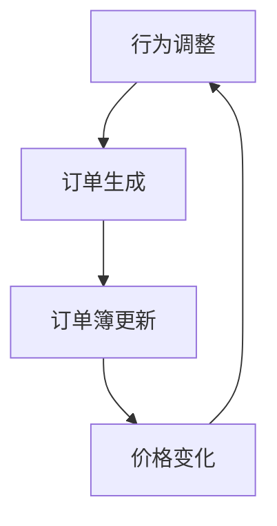
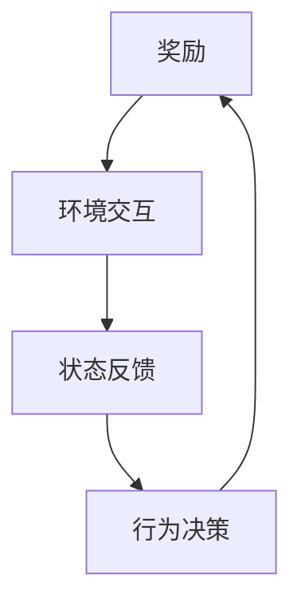
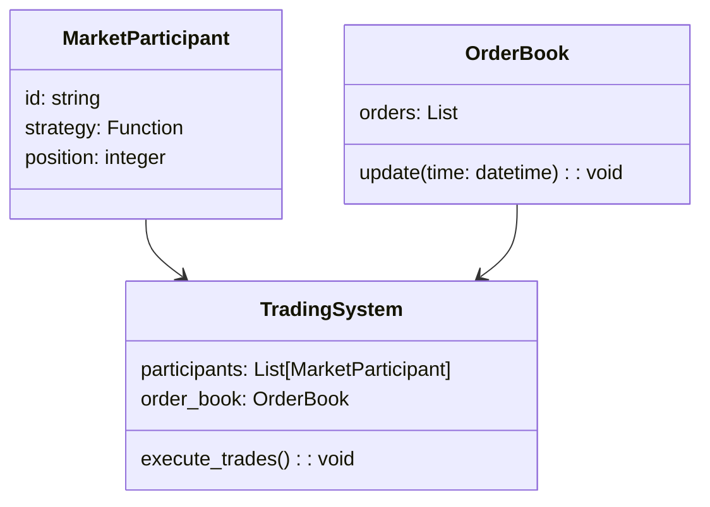
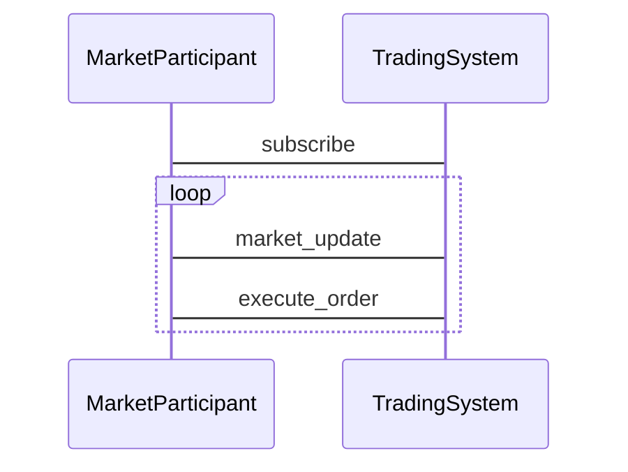

                 


# 《多智能体系统模拟市场微观结构》

## 关键词：多智能体系统，市场微观结构，算法，系统架构，项目实战

## 摘要：  
本文详细探讨了多智能体系统在模拟市场微观结构中的应用，通过逐步分析，从基本概念到算法原理，再到系统架构和项目实战，帮助读者理解如何利用多智能体系统建模和模拟复杂的市场环境。文章内容涵盖智能体定义、市场微观结构的复杂性、多智能体系统的核心算法、系统设计与实现，以及实际案例分析，为读者提供了全面的技术视角。

---

# 第四部分: 多智能体系统模拟的算法原理

## 第3章: 多智能体系统模拟的算法原理

### 3.1 基于规则的多智能体模型

#### 3.1.1 基于规则的智能体行为模拟

基于规则的多智能体系统通过定义一组规则来描述智能体的行为。例如，在市场微观结构中，每个参与者（如交易者、订单簿等）的行为都可以通过规则来模拟。

- **规则类型**：
  - **简单规则**：如价格变化触发订单。
  - **复杂规则**：如基于技术指标的交易策略。

#### 3.1.2 基于规则的多智能体模型实现

##### 3.1.2.1 算法流程图



##### 3.1.2.2 代码实现

```python
# 示例：基于规则的简单交易者
class Trader:
    def __init__(self, id, strategy):
        self.id = id
        self.strategy = strategy
        self.position = 0  # 持股数量

    def generate_order(self, current_price):
        # 根据策略生成订单
        if self.strategy(current_price):
            return "买入"
        else:
            return "卖出"

# 示例策略函数
def strategy(current_price):
    return current_price < 100  # 简单的低于100买入

# 使用示例
trader = Trader(" Trader 1", strategy)
order = trader.generate_order(95)
print(order)  # 输出：买入
```

#### 3.1.3 基于规则的模型优缺点

- **优点**：
  - 简单易懂，实现成本低。
- **缺点**：
  - 难以处理复杂和动态的市场环境。

### 3.2 基于强化学习的多智能体模型

#### 3.2.1 强化学习的基本原理

强化学习是一种通过智能体与环境交互来学习策略的方法。智能体通过试错不断优化行为，以最大化累积奖励。

##### 3.2.1.1 算法流程图



#### 3.2.2 多智能体强化学习的挑战

- **状态空间**：市场环境复杂，状态空间大。
- **动作空间**：多个智能体之间的动作相互影响。
- **奖励机制**：需要设计合理的奖励函数。

#### 3.2.3 多智能体强化学习的实现

##### 3.2.3.1 数学模型

假设市场中有多个智能体，每个智能体的策略可以表示为：

$$ \pi_i(a_i|s_i) $$

其中，$a_i$ 是智能体 $i$ 的动作，$s_i$ 是智能体 $i$ 的状态。

##### 3.2.3.2 代码实现

```python
# 示例：多智能体强化学习框架
import gym
import numpy as np

class MultiAgentEnv(gym.Env):
    def __init__(self, num_agents=2):
        super().__init__()
        self.num_agents = num_agents
        self.observation_space = gym.spaces.Box(low=-1, high=1, shape=(1,))
        self.action_space = gym.spaces.Discrete(3)  # 0: 卖出, 1: 持有, 2: 买入

    def step(self, actions):
        # 简单的价格变化模型
        price_change = np.random.randn(1)[0] * 0.1
        new_price = self.current_price + price_change
        # 计算奖励
        rewards = []
        for i in range(self.num_agents):
            if actions[i] == 2 and new_price > self.current_price:  # 买入且价格上涨
                rewards.append(1)
            elif actions[i] == 0 and new_price < self.current_price:  # 卖出且价格下跌
                rewards.append(1)
            else:
                rewards.append(0)
        self.current_price = new_price
        return self._get_obs(), rewards, False, {}

    def _get_obs(self):
        return np.array([self.current_price])

# 初始化环境和智能体
env = MultiAgentEnv()
state = env.reset()
actions = [1, 1]  # 所有智能体保持持有
next_state, rewards, done, info = env.step(actions)
print(rewards)  # 输出：[0, 0]
```

---

# 第五部分: 系统分析与架构设计

## 第4章: 系统分析与架构设计

### 4.1 系统功能设计

#### 4.1.1 领域模型



### 4.2 系统架构设计

#### 4.2.1 系统架构图


### 4.3 接口设计与交互

#### 4.3.1 接口设计

- **市场参与者接口**：
  - subscribe()：订阅市场更新。
  - execute_order()：执行交易订单。

- **订单簿接口**：
  - update()：更新订单簿。
  - get_order()：获取订单信息。

#### 4.3.2 交互设计



---

# 第六部分: 项目实战

## 第5章: 项目实战

### 5.1 环境安装与配置

#### 5.1.1 安装依赖

```bash
pip install gym matplotlib numpy
```

### 5.2 核心代码实现

#### 5.2.1 市场参与者类

```python
class MarketParticipant:
    def __init__(self, id, strategy):
        self.id = id
        self.strategy = strategy
        self.position = 0  # 持股数量

    def decide_action(self, state):
        # 根据状态决定动作
        if self.strategy(state):
            return 2  # 买入
        else:
            return 0  # 卖出
```

#### 5.2.2 订单簿类

```python
class OrderBook:
    def __init__(self):
        self.orders = []

    def update_order(self, order):
        self.orders.append(order)
```

#### 5.2.3 交易系统类

```python
class TradingSystem:
    def __init__(self, participants):
        self.participants = participants
        self.order_book = OrderBook()

    def execute_trades(self):
        # 简单的交易执行逻辑
        for participant in self.participants:
            state = self.order_book.get_state()
            action = participant.decide_action(state)
            self.order_book.update_order(action)
```

### 5.3 实际案例分析与解读

#### 5.3.1 案例分析

假设我们模拟一个简单的股票市场，有两个参与者，分别采用不同的交易策略。

```python
# 定义策略函数
def strategy1(state):
    return state > 90  # 简单的高于90买入

def strategy2(state):
    return state < 90  # 简单的低于90卖出

# 初始化参与者
participant1 = MarketParticipant("Participant 1", strategy1)
participant2 = MarketParticipant("Participant 2", strategy2)
system = TradingSystem([participant1, participant2])

# 执行交易
system.execute_trades()
```

#### 5.3.2 结果解读

- **初始状态**：市场价为90。
- **参与者1**：价格高于90，决定买入。
- **参与者2**：价格低于90，决定卖出。
- **结果**：订单簿更新，市场价可能上涨或下跌，取决于具体的交易机制。

### 5.4 项目小结

通过实际案例，我们可以看到多智能体系统在模拟市场微观结构中的应用潜力。然而，实际市场环境更为复杂，需要更精细的策略和算法。

---

# 第七部分: 总结与展望

## 第6章: 总结与展望

### 6.1 最佳实践

- **策略设计**：根据市场特点设计合理的交易策略。
- **系统架构**：确保系统的可扩展性和可维护性。
- **数据处理**：实时处理市场数据，保证系统的准确性。

### 6.2 小结

本文从理论到实践，详细讲解了多智能体系统模拟市场微观结构的核心概念、算法原理、系统设计与实现。通过实际案例，展示了多智能体系统在模拟市场环境中的应用潜力。

### 6.3 注意事项

- **数据准确性**：市场数据的实时性和准确性直接影响模拟结果。
- **系统稳定性**：确保系统的稳定运行，避免因算法错误导致的损失。
- **模型局限性**：多智能体系统模拟的复杂性可能导致模型难以完全捕捉市场的真实行为。

### 6.4 拓展阅读

- **推荐书籍**：
  - 《Multi-Agent Systems: Algorithmic, Complexity, and Theory》
  - 《Reinforcement Learning: Theory and Algorithms》
- **推荐论文**：
  - "A Survey of Multi-Agent Reinforcement Learning"  
  - "Modeling Market Microstructure with Multi-Agent Systems"

---

通过本文的系统讲解，读者可以深入了解多智能体系统在模拟市场微观结构中的应用，并为进一步的研究和实践打下坚实的基础。

