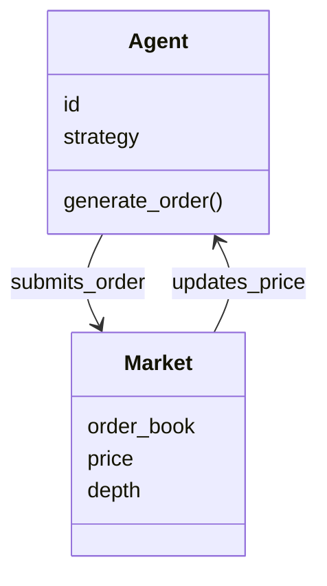
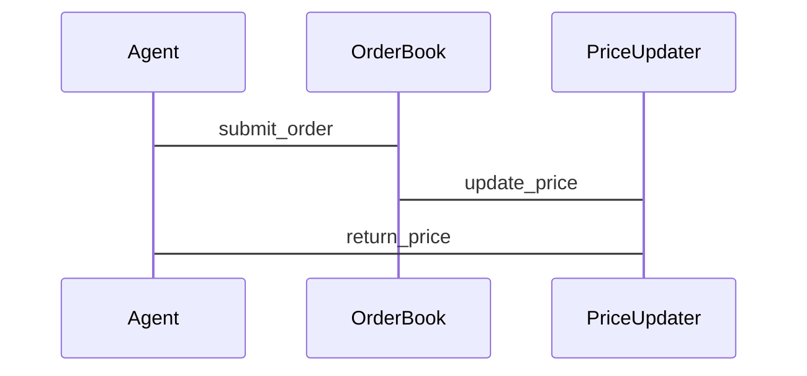

                 


# 《多智能体系统模拟市场流动性》

> 关键词：多智能体系统、市场流动性、金融市场、算法模拟、系统架构、智能体行为模型

> 摘要：本文系统地探讨了多智能体系统（MAS）在模拟市场流动性中的应用。从核心概念到算法实现，从系统架构到项目实战，本文详细介绍了如何利用MAS模型分析和模拟金融市场中的流动性问题。通过丰富的案例分析和详细的代码实现，本文为读者提供了一个全面的视角，帮助理解多智能体系统在金融市场中的重要作用。

---

# 第一部分: 多智能体系统与市场流动性概述

## 第1章: 多智能体系统与市场流动性概述

### 1.1 多智能体系统的定义与特点
#### 1.1.1 多智能体系统的定义
多智能体系统（Multi-Agent Systems, MAS）是由多个智能体（Agent）组成的分布式系统，这些智能体能够通过交互协作完成复杂任务。MAS的关键特点包括自主性、反应性、协作性和分布式性。

#### 1.1.2 多智能体系统的核心特点
- **自主性**：智能体能够独立决策和行动。
- **反应性**：智能体能够感知环境并实时调整行为。
- **协作性**：多个智能体通过协作完成共同目标。
- **分布式性**：智能体之间通过分布式计算进行交互。

#### 1.1.3 多智能体系统与传统模型的对比
| 特性             | 多智能体系统（MAS）             | 传统模型（单智能体系统）       |
|------------------|---------------------------------|-----------------------------|
| 结构             | 分布式、去中心化               | 中心化                      |
| 智能体数量       | 多个                          | 单个或少数                   |
| 交互方式         | 智能体之间实时交互             | 通过中心节点进行交互         |
| 应用场景         | 适用于复杂、动态的环境         | 适用于简单、静态的环境       |

### 1.2 市场流动性的定义与重要性
#### 1.2.1 市场流动性的定义
市场流动性是指资产在市场中快速买卖且价格稳定的特性。高流动性意味着资产可以迅速以合理价格买卖，低流动性则反之。

#### 1.2.2 市场流动性的影响因素
- **市场深度**：市场中有多少买家和卖家。
- **市场广度**：市场的参与者数量和类型。
- **交易成本**：交易的手续费和时间成本。
- **市场波动性**：价格的波动程度。

#### 1.2.3 市场流动性在金融市场中的作用
- **价格发现**：流动性高的市场能够快速反映市场信息。
- **降低交易成本**：高流动性市场通常具有较低的买卖价差。
- **风险管理**：流动性高的市场有助于快速对冲风险。

### 1.3 多智能体系统在金融市场中的应用
#### 1.3.1 多智能体系统在金融市场中的应用领域
- **市场微观结构模型**：模拟订单簿、交易行为等。
- **流动性风险管理**：预测和管理市场流动性风险。
- **算法交易**：利用智能体进行高频交易和策略交易。

#### 1.3.2 多智能体系统模拟市场流动性的优势
- **实时性**：MAS能够模拟市场的实时动态。
- **复杂性**：MAS能够处理多个智能体之间的复杂交互。
- **可扩展性**：MAS可以模拟大规模市场环境。

#### 1.3.3 实际案例分析
案例分析：某金融公司利用MAS模拟市场流动性，预测市场波动并优化交易策略。

---

## 第2章: 多智能体系统的核心概念与联系

### 2.1 多智能体系统的核心原理
#### 2.1.1 智能体的行为模型
- **反应式模型**：基于当前环境做出反应。
- **规划式模型**：基于目标进行规划。
- **学习式模型**：通过机器学习不断优化行为。

#### 2.1.2 智能体之间的交互机制
- **通信**：智能体之间通过消息传递信息。
- **协调**：智能体通过协作完成共同任务。
- **竞争**：智能体之间可能存在竞争关系。

#### 2.1.3 智能体与环境的互动关系
- **感知环境**：智能体通过传感器感知环境。
- **改变环境**：智能体通过行动改变环境。

### 2.2 多智能体系统与市场流动性的关系
#### 2.2.1 智能体在市场流动性中的角色
- **买方智能体**：模拟投资者的买入行为。
- **卖方智能体**：模拟投资者的卖出行为。
- **做市商智能体**：提供流动性并维护市场深度。

#### 2.2.2 多智能体系统模拟市场流动性的基本原理
MAS通过模拟多个智能体的交互，模拟市场的订单生成、价格变化和市场深度变化。

#### 2.2.3 多智能体系统与市场流动性的相互作用
- **价格形成机制**：MAS模拟市场价格的动态变化。
- **订单流管理**：MAS模拟市场的订单生成和成交过程。
- **市场深度分析**：MAS分析市场的买卖订单深度。

### 2.3 多智能体系统的核心要素对比
#### 2.3.1 不同智能体模型的特征对比
| 模型         | 反应式模型       | 规划式模型       | 学习式模型       |
|--------------|-----------------|-----------------|-----------------|
| 行为特点     | 基于当前环境反应 | 基于目标规划   | 基于学习优化   |
| 适用场景     | 实时交互         | 需要明确目标     | 需要持续优化     |

#### 2.3.2 多智能体系统与单智能体系统的对比
- **结构复杂性**：MAS复杂，单智能体系统简单。
- **交互方式**：MAS分布式交互，单智能体系统集中式交互。
- **应用场景**：MAS适用于复杂场景，单智能体系统适用于简单场景。

---

## 第3章: 多智能体系统模拟市场流动性的算法原理

### 3.1 算法原理概述
#### 3.1.1 基于智能体的建模方法
- **订单生成**：智能体生成买入或卖出订单。
- **价格形成**：订单成交后形成新的价格。
- **市场深度变化**：订单生成和成交导致市场深度变化。

#### 3.1.2 算法实现步骤
1. 初始化智能体和市场环境。
2. 智能体根据策略生成订单。
3. 订单提交到订单簿，更新市场深度和价格。
4. 监测市场流动性和价格变化。

### 3.2 多智能体系统模拟市场流动性的数学模型
#### 3.2.1 订单生成概率分布
$$ P(order~generation) = \lambda \cdot t $$
其中，λ是订单生成速率，t是时间。

#### 3.2.2 价格形成的数学模型
$$ P_{new} = P_{old} + \Delta P $$
其中，ΔP是价格变化量。

#### 3.2.3 市场深度变化公式
$$ D_{new} = D_{old} - Q $$
其中，Q是成交的订单量。

### 3.3 算法实现与代码示例
#### 3.3.1 Python代码实现
```python
import random

class Agent:
    def __init__(self, id, strategy):
        self.id = id
        self.strategy = strategy

    def generate_order(self):
        if random.random() < 0.5:
            return 'buy'
        else:
            return 'sell'

# 初始化市场环境
market_depth = 0
price = 100
agents = [Agent(1, 'passive'), Agent(2, 'aggressive')]

# 模拟市场流动性
for _ in range(10):
    for agent in agents:
        order = agent.generate_order()
        if order == 'buy':
            market_depth += 1
            price += 1
        else:
            market_depth -= 1
            price -= 1
    print(f"Market Depth: {market_depth}, Price: {price}")
```

---

## 第4章: 多智能体系统模拟市场流动性的系统架构设计

### 4.1 问题场景介绍
#### 4.1.1 项目背景
本项目旨在利用多智能体系统模拟金融市场中的流动性问题，帮助投资者和金融机构更好地理解和管理市场风险。

### 4.2 系统功能设计
#### 4.2.1 领域模型


#### 4.2.2 系统架构


### 4.3 系统接口设计
#### 4.3.1 系统接口
- **生成订单接口**：`generate_order()`
- **更新价格接口**：`update_price()`
- **查询市场深度接口**：`get_market_depth()`

#### 4.3.2 系统交互


---

## 第5章: 项目实战与案例分析

### 5.1 项目环境安装
#### 5.1.1 环境要求
- Python 3.8+
- Mermaid工具
- Plotly或Matplotlib

### 5.2 系统核心实现
#### 5.2.1 核心代码实现
```python
import matplotlib.pyplot as plt

class MarketSimulator:
    def __init__(self, num_agents=10):
        self.agents = [Agent(i) for i in range(num_agents)]
        self.depth = 0
        self.price = 100
        self.history = []

    def simulate(self, steps=10):
        for _ in range(steps):
            for agent in self.agents:
                order = agent.generate_order()
                if order == 'buy':
                    self.depth += 1
                    self.price += 1
                else:
                    self.depth -= 1
                    self.price -= 1
            self.history.append((self.depth, self.price))
            print(f"Step {_}: Depth={self.depth}, Price={self.price}")

    def plot_history(self):
        depths = [h[0] for h in self.history]
        prices = [h[1] for h in self.history]
        plt.plot(depths, label='Market Depth')
        plt.plot(prices, label='Price')
        plt.legend()
        plt.show()
```

### 5.3 案例分析与结果解读
#### 5.3.1 案例分析
案例：模拟10个智能体在10个时间步长中的行为，观察市场深度和价格的变化。

#### 5.3.2 结果解读
- 市场深度和价格随时间变化，展示市场的流动性波动。
- 智能体的策略影响市场深度和价格的变化趋势。

---

## 第6章: 最佳实践与注意事项

### 6.1 最佳实践
#### 6.1.1 参数选择
- 合理选择订单生成概率和价格变化幅度。
- 根据实际市场情况调整智能体策略。

#### 6.1.2 模型验证
- 使用实际市场数据验证模型的准确性。
- 持续优化模型以适应市场变化。

### 6.2 注意事项
- 模型的局限性：MAS模拟的是理想化市场，实际市场可能有更多复杂因素。
- 模型的适用性：MAS适用于复杂场景，但可能不适合简单场景。

### 6.3 拓展阅读
- 推荐阅读相关领域的书籍和论文，深入理解MAS和市场流动性模拟。

---

## 第7章: 总结与展望

### 7.1 总结
本文系统地介绍了多智能体系统在模拟市场流动性中的应用，从理论到实践，详细讲解了MAS的核心概念、算法实现和系统架构设计。

### 7.2 展望
未来，随着人工智能和大数据技术的发展，MAS在金融市场中的应用将更加广泛和深入，模拟市场流动性也将更加精确和实时。

---

以上是《多智能体系统模拟市场流动性》的完整目录大纲，涵盖从理论到实践的各个方面，确保读者能够系统地理解和应用多智能体系统模拟市场流动性。

