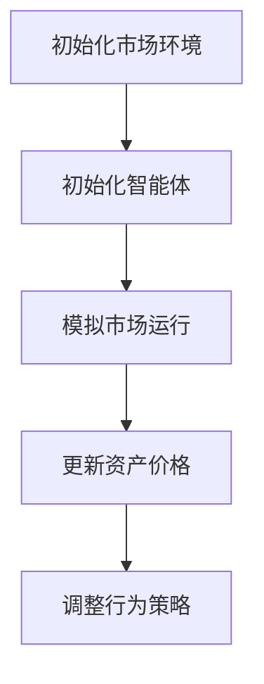
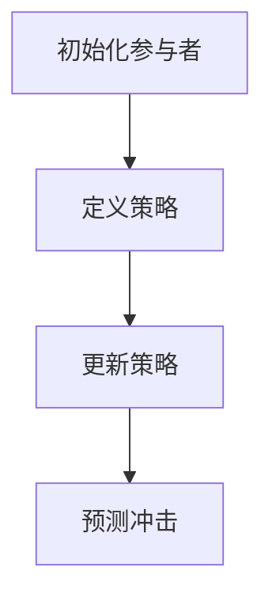
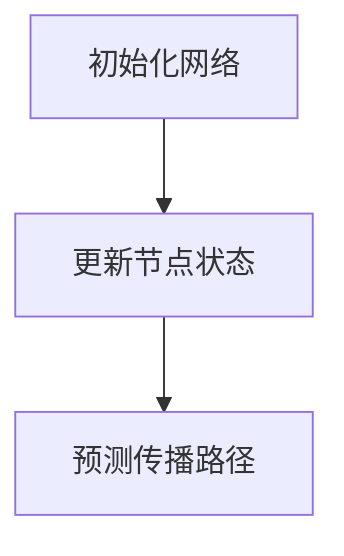
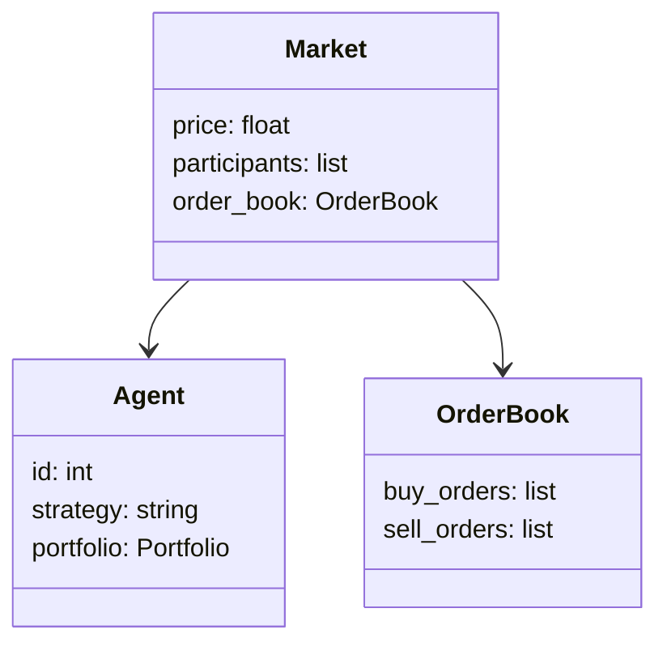

                 


# 多智能体系统模拟市场流动性冲击

> 关键词：多智能体系统，流动性冲击，金融市场，系统模拟，算法模型

> 摘要：本文深入探讨了多智能体系统（MAS）在模拟金融市场流动性冲击中的应用。通过分析多智能体系统的核心概念、架构设计、数学模型以及实际案例，本文揭示了MAS在模拟流动性冲击中的优势和挑战。文章从理论到实践，详细阐述了如何利用MAS技术来建模、分析和预测流动性冲击，为金融市场的风险管理提供了新的思路和方法。

---

# 第一部分: 多智能体系统与市场流动性冲击基础

## 第1章: 多智能体系统概述

### 1.1 多智能体系统的定义与特点

#### 1.1.1 多智能体系统的定义
多智能体系统（Multi-Agent System, MAS）是由多个智能体（Agent）组成的复杂系统，这些智能体能够通过交互协作完成特定任务。每个智能体都是一个独立的实体，具备感知环境、自主决策和执行动作的能力。

#### 1.1.2 多智能体系统的核心特点
- **分布式性**：智能体分布在网络中，不存在集中控制节点。
- **协作性**：智能体之间通过通信和协作完成共同目标。
- **动态性**：系统环境和智能体状态都可能动态变化。
- **复杂性**：系统行为由多个智能体的交互共同决定。

#### 1.1.3 多智能体系统与单智能体系统的区别
| 属性 | 多智能体系统 | 单智能体系统 |
|------|------------|-------------|
| 控制方式 | 分布式控制 | 集中式控制 |
| 交互性 | 高 | 低 |
| 可扩展性 | 高 | 低 |

### 1.2 多智能体系统的架构与设计原则

#### 1.2.1 分层架构
多智能体系统的架构通常分为三层：
1. **物理层**：智能体与环境的交互。
2. **逻辑层**：智能体之间的通信与协作。
3. **知识层**：智能体的知识表示与推理。

#### 1.2.2 分布式计算与通信机制
- **通信协议**：智能体之间通过消息传递进行通信。
- **分布式计算**：利用分布式计算技术实现任务分配和负载均衡。

#### 1.2.3 协作与竞争关系
- **协作**：智能体之间通过合作实现共同目标。
- **竞争**：智能体之间可能因为资源有限而产生竞争。

### 1.3 多智能体系统的建模与仿真

#### 1.3.1 系统建模的基本方法
- **基于规则的建模**：通过预定义规则描述智能体行为。
- **基于模型的建模**：利用数学模型描述系统动态。

#### 1.3.2 多智能体系统的仿真框架
仿真框架通常包括：
1. 环境建模：描述市场环境、参与者等。
2. 智能体建模：定义智能体的行为、知识等。
3. 仿真控制：控制仿真的启动、停止和参数调整。

#### 1.3.3 市场流动性冲击的初步建模思路
初步建模需要考虑：
1. 市场参与者的类型和行为。
2. 市场环境的动态变化。
3. 流动性冲击的传播机制。

---

## 第2章: 市场流动性冲击的定义与特性

### 2.1 市场流动性冲击的定义

#### 2.1.1 流动性冲击的定义
流动性冲击是指由于市场参与者大量买卖某资产，导致资产价格在短时间内出现大幅波动的现象。

#### 2.1.2 流动性冲击的分类
1. **卖方驱动冲击**：由大量卖单引发的流动性不足。
2. **买方驱动冲击**：由大量买单引发的流动性过剩。

#### 2.1.3 流动性冲击的影响
- **价格波动**：资产价格可能大幅波动。
- **交易成本增加**：买卖价差扩大，交易成本增加。
- **市场稳定性下降**：可能导致市场恐慌和进一步的流动性冲击。

### 2.2 市场流动性冲击的成因与特征

#### 2.2.1 市场微观结构分析
- **订单簿模型**：分析订单簿中的买方和卖方订单，预测价格变化。
- **市场深度**：衡量市场对大额交易的吸收能力。

#### 2.2.2 市场参与者的行为特征
- **理性行为**：参与者基于理性决策进行买卖。
- **羊群效应**：参与者可能因为其他人的行为而跟风操作。

#### 2.2.3 流动性冲击的传播机制
- **价格敏感性**：价格变化可能引发更多参与者进入或退出市场。
- **网络效应**：市场参与者之间的关联性可能导致冲击快速传播。

### 2.3 多智能体系统在流动性冲击模拟中的作用

#### 2.3.1 多智能体系统的优势
- **高实时性**：能够实时模拟市场动态。
- **可扩展性**：可以处理大规模市场参与者。
- **高精度**：能够模拟复杂的市场行为。

#### 2.3.2 多智能体系统在流动性冲击模拟中的应用
- **预测市场风险**：通过模拟预测流动性冲击的可能性。
- **制定风险管理策略**：基于模拟结果优化风险管理措施。

---

## 第3章: 多智能体系统与流动性冲击的核心概念

### 3.1 多智能体系统的核心概念

#### 3.1.1 智能体的定义与属性
智能体具备以下属性：
- **自主性**：智能体能够自主决策。
- **反应性**：智能体能够感知环境并做出反应。
- **协作性**：智能体能够与其他智能体协作。

#### 3.1.2 智能体之间的交互与协作
- **通信机制**：智能体之间通过消息传递进行通信。
- **协作协议**：智能体之间通过协议实现协作。

#### 3.1.3 多智能体系统的复杂性与可扩展性
- **复杂性**：系统行为由多个智能体的交互决定。
- **可扩展性**：系统能够扩展到更大的规模。

### 3.2 流动性冲击的核心概念

#### 3.2.1 流动性冲击的量化方法
- **波动率**：衡量价格波动程度。
- **交易量**：衡量市场活跃程度。

#### 3.2.2 流动性冲击的传播路径
- **从局部到全局**：冲击可能从某个资产扩散到整个市场。
- **从买方到卖方**：冲击可能在买卖双方之间交替传播。

#### 3.2.3 流动性冲击的预测与防范
- **预测模型**：利用统计模型预测流动性冲击的可能性。
- **防范措施**：制定风险管理策略，减少冲击的影响。

### 3.3 多智能体系统与流动性冲击的关系

#### 3.3.1 多智能体系统在流动性冲击模拟中的优势
- **高精度**：能够模拟复杂的市场行为。
- **可扩展性**：能够处理大规模市场参与者。

#### 3.3.2 多智能体系统与传统流动性冲击模型的对比
- **传统模型**：通常基于统计分析，难以捕捉市场参与者的微观行为。
- **多智能体系统**：能够模拟市场参与者的微观行为，预测流动性冲击。

#### 3.3.3 多智能体系统在流动性冲击研究中的创新点
- **微观行为建模**：能够模拟市场参与者的微观行为。
- **动态模拟**：能够动态模拟流动性冲击的传播过程。

---

## 第4章: 多智能体系统模拟流动性冲击的数学模型与算法

### 4.1 基于多智能体系统的流动性冲击传播模型

#### 4.1.1 算法原理
流动性冲击传播模型的算法原理如下：
1. 初始化市场环境，包括市场参与者、资产价格等。
2. 每个智能体根据市场环境做出决策，生成买卖订单。
3. 订单提交到订单簿，更新资产价格。
4. 根据价格变化，智能体调整行为策略。

#### 4.1.2 算法实现
```python
# 初始化市场环境
market = Market(initial_price=100, participants=100)
# 初始化智能体
agents = [Agent(id=i, strategy='market_maker') for i in range(participants)]
# 模拟市场运行
market.simulate(agents)
```

#### 4.1.3 算法流程图


### 4.2 基于博弈论的流动性冲击模型

#### 4.2.1 算法原理
博弈论模型通过模拟市场参与者的博弈过程，预测流动性冲击的可能性。

#### 4.2.2 算法实现
```python
# 定义博弈论模型
def game_theory_model(players, strategies):
    for player in players:
        player.update_strategy(strategies)
    return predict_shock(players, strategies)
```

#### 4.2.3 算法流程图


### 4.3 基于社会网络分析的流动性冲击传播模型

#### 4.3.1 算法原理
社会网络分析模型通过分析市场参与者之间的网络关系，预测流动性冲击的传播路径。

#### 4.3.2 算法实现
```python
# 定义社会网络分析模型
def social_network_model(network, nodes):
    for node in nodes:
        node.update_state(network)
    return predict_spread(network, nodes)
```

#### 4.3.3 算法流程图


---

## 第5章: 系统实现与案例分析

### 5.1 系统实现

#### 5.1.1 系统架构设计


#### 5.1.2 系统功能设计
- **市场环境模拟**：包括市场参与者、资产价格等。
- **智能体行为建模**：定义智能体的行为策略。
- **订单处理**：处理智能体提交的订单，更新资产价格。
- **冲击传播模拟**：模拟流动性冲击的传播过程。

### 5.2 案例分析

#### 5.2.1 案例介绍
以某金融市场的流动性冲击模拟为例，分析MAS的应用效果。

#### 5.2.2 案例分析
1. 初始化市场环境，包括市场参与者、资产价格等。
2. 模拟市场运行，观察流动性冲击的传播过程。
3. 分析模拟结果，评估风险管理策略的有效性。

### 5.3 应用前景

#### 5.3.1 应用场景
- **风险管理**：通过模拟预测流动性冲击的可能性。
- **市场分析**：通过模拟分析市场行为和价格波动。
- **政策制定**：通过模拟制定市场风险管理政策。

#### 5.3.2 技术挑战
- **计算复杂性**：大规模市场模拟需要高性能计算。
- **模型准确性**：需要准确建模市场参与者的行为。

---

## 第6章: 总结与展望

### 6.1 总结

#### 6.1.1 文章核心观点
- 多智能体系统能够模拟金融市场流动性冲击的传播过程。
- 通过MAS技术，可以更好地理解和预测流动性冲击。

#### 6.1.2 关键点总结
- 多智能体系统的分布式计算和协作能力。
- 流动性冲击的传播机制和预测模型。

### 6.2 未来展望

#### 6.2.1 技术发展
- 高性能计算技术的发展将提升MAS的模拟能力。
- 人工智能技术的结合将增强MAS的智能化水平。

#### 6.2.2 研究方向
- 探讨MAS在其他金融市场中的应用。
- 研究MAS在风险管理中的新方法。

### 6.3 最佳实践 tips

#### 6.3.1 实践建议
- 在MAS模拟中，建议结合实际市场数据进行验证。
- 建议逐步增加系统复杂性，避免一次实现过多功能。

#### 6.3.2 注意事项
- 注意系统的可扩展性和可维护性。
- 注意模型的准确性和鲁棒性。

---

通过以上分析，我们可以看到，多智能体系统在模拟市场流动性冲击方面具有巨大的潜力。通过合理设计和实现，MAS能够帮助我们更好地理解和预测流动性冲击，从而为金融市场风险管理提供有力支持。

