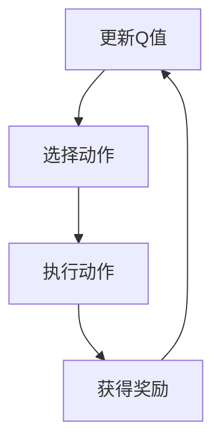
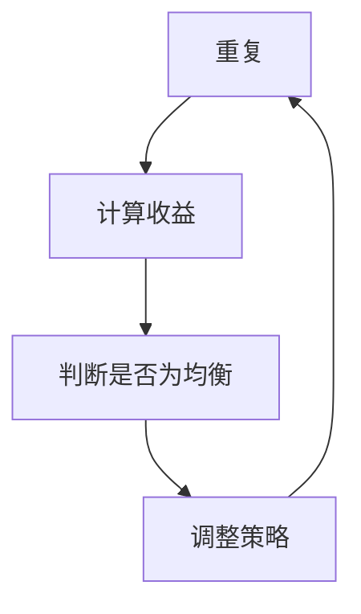
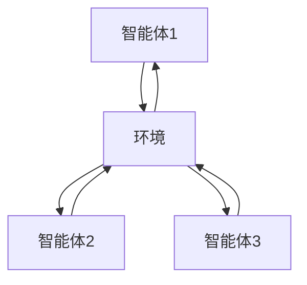

                 


# 《多智能体系统模拟投资者心理偏差》

---

## 关键词：多智能体系统，投资者心理偏差，强化学习，博弈论，系统模拟

---

## 摘要：  
本文探讨了利用多智能体系统模拟投资者心理偏差的理论与实践。通过分析投资者心理偏差的数学模型和行为特征，结合强化学习和博弈论算法，构建了一个多智能体系统来模拟投资者在金融市场中的决策过程。本文详细介绍了系统的架构设计、算法实现和案例分析，为理解和预测投资者行为提供了新的视角。

---

# 第一部分: 多智能体系统与投资者心理偏差背景介绍

## 第1章: 多智能体系统概述

### 1.1 多智能体系统的基本概念

#### 1.1.1 多智能体系统的定义  
多智能体系统（Multi-Agent System, MAS）是由多个智能体（Agent）组成的分布式系统，每个智能体具有自主性、反应性和社会性，能够与其他智能体和环境进行交互。  

#### 1.1.2 多智能体系统的特征  
- **自主性**：智能体能够独立决策。  
- **反应性**：智能体能够感知环境并实时响应。  
- **社会性**：智能体之间可以协作或竞争。  
- **分布式**：智能体之间通过通信进行协作。  

#### 1.1.3 多智能体系统与单智能体系统的区别  
单智能体系统只有一个决策主体，而多智能体系统由多个决策主体组成，具有更高的复杂性和灵活性。

---

### 1.2 投资者心理偏差的基本概念

#### 1.2.1 心理偏差的定义  
心理偏差是指投资者在决策过程中因心理因素导致的非理性行为，如贪婪、恐惧、从众心理等。

#### 1.2.2 常见投资者心理偏差类型  
- **贪婪**：过度追求高收益，忽视风险。  
- **恐惧**：因市场下跌而过度卖出。  
- **从众心理**：跟随大多数人的决策，忽视独立思考。  
- **过度自信**：过度相信自己的判断能力。  

#### 1.2.3 心理偏差对投资行为的影响  
心理偏差会导致投资者做出非理性决策，影响市场的波动性和效率。

---

### 1.3 多智能体系统与投资者心理偏差的结合

#### 1.3.1 多智能体系统模拟投资者行为的必要性  
多智能体系统能够模拟多个投资者的行为，捕捉市场的复杂性。

#### 1.3.2 心理偏差在多智能体系统中的表现形式  
通过建模投资者的心理偏差，可以模拟市场的非理性波动。

#### 1.3.3 研究的意义与应用前景  
研究多智能体系统模拟投资者心理偏差，有助于理解市场行为，优化投资策略。

---

## 第2章: 多智能体系统中的个体行为建模

### 2.1 个体行为模型的构建

#### 2.1.1 基于心理偏差的个体行为模型  
- **贪婪模型**：定义为追求最大收益的策略。  
- **恐惧模型**：定义为避免损失的策略。  

#### 2.1.2 基于强化学习的个体行为模型  
- **Q-Learning算法**：通过奖励机制优化决策。  
- **策略评估**：通过价值函数评估策略。  

#### 2.1.3 基于博弈论的个体行为模型  
- **纳什均衡**：多个智能体策略的均衡点。  
- **零和博弈**：智能体之间的收益与损失互为平衡。  

---

### 2.2 心理偏差对个体决策的影响

#### 2.2.1 贪婪与恐惧的数学模型  
- **贪婪模型**：$R_i = \max_{j} (R_j)$，表示选择最大收益的选项。  
- **恐惧模型**：$L_i = \min_{j} (L_j)$，表示选择最小损失的选项。  

#### 2.2.2 过度自信与从众心理的数学模型  
- **过度自信模型**：$C_i = \alpha \cdot \text{Confidence}_i + (1-\alpha) \cdot \text{True}_i$，其中$\alpha$是过度自信系数。  
- **从众心理模型**：$F_i = \beta \cdot \text{Majority}_i + (1-\beta) \cdot \text{Independent}_i$，其中$\beta$是从众系数。  

---

# 第二部分: 算法原理与数学模型

## 第3章: 算法原理与数学模型

### 3.1 强化学习算法

#### 3.1.1 Q-Learning算法  
Q-Learning是一种基于强化学习的算法，用于优化智能体的决策策略。  
$$ Q(s, a) \leftarrow Q(s, a) + \alpha [r + \max Q(s', a') - Q(s, a)] $$  
其中，$\alpha$是学习率，$r$是奖励，$s'$是下一状态。  

#### 3.1.2 算法流程  


### 3.2 博弈论算法

#### 3.2.1 纳什均衡  
纳什均衡是多个智能体策略的均衡点，满足每个智能体的最优策略不受其他智能体策略的影响。  
$$ \text{Nash Equilibrium} = (s_1^*, s_2^*, \ldots, s_n^*) $$  
其中，$s_i^*$是第$i$个智能体的最优策略。

#### 3.2.2 算法流程  


---

## 第4章: 系统分析与架构设计

### 4.1 系统架构设计

#### 4.1.1 项目背景  
模拟投资者心理偏差的多智能体系统，用于分析市场行为。

#### 4.1.2 系统功能设计  
- **环境感知**：感知市场数据。  
- **决策制定**：基于心理偏差模型做出决策。  
- **交互协作**：智能体之间通信协作。  

#### 4.1.3 系统架构图  


---

## 第5章: 项目实战

### 5.1 环境安装与配置

#### 5.1.1 安装依赖  
- Python 3.8+  
- NumPy  
- Pandas  
- Matplotlib  

#### 5.1.2 安装命令  
```bash
pip install numpy pandas matplotlib
```

### 5.2 核心代码实现

#### 5.2.1 心理偏差模型  
```python
class GreedyAgent:
    def decide(self, options):
        return max(options, key=lambda x: x['return'])
```

#### 5.2.2 强化学习模型  
```python
class QLearningAgent:
    def __init__(self, actions):
        self.q = {state: {action: 0 for action in actions} for state in states}
    
    def update(self, state, action, reward, next_state):
        self.q[state][action] += self.alpha * (reward + max(self.q[next_state].values()) - self.q[state][action])
```

### 5.3 案例分析

#### 5.3.1 模拟市场波动  
假设三个投资者，分别采用贪婪、恐惧和从众心理模型，模拟他们的决策过程。

---

## 第6章: 总结与展望

### 6.1 总结  
本文详细介绍了多智能体系统模拟投资者心理偏差的理论与实践，通过数学模型和算法实现，展示了系统的构建过程。

### 6.2 展望  
未来可以进一步研究心理偏差的复杂性，结合深度学习优化模型，提升系统的预测能力。

---

## 参考文献  
[1] Russell, S. J., & Norvig, P. (2009). Artificial Intelligence: A Modern Approach.  
[2] Osborne, M. J., & Rubinstein, J. (1994). A Course in Game Theory.  

---

希望这篇文章能为读者提供一个多智能体系统模拟投资者心理偏差的全面视角，从理论到实践，帮助读者理解市场行为的复杂性。

