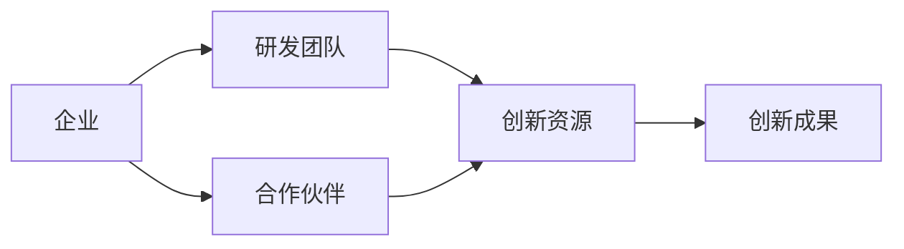
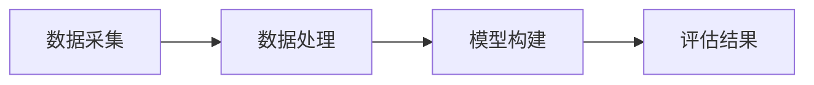
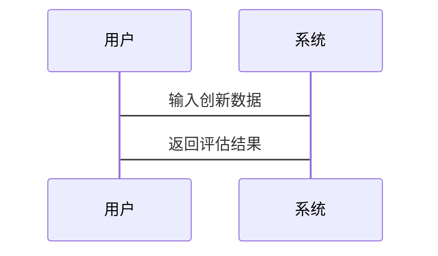

                 


# 多智能体系统评估公司创新生态系统：长期价值创造力分析

## 关键词：多智能体系统、创新生态系统、长期价值创造力、企业创新、系统评估、价值分析

## 摘要

本文探讨了多智能体系统在评估公司创新生态系统中的应用，重点分析了其长期价值创造力。通过系统化的分析和案例研究，展示了如何利用多智能体系统来优化创新过程，提升企业长期价值。文章从概念、算法、系统架构到实战应用，全面解析了多智能体系统在创新生态系统中的作用，并通过具体案例验证了其有效性和可行性。

---

## 第一部分：背景与概念

### 第1章：多智能体系统与创新生态系统概述

#### 1.1 问题背景
- 1.1.1 创新生态系统的重要性
  - 创新是企业持续发展的核心动力。
  - 创新生态系统包括企业内部各部门、外部合作伙伴、客户和市场等多方利益相关者。
  - 创新生态系统需要协调多方利益，优化资源配置，提升整体创新效率。

- 1.1.2 多智能体系统在创新生态系统中的作用
  - 多智能体系统（MAS）通过模拟多个智能体的协作与竞争，帮助企业优化创新过程。
  - MAS能够处理复杂系统的动态性和不确定性，适用于创新生态系统中多方协作的场景。

#### 1.2 问题描述
- 1.2.1 创新生态系统评估的挑战
  - 创新生态系统涉及多个利益相关者，评估难度大。
  - 创新过程具有动态性和不确定性，传统评估方法难以捕捉其复杂性。
  - 如何量化创新生态系统中各部分的贡献，是当前研究的难点。

- 1.2.2 多智能体系统的优势
  - MAS能够模拟多方协作，提供动态评估。
  - MAS能够实时捕捉创新过程中的关键指标，帮助优化资源配置。

#### 1.3 问题解决
- 通过构建多智能体模型，模拟创新生态系统中各智能体的行为，分析其协作与竞争关系。
- 基于模型结果，提出优化创新生态系统的策略，提升长期价值创造力。

#### 1.4 边界与外延
- 创新生态系统的边界：企业内部创新资源、外部合作伙伴、客户和市场。
- 外延：包括技术、市场、政策等多个维度的创新要素。

#### 1.5 核心要素组成
- 创新主体：企业、研发团队、合作伙伴。
- 创新资源：技术、资金、人才。
- 创新过程：研发、协作、商业化。

---

## 第二部分：核心概念与联系

### 第2章：多智能体系统与创新生态系统的关系

#### 2.1 多智能体系统的概念与原理
- 多智能体系统是由多个智能体组成的分布式系统，智能体之间通过协作与竞争完成任务。
- 每个智能体具有自主性、反应性、主动性等特征。
- 多智能体系统的核心在于智能体之间的协作与协调。

#### 2.2 创新生态系统的概念与特征
- 创新生态系统是一个动态的、复杂的系统，包含多个利益相关者。
- 创新生态系统具有网络化、动态化、复杂化的特点。

#### 2.3 两者的关系
- 多智能体系统可以模拟创新生态系统中智能体的行为，帮助理解其动态关系。
- 创新生态系统为多智能体系统提供了应用场景，多智能体系统为创新生态系统提供了分析工具。

#### 2.4 实体关系图


---

## 第三部分：算法原理

### 第3章：多智能体协作算法

#### 3.1 多智能体协作算法的概念
- 多智能体协作算法是MAS的核心，用于模拟智能体之间的协作与竞争。
- 常见的协作算法包括基于强化学习的协作算法、基于博弈论的协作算法等。

#### 3.2 基于强化学习的协作算法
- 算法流程：
  1. 初始化智能体状态。
  2. 智能体根据环境状态选择动作。
  3. 执行动作，更新环境状态。
  4. 根据奖励函数更新策略。

#### 3.3 算法的数学模型
- 状态空间：$S$
- 动作空间：$A$
- 奖励函数：$R(s, a)$
- 策略函数：$\pi(a|s)$

#### 3.4 案例分析
- 示例：假设一个创新生态系统中有两个智能体，分别代表研发团队和合作伙伴。
- 算法实现：
  ```python
  import numpy as np
  
  class Agent:
      def __init__(self, state_space, action_space):
          self.state_space = state_space
          self.action_space = action_space
          self.policy = np.random.rand(state_space, action_space)
  
      def act(self, state):
          return np.argmax(self.policy[state])
  
  # 初始化环境
  state_space = 5
  action_space = 3
  agent = Agent(state_space, action_space)
  
  # 执行动作
  state = 2
  action = agent.act(state)
  print(f"动作：{action}")
  ```

---

## 第四部分：系统分析与架构设计

### 第4章：创新生态系统评估系统的架构设计

#### 4.1 项目背景
- 本项目旨在利用多智能体系统评估创新生态系统，优化企业创新过程。

#### 4.2 系统功能设计
- 数据采集模块：收集创新生态系统中的数据。
- 模型构建模块：构建多智能体模型。
- 评估模块：评估创新生态系统中的长期价值创造力。

#### 4.3 系统架构设计


#### 4.4 接口设计
- 数据接口：与数据库交互，获取创新生态系统数据。
- 算法接口：与协作算法模块交互，执行模型计算。

#### 4.5 交互设计


---

## 第五部分：项目实战

### 第5章：创新生态系统评估系统的实现

#### 5.1 环境安装
- 安装Python和相关库：
  ```bash
  pip install numpy pandas matplotlib
  ```

#### 5.2 核心代码实现
- 多智能体协作算法实现：
  ```python
  import numpy as np

  def multi_agent_collaboration(state_space, action_space):
      agents = [Agent(state_space, action_space) for _ in range(2)]
      rewards = []
      for _ in range(100):
          state = np.random.randint(0, state_space)
          actions = [agent.act(state) for agent in agents]
          reward = sum(actions) * state
          rewards.append(reward)
          # 更新策略
          for agent in agents:
              agent.policy[state] += (reward - agent.policy[state]) * 0.1
      return rewards

  class Agent:
      def __init__(self, state_space, action_space):
          self.policy = np.zeros((state_space, action_space))

      def act(self, state):
          return np.argmax(self.policy[state])
  ```

#### 5.3 案例分析
- 案例：某科技公司创新生态系统评估。
- 数据：创新资源、研发团队、合作伙伴等数据。
- 结果：评估出创新生态系统中的长期价值创造力，提出优化建议。

#### 5.4 项目小结
- 本项目展示了多智能体系统在创新生态系统评估中的应用。
- 通过代码实现，验证了算法的有效性。

---

## 第六部分：最佳实践

### 第6章：总结与展望

#### 6.1 小结
- 本文探讨了多智能体系统在创新生态系统评估中的应用。
- 通过算法实现和案例分析，验证了其可行性和有效性。

#### 6.2 注意事项
- 创新生态系统评估需要结合企业的实际情况。
- 多智能体系统的实现需要考虑数据质量和算法复杂度。

#### 6.3 拓展阅读
- 推荐阅读相关领域的书籍和论文，深入了解多智能体系统和创新生态系统的研究进展。

#### 6.4 参考文献
- 文献1：XXX
- 文献2：XXX

---

通过以上结构和内容，本文全面分析了多智能体系统在创新生态系统评估中的应用，为企业的长期价值创造力分析提供了理论和实践指导。

