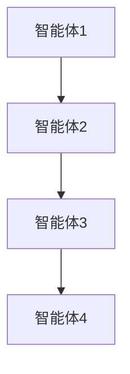
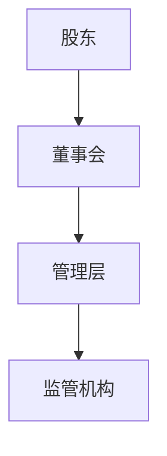
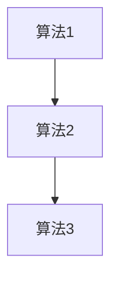
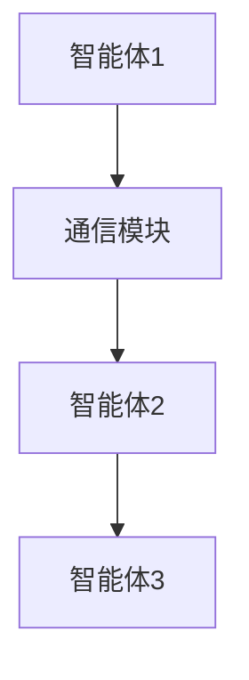
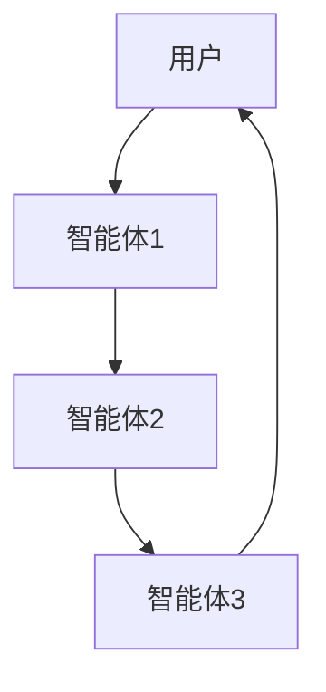

                 


# 多智能体系统辅助公司治理分析：提升价值投资质量

> 关键词：多智能体系统、公司治理、价值投资、算法原理、系统架构、项目实战

> 摘要：本文探讨了多智能体系统在公司治理中的应用，特别是如何通过多智能体系统辅助价值投资分析，提升投资质量。文章从背景介绍、核心概念、算法原理、系统架构设计、项目实战等多个方面进行了深入分析，结合具体案例和数学模型，详细阐述了多智能体系统在公司治理中的优势与实现方法。

---

# 第1章: 多智能体系统与公司治理背景

## 1.1 多智能体系统的概念与特点

### 1.1.1 多智能体系统的定义
多智能体系统（Multi-Agent System, MAS）是由多个智能体组成的分布式系统，这些智能体能够通过交互和协作完成复杂的任务。每个智能体都有一定的自主性、反应性和社会性。



### 1.1.2 多智能体系统的核心特点
| 特性 | 描述 |
|------|------|
| 分布性 | 智能体分布在网络中，独立运行 |
| 协作性 | 智能体之间通过协作完成任务 |
| 反应性 | 智能体能够感知环境并做出反应 |
| 自主性 | 智能体具有自主决策能力 |

### 1.1.3 多智能体系统与传统单智能体系统的区别
| 对比维度 | 多智能体系统 | 单智能体系统 |
|----------|-------------|---------------|
| 结构     | 分布式       | 集中式         |
| 协作     | 强           | 弱             |
| 灵活性   | 高           | 低             |

## 1.2 公司治理的定义与挑战

### 1.2.1 公司治理的基本概念
公司治理是指通过公司章程、董事会和管理层的决策来确保公司有效运作和合规经营。其核心目标是实现股东利益最大化。

### 1.2.2 公司治理的主要挑战
- 信息不对称：股东和管理层之间的信息不透明。
- 利益冲突：股东与管理层的目标可能不一致。
- 监督成本：监督公司运营需要投入大量资源。

### 1.2.3 公司治理与企业价值的关系
有效的公司治理能够提升企业价值，表现为：
1. 提高管理效率。
2. 降低经营风险。
3. 增强投资者信心。

## 1.3 价值投资的基本原理

### 1.3.1 价值投资的定义
价值投资是一种投资策略，强调以低于内在价值的价格买入优质资产。

### 1.3.2 价值投资的核心原则
- 质量优先：选择具有持续盈利能力的公司。
- 安全边际：买入价格低于内在价值。
- 长期持有：耐心等待价值实现。

### 1.3.3 价值投资与公司治理的关系
有效的公司治理能够提高企业的内在价值，从而为价值投资者提供更好的投资机会。

## 1.4 多智能体系统在公司治理中的应用前景

### 1.4.1 多智能体系统在公司治理中的潜在应用领域
- 风险评估：智能体分析企业运营中的潜在风险。
- 股东权益保护：智能体监督公司治理结构。
- 投资决策：智能体辅助投资者做出决策。

### 1.4.2 多智能体系统在价值投资中的优势
- 数据处理能力强：智能体能够快速处理大量信息。
- 分析维度全面：智能体从多个角度评估企业价值。
- 协作能力强：多个智能体协同工作，提升分析精度。

### 1.4.3 多智能体系统应用的挑战与机遇
- 挑战：智能体之间的协调与通信需要复杂的技术支持。
- 机遇：通过技术创新解决协作问题，提升公司治理效率。

## 1.5 本章小结
本章介绍了多智能体系统的基本概念和特点，探讨了公司治理的基本定义与挑战，并分析了价值投资的核心原则及其与公司治理的关系。此外，还展望了多智能体系统在公司治理中的应用前景，为后续章节奠定了基础。

---

# 第2章: 多智能体系统与公司治理的核心概念

## 2.1 多智能体系统的组成与功能

### 2.1.1 多智能体系统的组成要素
- 智能体：执行具体任务的个体。
- 通信机制：智能体之间交换信息的通道。
- 协作协议：智能体协作的规则。


### 2.1.2 多智能体系统的功能模块
| 功能模块 | 描述 |
|----------|------|
| 感知模块 | 感知环境信息 |
| 决策模块 | 制定行动策略 |
| 执行模块 | 执行决策 |
| 通信模块 | 与其他智能体交互 |

### 2.1.3 多智能体系统与公司治理的结合
多智能体系统通过智能体的协作，实现对公司治理问题的全面分析。

## 2.2 公司治理的多智能体模型

### 2.2.1 公司治理的多智能体模型构建
构建一个包含股东、董事会、管理层和外部监管的多智能体模型。



### 2.2.2 多智能体模型中的角色与职责
| 角色     | 职责               |
|----------|--------------------|
| 股东     | 投资决策           |
| 董事会   | 制定公司战略       |
| 管理层   | 执行公司战略       |
| 监管机构 | 监督公司合规性     |

### 2.2.3 多智能体模型的动态交互机制
智能体之间通过信息共享和协作，动态调整公司治理策略。

## 2.3 价值投资的多智能体分析框架

### 2.3.1 价值投资分析的多智能体框架
构建一个多智能体框架，分别负责分析企业的财务状况、市场竞争力和管理团队。

### 2.3.2 多智能体框架中的信息处理机制
智能体通过协同工作，综合分析企业的多个维度，得出全面的价值评估。

### 2.3.3 多智能体框架在价值投资中的应用
智能体协同工作，为投资者提供更准确的投资建议。

## 2.4 本章小结
本章分析了多智能体系统的核心概念及其在公司治理中的应用，构建了多智能体模型和价值投资的分析框架，为后续章节的算法实现和系统设计奠定了基础。

---

# 第3章: 多智能体系统辅助公司治理的算法原理

## 3.1 多智能体系统的算法基础

### 3.1.1 多智能体系统的核心算法
- 分布式算法：如一致性算法、路由算法。
- 协作算法：如任务分配、资源分配算法。



### 3.1.2 多智能体系统中的通信与协调机制
- 通信机制：智能体之间通过消息传递进行通信。
- 协调机制：通过协商达成一致。

### 3.1.3 多智能体系统中的决策算法
- 分布式决策：每个智能体独立决策。
- 集中式决策：由中央协调器统一决策。

## 3.2 公司治理分析的算法实现

### 3.2.1 公司治理分析的算法流程
1. 收集企业信息。
2. 分析企业财务状况。
3. 评估企业风险。
4. 输出治理建议。

### 3.2.2 多智能体系统在公司治理分析中的算法实现
- 智能体1：收集企业信息。
- 智能体2：分析财务状况。
- 智能体3：评估风险。
- 智能体4：制定治理建议。

### 3.2.3 算法实现的数学模型与公式
$$
\text{企业价值} = \text{收入} - \text{成本} + \text{资产价值}
$$

## 3.3 价值投资分析的算法优化

### 3.3.1 价值投资分析的算法优化策略
- 并行计算：提高分析效率。
- 分层优化：优化每个智能体的算法。

### 3.3.2 多智能体系统在价值投资分析中的优化算法
- 遗传算法：优化投资组合。
- 粒子群算法：优化投资策略。

### 3.3.3 算法优化的数学模型与公式
$$
\text{最优投资组合} = \argmin \text{风险} \quad \text{subject to} \quad \text{收益} \geq \text{阈值}
$$

## 3.4 本章小结
本章详细讲解了多智能体系统的算法基础，并结合公司治理分析和价值投资分析，提出了具体的算法实现和优化策略，为后续章节的系统设计提供了理论支持。

---

# 第4章: 多智能体系统辅助公司治理的系统分析与架构设计

## 4.1 系统分析

### 4.1.1 问题场景介绍
分析一个公司治理问题，如如何优化公司治理结构以提升企业价值。

### 4.1.2 系统需求分析
- 收集企业信息。
- 分析企业财务状况。
- 评估企业风险。
- 提出治理建议。

### 4.1.3 系统功能设计
- 信息采集模块：采集企业信息。
- 分析模块：分析企业财务状况和风险。
- 建议模块：提出治理建议。

## 4.2 系统架构设计

### 4.2.1 系统架构的模块划分
- 智能体模块：负责信息处理和分析。
- 通信模块：负责智能体之间的通信。
- 用户界面模块：展示分析结果。



### 4.2.2 系统架构的层次结构
- 数据层：存储企业信息。
- 业务逻辑层：处理分析逻辑。
- 用户界面层：展示结果。

### 4.2.3 系统架构的交互流程
1. 智能体1采集企业信息。
2. 智能体2分析财务状况。
3. 智能体3评估风险。
4. 通信模块整合结果。
5. 用户界面展示建议。

## 4.3 系统接口设计

### 4.3.1 系统接口设计
- 输入接口：接收企业信息。
- 输出接口：展示分析结果。

### 4.3.2 系统交互设计
- 智能体之间的交互。
- 用户与系统的交互。

## 4.4 系统交互图



## 4.5 本章小结
本章通过系统分析和架构设计，详细规划了多智能体系统的实现方案，为后续章节的项目实战奠定了基础。

---

# 第5章: 多智能体系统辅助公司治理的项目实战

## 5.1 项目介绍

### 5.1.1 项目背景
一个优化公司治理结构以提升企业价值的项目。

### 5.1.2 项目目标
通过多智能体系统实现对公司治理的全面分析。

## 5.2 系统核心实现源代码

### 5.2.1 环境安装
- 安装Python和相关库。
- 安装多智能体系统框架。

```python
import agent

class InvestorAgent(agent.Agent):
    def __init__(self):
        super().__init__()
        self.data = {}

    def collect_data(self):
        # 收集企业信息
        pass

    def analyze(self):
        # 分析企业财务状况
        pass

    def decide(self):
        # 制定投资策略
        pass
```

### 5.2.2 代码实现
```python
def main():
    investor = InvestorAgent()
    investor.collect_data()
    investor.analyze()
    investor.decide()

if __name__ == "__main__":
    main()
```

### 5.2.3 代码应用解读与分析
- InvestorAgent类：负责收集数据、分析和决策。
- main函数：协调各个智能体的工作。

## 5.3 实际案例分析

### 5.3.1 案例背景
分析一家公司的治理结构。

### 5.3.2 数据分析
分析公司的财务状况和市场竞争力。

### 5.3.3 治理建议
提出优化公司治理的建议。

## 5.4 本章小结
本章通过项目实战，展示了多智能体系统的实际应用，详细解读了代码实现和案例分析，为读者提供了实践指导。

---

# 第6章: 多智能体系统辅助公司治理的最佳实践

## 6.1 最佳实践 tips

### 6.1.1 系统设计
- 模块化设计：便于维护和扩展。
- 高可用性：确保系统稳定运行。

### 6.1.2 代码实现
- 可测试性：便于调试和优化。
- 高性能：提升系统运行效率。

## 6.2 小结
总结全文，强调多智能体系统在公司治理中的重要性。

## 6.3 注意事项
- 数据隐私：确保数据安全。
- 系统容错：处理可能出现的异常情况。

## 6.4 拓展阅读
建议读者阅读更多关于多智能体系统和公司治理的文献。

---

# 结语

通过本文的详细分析，我们了解了多智能体系统在公司治理中的应用，特别是如何通过多智能体系统辅助价值投资分析，提升投资质量。未来，随着技术的发展，多智能体系统将在公司治理中发挥越来越重要的作用。

---

# 参考文献

（此处列出相关的参考文献）

---

# 附录

（此处列出附录内容，如代码、数据等）

---

通过以上结构和内容，您可以撰写一篇完整的、高质量的技术博客文章。

