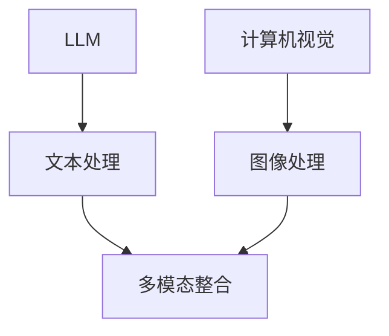
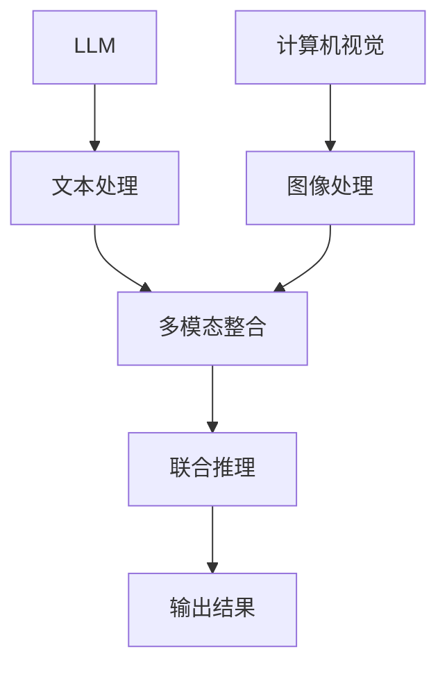
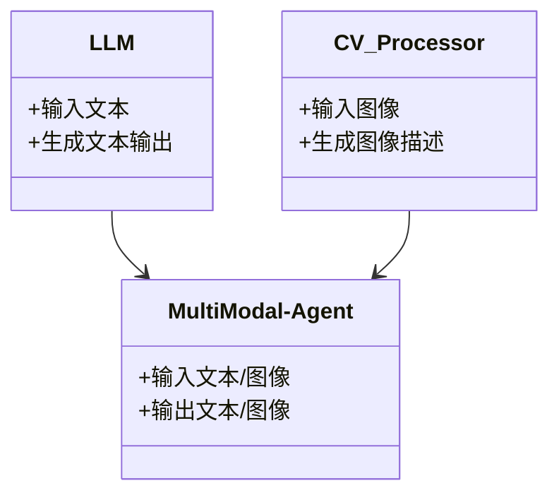
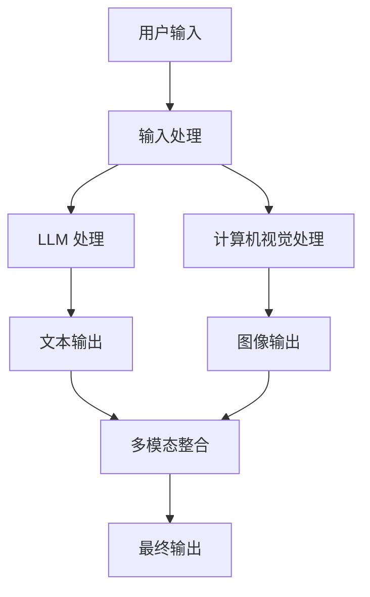
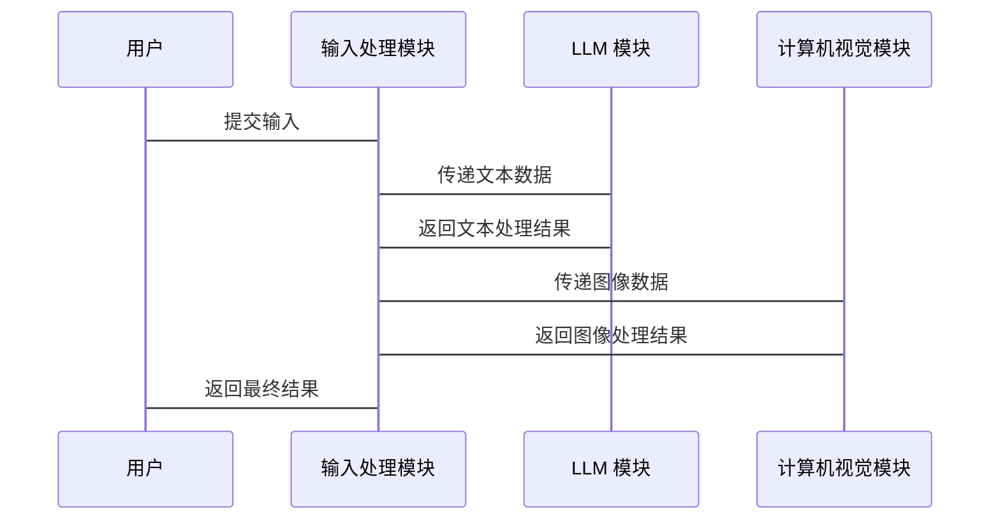

                 


# 多模态 AI Agent 开发：整合 LLM 与计算机视觉

> 关键词：多模态 AI Agent，LLM，计算机视觉，深度学习，人工智能，模态数据整合

> 摘要：本文深入探讨了多模态 AI Agent 的开发，重点介绍了如何将大语言模型（LLM）与计算机视觉技术相结合。文章从基础概念到高级算法，从系统设计到实战项目，全面解析了多模态 AI Agent 的开发过程。通过详细的技术分析和实际案例，本文为读者提供了从理论到实践的完整指南。

---

# 第一部分: 多模态 AI Agent 的核心概念与背景

## 第1章: 多模态 AI Agent 的定义与背景

### 1.1 多模态 AI Agent 的定义

#### 1.1.1 多模态 AI Agent 的概念
多模态 AI Agent 是一种能够处理多种类型数据（如文本、图像、语音等）并生成相应输出的人工智能系统。它结合了大语言模型（LLM）和计算机视觉技术，能够同时理解和处理结构化数据和非结构化数据。

#### 1.1.2 多模态 AI Agent 的核心要素
- **多模态数据处理能力**：能够同时处理文本、图像、语音等多种数据类型。
- **LLM 的语言理解能力**：通过大语言模型实现对文本的深度理解和生成。
- **计算机视觉的图像处理能力**：通过计算机视觉技术实现对图像的识别、分割和生成。
- **跨模态协同**：不同模态的数据能够协同工作，共同完成复杂的任务。

#### 1.1.3 多模态 AI Agent 的应用场景
- **智能客服**：结合文本和图像，提供更直观的交互体验。
- **医疗诊断**：结合病历文本和医学图像，辅助医生进行诊断。
- **自动驾驶**：结合环境感知（图像）和语言理解，实现更智能的决策。

### 1.2 LLM 与计算机视觉的结合

#### 1.2.1 LLM 的基本概念
大语言模型（LLM）是指基于Transformer架构的大规模预训练语言模型，如GPT-3、BERT等。LLM 具备强大的语言理解和生成能力，能够处理复杂的文本任务。

#### 1.2.2 计算机视觉的基本概念
计算机视觉（Computer Vision）是利用计算机对图像进行处理和理解的技术，包括图像识别、目标检测、图像分割等任务。

#### 1.2.3 LLM 与计算机视觉的协同工作方式
- **跨模态理解**：LLM 可以理解图像的描述性文本，计算机视觉技术可以生成图像的语义信息。
- **协同推理**：通过结合文本和图像信息，提高模型的推理能力。

### 1.3 多模态 AI Agent 的问题背景

#### 1.3.1 当前 AI 技术的局限性
- **单模态局限性**：传统 AI 系统通常只能处理单一类型的模态数据。
- **信息不完整**：单一模态数据无法提供完整的上下文信息。

#### 1.3.2 多模态技术的必要性
- **信息互补性**：通过结合不同模态的数据，可以提供更全面的信息。
- **任务复杂性**：许多实际任务需要处理多种类型的模态数据。

#### 1.3.3 多模态 AI Agent 的目标与意义
- **目标**：开发能够处理多种模态数据的智能系统，提高任务处理能力。
- **意义**：通过结合 LLM 和计算机视觉技术，实现更智能、更自然的人机交互。

## 第2章: 多模态 AI Agent 的核心概念与联系

### 2.1 多模态 AI Agent 的核心原理

#### 2.1.1 多模态数据的整合与处理
多模态数据的整合与处理需要考虑不同模态数据之间的关联性，通过特征对齐和融合技术实现信息的有效整合。

#### 2.1.2 LLM 在多模态任务中的角色
- **语言理解与生成**：LLM 用于处理文本数据，生成相关的语言输出。
- **跨模态桥梁**：LLM 可以作为不同模态数据之间的桥梁，实现信息的共享和协同。

#### 2.1.3 计算机视觉在多模态任务中的角色
- **图像理解**：计算机视觉技术用于图像的识别、分割和生成。
- **视觉辅助推理**：通过图像信息辅助 LLM 进行推理和决策。

### 2.2 LLM 与计算机视觉的对比分析

#### 2.2.1 LLM 的优势与劣势
- **优势**：强大的语言理解和生成能力，能够处理复杂的语言任务。
- **劣势**：对图像数据的处理能力较弱，需要依赖其他技术。

#### 2.2.2 计算机视觉的优势与劣势
- **优势**：擅长处理图像数据，能够进行高效的图像识别和生成。
- **劣势**：缺乏语言理解和生成能力，无法处理文本任务。

#### 2.2.3 两者的互补性分析
- **互补性**：LLM 和计算机视觉技术在各自的领域具有优势，可以通过协同工作实现更强大的功能。
- **协同效应**：通过结合 LLM 和计算机视觉技术，可以实现跨模态的任务处理，提高系统的整体性能。

### 2.3 多模态 AI Agent 的实体关系图



---

## 第3章: 多模态 AI Agent 的算法原理

### 3.1 LLM 的算法原理

#### 3.1.1 Transformer 模型的结构
Transformer 模型由编码器和解码器两部分组成，编码器用于将输入序列映射到一个中间表示，解码器用于根据编码器的输出生成目标序列。

#### 3.1.2 注意力机制的数学公式
注意力机制是 Transformer 模型的核心组件，其数学公式如下：

$$\text{Attention}(Q, K, V) = \text{softmax}(\frac{QK^T}{\sqrt{d}})V$$

其中，\( Q \) 是查询向量，\( K \) 是键向量，\( V \) 是值向量，\( d \) 是向量的维度。

### 3.2 计算机视觉的算法原理

#### 3.2.1 CNN 的基本结构
卷积神经网络（CNN）是计算机视觉领域的重要模型，其基本结构包括卷积层、池化层和全连接层。

#### 3.2.2 卷积层的数学公式
卷积操作的数学公式如下：

$$f(x) = \sum_{i=1}^{n} w_i \cdot x_i + b$$

其中，\( w_i \) 是卷积核的权重，\( x_i \) 是输入数据，\( b \) 是偏置项。

#### 3.2.3 池化层的作用
池化层用于降低计算复杂度和提高模型的平移不变性，常用的池化方式包括最大池化和平均池化。

---

### 3.3 多模态 AI Agent 的算法协作流程



---

## 第4章: 多模态 AI Agent 的系统分析与架构设计

### 4.1 问题场景介绍

#### 4.1.1 问题描述
本文将设计一个多模态 AI Agent 系统，该系统能够同时处理文本和图像数据，完成图像描述生成和图像问答等任务。

#### 4.1.2 问题解决
通过结合 LLM 和计算机视觉技术，实现多模态数据的协同处理，提高系统的任务处理能力。

### 4.2 系统功能设计

#### 4.2.1 领域模型设计



#### 4.2.2 系统架构设计



### 4.3 系统接口设计

#### 4.3.1 输入接口
- **文本输入**：接受用户输入的文本数据。
- **图像输入**：接受用户输入的图像数据。

#### 4.3.2 输出接口
- **文本输出**：生成与输入文本相关的输出。
- **图像输出**：生成与输入图像相关的输出。

### 4.4 系统交互流程



---

## 第5章: 多模态 AI Agent 的项目实战

### 5.1 环境安装

#### 5.1.1 安装 Python
- 安装 Python 3.8 或更高版本。

#### 5.1.2 安装依赖库
- 使用 pip 安装必要的依赖库，如：
  ```bash
  pip install numpy matplotlib tensorflow
  ```

### 5.2 系统核心实现源代码

#### 5.2.1 LLM 的实现

```python
import tensorflow as tf
from tensorflow.keras.layers import Dense, InputLayer, Activation

class LLM_Model:
    def __init__(self, vocab_size):
        self.vocab_size = vocab_size
        self.model = self.build_model()
    
    def build_model(self):
        model = tf.keras.Sequential()
        model.add(InputLayer(input_shape=(None,)))
        model.add(Embedding(self.vocab_size, 64))
        model.add(LSTM(64, return_sequences=True))
        model.add(Dense(self.vocab_size, activation='softmax'))
        return model
```

#### 5.2.2 计算机视觉模块的实现

```python
import cv2

class CV_Processor:
    def __init__(self):
        pass
    
    def process_image(self, image_path):
        # 加载图像
        image = cv2.imread(image_path)
        # 转换为 RGB 格式
        image = cv2.cvtColor(image, cv2.COLOR_BGR2RGB)
        return image
```

#### 5.2.3 多模态 AI Agent 的实现

```python
class MultiModalAgent:
    def __init__(self, llm_model, cv_processor):
        self.llm_model = llm_model
        self.cv_processor = cv_processor
    
    def process_input(self, input_type, input_data):
        if input_type == 'text':
            return self.llm_model.process_text(input_data)
        elif input_type == 'image':
            return self.cv_processor.process_image(input_data)
        else:
            raise ValueError("Invalid input type")
```

### 5.3 代码解读与分析

#### 5.3.1 LLM 的实现
上述代码定义了一个基于 LSTM 的大语言模型，能够处理序列数据并生成文本输出。

#### 5.3.2 计算机视觉模块的实现
上述代码定义了一个计算机视觉处理器，能够加载和处理图像数据。

#### 5.3.3 多模态 AI Agent 的实现
上述代码定义了一个多模态 AI Agent，能够根据输入类型调用相应的处理模块，实现多模态数据的协同处理。

### 5.4 实际案例分析

#### 5.4.1 案例描述
假设用户输入一张图像和一段文本描述，AI Agent 需要根据图像生成对应的文本描述，并根据文本生成相关的图像内容。

#### 5.4.2 处理流程
1. 用户输入图像和文本数据。
2. 输入处理模块将文本数据传递给 LLM 模块，生成图像描述。
3. 输入处理模块将图像数据传递给计算机视觉模块，生成图像内容。
4. 多模态 AI Agent 整合文本和图像数据，生成最终的输出结果。

---

## 第6章: 总结与展望

### 6.1 最佳实践 Tips

- **数据预处理**：在多模态任务中，数据的预处理非常重要，需要确保不同模态的数据能够有效对齐。
- **模型调优**：多模态模型通常比较复杂，需要进行充分的调优以获得最佳性能。
- **性能评估**：在多模态任务中，需要设计合适的评估指标，以全面衡量模型的性能。

### 6.2 小结

本文详细介绍了多模态 AI Agent 的开发过程，从核心概念到算法原理，从系统设计到实战项目，为读者提供了全面的指导。通过结合 LLM 和计算机视觉技术，多模态 AI Agent 能够处理多种类型的数据，实现更强大的功能。

### 6.3 注意事项

- **数据隐私**：在处理多模态数据时，需要注意数据的隐私和安全问题。
- **模型可解释性**：多模态模型的可解释性通常较差，需要进行专门的设计以提高模型的可解释性。

### 6.4 拓展阅读

- **多模态学习**：进一步阅读多模态学习的相关论文，了解最新的研究成果。
- **大语言模型**：深入学习大语言模型的内部机制，了解其在多模态任务中的应用。
- **计算机视觉**：系统学习计算机视觉技术，掌握更多的图像处理方法。

---

通过本文的学习，读者可以掌握多模态 AI Agent 的开发技巧，理解 LLM 和计算机视觉技术的整合方式，并能够将其应用于实际项目中。希望本文能为读者在多模态 AI Agent 的开发领域提供有价值的参考。

