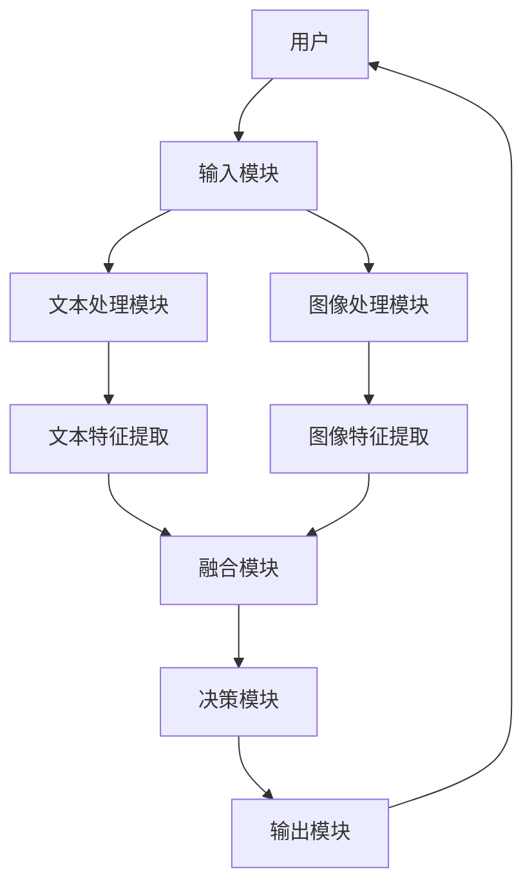
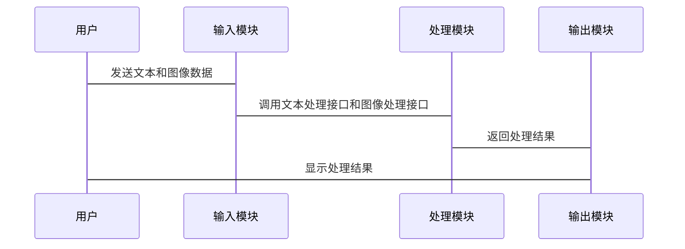

                 


# 多模态AI Agent：整合LLM与计算机视觉的最佳实践

## 关键词：多模态AI Agent，LLM，计算机视觉，深度学习，智能交互

## 摘要：  
多模态AI Agent通过整合大语言模型（LLM）与计算机视觉技术，实现了更智能、更自然的人机交互方式。本文将详细探讨多模态AI Agent的核心概念、整合方法、系统架构设计以及实际应用案例，帮助读者理解并掌握如何构建一个高效的多模态AI Agent系统。

---

# 第一部分: 多模态AI Agent的背景与概述

## 第1章: 多模态AI Agent的背景与概念

### 1.1 多模态AI Agent的背景

#### 1.1.1 多模态技术的起源与发展  
多模态技术起源于人工智能领域，旨在整合多种数据形式（如文本、图像、语音等）以提高模型的理解和处理能力。近年来，随着深度学习的兴起，多模态技术得到了广泛应用，尤其是在自然语言处理和计算机视觉领域。

#### 1.1.2 AI Agent的基本概念  
AI Agent（智能代理）是指能够感知环境、执行任务并做出决策的智能系统。它可以是一个软件程序，也可以是一个物理设备，核心目标是通过与用户的交互或环境的交互来完成特定任务。

#### 1.1.3 多模态与AI Agent的结合  
多模态AI Agent将多种数据形式（如文本、图像、语音）整合到AI Agent中，使其能够通过多种方式与用户交互，并理解复杂的上下文信息。这种结合显著提升了AI Agent的智能性和实用性。

### 1.2 多模态AI Agent的核心特点

#### 1.2.1 多模态数据的整合与处理  
多模态AI Agent能够同时处理文本、图像等多种数据形式，并通过融合这些数据来提高模型的准确性。

#### 1.2.2 智能交互与实时反馈  
多模态AI Agent能够通过自然语言理解、图像识别等多种方式与用户交互，并实时提供反馈，提升用户体验。

#### 1.2.3 系统的可扩展性与灵活性  
多模态AI Agent的设计使其能够轻松扩展和集成新的数据形式或功能，具有高度的灵活性。

### 1.3 多模态AI Agent的应用场景

#### 1.3.1 智能客服  
多模态AI Agent可以用于智能客服系统，通过文本和语音交互为用户提供支持。

#### 1.3.2 智能助手  
多模态AI Agent可以作为智能助手，帮助用户完成日程管理、信息查询等多种任务。

#### 1.3.3 智慧教育  
多模态AI Agent可以用于智慧教育系统，通过图像识别和自然语言处理为学生提供个性化的学习支持。

#### 1.3.4 智慧医疗  
多模态AI Agent可以用于智慧医疗系统，通过整合医疗图像和病历文本，辅助医生进行诊断。

## 第2章: 大语言模型（LLM）与计算机视觉的基础

### 2.1 大语言模型（LLM）概述

#### 2.1.1 LLM的定义与特点  
大语言模型（LLM）是一种基于深度学习的自然语言处理模型，具有大规模参数和强大的上下文理解能力。

#### 2.1.2 LLM的核心技术与算法  
LLM的核心技术包括转移学习（Transfer Learning）、注意力机制（Attention Mechanism）和生成模型（Generative Models）。

#### 2.1.3 LLM的应用领域  
LLM广泛应用于自然语言生成、机器翻译、问答系统等领域。

### 2.2 计算机视觉基础

#### 2.2.1 计算机视觉的定义与应用  
计算机视觉是一种通过计算机处理和分析图像的技术，应用于图像识别、目标检测、图像分割等领域。

#### 2.2.2 常见计算机视觉算法与模型  
常见的计算机视觉算法包括卷积神经网络（CNN）、区域卷积神经网络（R-CNN）和YOLO等目标检测算法。

#### 2.2.3 计算机视觉与深度学习的结合  
深度学习的兴起推动了计算机视觉的发展，使得图像识别的准确率和效率都有了显著提升。

### 2.3 LLM与计算机视觉的整合

#### 2.3.1 整合的基本概念  
LLM与计算机视觉的整合是指将自然语言处理与图像处理技术相结合，使模型能够同时理解和处理文本和图像信息。

#### 2.3.2 整合的优势与挑战  
整合的优势包括提升模型的多任务处理能力，增强用户体验。挑战则包括数据融合的复杂性和模型训练的难度。

#### 2.3.3 整合的典型应用案例  
典型应用案例包括图像描述生成、多模态问答系统等。

---

# 第二部分: 多模态数据处理与融合

## 第3章: 多模态数据的处理与分析

### 3.1 多模态数据的获取与预处理

#### 3.1.1 数据获取方法  
多模态数据可以通过多种方式获取，例如摄像头采集图像数据，麦克风采集语音数据，文本数据可以通过API接口获取。

#### 3.1.2 数据清洗与预处理  
数据清洗包括去除噪声、填补缺失值等，预处理包括归一化、标准化等操作。

#### 3.1.3 数据格式的转换与标准化  
数据格式的转换包括将图像数据转换为矩阵形式，文本数据转换为向量形式等。

### 3.2 多模态数据的特征提取

#### 3.2.1 文本特征提取  
文本特征提取可以通过词袋模型（Bag of Words）、TF-IDF等方法实现。

#### 3.2.2 图像特征提取  
图像特征提取可以通过CNN等深度学习模型实现，提取图像的高层次特征。

#### 3.2.3 融合特征的提取方法  
融合特征的提取方法包括将文本和图像的特征向量进行拼接、加权融合等。

### 3.3 多模态数据的融合策略

#### 3.3.1 早期融合  
早期融合是指在特征提取的早期阶段进行数据融合，适用于需要实时处理的应用场景。

#### 3.3.2 中期融合  
中期融合是指在特征提取的中期阶段进行数据融合，适用于需要较深的特征交互的应用场景。

#### 3.3.3 晚期融合  
晚期融合是指在特征提取的后期阶段进行数据融合，适用于需要全局特征交互的应用场景。

## 第4章: 多模态数据融合的算法与模型

### 4.1 基于深度学习的多模态融合模型

#### 4.1.1 多模态融合的网络结构  
多模态融合的网络结构包括并行结构、级联结构和混合结构。

#### 4.1.2 多模态融合的损失函数  
多模态融合的损失函数包括交叉熵损失、均方误差损失等。

#### 4.1.3 多模态融合的训练方法  
多模态融合的训练方法包括迁移学习、联合训练等。

---

## 第5章: 多模态AI Agent的系统架构设计

### 5.1 问题场景介绍  
本章将介绍一个多模态AI Agent的实际应用场景，例如智能客服系统。

### 5.2 系统功能设计

#### 5.2.1 系统功能模块  
系统功能模块包括文本处理模块、图像处理模块、融合处理模块、决策模块等。

#### 5.2.2 系统功能流程  
系统功能流程包括数据获取、特征提取、数据融合、决策输出等步骤。

### 5.3 系统架构设计

#### 5.3.1 系统架构图  
以下是系统架构的Mermaid图：



### 5.4 系统接口设计  
系统接口设计包括文本处理接口、图像处理接口、融合处理接口等。

### 5.5 系统交互设计

#### 5.5.1 系统交互流程  
以下是系统交互的Mermaid图：



---

## 第6章: 项目实战

### 6.1 环境安装

#### 6.1.1 安装Python  
安装Python 3.8或更高版本。

#### 6.1.2 安装依赖库  
安装必要的依赖库，例如TensorFlow、PyTorch、OpenCV等。

### 6.2 系统核心实现源代码

#### 6.2.1 文本处理模块  
以下是文本处理模块的代码：

```python
import tensorflow as tf
from tensorflow.keras.layers import Dense, Input, Dropout
from tensorflow.keras.models import Model

# 文本处理模块
def text_processing_module(input_text):
    text_input = Input(shape=(None,))
    embedding_layer = Embedding(input_dim= vocabulary_size, output_dim= embedding_dim)(text_input)
    dense_layer = Dense(256, activation='relu')(embedding_layer)
    dropout_layer = Dropout(0.5)(dense_layer)
    return Model(inputs=text_input, outputs=dense_layer)
```

#### 6.2.2 图像处理模块  
以下是图像处理模块的代码：

```python
import cv2
import tensorflow as tf
from tensorflow.keras.layers import Conv2D, MaxPooling2D, Flatten, Dense
from tensorflow.keras.models import Model

# 图像处理模块
def image_processing_module(input_image):
    image_input = Input(shape=(224, 224, 3))
    conv_layer = Conv2D(64, (3,3), activation='relu')(image_input)
    pooling_layer = MaxPooling2D((2,2))(conv_layer)
    conv_layer2 = Conv2D(128, (3,3), activation='relu')(pooling_layer)
    pooling_layer2 = MaxPooling2D((2,2))(conv_layer2)
    flatten_layer = Flatten()(pooling_layer2)
    dense_layer = Dense(256, activation='relu')(flatten_layer)
    return Model(inputs=image_input, outputs=dense_layer)
```

#### 6.2.3 数据融合模块  
以下是数据融合模块的代码：

```python
def data_fusion_module(text_feature, image_feature):
    concatenated_features = tf.keras.layers.concatenate([text_feature, image_feature])
    dense_layer = Dense(512, activation='relu')(concatenated_features)
    dropout_layer = Dropout(0.5)(dense_layer)
    output_layer = Dense(1, activation='sigmoid')(dropout_layer)
    return Model(inputs=[text_feature.input, image_feature.input], outputs=output_layer)
```

### 6.3 代码应用解读与分析  
本章将详细解读上述代码的实现原理，并分析其在实际应用中的表现。

### 6.4 实际案例分析和详细讲解剖析  
通过一个实际案例，详细讲解如何利用上述代码构建一个多模态AI Agent系统。

### 6.5 项目小结  
本章通过实际案例展示了如何整合LLM与计算机视觉技术，构建一个多模态AI Agent系统。

---

## 第7章: 最佳实践 tips、小结、注意事项、拓展阅读

### 7.1 最佳实践 tips  
- 在数据融合过程中，建议先进行数据预处理，确保数据的干净和一致性。
- 在模型训练过程中，建议使用迁移学习，以提升模型的泛化能力。

### 7.2 小结  
本文详细探讨了多模态AI Agent的核心概念、整合方法、系统架构设计以及实际应用案例，为读者提供了一个全面的视角。

### 7.3 注意事项  
- 在实际应用中，需注意数据隐私和安全问题。
- 在模型部署时，需考虑系统的可扩展性和可维护性。

### 7.4 拓展阅读  
建议读者进一步阅读关于多模态学习和深度学习的经典论文，以深入理解相关技术。

---

通过本文的详细讲解，读者可以系统地掌握多模态AI Agent的设计与实践，为实际应用打下坚实的基础。

