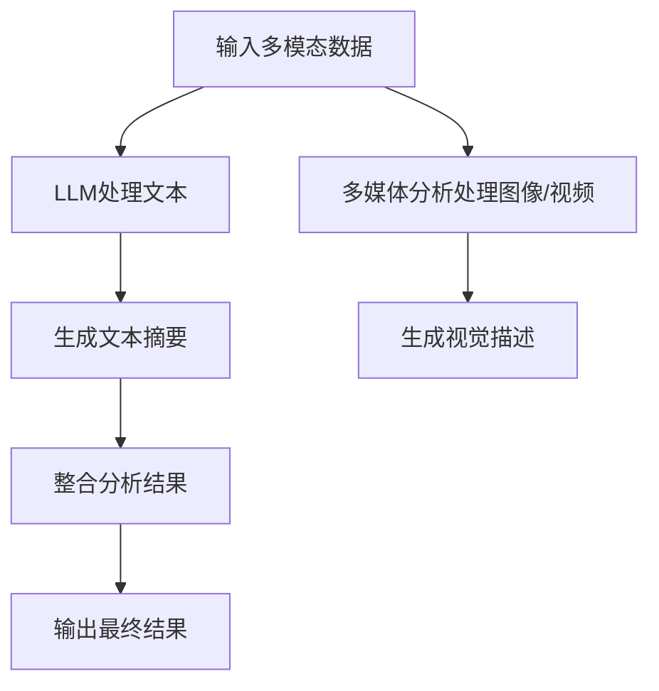

                 


# 多模态内容理解AI Agent：整合LLM与多媒体分析

> 关键词：多模态AI Agent，LLM，多媒体分析，计算机视觉，自然语言处理，深度学习

> 摘要：多模态内容理解AI Agent通过整合大语言模型（LLM）与多媒体分析技术，实现了对文本、图像、视频等多种数据形式的智能理解与交互。本文将详细探讨多模态内容理解的核心概念、算法原理、系统架构及实际应用，帮助读者全面掌握这一前沿技术。

---

# 第一部分: 多模态内容理解AI Agent概述

## 第1章: 多模态内容理解与AI Agent背景

### 1.1 多模态内容理解的定义与背景

#### 1.1.1 多模态数据的定义
多模态数据指的是同时包含多种类型信息的数据，例如文本、图像、语音、视频等。这些数据的结合能够提供更全面的信息理解能力，是实现真正智能化系统的关键。

#### 1.1.2 多模态内容理解的背景与重要性
随着人工智能技术的快速发展，单一模态的数据处理已难以满足复杂的实际需求。多模态内容理解能够整合不同模态的信息，提升系统的理解能力与决策能力，具有重要的研究价值。

#### 1.1.3 AI Agent的基本概念与特点
AI Agent是一种智能体，能够感知环境、执行任务并做出决策。与传统程序不同，AI Agent具备自主性、反应性、目标导向性和社会性等特点。

---

### 1.2 LLM与多媒体分析的结合

#### 1.2.1 大语言模型（LLM）的定义与特点
大语言模型（LLM）如GPT系列模型，通过深度学习技术训练而成，能够处理和生成自然语言文本，具备强大的语义理解和生成能力。

#### 1.2.2 多媒体分析的核心技术
多媒体分析主要涉及图像识别、视频分析和语音识别等技术，通过计算机视觉和深度学习方法实现对图像、视频等数据的自动分析。

#### 1.2.3 LLM与多媒体分析的整合优势
将LLM与多媒体分析技术结合，能够实现对多模态数据的联合理解，突破单一模态分析的局限性，提升系统的智能性与实用性。

---

### 1.3 多模态内容理解AI Agent的应用场景

#### 1.3.1 智能客服与对话系统
通过整合LLM与多媒体分析，AI Agent能够实现多轮对话理解，同时结合用户的情感分析与意图识别，提供更智能的客服服务。

#### 1.3.2 多媒体内容推荐系统
AI Agent可以根据用户的多模态输入，结合文本、图像等信息，提供个性化的内容推荐，提升用户体验。

#### 1.3.3 智能监控与视频分析
通过多模态分析，AI Agent能够实时监控视频流，结合语音识别与图像分析，实现智能安防与事件预警。

---

## 第2章: 多模态内容理解的核心概念与联系

### 2.1 多模态AI Agent的核心原理

#### 2.1.1 多模态数据的整合与处理
多模态数据的整合需要对不同模态的数据进行预处理、特征提取与融合，例如将文本与图像特征进行融合，形成统一的表示。

#### 2.1.2 LLM在多模态任务中的作用
LLM能够处理和生成自然语言文本，同时通过与多媒体分析技术的结合，实现对多模态数据的理解与交互。

#### 2.1.3 多媒体分析的技术实现
多媒体分析主要依赖于计算机视觉技术，包括图像分类、目标检测、语义分割等任务，通过深度学习模型实现对图像和视频的自动分析。

---

### 2.2 核心概念对比与ER实体关系图

#### 2.2.1 多模态AI Agent与传统AI Agent的对比
| 对比维度       | 多模态AI Agent                     | 传统AI Agent                     |
|----------------|------------------------------------|------------------------------------|
| 处理数据类型   | 文本、图像、语音、视频等           | 单一模态数据                      |
| 理解能力       | 多维度、全面                      | 单一维度                        |
| 应用场景       | 智能客服、多媒体推荐、智能监控等    | 简单任务处理                    |

#### 2.2.2 LLM与传统NLP模型的对比
| 对比维度       | LLM                              | 传统NLP模型                     |
|----------------|------------------------------------|------------------------------------|
| 模型规模       | 大型或超大规模模型                | 中小型模型                      |
| 任务处理能力   | 多任务、复杂任务                 | 单一任务                        |
| 模型参数       | 数以亿计的参数                    | 数百万级别的参数                |

#### 2.2.3 多媒体分析与传统图像处理的对比
| 对比维度       | 多媒体分析                      | 传统图像处理                   |
|----------------|----------------------------------|----------------------------------|
| 数据输入       | 图像、视频                      | 单一图像                      |
| 处理任务       | 目标检测、语义分割、行为识别      | 简单图像处理如边缘检测          |
| 技术基础       | 深度学习                        | 传统图像处理算法                |

```mermaid
er
    entity 多模态AI Agent {
        id
        name
        function
    }
    entity LLM {
        model_id
        parameters
        function
    }
    entity 多媒体分析 {
        media_id
        type
        analysis_result
    }
    多模态AI Agent --> LLM: 使用
    多模态AI Agent --> 多媒体分析: 整合
```

---

### 2.3 算法原理与流程图



---

## 第3章: 多模态内容理解AI Agent的算法原理

### 3.1 大语言模型（LLM）的核心算法

#### 3.1.1 变压量模

---

**总结：** 通过整合LLM与多媒体分析技术，多模态内容理解AI Agent能够实现对多种数据形式的智能理解与交互。本文从核心概念、算法原理、系统架构等方面进行了详细探讨，帮助读者全面掌握这一前沿技术。

