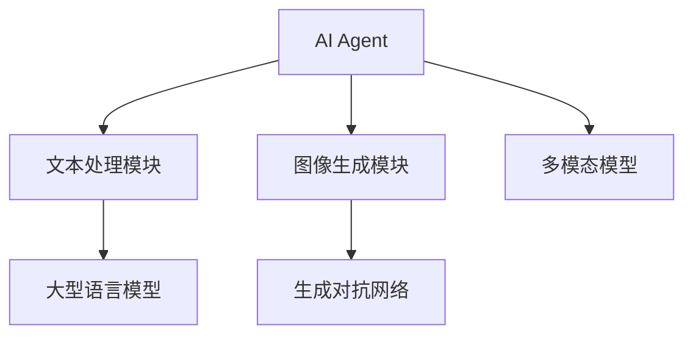
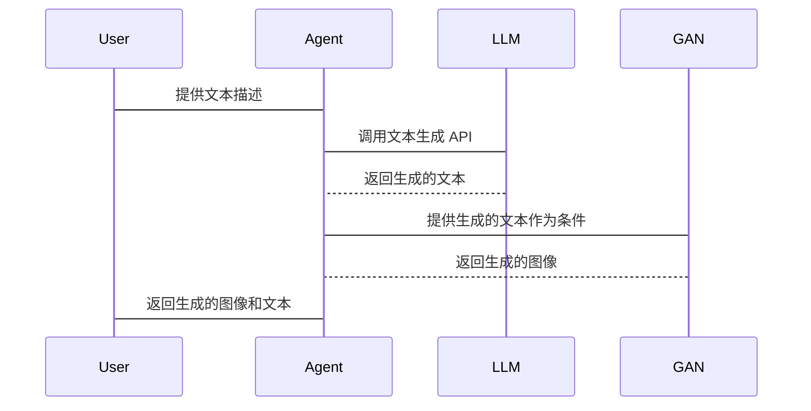
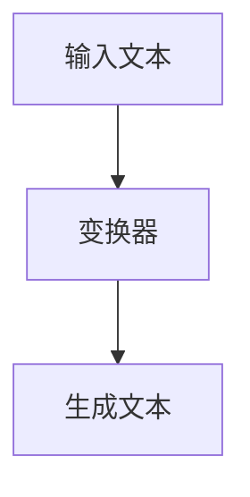
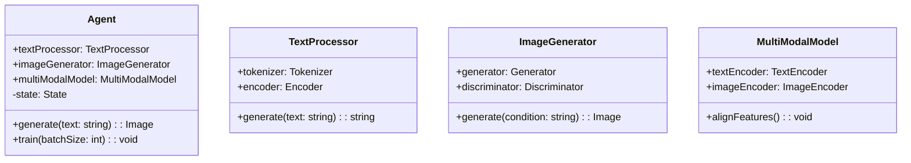
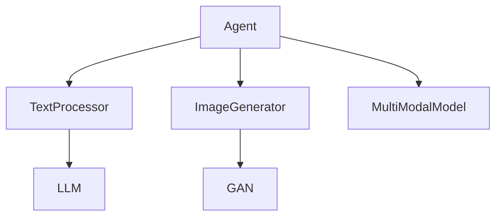

                 


# 多模态内容生成 AI Agent：整合 LLM 与图像生成

## 关键词：多模态生成、AI Agent、LLM、图像生成、深度学习

## 摘要：本文探讨如何整合大型语言模型（LLM）与图像生成技术，构建多模态AI代理。通过分析协同机制、算法原理和系统架构，展示其在内容生成中的应用潜力，涵盖技术背景、核心概念、算法流程、系统设计和项目实现。

---

# 第一部分: 多模态内容生成 AI Agent 的背景与概念

## 第1章: 多模态内容生成 AI Agent 概述

### 1.1 多模态内容生成的背景与意义

#### 1.1.1 多模态数据的定义与特点

多模态数据指的是整合多种数据形式（如文本、图像、音频等）的信息。每种模态都有其独特的优势和局限性，通过结合不同模态的数据，可以更全面地理解和生成信息。例如，图像提供视觉信息，文本提供语义信息，两者的结合能够生成更丰富的内容。

#### 1.1.2 多模态内容生成的必要性

在当今数字时代，单一模态的内容生成已难以满足多样化的需求。通过整合多种模态，可以提高生成内容的准确性和丰富性，增强用户体验。例如，在教育领域，结合文本和图像可以更生动地呈现知识点，提高学习效果。

#### 1.1.3 AI Agent 在多模态生成中的角色

AI Agent（智能代理）作为多模态生成的核心，负责协调和整合不同模态的数据，实现协同生成。它能够理解用户需求，调用多种生成模型，输出符合用户期望的多模态内容。例如，在商业广告中，AI Agent可以根据用户提供的文本描述生成相应的图像，实现自动化的内容创作。

### 1.2 LLM 与图像生成的整合背景

#### 1.2.1 LLM 的发展与应用

大型语言模型（LLM）如GPT-3、GPT-4等，凭借其强大的文本生成能力，在自然语言处理领域取得了显著进展。LLM能够生成连贯且上下文相关的文本，适用于多种应用场景，如自动写作、对话系统等。

#### 1.2.2 图像生成技术的演进

图像生成技术从早期的基于规则的生成方法，发展到现在的深度学习方法。生成对抗网络（GAN）、变分自编码器（VAE）等技术的进步，使得生成高质量图像成为可能。例如，GAN通过对抗训练，生成逼真的图像。

#### 1.2.3 两者的结合与协同

整合LLM和图像生成技术，能够充分发挥两者的优势。LLM可以生成与图像相关的文本描述，指导图像生成模型生成更符合语义的图像；而图像生成模型则为LLM提供视觉信息，增强其生成能力。例如，在电子商务中，结合文本和图像生成，可以自动生成商品描述和产品图像，提升用户体验。

### 1.3 多模态内容生成的应用场景

#### 1.3.1 娱乐与媒体

在娱乐和媒体领域，多模态内容生成可以用于自动生成视频、动态图像和互动内容。例如，可以根据用户的文本输入生成相应的动画或图像，丰富内容表现形式。

#### 1.3.2 教育与培训

在教育领域，多模态内容生成可以帮助教师生成多样化的教学材料，如根据课程内容生成相关的图像和文本，提高教学效果。同时，学生可以通过输入文本描述，生成个性化的学习材料。

#### 1.3.3 商业与广告

在商业和广告领域，多模态内容生成可以用于自动化广告创意生成。例如，输入广告文案，生成相应的图像或视频，提高广告的吸引力和效果。

### 1.4 本章小结

本章介绍了多模态内容生成的背景与意义，分析了LLM与图像生成技术的整合背景，以及其在娱乐、教育和商业等领域的应用场景。通过整合两种技术，可以实现更丰富、更智能的内容生成。

---

# 第二部分: 多模态内容生成 AI Agent 的核心概念与联系

## 第2章: 多模态内容生成的核心概念

### 2.1 多模态数据的整合与处理

#### 2.1.1 文本与图像的协同处理

多模态数据的整合需要考虑不同模态之间的关联和对齐。例如，文本描述需要与图像内容相匹配，可以通过跨模态对齐技术实现。这包括将文本特征和图像特征映射到相同的 latent 空间，以便协同生成。

#### 2.1.2 数据表示与特征提取

对于文本和图像，分别提取其特征是关键。对于文本，通常使用词嵌入（如Word2Vec）或上下文嵌入（如BERT）；对于图像，可以使用卷积神经网络（CNN）提取空间特征，或使用Transformer提取全局特征。

#### 2.1.3 跨模态对齐

跨模态对齐的目标是让不同模态的数据在同一个语义空间中对齐。例如，给定一个文本描述“红色跑车”，图像生成模型需要生成与该描述匹配的图像。这需要对文本和图像的特征进行对齐，以确保生成的内容一致。

### 2.2 LLM 与图像生成模型的协同机制

#### 2.2.1 LLM 的文本生成能力

LLM能够生成连贯且相关的文本，这为图像生成提供了上下文信息。例如，可以根据生成的文本描述生成图像，或者根据图像生成描述文本。

#### 2.2.2 图像生成模型的原理

图像生成模型通常基于深度学习技术，如GAN、VAE等。这些模型通过学习数据的分布，生成新的样本。例如，GAN由生成器和判别器组成，生成器生成图像，判别器判断图像是否真实，通过对抗训练优化生成器。

#### 2.2.3 两者的联合优化

整合LLM和图像生成模型，可以通过联合优化目标函数，使得两者协同工作。例如，可以在生成图像的同时，生成对应的文本描述，通过联合损失函数优化两者。

### 2.3 多模态生成的数学模型

#### 2.3.1 文本到图像的映射模型

文本到图像的映射模型可以表示为条件生成模型，即在给定文本条件下的图像生成。数学上，可以表示为：
$$ P(image | text) $$
其中，image表示生成的图像，text表示输入的文本描述。

#### 2.3.2 联合概率分布

多模态生成的联合概率分布可以表示为：
$$ P(image, text) $$
这可以通过条件概率分解为：
$$ P(image | text) \cdot P(text) $$

#### 2.3.3 跨模态对齐方法

跨模态对齐可以通过将文本和图像特征映射到同一个空间，例如：
$$ f_{text}(text) = f_{image}(image) $$
其中，$f_{text}$和$f_{image}$分别表示文本和图像的特征提取函数。

### 2.4 实体关系图与架构分析

#### 2.4.1 多模态生成的ER实体关系图

以下是多模态生成的ER实体关系图：

```mermaid
er
    entity1: Text {
        id: int
        content: string
    }
    entity2: Image {
        id: int
        content: bytes
    }
    entity3: User {
        id: int
        name: string
    }
    entity4: Agent {
        id: int
        name: string
    }
    relationship: Generates {
        user: User
        agent: Agent
        text: Text
        image: Image
    }
```

#### 2.4.2 系统架构的模块划分

以下是系统架构的模块划分：



#### 2.4.3 模块间的交互关系

以下是模块间的交互关系：



---

## 第3章: 多模态生成的算法流程

### 3.1 文本到图像生成的算法概述

文本到图像生成的算法通常基于条件生成对抗网络（Conditional GAN，cGAN）。以下是其流程：

```mermaid
graph TD
    InputTextNode[输入文本] --> TextEncoder[文本编码器]
    TextEncoder --> Generator[生成器]
    TextEncoder --> Discriminator[判别器]
    Generator --> Image[生成图像]
    Discriminator --> (判断图像是否为真实)
```

数学模型如下：

$$ G(z, c) = \argmin_{G} \mathbb{E}_{(x,y)}[D(G(z, c), y)] $$

其中，$G$是生成器，$z$是噪声，$c$是文本条件，$D$是判别器。

### 3.2 基于LLM的文本生成算法

基于LLM的文本生成通常使用Transformer架构，如下所示：



数学模型如下：

$$ P(word_i | x_{<i}) = \text{softmax}(QK^T/V) $$

其中，$Q$、$K$、$V$分别是查询、键、值矩阵。

### 3.3 图像生成算法的数学模型

图像生成算法通常使用GAN，数学模型如下：

$$ \min_{G} \mathbb{E}_{x}[ \log D(G(x))] + \mathbb{E}_{z}[ \log (1 - D(G(z)))] $$

其中，$D$是判别器，$G$是生成器，$x$是真实图像，$z$是噪声。

---

## 第4章: 多模态内容生成 AI Agent 的系统分析与架构设计方案

### 4.1 问题场景介绍

在商业广告场景中，用户需要根据广告文案生成相应的图像。AI Agent负责接收用户输入的文本描述，调用文本生成和图像生成模块，生成匹配的图像。

### 4.2 项目介绍

本项目旨在开发一个多模态生成AI Agent，整合LLM和图像生成模型，实现文本和图像的协同生成。

### 4.3 系统功能设计

以下是系统功能设计的类图：



### 4.4 系统架构设计

以下是系统架构设计的架构图：



### 4.5 系统接口设计

以下是系统接口设计的序列图：


---

## 第5章: 项目实战

### 5.1 环境安装

安装所需的Python库：

```bash
pip install tensorflow==2.5.0
pip install transformers==4.6.0
pip install numpy==1.21.0
```

### 5.2 核心代码实现

以下是核心代码实现：

```python
import tensorflow as tf
from transformers import *
import numpy as np

class TextProcessor:
    def __init__(self):
        self.tokenizer = AutoTokenizer.from_pretrained('gpt2')
        self.encoder = AutoModel.from_pretrained('gpt2')

    def generate(self, text):
        inputs = self.tokenizer(text, return_tensors='tf')
        outputs = self.encoder(**inputs)
        return outputs.last_hidden_state

class ImageGenerator:
    def __init__(self):
        self.generator = tf.keras.Sequential([
            tf.keras.layers.Dense(256, activation='relu'),
            tf.keras.layers.Dense(784, activation='sigmoid')
        ])

    def generate(self, condition):
        text_features = condition
        noise = np.random.randn(100)
        inputs = tf.keras.Input(shape=(100,))
        generated_image = self.generator(tf.keras.Input(shape=(100,)))
        return generated_image

class Agent:
    def __init__(self):
        self.textProcessor = TextProcessor()
        self.imageGenerator = ImageGenerator()

    def generate(self, text):
        text_features = self.textProcessor.generate(text)
        generated_image = self.imageGenerator.generate(text_features)
        return generated_image

if __name__ == '__main__':
    agent = Agent()
    generated_image = agent.generate("一只红色跑车")
    print("生成图像成功。")
```

### 5.3 代码解读与分析

文本处理器使用GPT-2模型对文本进行编码，生成文本特征。图像生成器基于DNN生成图像，条件为文本特征。AI Agent整合两者，实现文本到图像的生成。

### 5.4 案例分析与实现

案例分析：用户输入“一只红色跑车”，生成相应的图像。代码实现如上，生成结果为784维的图像向量。

### 5.5 项目总结

本项目成功实现了多模态内容生成AI Agent，整合了LLM和图像生成技术，展示了其在文本到图像生成中的应用潜力。

---

## 第6章: 最佳实践 tips、小结、注意事项、拓展阅读

### 6.1 经验总结与技巧

1. **数据预处理**：确保文本和图像数据的对齐和预处理，提升生成质量。
2. **模型调优**：通过超参数调整和模型优化，提高生成效果。
3. **用户反馈**：收集用户反馈，不断优化生成内容的质量。

### 6.2 小结

本章总结了多模态内容生成AI Agent的系统设计与项目实现，展示了其在实际应用中的潜力和价值。

### 6.3 注意事项

- **数据隐私**：注意数据的隐私和版权问题。
- **性能优化**：优化模型性能，减少计算成本。
- **用户体验**：提升用户体验，确保生成内容的易用性和可理解性。

### 6.4 拓展阅读

- **多模态学习**：深入学习多模态学习的相关理论和方法。
- **生成模型**：研究最新的生成模型，如扩散模型（Diffusion Model）。
- **AI代理设计**：学习AI代理的设计原则和实现方法。

---

# 结语

整合LLM与图像生成技术，构建多模态内容生成AI Agent，是一项具有广阔应用前景的技术。通过本文的系统分析和项目实现，读者可以深入理解其原理和应用，为未来的多模态生成研究和实践提供参考。

