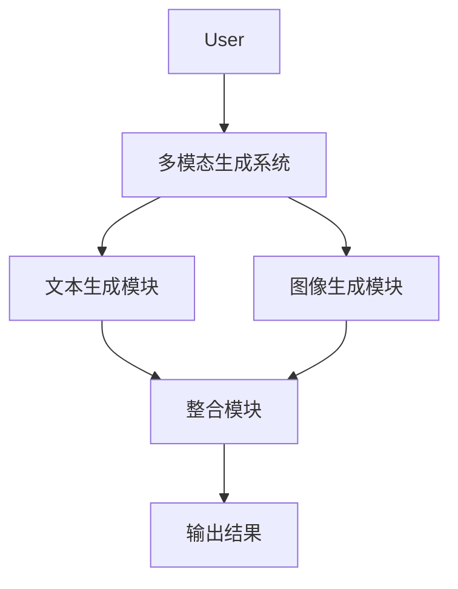

                 


# 多模态内容生成AI Agent：整合LLM与其他生成模型

> 关键词：多模态生成，LLM，AI Agent，生成模型，深度学习，图像生成，自然语言处理

> 摘要：本文探讨了多模态内容生成AI Agent的设计与实现，重点分析了如何整合大型语言模型（LLM）与其他生成模型（如图像生成模型）以实现多模态内容生成。通过系统分析和算法原理的详细讲解，本文为读者提供了一种整合LLM与其他生成模型的系统架构设计方案，同时结合项目实战展示了如何在实际场景中应用这些技术。

---

## # 第一部分: 多模态内容生成AI Agent概述

### ## 第1章: 多模态内容生成AI Agent的背景与概述

#### ### 1.1 多模态内容生成的背景
- **问题背景**：传统的生成模型通常专注于单一模态（如文本或图像），但在实际应用中，我们需要生成多模态内容（如文本、图像、音频等），以满足更复杂的需求。
- **问题描述**：单一模态生成模型难以应对多模态生成任务，如何整合不同生成模型以实现多模态生成成为关键问题。
- **解决方案**：通过整合大型语言模型（LLM）与其他生成模型（如图像生成模型），构建一个多模态内容生成AI Agent。

#### ### 1.2 AI Agent的基本概念
- **AI Agent定义**：AI Agent是一种智能体，能够感知环境并采取行动以实现目标。
- **多模态AI Agent的特点**：能够处理多种模态（文本、图像、音频等）输入，并生成多模态输出。
- **多模态AI Agent的应用领域**：如智能客服、虚拟助手、内容生成工具等。

#### ### 1.3 LLM与其他生成模型的整合
- **LLM的定义**：大型语言模型（如GPT系列）能够生成高质量的文本内容。
- **其他生成模型简介**：如图像生成模型（GAN、VAE等）。
- **整合的意义**：通过整合LLM和其他生成模型，实现多模态内容生成，满足更复杂的应用需求。

---

## # 第二部分: 多模态内容生成的核心概念与联系

### ## 第2章: 多模态内容生成的核心概念

#### ### 2.1 多模态内容生成的定义与特点
- **定义**：多模态内容生成是指生成同时包含多种模态（如文本、图像、音频等）的内容。
- **特点**：
  - 多样性：能够生成多种模态的内容。
  - 综合性：整合不同模态的信息，生成更丰富的结果。
  - 交互性：能够根据输入的多种模态信息生成相应的输出。

#### ### 2.2 LLM与其他生成模型的对比
- **LLM的优势**：
  - 高质量的文本生成能力。
  - 能够处理大规模文本数据。
- **其他生成模型的优势**：
  - 图像生成模型能够生成高质量的图像。
  - 音频生成模型能够生成逼真的语音或音乐。
- **对比分析**：
  | 模型类型 | 优势 | 劣势 |
  |----------|------|------|
  | LLM      | 高质量文本生成 | 不擅长处理其他模态数据 |
  | 图像生成模型 | 高质量图像生成 | 不擅长生成文本 |

#### ### 2.3 多模态内容生成的实体关系图
```mermaid
er
actor(用户) --> 多模态生成系统: 请求生成多模态内容
多模态生成系统 --> LLM: 生成文本内容
多模态生成系统 --> 图像生成模型: 生成图像内容
多模态生成系统 --> 音频生成模型: 生成音频内容
```

---

## # 第三部分: 多模态内容生成的算法原理

### ## 第3章: 多模态内容生成的算法原理

#### ### 3.1 大型语言模型（LLM）的原理
- **LLM的数学模型**：
  - 基于Transformer架构，通过自注意力机制生成上下文相关的文本。
  - $$ P(\text{output} | \text{input}) = \text{Transformer}(\text{input}) $$

#### ### 3.2 图像生成模型的原理
- **生成对抗网络（GAN）**：
  - 包含生成器和判别器，通过对抗训练生成图像。
  - $$ G(z) = \text{生成器}(z) $$，其中$z$是随机噪声。
  - $$ D(x) = \text{判别器}(x) $$，判断输入是否为真实图像。

#### ### 3.3 多模态生成模型的整合
- **整合思路**：将LLM生成的文本与图像生成模型生成的图像进行融合，形成多模态输出。
- **融合方法**：
  - 文本驱动图像生成：根据生成的文本生成相关图像。
  - 图像驱动文本生成：根据输入的图像生成相关文本。

---

## # 第四部分: 多模态内容生成AI Agent的系统架构设计

### ## 第4章: 系统架构设计

#### ### 4.1 系统功能设计
- **功能模块**：
  - 文本生成模块：基于LLM生成文本。
  - 图像生成模块：基于GAN生成图像。
  - 整合模块：将生成的文本和图像进行融合，形成多模态输出。

#### ### 4.2 系统架构图


---

## # 第五部分: 多模态内容生成AI Agent的项目实战

### ## 第5章: 项目实战

#### ### 5.1 环境安装
- **安装Python和相关库**：
  - `pip install numpy`
  - `pip install tensorflow`

#### ### 5.2 系统核心实现源代码
```python
import numpy as np
import tensorflow as tf

class TextGenerator:
    def __init__(self, model):
        self.model = model

    def generate_text(self, input_text):
        return self.model.generate(input_text)

class ImageGenerator:
    def __init__(self, generator, discriminator):
        self.generator = generator
        self.discriminator = discriminator

    def generate_image(self, noise):
        return self.generator(noise)

class MultiModalAgent:
    def __init__(self, text_model, image_model):
        self.text_model = text_model
        self.image_model = image_model

    def generate_multi_modal(self, input_text):
        text_output = self.text_model.generate_text(input_text)
        noise = np.random.randn(100)
        image_output = self.image_model.generate_image(noise)
        return text_output, image_output
```

---

## # 第六部分: 多模态内容生成AI Agent的最佳实践与总结

### ## 第6章: 最佳实践与总结

#### ### 6.1 最佳实践
- **数据预处理**：确保输入数据的多样性和质量。
- **模型调优**：根据实际需求调整模型超参数。
- **性能优化**：优化生成速度和生成质量。

#### ### 6.2 小结
- 多模态内容生成AI Agent通过整合LLM和其他生成模型，能够生成高质量的多模态内容。
- 本文详细讲解了多模态生成的算法原理和系统架构设计，并通过项目实战展示了具体实现方法。

#### ### 6.3 注意事项
- 在实际应用中，需要考虑模型的计算资源消耗和生成速度。
- 多模态生成模型的训练需要大量数据和计算资源，建议使用云计算平台进行部署。

#### ### 6.4 拓展阅读
- 学习更多关于生成对抗网络（GAN）的知识。
- 研究多模态生成模型的最新研究成果。

---

## # 结语

通过本文的讲解，读者可以深入了解多模态内容生成AI Agent的设计与实现，掌握整合LLM与其他生成模型的关键技术。未来，随着生成模型的不断发展，多模态内容生成AI Agent将有更广泛的应用场景。

