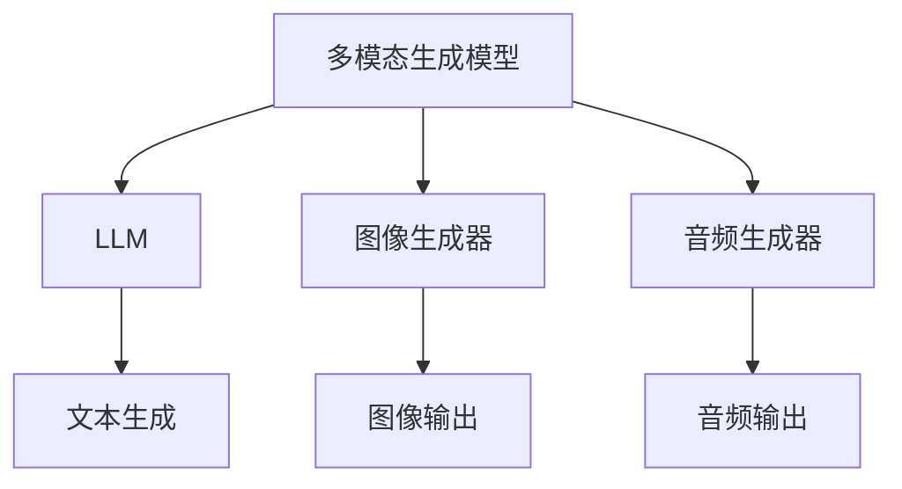
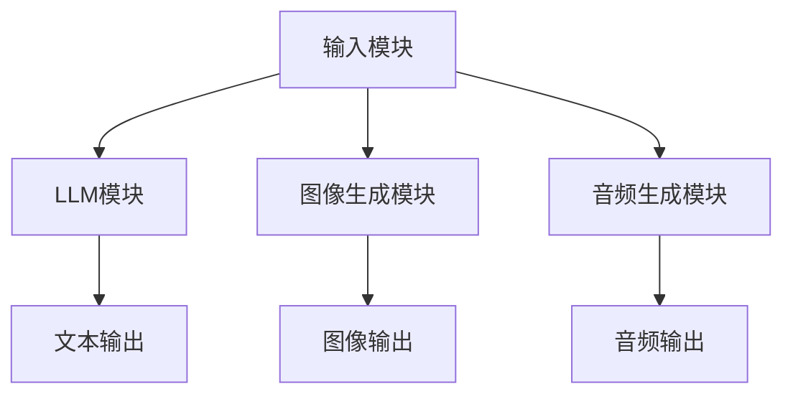

                 


# 多模态创意生成AI Agent：整合LLM与图像、音频生成

## 关键词：多模态生成，LLM，图像生成，音频生成，AI Agent

## 摘要：本文探讨了多模态创意生成AI Agent的整合技术，分析了大型语言模型（LLM）与图像、音频生成的结合方法，详细介绍了多模态生成技术的核心原理、系统架构及实际应用案例，帮助读者全面理解并掌握多模态创意生成AI Agent的设计与实现。

---

## 第一部分: 多模态创意生成AI Agent的背景与基础

### 第1章: 多模态创意生成AI Agent概述

#### 1.1 多模态AI的背景与意义
多模态AI是指能够处理和整合多种数据类型（如文本、图像、音频、视频等）的智能系统。与单一模态AI相比，多模态AI能够更全面地理解和生成信息，具有更强的泛化能力和应用场景的多样性。

**1.1.1 多模态数据的定义与特点**
- **定义**：多模态数据是指包含多种类型信息的数据集合，例如文本、图像、音频、视频等。
- **特点**：
  - **互补性**：不同模态的数据可以互相补充，提供更丰富的信息。
  - **多样性**：多模态数据能够覆盖更多的应用场景，提高系统的鲁棒性。
  - **复杂性**：整合多种模态数据需要复杂的算法和架构设计。

**1.1.2 多模态AI的核心概念与优势**
- **核心概念**：多模态AI通过整合多种数据类型，提升模型的理解和生成能力，能够实现更复杂的任务。
- **优势**：
  - **提升准确性**：通过多模态数据的融合，模型可以更准确地理解输入信息。
  - **增强生成能力**：多模态生成能够输出更丰富、更符合用户需求的结果。

**1.1.3 创意生成的定义与应用场景**
- **定义**：创意生成是指通过AI技术生成具有创新性和独特性的内容，例如文本、图像、音乐等。
- **应用场景**：
  - **艺术创作**：生成绘画、音乐、诗歌等。
  - **内容创作**：生成文章、视频脚本等。
  - **广告设计**：生成广告文案和视觉内容。

---

#### 1.2 LLM与图像、音频生成的整合
大型语言模型（LLM）在文本生成方面表现出色，而图像和音频生成技术则在各自的领域取得了显著进展。将LLM与图像、音频生成技术整合，能够实现多模态创意生成。

**1.2.1 LLM的基本原理与特点**
- **基本原理**：LLM通过大量的文本数据训练，利用深度学习模型（如Transformer）生成与输入相关的文本。
- **特点**：
  - **强大的上下文理解能力**：LLM能够理解长文本的上下文关系。
  - **生成能力强**：LLM可以生成高质量的文本，包括回答、摘要、创作等。

**1.2.2 图像生成技术的发展与现状**
- **发展**：从早期的基于规则的图像生成方法，到现在的深度学习方法（如GAN、VAE）。
- **现状**：图像生成技术已经能够生成高质量的图像，例如Deepfake技术可以生成逼真的图像和视频。

**1.2.3 音频生成技术的发展与现状**
- **发展**：从基于语音合成的简单方法，到现在的深度学习方法（如Wavenet、VQ-VAE）。
- **现状**：音频生成技术可以生成高质量的语音、音乐等。

**1.2.4 多模态生成的优势与挑战**
- **优势**：
  - **丰富的内容形式**：多模态生成可以提供文本、图像、音频等多种形式的内容。
  - **增强用户体验**：多模态生成能够为用户提供更丰富的交互体验。
- **挑战**：
  - **数据整合难度大**：不同模态的数据格式和特征差异较大，整合起来较为复杂。
  - **模型训练难度大**：多模态生成模型需要处理多种数据类型，训练过程更加复杂。

---

#### 1.3 多模态创意生成AI Agent的定义与架构
**1.3.1 多模态创意生成AI Agent的定义**
多模态创意生成AI Agent是一种能够整合LLM、图像生成和音频生成技术的智能系统，能够根据用户需求生成多种形式的内容。

**1.3.2 多模态生成AI Agent的核心架构**
- **输入模块**：接收用户的输入，例如文本、图像、音频等。
- **LLM模块**：负责生成文本内容。
- **图像生成模块**：负责生成图像内容。
- **音频生成模块**：负责生成音频内容。
- **输出模块**：将生成的内容输出给用户。

**1.3.3 多模态生成AI Agent的功能模块**
- **文本生成模块**：基于LLM生成文本内容。
- **图像生成模块**：基于GAN或VAE生成图像内容。
- **音频生成模块**：基于Wavenet或VQ-VAE生成音频内容。
- **融合模块**：将生成的文本、图像、音频内容进行融合，输出最终的结果。

---

### 第2章: 多模态生成技术的核心概念与联系

#### 2.1 多模态生成技术的核心原理
多模态生成技术的核心原理是通过整合多种生成模型，实现多种形式内容的生成。以下是几种主要的生成模型及其特点：

**2.1.1 不同生成模型的对比分析**

| 模型类型    | 特点                                                                 |
|-------------|----------------------------------------------------------------------|
| GAN         | 基于生成器和判别器的对抗训练，生成高质量的图像。                   |
| VAE         | 基于变分推断，生成具有较好语义的图像。                             |
| Transformer  | 基于自注意力机制，擅长处理序列数据，如文本和音频。               |
| Wavenet      | 基于扩张因果卷积，擅长生成音频。                                   |

**2.1.2 多模态生成模型的性能评估**
- **评估指标**：
  - **生成质量**：生成内容的逼真程度。
  - **多样性**：生成内容的丰富程度。
  - **生成速度**：生成内容的速度。

---

#### 2.2 多模态生成技术的实体关系图


---

## 第三部分: 多模态生成技术的算法原理

### 第3章: 大型语言模型（LLM）的算法原理

#### 3.1 LLM的基本原理
**3.1.1 LLM的训练过程**
- **输入**：大量的文本数据。
- **输出**：生成与输入相关的文本。

**3.1.2 LLM的模型架构**
- **Transformer架构**：由编码器和解码器组成，利用自注意力机制进行文本生成。

**3.1.3 LLM的训练目标**
- **目标**：最小化生成文本与真实文本之间的交叉熵损失。

**公式**：
$$ \text{损失函数} = -\sum_{i=1}^{n} \log P(y_i | y_{<i}) $$

---

#### 3.2 LLM的训练过程
- **输入**：训练数据为大量的文本数据。
- **输出**：生成与输入相关的文本。

---

### 第4章: 图像生成模型的算法原理

#### 4.1 图像生成模型的核心原理
**4.1.1 GAN（生成对抗网络）**
- **生成器**：生成图像。
- **判别器**：判断图像是否为真实图像。

**公式**：
$$ \text{生成器损失} = \log D(G(x)) $$
$$ \text{判别器损失} = -(\log D(x) + \log (1 - D(G(x))) ) $$

**4.1.2 VAE（变分自编码器）**
- **编码器**：将输入图像编码为潜在向量。
- **解码器**：将潜在向量解码为图像。

**公式**：
$$ \text{损失函数} = \text{重建损失} + \text{KL散度} $$

---

### 第5章: 音频生成模型的算法原理

#### 5.1 音频生成模型的核心原理
**5.1.1 Wavenet**
- **结构**：基于扩张因果卷积。
- **原理**：通过自回归方式生成音频。

**公式**：
$$ p(x_t | x_{<t}) = \text{softmax}(W x_{<t} + b) $$

**5.1.2 VQ-VAE**
- **结构**：基于变分自编码器和向量量化。
- **原理**：将音频信号量化为离散的代码，再进行生成。

---

## 第四部分: 系统分析与架构设计方案

### 第6章: 多模态生成AI Agent的系统架构

#### 6.1 系统架构设计
- **输入模块**：接收用户的输入，例如文本、图像、音频。
- **LLM模块**：生成文本内容。
- **图像生成模块**：生成图像内容。
- **音频生成模块**：生成音频内容。
- **输出模块**：将生成的内容输出给用户。

**系统架构图**：


---

## 第五部分: 项目实战

### 第7章: 多模态生成AI Agent的实现

#### 7.1 项目实战
- **环境安装**：安装Python、TensorFlow、Keras等库。
- **核心代码实现**：
  ```python
  # LLM模块
  class LLM:
      def generate_text(self, input_text):
          # 生成文本
          pass

  # 图像生成模块
  class ImageGenerator:
      def generate_image(self, input_desc):
          # 生成图像
          pass

  # 音频生成模块
  class AudioGenerator:
      def generate_audio(self, input_desc):
          # 生成音频
          pass
  ```

---

### 第8章: 总结与展望

#### 8.1 最佳实践
- **数据预处理**：对输入数据进行清洗和标准化处理。
- **模型调优**：根据具体任务调整模型参数。

#### 8.2 小结
多模态创意生成AI Agent通过整合LLM、图像生成和音频生成技术，能够生成多种形式的内容，具有广泛的应用前景。

#### 8.3 注意事项
- **数据隐私**：注意保护用户数据隐私。
- **模型性能**：确保生成模型的性能和稳定性。

#### 8.4 拓展阅读
- **多模态生成技术的研究论文**。
- **相关开源项目和工具**。

---

以上是《多模态创意生成AI Agent：整合LLM与图像、音频生成》的技术博客文章的正文部分，希望对您有所帮助！

