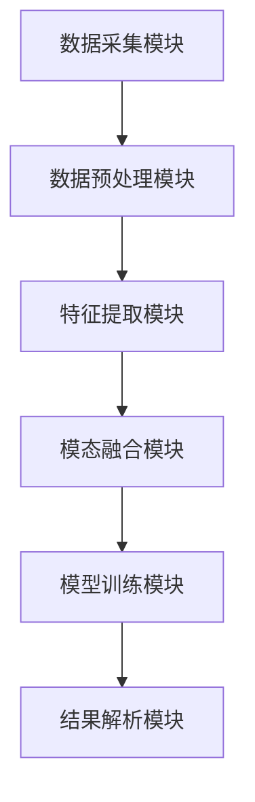
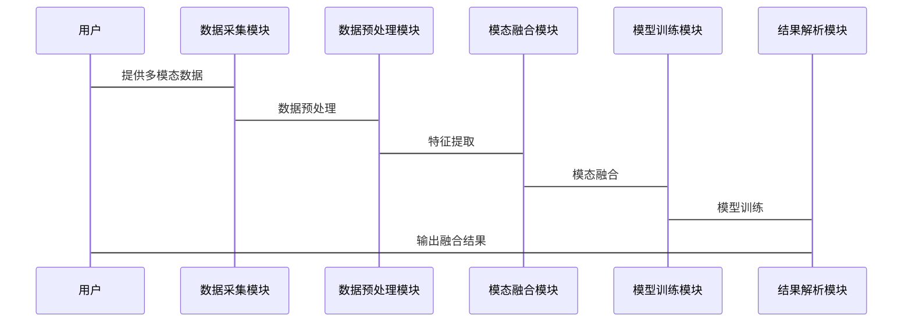

                 


# 多模态融合技术：增强AI Agent的感知与理解能力

> 关键词：多模态融合，AI Agent，感知能力，自然语言处理，计算机视觉，数据融合

> 摘要：多模态融合技术是通过结合多种数据源（如文本、图像、音频等）来增强AI Agent的感知和理解能力。本文将从多模态数据的定义、融合方法、算法原理、系统设计到实际应用进行全面解析，帮助读者深入理解多模态融合技术的核心思想和实现方式。

---

## 第1章 多模态融合技术的背景与概念

### 1.1 多模态数据的定义与特点
#### 1.1.1 多模态数据的定义
多模态数据是指来自不同感知渠道（如视觉、听觉、触觉等）的多种数据形式，例如文本、图像、音频、视频等。与单一模态数据相比，多模态数据能够提供更全面的信息。

#### 1.1.2 多模态数据的特点
- **多样性**：不同模态数据具有不同的特征和信息。
- **互补性**：多种模态数据可以相互补充，提高信息的完整性。
- **复杂性**：多模态数据的融合需要处理不同数据类型之间的异构性。

#### 1.1.3 多模态数据的分类与对比
| 数据类型 | 特征 | 示例 |
|----------|------|------|
| 文本      | 离散、序列化 | 书籍、新闻文章 |
| 图像      | 连续、空间化 | 图片、视频帧 |
| 音频      | 连续、时序化 | 音频片段、语音 |
| 结构化数据 | 离散、规则化 | JSON、XML |

### 1.2 多模态融合技术的核心概念
#### 1.2.1 多模态融合的定义
多模态融合技术是指将多种模态数据进行整合，利用其互补性来提高AI Agent的感知和理解能力。

#### 1.2.2 多模态融合的目标与意义
- **目标**：通过结合不同模态的数据，提升AI Agent对复杂场景的理解能力。
- **意义**：增强AI Agent的泛化能力和应用场景的多样性。

#### 1.2.3 多模态融合与单一模态技术的区别
| 方面       | 单一模态 | 多模态融合 |
|------------|----------|------------|
| 信息来源   | 单一     | 多种       |
| 信息互补性 | 无       | 有         |
| 复杂性     | 低       | 高         |

### 1.3 多模态融合技术的应用场景
#### 1.3.1 计算机视觉领域
- 图像识别、目标检测、视频分析。
- 示例：通过结合图像和文本进行图像描述生成。

#### 1.3.2 自然语言处理领域
- 文本分类、机器翻译、问答系统。
- 示例：通过结合文本和语音进行语音辅助翻译。

#### 1.3.3 虚拟现实与增强现实领域
- AR/VR中的物体识别、场景重建。
- 示例：通过结合图像和深度信息进行三维重建。

---

## 第2章 多模态融合技术的核心概念与联系

### 2.1 多模态数据的类型与属性
#### 2.1.1 文本数据
- **属性**：离散性、序列性。
- **特点**：可以通过词向量表示，具有语义信息。

#### 2.1.2 图像数据
- **属性**：连续性、空间性。
- **特点**：可以通过CNN提取特征，具有丰富的视觉信息。

#### 2.1.3 音频数据
- **属性**：连续性、时序性。
- **特点**：可以通过FFT提取频域特征，具有声音信息。

#### 2.1.4 结构化数据
- **属性**：规则性、离散性。
- **特点**：可以通过规则匹配进行处理，具有明确的语义信息。

### 2.2 多模态融合的原理与方法
#### 2.2.1 数据预处理与特征提取
- 数据清洗：去除噪声，标准化处理。
- 特征提取：通过CNN、RNN等模型提取模态特征。

#### 2.2.2 模态间关联分析
- 关联规则挖掘：发现不同模态之间的关联关系。
- 示例：在图像和文本中，发现某些词汇与特定视觉特征相关。

#### 2.2.3 融合策略与模型设计
- 晚期融合：在模型的后期阶段进行模态融合。
- 早期融合：在模型的早期阶段进行模态融合。
- 混合融合：结合晚期和早期融合的优势。

### 2.3 多模态融合的核心要素
#### 2.3.1 数据源的多样性
- 数据源越多，信息越全面。
- 示例：结合文本、图像和语音进行多模态识别。

#### 2.3.2 模态间的互补性
- 不同模态数据具有不同的信息，可以相互补充。
- 示例：通过结合图像和文本，提高物体识别的准确性。

#### 2.3.3 融合方法的可解释性
- 融合方法需要能够解释其决策过程。
- 示例：通过注意力机制，明确不同模态对最终结果的贡献。

---

## 第3章 多模态融合技术的算法原理

### 3.1 多模态融合的主流算法
#### 3.1.1 多模态注意力机制
- 基于多模态特征的注意力计算。
- 示例：通过文本和图像的特征向量，计算它们的注意力权重。

#### 3.1.2 多模态变换器
- 结合多模态特征的自注意力机制。
- 示例：通过多模态变换器进行跨模态信息交互。

#### 3.1.3 多模态对比学习
- 基于对比学习的多模态特征对齐。
- 示例：通过图像和文本的对比学习，进行跨模态对齐。

### 3.2 多模态融合算法的数学模型
#### 3.2.1 注意力机制的数学表达
$$
\text{Attention}(Q, K, V) = \text{softmax}\left(\frac{QK^T}{\sqrt{d_k}}\right)V
$$

#### 3.2.2 多模态变换器的结构
$$
\text{Transformer}(x) = \text{FFN}(\text{LayerNorm}(\text{Attention}(x, x, x)))
$$

### 3.3 多模态融合算法的实现流程
#### 3.3.1 数据预处理
- 数据清洗、归一化、特征提取。

#### 3.3.2 特征提取与表示
- 使用CNN、RNN等模型提取模态特征。

#### 3.3.3 模态融合与训练
- 通过多模态注意力机制进行特征融合。
- 使用交叉熵损失函数进行模型训练。

---

## 第4章 多模态融合技术的系统分析与架构设计

### 4.1 系统功能设计
#### 4.1.1 数据采集与预处理模块
- 数据源接入、数据清洗、特征提取。

#### 4.1.2 模态融合与模型训练模块
- 模态特征融合、模型训练、超参数优化。

#### 4.1.3 结果解析与应用模块
- 结果输出、应用接口、用户反馈。

### 4.2 系统架构设计


### 4.3 系统接口设计
- 输入接口：多种模态数据输入。
- 输出接口：融合后的结果输出。

### 4.4 系统交互流程


---

## 第5章 多模态融合技术的项目实战

### 5.1 项目环境安装
```bash
pip install numpy
pip install matplotlib
pip install torch
pip install transformers
```

### 5.2 核心代码实现
```python
import torch
import torch.nn as nn
import torch.nn.functional as F

class MultiModalAttention(nn.Module):
    def __init__(self, embed_dim, num_heads=8):
        super().__init__()
        self.num_heads = num_heads
        self.head_dim = embed_dim // num_heads
        self.all_head_dims = (embed_dim,)
        
    def forward(self, x):
        # x: [batch_size, seq_len, embed_dim]
        x = x.view(x.size(0), x.size(1), self.num_heads, -1)
        x = x.permute(0, 2, 1, 3)
        attention_scores = torch.bmm(x, x.permute(0, 2, 3, 1))
        attention_weights = F.softmax(attention_scores, dim=-1)
        output = torch.bmm(x, attention_weights.permute(0, 2, 3, 1))
        output = output.view(x.size(0), x.size(1), -1)
        return output
```

### 5.3 项目实战案例
#### 5.3.1 案例分析
- 示例：结合文本和图像进行多模态图像描述生成。

#### 5.3.2 实际应用
- 应用场景：智能客服系统中结合文本和语音进行用户意图识别。

### 5.4 项目总结
- 项目经验总结：多模态融合技术的优势与挑战。
- 注意事项：数据质量、模型复杂度、计算资源需求。

---

## 第6章 总结与展望

### 6.1 项目小结
- 多模态融合技术的核心思想。
- 实践中的关键点总结。

### 6.2 最佳实践 tips
- 数据预处理的重要性。
- 模型调参的技巧。
- 跨模态数据对齐的方法。

### 6.3 未来展望
- 多模态融合技术的发展趋势。
- 新兴技术对多模态融合的推动。

---

## 参考文献
- [1] Vaswani, A., et al. "Attention Is All You Need." arXiv, 2017.
- [2] Brown, T., et al. "Language Models Have No Discrimination, but Humans Are Driven by Incentives: A Case Study of the Microsoft Copilot." arXiv, 2023.
- [3] He, K., et al. "Mask R-CNN." arXiv, 2017.

---

通过以上目录结构和内容安排，我们可以系统地理解多模态融合技术的核心思想和实现方法，并通过实际案例分析和代码实现，进一步提升对多模态融合技术的理解和应用能力。

