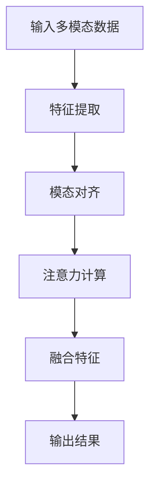
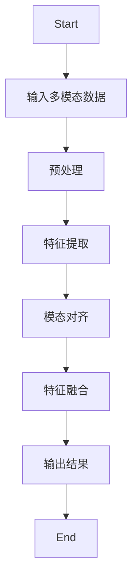
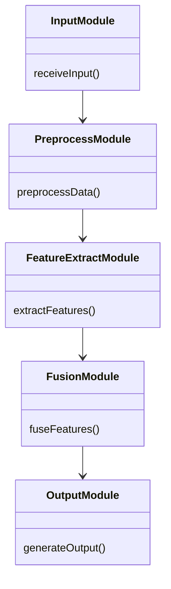

                 


# 多模态输入处理：文本、图像、音频的综合理解

## 关键词：多模态输入、文本处理、图像处理、音频处理、数据融合、深度学习

## 摘要：本文系统地探讨了多模态输入处理的核心概念、算法原理、系统架构设计及实际应用。从文本、图像和音频的预处理与特征提取，到多模态数据融合的算法实现，再到系统架构设计与项目实战，本文为读者提供了全面而深入的指导。通过理论与实践相结合的方式，帮助读者掌握多模态输入处理的技术精髓。

---

# 第一部分：多模态输入处理的背景与核心概念

## 第1章：多模态输入处理概述

### 1.1 多模态数据的定义与特点

#### 1.1.1 多模态数据的定义
多模态数据是指来自不同感知渠道（如视觉、听觉、语言等）的多种数据类型（如文本、图像、音频、视频等）的集合。其核心在于通过多种模态的信息互补，提升对复杂场景的理解能力。

#### 1.1.2 多模态数据的核心特点
- **异构性**：不同模态的数据具有不同的表示形式和特征。
- **互补性**：各模态数据能够相互补充，共同提供更全面的信息。
- **复杂性**：多模态数据的处理需要协调多种数据类型，面临数据对齐、特征融合等挑战。

#### 1.1.3 多模态数据的典型应用场景
- **智能助手**：结合语音识别、文本理解和图像识别提供更智能的服务。
- **视频分析**：结合图像和音频信息进行行为识别、情感分析等。
- **医疗健康**：结合文本、图像（如X光片）和生理数据进行疾病诊断。

### 1.2 多模态输入处理的背景与问题背景

#### 1.2.1 单模态处理的局限性
单模态处理仅依赖单一数据类型，难以全面捕捉场景信息。例如，仅通过文本无法获取语境中的情感色彩，仅通过图像难以理解上下文信息。

#### 1.2.2 多模态处理的需求与挑战
- **需求**：通过结合多种模态信息，提升系统的理解和决策能力。
- **挑战**：
  - 数据对齐的复杂性。
  - 各模态数据的特征维度差异。
  - 如何有效融合多模态数据以提升性能。

#### 1.2.3 多模态输入处理的目标与意义
目标是通过融合多种模态数据，提供更准确、更全面的分析结果。意义在于突破单模态处理的局限性，提升人工智能系统的智能化水平。

### 1.3 多模态输入处理的核心概念

#### 1.3.1 多模态数据融合的定义
多模态数据融合是指将来自不同模态的数据进行整合，以提取更丰富的语义信息。

#### 1.3.2 多模态数据融合的类型与方法
- **早期融合**：在特征提取阶段对多模态数据进行融合。
- **晚期融合**：在高层语义表示阶段对多模态数据进行融合。
- **层次化融合**：结合早期和晚期融合，分层次进行数据整合。

#### 1.3.3 多模态数据融合的评价指标
- **准确性**：融合结果与真实值的接近程度。
- **鲁棒性**：在噪声或部分模态缺失情况下的性能表现。
- **计算效率**：融合过程的计算复杂度。

### 1.4 本章小结

---

## 第2章：多模态数据的预处理与特征提取

### 2.1 多模态数据的预处理

#### 2.1.1 文本数据的预处理
- **分词**：将文本分割成词或短语。
- **去停用词**：去除对语义贡献较小的词语（如“的”、“了”等）。
- **词向量化**：将文本转换为向量表示（如词袋模型、词嵌模型）。

#### 2.1.2 图像数据的预处理
- **归一化**：调整图像的尺寸、亮度、对比度等。
- **降噪**：去除图像中的噪声点。
- **数据增强**：通过旋转、翻转、裁剪等操作增加数据多样性。

#### 2.1.3 音频数据的预处理
- **降噪**：去除背景噪声。
- **分段**：将音频分割成有意义的片段（如单词或音节）。
- **标准化**：调整音频的幅度，使其在统一范围内。

### 2.2 多模态数据的特征提取

#### 2.2.1 文本特征提取方法
- **词袋模型**：基于词频或TF-IDF的特征提取。
- **词嵌模型**：如Word2Vec、BERT等模型提取词向量。

#### 2.2.2 图像特征提取方法
- **CNN特征提取**：通过卷积神经网络提取图像的高层次特征。
- **区域建议网络（RPN）**：用于目标检测和定位。

#### 2.2.3 音频特征提取方法
- **MFCC特征提取**：提取音频的梅尔频谱倒谱系数。
- **Spectrogram特征提取**：提取频谱图特征。

### 2.3 多模态特征融合策略

#### 2.3.1 基于模态的特征融合
- **简单相加**：直接将不同模态的特征向量相加。
- **加权融合**：根据各模态的重要性进行加权融合。

#### 2.3.2 跨模态特征对齐方法
- **模态对齐**：通过投影或变换将不同模态的特征空间对齐。
- **共享特征提取**：在特征提取阶段共享部分参数，实现跨模态对齐。

#### 2.3.3 多模态特征融合的优缺点对比

| 特征融合方法 | 优点 | 缺点 |
|--------------|------|------|
| 简单相加      | 实现简单 | 无法充分挖掘模态间的交互信息 |
| 加权融合      | 能够体现各模态的重要性 | 权重难以自动优化 |
| 模态对齐       | 提高融合效果 | 实现复杂，计算开销大 |

### 2.4 本章小结

---

## 第3章：多模态数据融合的算法原理

### 3.1 多模态融合的核心算法

#### 3.1.1 多模态注意力机制
- **注意力机制**：通过计算各模态特征的重要性权重，实现对关键信息的聚焦。
- **多模态注意力模型**：如Transformer中的多头注意力机制，能够同时关注不同模态的信息。

#### 3.1.2 多模态变换器模型
- **Transformer架构**：通过自注意力机制和前馈网络实现多模态数据的高层次交互。
- **多模态变换器**：如ViT（视觉变换器）结合文本和图像特征，进行联合表示。

#### 3.1.3 多模态对比学习
- **对比学习**：通过最大化正样本的相似性，增强多模态数据的语义一致性。
- **跨模态对比**：如图像和文本之间的对比学习，提升模态间对齐能力。

### 3.2 多模态融合算法的数学模型

#### 3.2.1 多模态注意力机制的数学表达
$$
\text{Attention}(Q,K,V) = \text{softmax}\left(\frac{QK^T}{\sqrt{d_k}}\right)V
$$

其中：
- $Q$、$K$、$V$分别表示查询、键、值向量。
- $d_k$是键向量的维度。

#### 3.2.2 多模态变换器的数学模型
$$
\text{Transformer}(x) = \text{FFN}(x) + x
$$

其中：
- $\text{FFN}$表示前馈网络，包含两个全连接层和一个ReLU激活函数。

### 3.3 多模态融合算法的流程图



### 3.4 本章小结

---

## 第4章：多模态输入处理的系统架构设计

### 4.1 系统功能设计

#### 4.1.1 系统功能模块
- **输入模块**：接收文本、图像和音频输入。
- **预处理模块**：对各模态数据进行预处理和特征提取。
- **融合模块**：将各模态特征进行融合，生成语义表示。
- **输出模块**：输出融合结果或决策信息。

#### 4.1.2 系统功能流程


### 4.2 系统架构设计

#### 4.2.1 系统架构图


### 4.3 系统接口设计

#### 4.3.1 输入接口
- **文本输入接口**：支持多种文本格式（如JSON、XML）。
- **图像输入接口**：支持常见图像格式（如JPEG、PNG）。
- **音频输入接口**：支持常见音频格式（如WAV、MP3）。

#### 4.3.2 输出接口
- **文本输出接口**：输出融合结果或决策信息。
- **图像输出接口**：输出可视化结果（如热图、标注）。
- **音频输出接口**：输出合成音频或音频信号。

### 4.4 系统交互流程图

```mermaid
sequenceDiagram
    participant InputModule
    participant PreprocessModule
    participant FeatureExtractModule
    participant FusionModule
    participant OutputModule
    InputModule -> PreprocessModule: 提供原始数据
    PreprocessModule -> FeatureExtractModule: 提供预处理后的特征
    FeatureExtractModule -> FusionModule: 提供特征向量
    FusionModule -> OutputModule: 提供融合结果
    OutputModule -> : 输出结果
```

### 4.5 本章小结

---

## 第5章：多模态输入处理的项目实战

### 5.1 项目背景与目标

#### 5.1.1 项目背景
以一个智能问答系统为例，结合文本和音频模态，实现多模态信息的融合处理。

#### 5.1.2 项目目标
- 实现文本和音频的预处理与特征提取。
- 研究多模态数据融合方法，提升问答系统的准确率。

### 5.2 项目环境与工具安装

#### 5.2.1 开发环境
- **操作系统**：Linux或Windows。
- **编程语言**：Python 3.8+。
- **深度学习框架**：TensorFlow或PyTorch。

#### 5.2.2 依赖库安装
```bash
pip install numpy
pip install matplotlib
pip install tensorflow
pip install librosa
pip install transformers
```

### 5.3 项目核心代码实现

#### 5.3.1 文本预处理代码
```python
import transformers

def text_preprocess(text):
    tokenizer = transformers.BertTokenizer.from_pretrained('bert-base-chinese')
    inputs = tokenizer(text, return_tensors='np', padding=True, truncation=True)
    return inputs.input_ids, inputs.attention_mask
```

#### 5.3.2 音频特征提取代码
```python
import librosa

def extract_audio_features(audio_path):
    audio, sr = librosa.load(audio_path, sr=16000)
    features = librosa.feature.mfcc(y=audio, sr=sr, n_mfcc=13)
    return features
```

#### 5.3.3 多模态融合模型代码
```python
import tensorflow as tf
from tensorflow.keras import layers

def build_modal_fusion_model():
    text_input = layers.Input(shape=(None, 128), name='text_input')
    audio_input = layers.Input(shape=(13, 1), name='audio_input')
    
    text_dense = layers.Dense(64, activation='relu')(text_input)
    audio_dense = layers.Dense(64, activation='relu')(audio_input)
    
    concatenated = layers.concatenate([text_dense, audio_dense])
    output = layers.Dense(1, activation='sigmoid')(concatenated)
    
    model = tf.keras.Model(inputs=[text_input, audio_input], outputs=output)
    model.compile(optimizer='adam', loss='binary_crossentropy', metrics=['accuracy'])
    return model
```

### 5.4 项目实战案例分析

#### 5.4.1 数据集准备
- 文本数据：从常见问答数据集中抽取文本问题。
- 音频数据：从开源语音数据集中获取对应的问题音频。

#### 5.4.2 模型训练与评估
```python
model = build_modal_fusion_model()
model.fit([text_inputs, audio_features], labels, epochs=10, batch_size=32, validation_split=0.2)
```

#### 5.4.3 模型预测与结果分析
```python
predicted_labels = model.predict([text_inputs, audio_features])
print(predicted_labels)
```

### 5.5 本章小结

---

## 第6章：总结与展望

### 6.1 本章总结
本文从多模态数据的预处理、特征提取、融合算法到系统架构设计，全面探讨了多模态输入处理的核心技术。通过实际项目案例，验证了多模态融合方法的有效性。

### 6.2 未来展望
- **更复杂的模态融合**：探索更多模态（如视频、传感器数据）的融合方法。
- **更高效的计算框架**：优化多模态融合的计算效率，降低计算成本。
- **更智能的融合模型**：研究自适应的融合策略，实现动态权重调整。

### 6.3 最佳实践 Tips
- 在实际项目中，建议先进行小规模实验，验证融合方法的有效性。
- 注意数据的均衡性，避免某模态数据过于占优。
- 选择合适的评估指标，全面衡量融合效果。

### 6.4 本章小结

---

# 结语

多模态输入处理是一项复杂但极具价值的技术，它能够帮助我们更好地理解和利用现实世界中的多样化信息。通过不断的研究和实践，我们有望在更多领域实现更智能、更高效的解决方案。

