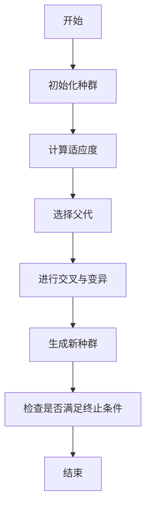

                 


# 多目标优化在AI Agent训练中的实践

---

## 关键词
多目标优化, AI Agent, 优化算法, Pareto前沿, 系统设计, 项目实战

---

## 摘要
本文系统地探讨了多目标优化在AI Agent训练中的实践应用。首先，我们介绍了多目标优化的基本概念和AI Agent的核心功能，分析了多目标优化在AI Agent训练中的重要性。接着，我们详细讲解了多目标优化的理论基础，包括问题建模、数学模型和Pareto前沿等关键概念。随后，我们深入分析了多目标优化算法的原理，包括常见算法（如NSGA、MOEA/D）的实现流程和数学模型。此外，我们还结合实际场景，探讨了多目标优化在AI Agent系统设计中的应用，包括系统架构、接口设计和交互流程。最后，我们通过一个具体的项目实战案例，展示了多目标优化在AI Agent训练中的具体实现和效果评估。本文旨在为AI Agent的训练和优化提供理论支持和实践指导。

---

## 第一部分: 多目标优化与AI Agent基础

---

### 第1章: 多目标优化与AI Agent概述

#### 1.1 多目标优化的基本概念
多目标优化是优化问题的一种形式，涉及多个目标函数的优化。与单目标优化不同，多目标优化需要在多个目标之间进行权衡，找到一组最优解，称为Pareto最优解。例如，在资源分配问题中，我们可能需要在成本、效率和质量之间找到平衡。

#### 1.2 AI Agent的基本概念
AI Agent（人工智能代理）是指能够感知环境、自主决策并执行任务的智能实体。AI Agent可以是软件程序、机器人或其他智能系统，其核心功能包括感知、推理、规划和执行。AI Agent的设计目标是使其能够在复杂环境中高效完成任务。

#### 1.3 多目标优化在AI Agent训练中的重要性
在AI Agent的训练中，通常需要优化多个目标，例如任务完成时间、资源消耗、准确性和用户体验等。多目标优化可以帮助AI Agent在这些目标之间找到最佳平衡点，从而提高其整体性能。例如，在自动驾驶系统中，AI Agent需要在安全性、效率和用户体验之间进行权衡。

---

### 第2章: 多目标优化的理论基础

#### 2.1 多目标优化问题建模
多目标优化问题可以通过数学模型进行描述。例如，假设我们有n个目标函数$f_1(x), f_2(x), ..., f_n(x)$，以及m个约束条件$g_i(x) \leq 0$。目标是最优化这组目标函数，同时满足所有约束条件。

#### 2.2 多目标优化的数学模型
多目标优化的数学模型可以表示为：
$$ \text{目标函数：} f(x) = (f_1(x), f_2(x), ..., f_n(x)) $$
$$ \text{约束条件：} g_i(x) \leq 0, i=1,2,...,m $$

#### 2.3 多目标优化的Pareto前沿
Pareto前沿是多目标优化问题中所有Pareto最优解的集合。在Pareto最优解中，不存在任何一个解在所有目标上都优于另一个解。例如，在二维目标空间中，Pareto前沿是一条曲线，表示两个目标之间的权衡关系。

#### 2.4 多目标优化算法的分类
多目标优化算法可以分为以下几类：
1. 基于权重的方法：通过为每个目标分配权重，将多目标问题转化为单目标问题。
2. 基于Pareto排序的方法：通过比较个体之间的优劣关系，逐步筛选出Pareto最优解。
3. 基于分解的方法：将多目标问题分解为多个子问题，分别求解后组合成最终解。

---

### 第3章: 多目标优化算法原理

#### 3.1 常见多目标优化算法
1. **NSGA（非支配排序遗传算法）**：通过Pareto排序选择个体，并进行交叉和变异操作。
2. **MOEA/D（多目标进化算法）**：将多目标问题分解为多个子问题，分别进行优化。

#### 3.2 多目标优化算法的实现流程
1. 初始化种群：随机生成一组初始解。
2. 计算适应度：评估每个解的目标函数值。
3. 选择父代：基于适应度值选择部分个体进行交叉和变异。
4. 生成新种群：通过交叉和变异操作生成新的个体。
5. 检查终止条件：判断是否达到预设的终止条件，如迭代次数或适应度收敛。

#### 3.3 算法实现的数学模型
假设我们有一个二维优化问题，目标函数为$f_1(x)$和$f_2(x)$，约束条件为$g(x) \leq 0$。我们可以使用NSGA算法进行优化，具体步骤如下：
1. 初始化种群：$X = \{x_1, x_2, ..., x_n\}$。
2. 计算适应度：对于每个$x_i$，计算$f_1(x_i)$和$f_2(x_i)$。
3. 进行Pareto排序：根据适应度值对种群进行排序，筛选出Pareto最优解。
4. 交叉和变异：对部分个体进行交叉和变异操作，生成新个体。

#### 3.4 算法流程图（mermaid）


---

## 第二部分: 多目标优化在AI Agent中的应用

---

### 第4章: 多目标优化在AI Agent系统设计中的应用

#### 4.1 系统功能设计
AI Agent系统通常包括感知模块、推理模块、规划模块和执行模块。在系统设计中，我们需要优化多个目标，例如感知的准确性和计算效率。

#### 4.2 系统架构设计（mermaid）


#### 4.3 系统接口设计
AI Agent系统需要与外部环境进行交互，通常通过标准接口（如REST API）进行通信。

#### 4.4 系统交互流程（mermaid）


---

### 第5章: 项目实战——基于多目标优化的AI Agent训练

#### 5.1 项目背景
在本项目中，我们需要训练一个AI Agent，使其在多个目标（如任务完成时间、资源消耗、用户体验）之间进行优化。

#### 5.2 环境安装
为了实现多目标优化，我们需要安装以下工具：
- Python 3.8+
- numpy
- scikit-learn
- DEAP（进化算法库）

#### 5.3 核心代码实现
以下是基于DEAP库实现的多目标优化算法代码：
```python
import numpy as np
from deap import algorithms, base, tools

# 定义目标函数
class FitnessFcn:
    def __call__(self, x):
        # 目标函数1：最大化
        f1 = x
        # 目标函数2：最大化
        f2 = 4.0 - x**2
        return (f1, f2)

# 初始化种群
def main():
    pop = algorithms.initRepeat(list, [np.random.uniform(0,4)], 200)
    
    # 定义适应度函数
    fitness = FitnessFcn()
    
    # 计算适应度
    fitnesses = []
    for x in pop:
        fitnesses.append(fitness(x))
    
    # 选择和进化
    pop = algorithms.select(pop, fitnesses, 100)
    pop = algorithms.evolve(pop, 20, 0.5, 1, 1)
    
    # 终止条件
    if len(pop) < 10:
        return
    
    # 打印最优解
    best = max(pop, key=lambda x: fitness(x))
    print("最优解：", best)

if __name__ == "__main__":
    main()
```

#### 5.4 代码解读与分析
上述代码实现了基于DEAP库的多目标优化算法。我们首先定义了目标函数，然后初始化种群并计算适应度。接着，我们通过选择和进化操作生成新的种群，并在满足终止条件时输出最优解。

#### 5.5 实际案例分析
假设我们有一个二维优化问题，目标函数为$f_1(x) = x$和$f_2(x) = 4 - x^2$。我们可以通过上述代码找到Pareto最优解，例如$x = 2$时，$f_1 = 2$，$f_2 = 0$。

---

## 第三部分: 总结与展望

---

### 第6章: 总结与未来展望

#### 6.1 本章小结
本文系统地探讨了多目标优化在AI Agent训练中的实践应用，包括理论基础、算法原理和系统设计等方面。我们通过具体的项目案例，展示了多目标优化在实际应用中的优势。

#### 6.2 未来展望
随着AI技术的不断发展，多目标优化在AI Agent中的应用将更加广泛。未来的研究方向包括：
1. 更高效的多目标优化算法。
2. 多目标优化在复杂环境中的应用。
3. 多目标优化与强化学习的结合。

---

### 关键技巧与最佳实践
- 在设计AI Agent时，始终关注多个目标的优化。
- 使用高效的多目标优化算法，如NSGA和MOEA/D。
- 在实际项目中，结合具体场景选择合适的优化策略。

---

### 注意事项
- 多目标优化问题通常没有唯一的最优解，需要根据实际需求选择合适的目标权重。
- 在优化过程中，要注意计算复杂度和收敛速度的平衡。

---

### 拓展阅读
1. 参考文献：多目标优化的经典论文。
2. 推荐书籍：《多目标优化算法与应用》。
3. 在线资源：DEAP库的官方文档和教程。

---

通过本文的系统介绍，读者可以全面了解多目标优化在AI Agent训练中的实践应用，并能够将其应用于实际项目中。

