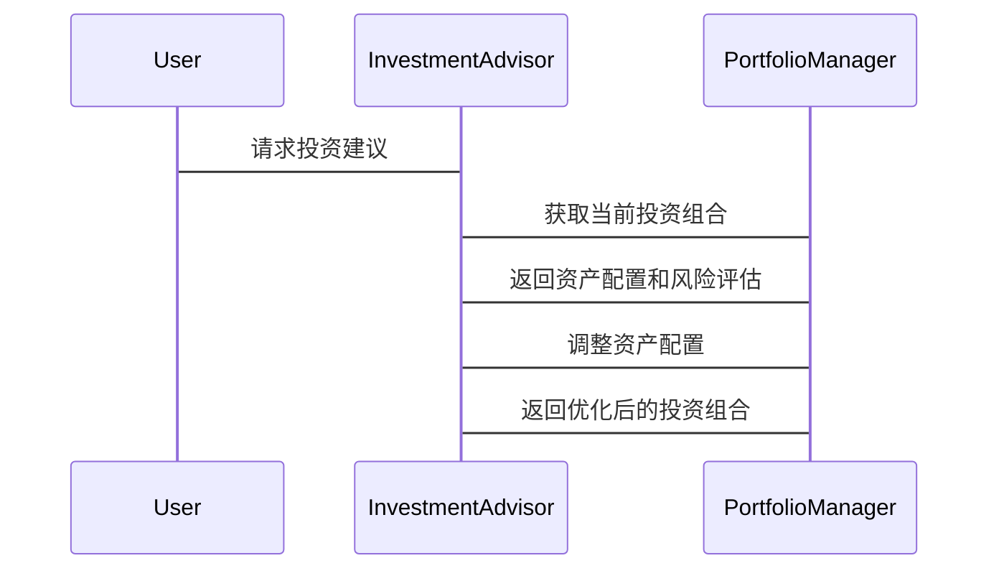

                 


# 多目标优化在AI Agent训练中的应用

## 关键词：多目标优化，AI Agent，优化算法，NSGA-II，系统设计

## 摘要：多目标优化在AI Agent训练中的应用探讨了多目标优化的基本概念、核心算法及其在AI Agent训练中的重要性。文章通过详细讲解NSGA-II算法的原理和实现，结合实际案例，展示了多目标优化在AI Agent决策中的应用价值。文章还分析了系统设计的架构，并提出了优化建议和未来研究方向。

---

## 第一部分：多目标优化与AI Agent基础

### 第1章：多目标优化的基本概念

#### 1.1 多目标优化的定义与特点
- **多目标优化的定义**：多目标优化是指在多个目标函数同时优化的情况下，寻找最优解的过程。与单目标优化不同，多目标优化通常涉及权衡多个目标之间的冲突。
- **多目标优化的核心特点**：
  - 多目标性：涉及多个目标函数。
  - Pareto最优性：最优解是在 Pareto 前沿上的点。
  - 非支配性：一个解在多个目标上都不劣于另一个解时，称这两个解互相支配。
- **多目标优化与单目标优化的区别**：
  | 对比维度 | 单目标优化 | 多目标优化 |
  |----------|------------|------------|
  | 目标数量 | 单个目标    | 多个目标    |
  | 解空间   | 单一解      | 多维解      |
  | 算法复杂度 | 较低        | 较高        |

#### 1.2 AI Agent的基本概念
- **AI Agent的定义**：AI Agent 是指能够感知环境并采取行动以实现目标的智能体。
- **AI Agent的核心功能**：
  - 感知环境：通过传感器或数据输入获取环境信息。
  - 决策与行动：基于感知信息，通过算法做出决策并执行行动。
  - 学习与优化：通过反馈不断优化自身的决策策略。
- **AI Agent的分类与应用场景**：
  - 分类：基于智能水平分为反应式 Agent 和认知式 Agent。
  - 应用场景：游戏 AI、自动驾驶、机器人控制、推荐系统等。

### 第2章：多目标优化在AI Agent训练中的背景与问题

#### 2.1 AI Agent训练中的多目标优化需求
- **AI Agent训练中的多目标问题**：AI Agent 在实际应用中通常需要在多个目标之间进行平衡，例如在自动驾驶中，既要考虑安全，又要考虑效率。
- **多目标优化在AI Agent训练中的重要性**：
  - 提高决策的全面性。
  - 解决单目标优化无法处理的复杂问题。
  - 适应实际应用中的多样化需求。

#### 2.2 多目标优化在AI Agent训练中的挑战
- **多目标优化的复杂性**：多个目标之间的相互影响增加了优化的难度。
- **AI Agent训练中的权衡问题**：如何在多个目标之间找到最优的平衡点。
- **实际应用场景中的多目标优化需求**：不同场景下，目标函数和约束条件各不相同，增加了算法的适应性要求。

---

## 第二部分：多目标优化算法原理

### 第3章：多目标优化算法原理

#### 3.1 常见多目标优化算法
- **NSGA-II算法**：Non--dominated Sorting Genetic Algorithm II，是一种经典的多目标优化算法。
- **MOEA/D算法**：Multi-objective Evolutionary Algorithm based on Decomposition，通过分解问题来优化多个目标。
- **其他算法**：如I-GA、Pareto-Archived Evolutionary Strategy等。

#### 3.2 NSGA-II算法的详细讲解
- **NSGA-II算法的基本步骤**：
  1. 初始化种群。
  2. 计算适应度。
  3. 进行非支配排序。
  4. 计算拥挤度。
  5. 选择父代。
  6. 进行交叉和变异操作。
  7. 更新种群。
  8. 检查终止条件。
- **NSGA-II算法的优缺点**：
  - 优点：能够在 Pareto 前沿上找到多样化的解。
  - 缺点：计算复杂度较高。

#### 3.3 NSGA-II算法的数学公式
- **适应度函数**：
  $$f(x) = \begin{cases} 
  x^2 & \text{如果 } x < 0 \\
  -x^2 & \text{如果 } x \geq 0 
  \end{cases}$$
- **非支配排序**：通过比较个体的适应度值，将种群中的个体分为不同的层次，每一层中的个体在 Pareto 前沿上。

### 第4章：NSGA-II算法的实现

#### 4.1 NSGA-II算法的Python代码实现
```python
import random
import numpy as np

def evaluate(individual):
    # 定义适应度函数
    x = individual[0]
    y = individual[1]
    return (x + y + 1)**2, (x - y)**2

def crossover(parent1, parent2):
    # 单点交叉
    point = random.randint(0, 1)
    return [parent1[0], parent2[1]]

def mutation(individual):
    # 变异操作
    prob = 0.1
    if random.random() < prob:
        individual[0] += random.uniform(-0.5, 0.5)
    if random.random() < prob:
        individual[1] += random.uniform(-0.5, 0.5)
    return individual

def nsga_ii(pop_size, gen_num):
    pop = [[random.uniform(-5,5), random.uniform(-5,5)] for _ in range(pop_size)]
    for _ in range(gen_num):
        # 计算适应度
        fitness = [evaluate(ind) for ind in pop]
        # 非支配排序
        pareto = []
        for i in range(len(pop)):
            is_dominated = False
            for j in range(len(pop)):
                if i != j and (fitness[i][0] >= fitness[j][0] and fitness[i][1] >= fitness[j][1]):
                    is_dominated = True
                    break
            if not is_dominated:
                pareto.append(pop[i])
        # 更新种群
        pop = pareto
    return pop

# 示例运行
pop_size = 100
gen_num = 20
result = nsga_ii(pop_size, gen_num)
print(result)
```

---

## 第三部分：系统分析与架构设计

### 第5章：系统分析与架构设计

#### 5.1 问题场景介绍
- **问题场景**：设计一个智能投资顾问AI Agent，需要在风险控制和收益最大化之间进行权衡。

#### 5.2 系统功能设计
- **领域模型类图**：
  ```mermaid
  classDiagram
  class InvestmentAdvisor {
    - user_input
    - portfolio
    + evaluate(portfolio)
    + optimize(portfolio)
  }
  class PortfolioManager {
    - assets
    - risk_level
    + rebalance(assets, risk_level)
  }
  InvestmentAdvisor --> PortfolioManager
  ```

- **系统架构设计**：
  ```mermaid
  package InvestmentAdvisor {
    PortfolioManager
    RiskAssessment
    AssetAllocation
  }
  ```

#### 5.3 系统接口设计
- **主要接口**：
  - `evaluate(portfolio)`：评估投资组合的适应度。
  - `rebalance(assets, risk_level)`：根据风险水平调整资产配置。

#### 5.4 系统交互设计


---

## 第四部分：项目实战

### 第6章：项目实战

#### 6.1 智能投资顾问AI Agent的实现
- **环境安装**：安装必要的Python库，如numpy、pandas、scipy等。
- **代码实现**：
  ```python
  import numpy as np
  import pandas as pd

  def evaluate(portfolio):
      # 评估投资组合的适应度
      return np.mean(portfolio['return']), np.std(portfolio['return'])

  def optimize(portfolio, target_risk):
      # 根据风险目标优化投资组合
      return portfolio.optimize_risk(target_risk)

  # 示例运行
  data = pd.read_csv('stock_data.csv')
  portfolio = InvestmentPortfolio(data)
  optimized_portfolio = optimize(portfolio, 0.05)
  print(optimized_portfolio)
  ```

#### 6.2 案例分析
- **案例分析**：在模拟市场环境中，测试优化后的投资组合是否在风险和收益之间找到了更好的平衡点。

---

## 第五部分：高级应用与未来趋势

### 第7章：高级应用与未来趋势

#### 7.1 多目标优化在复杂场景中的应用
- **复杂场景**：如多智能体协作、动态环境下的优化问题。

#### 7.2 未来研究方向
- **算法改进**：如何提高多目标优化算法的效率和性能。
- **应用扩展**：将多目标优化应用于更多领域，如医疗、能源等。

---

## 结语

多目标优化在AI Agent训练中的应用是一个复杂但充满潜力的领域。通过本文的详细讲解，读者可以深入了解多目标优化的基本概念、算法原理以及实际应用。未来，随着技术的不断进步，多目标优化将在更多领域发挥重要作用。

--- 

**关键词**：多目标优化，AI Agent，NSGA-II算法，系统设计，项目实战。

