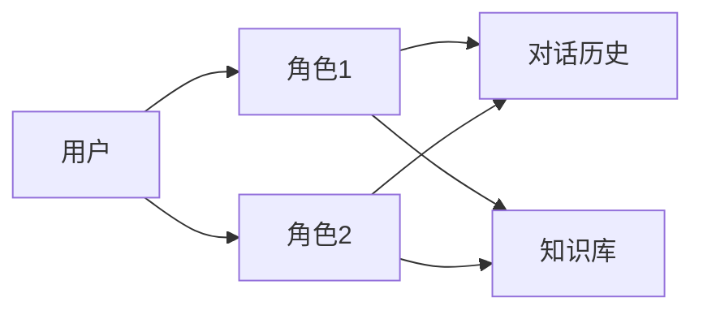
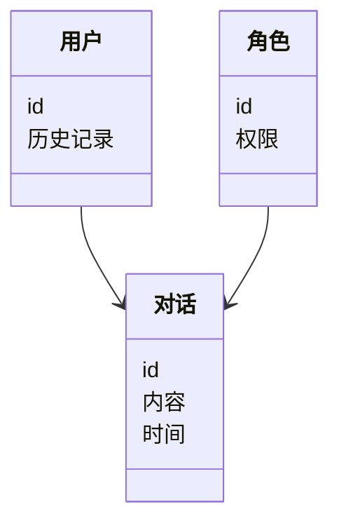
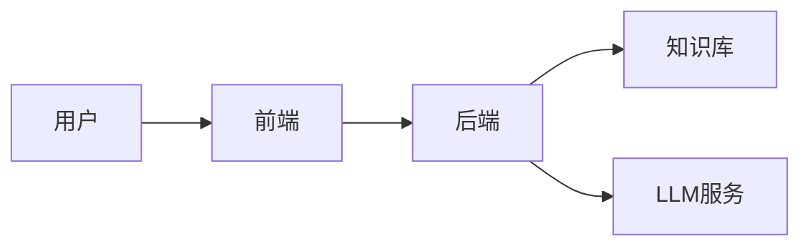
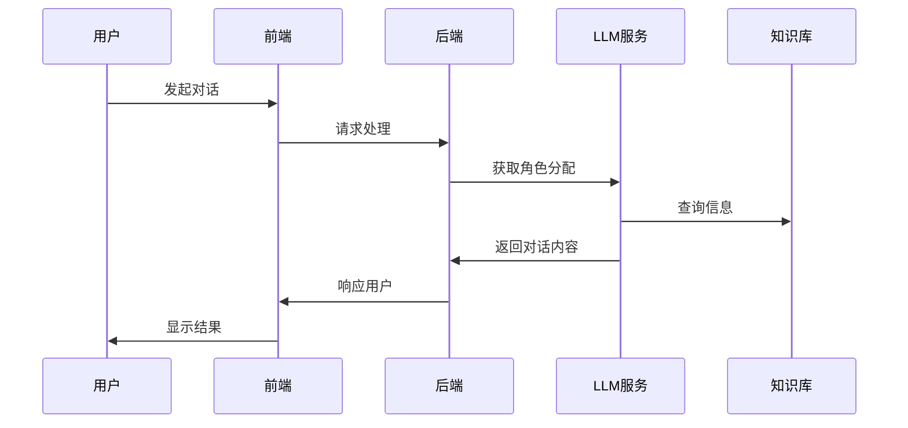

                 


# 多角色扮演AI Agent：基于LLM的复杂场景模拟

## 关键词：多角色扮演，AI Agent，大语言模型，复杂场景模拟，对话生成

## 摘要：本文深入探讨了基于大语言模型的多角色AI Agent在复杂场景模拟中的应用。通过分析多角色扮演的核心概念、算法原理、系统架构以及实际案例，本文为读者提供了从理论到实践的全面指南。

---

## 目录

### 第1章: 多角色扮演AI Agent概述

#### 1.1 问题背景与问题描述
- 1.1.1 传统AI Agent的局限性
- 1.1.2 多角色扮演的需求场景
- 1.1.3 问题解决的目标与意义

#### 1.2 多角色扮演AI Agent的核心概念
- 1.2.1 多角色扮演的定义
- 1.2.2 复杂场景模拟的必要性
- 1.2.3 边界与外延

#### 1.3 多角色扮演AI Agent的概念结构与核心要素
- 1.3.1 角色建模
- 1.3.2 对话管理
- 1.3.3 知识库管理

### 第2章: 多角色扮演AI Agent的核心概念与联系

#### 2.1 核心概念原理
- 2.1.1 大语言模型（LLM）的角色模拟能力
- 2.1.2 多角色协作的机制
- 2.1.3 场景模拟的动态调整

#### 2.2 核心概念属性特征对比
- 2.2.1 角色建模与对话管理的对比分析
- 2.2.2 知识库管理与场景模拟的关联性
- 2.2.3 多角色协作与单角色执行的差异

#### 2.3 ER实体关系图架构


### 第3章: 基于LLM的多角色模拟算法

#### 3.1 算法原理概述
- 3.1.1 大语言模型的训练目标
- 3.1.2 多角色模拟的实现方法
- 3.1.3 对话生成的优化策略

#### 3.2 算法流程图


#### 3.3 算法实现代码
```python
def multi_role_agent():
    # 角色分配
    roles = ['客服', '客户']
    # 知识库调用
    knowledge_base = {
        '产品信息': '我们的产品是...', 
        '客户反馈': '客户满意度...'
    }
    # 对话生成
    response = generate_response(role='客服', knowledge=knowledge_base)
    return response

def generate_response(role, knowledge):
    # 生成回复的逻辑
    return f"{role}：{knowledge['产品信息']}"
```

### 第4章: 系统分析与架构设计方案

#### 4.1 问题场景介绍
- 4.1.1 问题场景描述
- 4.1.2 系统目标

#### 4.2 系统功能设计
- 4.2.1 领域模型设计


- 4.2.2 系统架构设计


- 4.2.3 系统接口设计
- 4.2.4 系统交互流程图


### 第5章: 项目实战

#### 5.1 环境安装
- 5.1.1 安装Python
- 5.1.2 安装必要的库（如transformers、torch）

#### 5.2 系统核心实现源代码
```python
from transformers import AutoModelForCausalLM, AutoTokenizer

class MultiRoleAgent:
    def __init__(self, model_name):
        self.model = AutoModelForCausalLM.from_pretrained(model_name)
        self.tokenizer = AutoTokenizer.from_pretrained(model_name)

    def generate_response(self, role, input_text):
        # 编码输入
        inputs = self.tokenizer.encode(input_text, return_tensors='pt')
        # 解码输出
        outputs = self.model.generate(inputs, max_length=50)
        response = self.tokenizer.decode(outputs[0], skip_special_tokens=True)
        return f"{role}: {response}"

# 使用示例
agent = MultiRoleAgent("gpt2")
response = agent.generate_response("客服", "你好，欢迎光临！")
print(response)
```

#### 5.3 代码应用解读与分析
- 5.3.1 代码功能解读
- 5.3.2 代码实现细节分析

#### 5.4 实际案例分析和详细讲解剖析
- 5.4.1 案例背景
- 5.4.2 案例实现过程
- 5.4.3 案例结果分析

#### 5.5 项目小结

### 第6章: 最佳实践与总结

#### 6.1 小结
- 6.1.1 核心知识点回顾
- 6.1.2 实践中的关键点

#### 6.2 注意事项
- 6.2.1 开发中的常见问题
- 6.2.2 解决方案建议

#### 6.3 拓展阅读
- 6.3.1 相关技术领域推荐
- 6.3.2 进一步学习的方向

---

# 总结

本文从多角色扮演AI Agent的背景出发，详细探讨了其核心概念、算法原理、系统架构设计以及实际项目实现。通过具体的代码示例和案例分析，为读者提供了一个从理论到实践的全面指南。未来，随着大语言模型技术的不断进步，多角色扮演AI Agent将在更多复杂场景中发挥重要作用。

