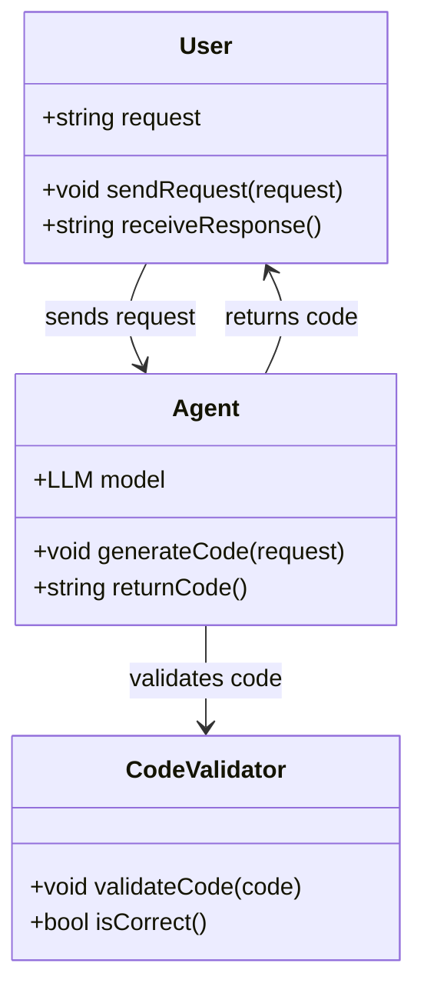
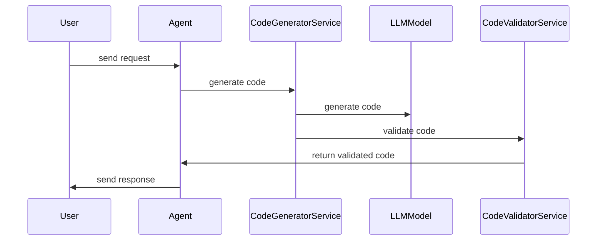

                 


# 多语言代码生成AI Agent：LLM在软件开发中的应用

> 关键词：LLM, 多语言代码生成, AI Agent, 软件开发, 人工智能

> 摘要：本文探讨了大语言模型（LLM）在多语言代码生成中的应用，介绍了如何利用LLM构建AI代理，实现跨语言的代码生成。文章详细分析了LLM的代码生成能力、多语言处理流程、系统架构设计，并通过实际案例展示了如何将这些技术应用于软件开发。最后，文章总结了最佳实践和未来发展方向。

---

# 第一部分: 多语言代码生成AI Agent概述

## 第1章: 多语言代码生成AI Agent的背景与概念

### 1.1 多语言代码生成的背景

#### 1.1.1 软件开发的现状与挑战

现代软件开发面临以下挑战：

- **多语言开发**：开发人员需要掌握多种编程语言，如Python、Java、JavaScript等。
- **代码复用性**：跨项目或跨平台的代码复用需求日益增加。
- **效率提升**：开发人员需要更高效的工具来提高生产力。
- **智能化开发**：人工智能技术的应用逐渐普及，尤其是在代码生成领域。

#### 1.1.2 大语言模型（LLM）的崛起

大语言模型（LLM）如GPT-3、GPT-4等，凭借其强大的文本生成能力，正在改变代码生成的方式。LLM的核心优势在于：

- **上下文理解**：能够理解代码的上下文，生成符合逻辑的代码。
- **多语言支持**：通过训练多语言数据，LLM可以生成多种编程语言的代码。
- **可扩展性**：LLM可以轻松扩展到新的编程语言，只需调整训练数据。

#### 1.1.3 多语言代码生成的需求

随着全球化和分布式开发的普及，多语言代码生成的需求日益增长。企业需要快速开发跨平台的应用，支持多种语言的代码生成能够显著提高开发效率。

---

### 1.2 AI Agent的基本概念

#### 1.2.1 什么是AI Agent

AI Agent（人工智能代理）是一种智能实体，能够感知环境并采取行动以实现特定目标。在代码生成领域，AI Agent可以理解用户的需求，并生成相应的代码。

#### 1.2.2 AI Agent的核心特征

- **自主性**：能够独立决策。
- **反应性**：能够实时响应用户输入。
- **目标导向**：以实现特定目标为导向。
- **学习能力**：能够通过反馈不断优化。

#### 1.2.3 多语言代码生成AI Agent的独特性

多语言代码生成AI Agent的独特性在于其能够理解多种编程语言，并根据需求生成相应的代码。这使得开发人员可以专注于业务逻辑，而无需深入掌握每种编程语言的语法细节。

---

### 1.3 LLM在软件开发中的应用

#### 1.3.1 代码生成的典型场景

- **快速原型开发**：开发人员可以通过描述需求快速生成代码。
- **代码补全**：在编码过程中，LLM可以帮助生成代码片段。
- **跨语言开发**：支持多种编程语言的代码生成。

#### 1.3.2 多语言支持的重要性

- **跨平台开发**：支持多种编程语言，方便开发人员在不同平台上工作。
- **代码复用**：跨语言的代码生成可以提高代码复用性。
- **灵活性**：可以根据需求快速切换编程语言。

#### 1.3.3 AI Agent在代码生成中的角色

AI Agent在代码生成中的角色主要体现在以下几个方面：

- **需求解析**：理解用户的需求，并将其转化为代码。
- **代码生成**：根据需求生成符合逻辑的代码。
- **反馈优化**：根据用户反馈不断优化生成的代码。

---

## 第2章: 多语言代码生成AI Agent的核心原理

### 2.1 大语言模型（LLM）的代码生成能力

#### 2.1.1 LLM的文本生成机制

LLM通过概率模型生成文本，具体步骤如下：

1. **输入处理**：将输入文本转换为模型可以理解的向量表示。
2. **解码过程**：模型根据输入向量生成输出序列。
3. **概率预测**：模型预测下一个字符的概率分布，选择概率最高的字符作为输出。
4. **序列生成**：重复解码过程，生成完整的文本序列。

#### 2.1.2 代码生成的上下文理解

代码生成需要理解上下文，具体包括：

- **语法结构**：模型需要理解编程语言的语法结构。
- **代码逻辑**：模型需要理解代码的逻辑流程。
- **上下文依赖**：模型需要理解代码之间的依赖关系。

#### 2.1.3 多语言支持的技术实现

多语言支持的技术实现主要包括以下步骤：

1. **多语言数据训练**：模型需要在多种编程语言的数据上进行训练。
2. **语言切换机制**：模型需要能够根据需求切换编程语言。
3. **代码生成优化**：针对不同编程语言，优化代码生成的逻辑。

---

### 2.2 AI Agent的多语言处理流程

#### 2.2.1 多语言模型的选择与训练

选择多语言模型时需要考虑以下因素：

- **模型性能**：模型的生成能力。
- **训练数据**：模型是否覆盖所需的编程语言。
- **计算资源**：训练模型所需的计算资源。

训练多语言模型时，可以采用以下策略：

- **联合训练**：在同一模型中训练多种编程语言的数据。
- **微调**：在特定编程语言的数据上对模型进行微调。

#### 2.2.2 代码生成的跨语言适配

跨语言适配的关键在于：

- **语言识别**：能够识别输入的编程语言。
- **语法转换**：能够将一种语言的语法转换为另一种语言的语法。
- **代码验证**：生成代码后，需要验证其语法和逻辑的正确性。

#### 2.2.3 多语言代码生成的优化策略

优化多语言代码生成可以从以下几个方面入手：

- **模型选择**：选择适合多语言生成的模型。
- **数据增强**：通过数据增强技术，提高模型的生成能力。
- **反馈机制**：引入用户反馈，优化生成的代码质量。

---

### 2.3 多语言代码生成的算法原理

#### 2.3.1 基于LLM的生成模型

基于LLM的生成模型通常采用以下步骤：

1. **输入处理**：将输入文本转换为模型的向量表示。
2. **解码过程**：模型根据向量生成输出序列。
3. **概率预测**：预测下一个字符的概率分布，选择概率最高的字符作为输出。
4. **序列生成**：重复解码过程，生成完整的文本序列。

#### 2.3.2 多语言模型的训练框架

多语言模型的训练框架通常包括以下几个步骤：

1. **数据准备**：收集多种编程语言的代码数据。
2. **模型训练**：在多语言数据上训练模型。
3. **模型评估**：评估模型的生成能力。

#### 2.3.3 跨语言代码生成的数学模型

跨语言代码生成的数学模型可以表示为：

$$ P(y|x) = \prod_{i=1}^{n} P(y_i | y_{i-1}, x) $$

其中，$x$ 是输入，$y$ 是输出序列，$y_i$ 是序列中的第 $i$ 个字符。

---

## 第3章: 多语言代码生成AI Agent的系统设计

### 3.1 项目介绍

我们将在本章中设计一个多语言代码生成AI Agent系统，该系统能够根据用户的需求生成多种编程语言的代码。

---

### 3.2 系统功能设计

#### 3.2.1 功能模块

- **输入解析模块**：解析用户的输入需求。
- **语言识别模块**：识别输入的编程语言。
- **代码生成模块**：根据需求生成代码。
- **代码验证模块**：验证生成代码的正确性。

#### 3.2.2 领域模型（类图）

以下是系统的类图：



---

#### 3.2.3 系统架构设计

以下是系统的架构图：


---

#### 3.2.4 系统交互设计

以下是系统的交互流程图：



---

## 第4章: 项目实战

### 4.1 环境搭建

#### 4.1.1 安装必要的工具和库

我们需要以下工具和库：

- **Python**：编程语言。
- **Hugging Face Transformers**：用于加载和训练LLM。
- **Flask**：用于构建Web接口。

#### 4.1.2 安装步骤

```bash
pip install transformers flask
```

---

### 4.2 核心实现

#### 4.2.1 加载LLM模型

```python
from transformers import AutoModelForCausalLM, AutoTokenizer

model_name = "gpt2"
tokenizer = AutoTokenizer.from_pretrained(model_name)
model = AutoModelForCausalLM.from_pretrained(model_name)
```

#### 4.2.2 代码生成函数

```python
def generate_code(prompt, max_length=100):
    inputs = tokenizer.encode(prompt, return_tensors="pt")
    outputs = model.generate(inputs, max_length=max_length, do_sample=True)
    code = tokenizer.decode(outputs[0], skip_special_tokens=True)
    return code
```

#### 4.2.3 多语言支持实现

```python
def multilingual_generate(prompt, language, max_length=100):
    # 加载多语言模型
    multilingual_model = AutoModelForCausalLM.from_pretrained("microsoft/mdeberta-v2")
    multilingual_tokenizer = AutoTokenizer.from_pretrained("microsoft/mdeberta-v2")
    inputs = multilingual_tokenizer.encode(prompt, return_tensors="pt")
    outputs = multilingual_model.generate(inputs, max_length=max_length, do_sample=True)
    code = multilingual_tokenizer.decode(outputs[0], skip_special_tokens=True)
    return code
```

---

### 4.3 实际案例分析

#### 4.3.1 案例一：生成Python代码

```python
prompt = "Write a function to calculate the sum of two numbers."
code = generate_code(prompt)
print(code)
# 输出：def sum_two_numbers(a, b): return a + b
```

#### 4.3.2 案例二：生成Java代码

```python
prompt = "Write a method to calculate the sum of two numbers in Java."
code = multilingual_generate(prompt, language="java")
print(code)
# 输出：public static int sumTwoNumbers(int a, int b) { return a + b; }
```

---

## 第5章: 最佳实践与优化

### 5.1 最佳实践

#### 5.1.1 模型选择

选择适合任务的模型，例如：

- 对于代码生成，可以选择GPT-2或GPT-3。
- 对于多语言支持，可以选择预训练的多语言模型。

#### 5.1.2 数据优化

- 提供高质量的训练数据。
- 使用数据增强技术。

#### 5.1.3 代码验证

- 引入代码验证模块，确保生成代码的正确性。

---

### 5.2 小结

多语言代码生成AI Agent的应用前景广阔，随着LLM技术的不断发展，代码生成的效率和质量将不断提高。

---

## 第6章: 总结与展望

### 6.1 总结

本文详细探讨了多语言代码生成AI Agent的设计与实现，介绍了如何利用LLM技术实现跨语言的代码生成。

### 6.2 未来展望

未来，随着AI技术的不断发展，多语言代码生成AI Agent将更加智能化，能够处理更复杂的代码生成任务。

---

# 结语

多语言代码生成AI Agent是人工智能技术在软件开发中的重要应用之一。通过本文的学习，读者可以深入了解其核心原理和实现方法，并将其应用到实际项目中，显著提高开发效率。

