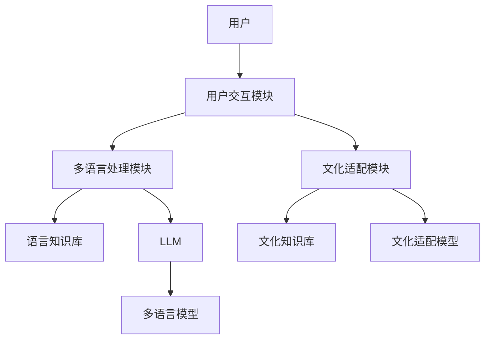
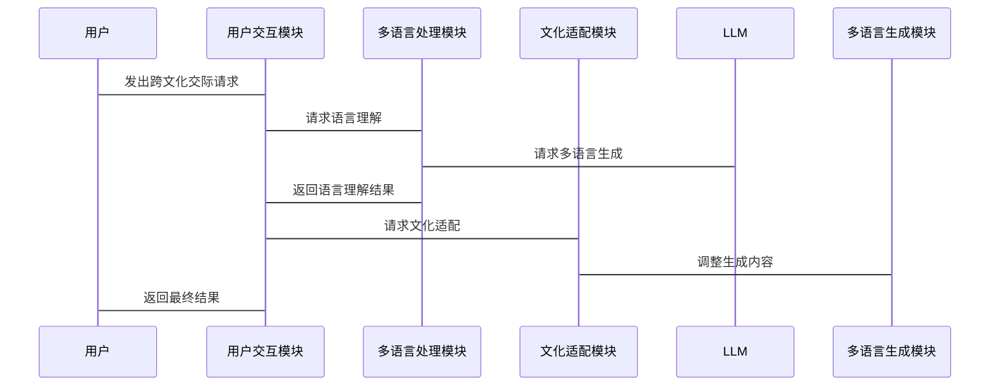

                 


# 多语言多文化AI Agent：LLM在跨文化交流中的应用

## 关键词：多语言AI Agent，多文化AI Agent，LLM，跨文化交流，NLP

## 摘要：  
随着全球化的深入，跨文化交流变得越来越频繁。然而，语言和文化差异往往导致沟通障碍，影响交流效果。多语言多文化AI Agent通过结合大语言模型（LLM）和跨文化适应性技术，能够有效解决这些问题。本文将从多语言多文化AI Agent的核心概念、算法原理、系统架构到实际应用进行详细探讨，分析其在跨文化交流中的应用价值和实现路径。

---

# 第一章: 多语言多文化AI Agent的背景与概念

## 1.1 跨文化交际的挑战与需求

### 1.1.1 全球化背景下的跨文化交际问题
- 全球化使得跨文化交际成为常态，但语言和文化差异导致误解和沟通不畅。
- 传统的人工翻译和文化中介效率低下，难以满足实时性和大规模需求。

### 1.1.2 多语言多文化AI Agent的提出
- AI Agent能够自动化处理语言和文化差异，提供实时、高效的跨文化交际支持。
- LLM的出现为多语言理解和生成提供了技术基础。

### 1.1.3 LLM在跨文化交流中的应用前景
- LLM具有多语言处理能力，能够理解多种语言和文化背景下的语境。
- LLM可以用于实时翻译、文化适配和跨文化内容生成。

## 1.2 多语言多文化AI Agent的核心概念

### 1.2.1 多语言AI Agent的定义
- 多语言AI Agent能够理解和生成多种语言，支持跨语言交流。
- 其核心是多语言NLP技术，包括机器翻译、跨语言信息检索等。

### 1.2.2 多文化AI Agent的定义
- 多文化AI Agent能够理解不同文化背景下的语境和习惯用语。
- 其核心是文化适配技术，包括文化知识库和文化敏感性分析。

### 1.2.3 多语言与多文化的区别与联系
- 多语言侧重于语言本身的处理，而多文化侧重于文化背景的适配。
- 两者相辅相成，共同实现跨文化交流的目标。

### 1.2.4 多语言多文化AI Agent的实现原理
- 多语言多文化AI Agent通过结合多语言NLP和文化适配技术，实现跨文化交际支持。
- 其核心是LLM的多语言能力和文化知识库的结合。

## 1.3 问题背景与问题描述

### 1.3.1 跨文化交际中的语言障碍
- 不同语言的表达方式差异可能导致信息失真。
- 语言不通导致跨文化交际效率低下。

### 1.3.2 不同文化背景下的语境差异
- 同一语言在不同文化背景下的含义可能不同。
- 文化差异导致语境理解困难。

### 1.3.3 AI Agent在跨文化交流中的角色定位
- AI Agent作为中介，帮助用户跨越语言和文化的障碍。
- AI Agent需要具备多语言和多文化适应能力。

### 1.3.4 问题解决的目标与边界
- 目标：实现高效、准确的跨文化交际支持。
- 边界：AI Agent的性能受限于LLM的多语言能力和文化知识库的完善程度。

## 1.4 核心概念与联系

### 1.4.1 多语言多文化AI Agent的核心要素
- 多语言NLP模块：负责语言理解和生成。
- 文化适配模块：负责文化背景分析和适配。
- 用户交互模块：负责与用户的实时交互。

### 1.4.2 多语言与多文化的区别与联系
- 区别：多语言处理语言本身，多文化处理文化背景。
- 联系：两者共同实现跨文化交流。

### 1.4.3 多语言多文化AI Agent的ER实体关系图
```mermaid
er
actor: 用户
role: 用户文化背景
action: 交互行为
language: 语言
culture: 文化特征
agent: AI Agent
```

## 1.5 本章小结

---

# 第二章: 多语言多文化AI Agent的核心原理

## 2.1 多语言处理的算法原理

### 2.1.1 多语言NLP的挑战
- 多语言NLP需要处理多种语言的语法、词汇和语义差异。
- 数据稀疏性问题：某些语言的训练数据不足。

### 2.1.2 多语言模型的训练方法
- 使用多语言预训练模型（如Marian、XLM）进行统一训练。
- 跨语言迁移学习：利用一种语言的模型参数初始化其他语言模型。

### 2.1.3 多语言模型的推理机制
- 统一编码表示：将不同语言的文本映射到相同的向量空间。
- 多语言解码：生成多种语言的输出。

## 2.2 多文化适配的算法原理

### 2.2.1 文化差异的识别与建模
- 文化知识库的构建：包括不同文化的语言习惯、禁忌语和文化敏感点。
- 文化差异的特征表示：将文化差异转化为模型可理解的特征。

### 2.2.2 文化适配的策略
- 文化背景匹配：根据用户的文化背景调整输出内容。
- 文化敏感性评估：避免使用可能冒犯用户文化背景的内容。

### 2.2.3 文化敏感性评估
- 基于文化知识库的语义分析。
- 文化适配评分：评估内容的文化适配度。

## 2.3 LLM在多语言多文化中的应用

### 2.3.1 LLM的多语言能力
- LLM通过多语言预训练具备多种语言的理解和生成能力。
- 使用LLM进行实时翻译和跨语言对话。

### 2.3.2 LLM的文化理解能力
- LLM通过文化知识库和微调任务具备文化适配能力。
- 使用LLM进行跨文化内容生成。

### 2.3.3 LLM在跨文化交流中的优势
- 高效性：LLM可以实时处理多种语言和文化背景的请求。
- 准确性：通过多语言预训练和文化适配技术提高交流质量。

## 2.4 核心算法的数学模型

### 2.4.1 多语言模型的训练目标
$$ \mathcal{L} = -\frac{1}{|B|}\sum_{i=1}^{|B|}\sum_{j=1}^{n}\log p(w_j|x_i) $$
其中，$B$是批次，$n$是序列长度。

### 2.4.2 多文化适配的优化目标
$$ \mathcal{O} = \lambda_1 \mathcal{L}_\text{lang} + \lambda_2 \mathcal{L}_\text{culture} $$
其中，$\lambda_1$和$\lambda_2$是调节参数，$\mathcal{L}_\text{lang}$是语言模型的损失，$\mathcal{L}_\text{culture}$是文化适配损失。

---

# 第三章: 多语言多文化AI Agent的系统架构

## 3.1 问题场景介绍

### 3.1.1 跨文化交际中的常见问题
- 语言不通导致信息失真。
- 文化差异导致语境理解困难。
- 不同文化背景下的表达习惯不同。

## 3.2 系统功能设计

### 3.2.1 用户交互模块
- 多语言对话功能：支持多种语言的实时对话。
- 文化适配功能：根据用户文化背景调整输出内容。

### 3.2.2 多语言处理模块
- 多语言文本解析：理解多种语言的输入文本。
- 多语言生成：生成多种语言的输出文本。

### 3.2.3 文化适配模块
- 文化背景识别：识别用户的文化背景。
- 文化适配策略：根据文化背景调整输出内容。

## 3.3 系统架构设计

### 3.3.1 系统架构图


### 3.3.2 系统接口设计
- 用户接口：文本输入输出接口。
- 模块接口：多语言处理模块与文化适配模块的交互接口。

### 3.3.3 系统交互流程图


---

# 第四章: 多语言多文化AI Agent的项目实战

## 4.1 环境安装

### 4.1.1 安装Python和相关库
- 安装Python 3.8及以上版本。
- 安装必要的库：transformers、torch、scikit-learn。

### 4.1.2 安装LLM模型
- 下载多语言预训练模型（如XLM）。
- 安装文化知识库（如语言习惯和文化禁忌语）。

## 4.2 系统核心实现

### 4.2.1 多语言处理模块的实现
```python
from transformers import AutoTokenizer, AutoModelForMaskedLM

# 加载多语言模型
tokenizer = AutoTokenizer.from_pretrained('facebook/xlm-roberta-base')
model = AutoModelForMaskedLM.from_pretrained('facebook/xlm-roberta-base')
```

### 4.2.2 文化适配模块的实现
```python
def cultural_adjustment(user_culture, input_text):
    # 根据用户文化背景调整输入文本
    # 返回调整后的文本
    pass
```

### 4.2.3 用户交互模块的实现
```python
def user_interaction():
    while True:
        input_text = input("请输入您的需求：")
        response = generate_response(input_text)
        print(response)
```

## 4.3 实际案例分析

### 4.3.1 案例背景
- 用户来自不同的文化背景，需要进行跨语言对话。

### 4.3.2 系统实现
- 用户输入多语言文本，系统进行文化适配和多语言生成。

### 4.3.3 系统优化
- 根据用户反馈优化文化适配策略。
- 不断更新文化知识库和多语言模型。

## 4.4 项目小结

---

# 第五章: 多语言多文化AI Agent的最佳实践

## 5.1 小结

## 5.2 注意事项

### 5.2.1 数据偏见问题
- 注意避免文化偏见，确保文化知识库的中立性。

### 5.2.2 文化敏感性问题
- 避免使用可能冒犯用户文化背景的内容。

## 5.3 拓展阅读

### 5.3.1 推荐书籍
- 《跨文化交际学》
- 《自然语言处理入门》

### 5.3.2 推荐论文
- "Cultural Adaptation in NLP"
- "Multilingual Neural Machine Translation"

---

# 结语

多语言多文化AI Agent通过结合LLM和跨文化适应性技术，为跨文化交流提供了高效、准确的支持。随着技术的不断发展，未来AI Agent将在全球化的跨文化交流中发挥越来越重要的作用。

