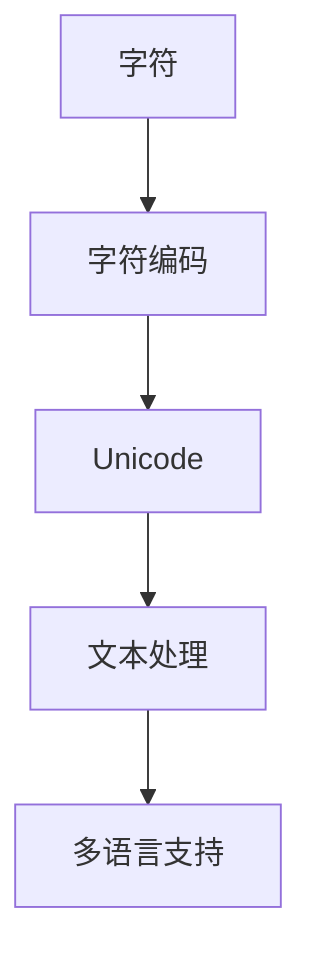

                 


# 多语言支持

> 关键词：多语言支持，字符编码，Unicode，文本处理，系统架构，算法原理

> 摘要：多语言支持是计算机系统中处理多种语言文本的重要能力，本文从多语言支持的背景与重要性入手，详细探讨其核心概念、算法原理、系统架构设计以及实际项目实现，帮助读者全面理解多语言支持的技术细节。

---

## 第一部分: 多语言支持的背景与基础

### 第1章: 多语言支持的背景与重要性

#### 1.1 多语言支持的定义与背景

- **1.1.1 什么是多语言支持**  
  多语言支持是指计算机系统能够处理、显示和操作多种语言的文本，包括不同的字符集、编码方式和语言规则。

- **1.1.2 多语言支持的重要性**  
  在全球化背景下，多语言支持是跨文化交流、跨国企业应用和国际化产品的必备功能。它能够提升用户体验，扩大产品的市场范围。

- **1.1.3 多语言支持的应用场景**  
  例如，国际化网站、移动应用、办公软件、社交媒体平台等都需要支持多种语言，以满足不同地区用户的需求。

#### 1.2 多语言支持的核心概念

- **1.2.1 字符编码与字符集**  
  字符编码是将字符（如字母、符号）转换为二进制数据的方式。常见的字符编码包括ASCII、ISO-8859-1、GB2312、UTF-8等。

- **1.2.2 Unicode标准与多语言支持的关系**  
  Unicode是统一字符编码标准，旨在表示世界上所有的文字。它为每种字符分配唯一的编码，解决了不同字符编码之间的兼容性问题。

- **1.2.3 多语言支持的实现机制**  
  通过字符编码转换和Unicode标准化，系统可以正确处理多种语言的文本，确保在不同平台和编码方式下文本的正确显示和操作。

#### 1.3 多语言支持的边界与外延

- **1.3.1 多语言支持的边界**  
  多语言支持主要关注字符编码转换和文本处理，不包括语音识别、自然语言理解等高级功能。

- **1.3.2 多语言支持与其他技术的关系**  
  多语言支持与文本排版、输入法、语言识别等技术密切相关，是实现跨语言处理的基础。

- **1.3.3 多语言支持的未来发展**  
  随着全球化的深入，多语言支持将更加智能化，结合AI技术实现更高效的多语言处理和翻译。

### 第2章: 多语言支持的核心概念与联系

#### 2.1 多语言支持的核心原理

- **2.1.1 字符编码的转换机制**  
  不同字符编码之间可以通过中间编码（如UTF-16）进行转换，确保文本在不同编码方式下的正确表示。

- **2.1.2 Unicode的实现方式**  
  Unicode通常以UTF-8、UTF-16或UTF-32的形式实现，其中UTF-8是最常用的编码方式。

- **2.1.3 多语言文本处理的流程**  
  文本输入 → 字符编码识别 → Unicode转换 → 文本处理 → 显示输出。

#### 2.2 多语言支持的核心概念对比

- **2.2.1 字符编码对比表**

| 编码方式 | 字符范围 | 占用字节 |
|----------|----------|----------|
| ASCII    | 0-127    | 1        |
| UTF-8    | 全球字符 | 1-4      |
| GB2312   | 中文字符 | 2        |

- **2.2.2 Unicode与字符编码的对比**  
  Unicode是一个字符集，而字符编码是Unicode字符的具体编码方式。

- **2.2.3 多语言支持实现方式的对比**  
  - 基于字符编码的实现：适用于简单场景，但需要处理编码转换问题。  
  - 基于Unicode的实现：通用性强，支持所有语言，但实现复杂。

#### 2.3 多语言支持的ER实体关系图



---

## 第三部分: 多语言支持的算法原理

### 第3章: 多语言支持的算法原理

#### 3.1 多语言文本处理算法

- **3.1.1 字符编码转换算法**  
  通过中间编码（如UTF-16）实现不同字符编码之间的转换。

- **3.1.2 Unicode的标准化算法**  
  Unicode标准化包括形式C（未定序）、D（定序）和 Fullwidth 表示。

- **3.1.3 多语言文本匹配算法**  
  使用Unicode属性和正则表达式实现跨语言文本匹配。

#### 3.2 多语言支持的数学模型

- **3.2.1 字符编码转换的数学模型**  
  $$ f(x) = g(y) $$  
  其中，\( x \) 表示输入编码，\( y \) 表示目标编码。

- **3.2.2 Unicode标准化的数学模型**  
  $$ g(y) = h(z) $$  
  其中，\( y \) 表示Unicode字符，\( z \) 表示标准化形式。

#### 3.3 多语言支持的算法实现

- **3.3.1 字符编码转换的Python实现**  
  ```python
  def convert_encoding(text, from_encoding, to_encoding):
      return text.encode(from_encoding).decode(to_encoding)
  ```

---

## 第四部分: 多语言支持的系统分析与架构设计

### 第4章: 多语言支持的系统分析与架构设计

#### 4.1 系统分析

- **4.1.1 问题场景介绍**  
  一个国际化网站需要支持中英文两种语言，用户在页面上输入文本时，系统需要正确显示和存储文本。

- **4.1.2 项目介绍**  
  开发一个多语言支持的Web应用，支持多种字符编码和Unicode的转换。

- **4.1.3 系统功能需求**  
  - 文本输入：支持多种语言输入。  
  - 文本存储：使用UTF-8编码存储文本。  
  - 文本显示：正确显示多语言文本。

#### 4.2 系统架构设计

- **4.2.1 系统架构图**  
  ```mermaid
  graph TD
  A[前端] --> B[后端]
  B --> C[数据库]
  B --> D[缓存]
  ```

- **4.2.2 系统功能模块**  
  - 前端：接收用户输入，处理字符编码。  
  - 后端：转换字符编码为Unicode，调用文本处理功能。  
  - 数据库：存储UTF-8编码的文本。

#### 4.3 系统接口设计

- **4.3.1 系统接口设计**  
  - 输入接口：接收用户输入的文本和字符编码。  
  - 输出接口：显示处理后的文本。

- **4.3.2 系统交互序列图**  
  ```mermaid
  sequenceDiagram
  user -> frontend: 输入文本
  frontend -> backend: 发送文本和编码
  backend -> database: 存储文本
  database --> backend: 确认存储
  backend --> frontend: 返回处理结果
  frontend -> user: 显示文本
  ```

---

## 第五部分: 多语言支持的项目实战

### 第5章: 多语言支持的项目实现

#### 5.1 环境配置

- 安装Python和相关库：`pip install chardet`。

#### 5.2 核心代码实现

- **字符编码检测**  
  ```python
  import chardet
  def detect_encoding(text):
      return chardet.detect(text)['encoding']
  ```

- **字符编码转换**  
  ```python
  def convert_encoding(text, from_encoding, to_encoding):
      return text.encode(from_encoding).decode(to_encoding)
  ```

#### 5.3 项目小结

- **5.3.1 项目总结**  
  通过本项目，我们实现了多语言支持的核心功能，包括字符编码检测和转换。

- **5.3.2 实际案例分析**  
  使用Python处理一个多语言文本文件，检测其编码并将其转换为UTF-8。

---

## 第六部分: 总结与展望

### 第6章: 总结与最佳实践

#### 6.1 总结

- 多语言支持是实现国际化系统的重要基础，需要理解字符编码、Unicode标准和文本处理算法。

#### 6.2 最佳实践

- **编码规范**  
  始终使用UTF-8编码，避免使用其他编码方式。

- **测试与调试**  
  在处理多语言文本时，要进行充分的测试，确保不同编码方式下的文本正确显示。

#### 6.3 小结

- 通过本文的学习，读者可以掌握多语言支持的核心技术，并能够将其应用到实际项目中。

#### 6.4 注意事项

- 处理多语言文本时，要注意编码转换的正确性，避免乱码问题。

#### 6.5 拓展阅读

- 推荐阅读《编码：解密编程的第1语言》深入理解字符编码。

---

通过以上章节的内容，读者可以系统地学习多语言支持的技术细节，并能够将其应用到实际的项目开发中。

