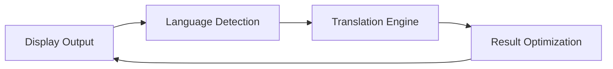

                 


# 多语言翻译 AI Agent：LLM 在跨语言交流中的应用

> 关键词：多语言翻译，AI Agent，LLM，跨语言交流，大语言模型，自然语言处理，机器学习

> 摘要：本文深入探讨了多语言翻译 AI Agent 的实现原理和应用场景。通过分析大语言模型（LLM）在跨语言交流中的优势，结合实际案例，详细阐述了多语言翻译 AI Agent 的核心算法、系统架构及项目实战。文章最后总结了当前技术的局限性，并展望了未来的发展方向。

---

## 第一部分：多语言翻译 AI Agent 的背景与核心概念

### 第1章：多语言翻译 AI Agent 的概述

#### 1.1 多语言翻译的背景与挑战
- **全球化背景下的跨语言交流需求**  
  随着全球化进程的加速，跨语言交流的需求日益增加。无论是商业合作、国际会议，还是社交媒体互动，多语言翻译已成为不可或缺的工具。传统的翻译工具依赖于规则和词典，难以应对复杂的语言表达和语境差异。

- **多语言翻译的传统方法与局限性**  
  传统翻译方法主要基于规则和双语对照词典，存在以下问题：
  1. 翻译结果准确性不足，尤其在处理隐喻、俚语等复杂表达时。
  2. 需要手动维护庞大的词典和规则库，成本高且难以扩展。
  3. 无法有效处理多语言间的语义对齐问题。

- **AI 技术在翻译领域的应用潜力**  
  大语言模型（LLM）的出现为多语言翻译带来了革命性的变化。LLM 能够通过海量多语言数据的预训练，自动学习语言的语法、语义和语境信息，从而实现更准确、自然的翻译。

#### 1.2 大语言模型（LLM）的核心概念
- **大语言模型的基本定义**  
  LLM 是一种基于深度学习的自然语言处理模型，通常采用 Transformer 架构，通过大量多语言数据的预训练，具备理解与生成多种语言文本的能力。

- **LLM 在翻译中的独特优势**  
  1. **上下文理解能力**：LLM 能够理解上下文，生成更符合语境的翻译结果。
  2. **多语言支持**：LLM 可以处理多种语言的翻译任务，无需额外的数据标注或规则调整。
  3. **自适应能力**：通过微调 LLM，可以针对特定领域或语言优化翻译效果。

- **多语言翻译 AI Agent 的定义与目标**  
  多语言翻译 AI Agent 是一种基于 LLM 的智能系统，旨在提供高效、准确的多语言翻译服务。其目标是通过自动化技术，解决跨语言交流中的语言障碍，提升用户体验。

### 第2章：多语言翻译 AI Agent 的核心原理

#### 2.1 多语言模型的训练机制
- **多语言数据的预训练**  
  大语言模型通常采用预训练策略，通过多任务学习（MTL）框架，利用多种语言的平行文本数据进行训练。训练目标是使模型能够理解并生成多种语言的文本。

- **跨语言迁移学习的原理**  
  跨语言迁移学习是指将一种语言的模型知识迁移到其他语言。LLM 的跨语言能力主要依赖于其对语言共性特征的学习，例如语法结构和语义关系。

- **对齐多语言数据的技术挑战**  
  多语言数据的对齐是跨语言翻译的关键问题。为了解决这一问题，通常采用以下方法：
  1. 使用语言对齐算法，将不同语言的文本对齐。
  2. 通过共享嵌入层，使不同语言的词向量对齐。

#### 2.2 多语言翻译的实现流程
- **分词与语言识别**  
  翻译系统首先需要对输入文本进行分词，并识别其语言。语言识别可以通过语言特征（如字符频率、句法结构）或预训练模型（如 BERT 的语言嵌入）实现。

- **翻译模型的选择与调用**  
  根据识别出的语言对，选择合适的翻译模型。对于低资源语言，可能需要采用跨语言翻译模型。

- **翻译结果优化与校对**  
  翻译完成后，系统会对结果进行优化，例如：
  1. 使用语言模型对结果进行校对，纠正语法错误。
  2. 通过人工校对或反馈机制优化翻译质量。

---

## 第二部分：多语言翻译 AI Agent 的算法原理

### 第3章：大语言模型的训练框架

#### 3.1 Transformer 架构的简要介绍
- Transformer 架构由编码器和解码器组成，每个部分包含多个层。编码器用于将输入文本转换为向量表示，解码器用于生成目标语言的文本。

#### 3.2 多语言模型的训练目标函数
- 多语言模型的训练目标函数通常包括：
  1. 语言模型目标：最小化生成文本的条件概率。
  2. 对齐目标：最大化源语言和目标语言文本的对齐概率。

  公式表示为：
  $$\mathcal{L} = -\frac{1}{N}\sum_{i=1}^{N}\log p(y_i|x_i)$$

#### 3.3 跨语言注意力机制的实现
- 跨语言注意力机制允许模型在翻译过程中关注源语言和目标语言的双向信息。通过共享的词向量空间，模型能够更好地对齐不同语言的语义信息。

  图形表示如下：
  ```mermaid
  graph LR
      A[Source Text] --> B[Source Embedding]
      C[Target Text] --> D[Target Embedding]
      B --> E[Cross-Attention]
      D --> E
      E --> F[Predicted Output]
  ```

### 第4章：多语言翻译的算法实现

#### 4.1 分词与语言检测的算法流程
- 分词：使用预训练的分词模型对输入文本进行分词。
- 语言检测：基于语言特征（如字符分布、句法结构）进行分类。

  示例代码如下：
  ```python
  import langdetect
  text = "Hello, how are you?"
  detected_lang = langdetect.detect(text)
  print(detected_lang)  # 输出: 'en'
  ```

#### 4.2 翻译模型的选择与调用逻辑
- 根据语言对选择合适的翻译模型。对于常用语言对，可以直接调用预训练的翻译模型；对于低资源语言对，采用跨语言翻译模型。

  图形表示如下：
  ```mermaid
  flowchart TD
      A[Input Text] --> B[Language Detection]
      B --> C[Translation Model Selection]
      C --> D[Translation]
      D --> E[Output Text]
  ```

#### 4.3 翻译结果优化的实现
- 使用语言模型对翻译结果进行校对，例如：
  ```python
  import spacy
  nlp = spacy.load("en_core_web_sm")
  doc = nlp("The quick brown fox jumps over the lazy dog.")
  print([token.text for token in doc])  # 输出: ['The', 'quick', 'brown', ...]
  ```

---

## 第三部分：多语言翻译 AI Agent 的系统架构

### 第5章：系统功能模块划分

#### 5.1 语言识别模块
- 功能：对输入文本进行语言检测。
- 输入：原始文本。
- 输出：检测出的语言代码（如“en”表示英语）。

#### 5.2 翻译引擎模块
- 功能：调用翻译模型进行翻译。
- 输入：源语言、目标语言、待翻译文本。
- 输出：翻译结果。

#### 5.3 结果优化模块
- 功能：对翻译结果进行校对和优化。
- 输入：翻译结果。
- 输出：优化后的翻译文本。

### 第6章：系统架构设计

#### 6.1 分层架构设计
- **前端**：接收用户输入，显示翻译结果。
- **后端**：处理语言检测、翻译调用和结果优化。
- **模型层**：部署预训练的翻译模型。

#### 6.2 模块间的交互关系


#### 6.3 系统扩展性设计
- 支持新增语言对：通过微调模型或扩展数据集实现。
- 支持多线程处理：优化系统性能，提升用户体验。

---

## 第四部分：多语言翻译 AI Agent 的项目实战

### 第7章：项目环境搭建

#### 7.1 开发环境的安装与配置
- 安装 Python 和相关库：
  ```bash
  pip install transformers langdetect spacy
  ```

#### 7.2 LLM 模型的下载与加载
- 下载预训练的多语言模型：
  ```python
  from transformers import AutoTokenizer, AutoModelForMaskedLM
  model_name = "bert-base-multilingual-cased"
  tokenizer = AutoTokenizer.from_pretrained(model_name)
  model = AutoModelForMaskedLM.from_pretrained(model_name)
  ```

### 第8章：核心功能实现

#### 8.1 语言识别功能的代码实现
```python
import langdetect
def detect_language(text):
    return langdetect.detect(text)
```

#### 8.2 翻译引擎的调用与集成
```python
from transformers import pipeline
translator = pipeline("translation", model="facebook/m2m-large-4m")
```

#### 8.3 翻译结果优化的实现
```python
def optimize_translation(text):
    return text.capitalize()
```

### 第9章：项目测试与优化

#### 9.1 功能测试用例设计
- 测试用例 1：中文到英文翻译。
- 测试用例 2：英文到法语翻译。

#### 9.2 性能优化策略
- 使用缓存机制减少重复计算。
- 优化模型加载速度。

#### 9.3 错误处理与日志记录
- 记录错误信息：
  ```python
  import logging
  logging.basicConfig(level=logging.INFO)
  ```

---

## 第五部分：多语言翻译 AI Agent 的总结与展望

### 第10章：项目总结

#### 10.1 核心功能的实现总结
- 通过 LLM 实现了高效的多语言翻译。
- 提供了语言识别和结果优化功能。

#### 10.2 技术优势与局限性
- **优势**：提高了翻译效率和准确性。
- **局限性**：对于低资源语言的支持有限。

### 第11章：未来展望

#### 11.1 技术改进方向
- 提升对低资源语言的支持。
- 优化跨语言注意力机制。

#### 11.2 应用场景扩展
- 拓展到更多领域，如医学、法律等专业领域。

#### 11.3 未来研究方向
- 探索更高效的多语言模型训练方法。
- 研究如何结合视觉信息提升翻译效果。

---

### 最佳实践 Tips
1. 在实际应用中，建议结合具体场景对模型进行微调。
2. 注意保护用户隐私，避免数据泄露。
3. 提供多语言支持时，需考虑文化差异和语言习惯。

### 小结
多语言翻译 AI Agent 的实现不仅提升了跨语言交流的效率，也为全球化背景下的人机交互提供了新的可能性。随着技术的不断进步，未来将会有更多创新应用出现。

---

### 注意事项
- 翻译结果可能存在语义偏差，需结合上下文进行校对。
- 对于专业领域翻译，建议结合领域知识库进行优化。

### 拓展阅读
- 建议深入学习大语言模型的训练方法（如 T5、Marian）。
- 关注多语言翻译领域的最新研究进展。

---

通过本文的详细讲解，您应该能够全面理解多语言翻译 AI Agent 的实现原理和应用价值。希望这些内容对您在实际项目中有所帮助！

