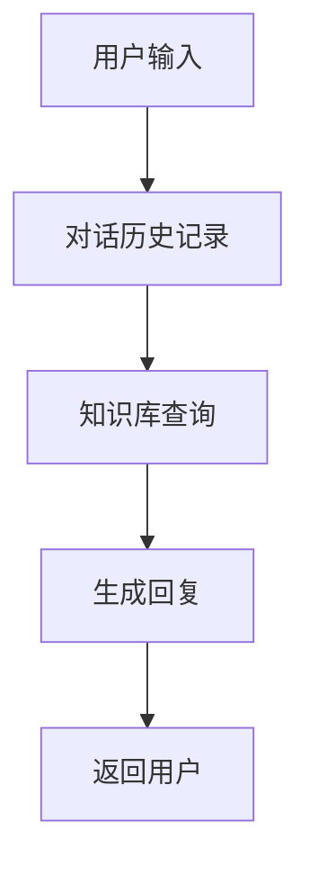
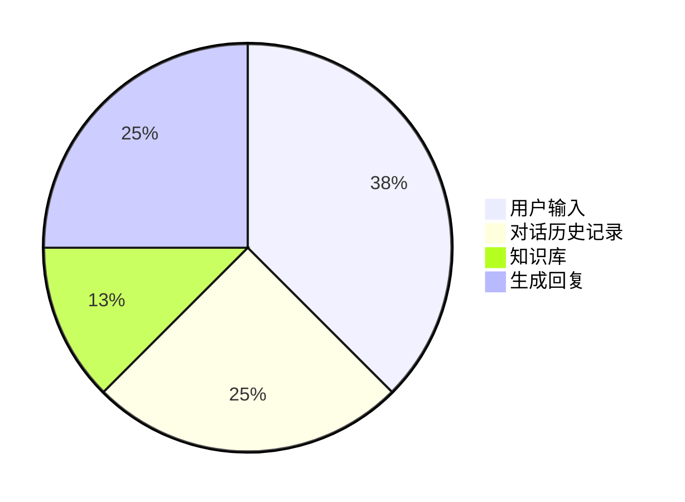

                 


# 多轮对话 AI Agent：提升 LLM 的上下文理解能力

> 关键词：多轮对话 AI Agent, 大语言模型, 上下文理解, 对话系统, 自然语言处理, 人工智能

> 摘要：  
在当前人工智能快速发展的背景下，多轮对话 AI Agent 正在成为人机交互领域的核心技术。本文将详细探讨多轮对话 AI Agent 的核心概念、算法原理、系统架构设计以及实际应用。通过分析多轮对话中的上下文理解问题，本文将深入挖掘大语言模型（LLM）在对话系统中的潜力，结合实际案例，展示如何通过技术手段提升 AI Agent 的对话能力。

---

# 第1章: 多轮对话 AI Agent 的背景与概念

## 1.1 多轮对话 AI Agent 的定义与背景

### 1.1.1 什么是多轮对话  
多轮对话是指用户与 AI Agent 之间进行连续的、多轮次的交互过程。与单轮对话（仅一次交互）不同，多轮对话能够保持上下文的一致性，从而实现更自然、更智能的对话体验。

### 1.1.2 多轮对话的必要性  
- **上下文理解**：单轮对话无法处理复杂的上下文关系，而多轮对话能够通过记忆和理解对话历史，提供更精准的回复。  
- **任务完成**：在复杂任务中，用户可能需要多次交互来完成目标（如预订机票、安排会议等）。  
- **用户体验**：多轮对话能够模拟人类的自然对话方式，提升用户的使用体验。

### 1.1.3 AI Agent 的核心概念  
AI Agent 是一种能够感知环境、理解用户需求并主动提供服务的智能体。它通过多轮对话与用户交互，结合上下文信息和外部知识库，提供更智能的服务。

---

## 1.2 多轮对话与单轮对话的对比

### 1.2.1 单轮对话的局限性  
- 无法处理复杂的上下文关系。  
- 无法记忆对话历史，导致重复询问和不连贯的对话体验。  
- 对复杂任务的支持能力有限。

### 1.2.2 多轮对话的优势  
- **上下文理解**：能够理解对话历史，保持对话的连贯性。  
- **任务支持**：支持复杂任务的分步骤完成。  
- **用户体验**：提供更自然、更高效的对话体验。

### 1.2.3 AI Agent 的应用场景  
- 智能客服  
- 智能助手（如 Siri、Alexa）  
- 在线教育辅助  
- 医疗咨询  

---

## 1.3 多轮对话 AI Agent 的核心要素

### 1.3.1 对话历史的理解  
多轮对话的核心是理解对话历史，这需要 AI Agent 能够存储和理解之前的交互内容。

### 1.3.2 上下文记忆机制  
上下文记忆机制是多轮对话 AI Agent 的关键，它决定了 Agent 如何存储和使用对话历史信息。

### 1.3.3 对话策略的制定  
对话策略决定了 AI Agent 如何根据当前对话内容和目标生成回复。

---

## 1.4 本章小结  
本章介绍了多轮对话 AI Agent 的定义、背景、核心概念以及与单轮对话的对比。通过理解多轮对话的核心要素，我们可以更好地设计和优化 AI Agent 的对话能力。

---

# 第2章: 多轮对话 AI Agent 的核心概念与联系

## 2.1 多轮对话的核心概念

### 2.1.1 对话上下文的理解  
对话上下文是指当前对话的所有相关信息，包括用户的历史输入、系统的历史回复以及外部知识库中的数据。

### 2.1.2 对话历史的存储与检索  
对话历史的存储与检索是多轮对话 AI Agent 的基础功能，通常采用数据库或缓存技术来实现。

### 2.1.3 对话目标的设定  
对话目标是多轮对话的核心，它决定了对话的方向和终点。例如，用户的目标可能是“预订机票”，而 AI Agent 的目标是“帮助用户完成机票预订”。

---

## 2.2 多轮对话与自然语言处理的关系

### 2.2.1 NLP 在多轮对话中的作用  
自然语言处理（NLP）技术是多轮对话 AI Agent 的技术基础，包括文本理解、意图识别、实体识别等功能。

### 2.2.2 大语言模型（LLM）的应用  
大语言模型（如 GPT、BERT）在多轮对话中发挥着重要作用，能够生成自然、连贯的对话内容。

### 2.2.3 对话系统中的知识库  
知识库是多轮对话的重要支持，它存储了对话所需的所有信息，如产品信息、服务信息等。

---

## 2.3 多轮对话 AI Agent 的实体关系图

```mermaid
er
  actor: 用户
  agent: AI Agent
  dialogue_history: 对话历史记录
  knowledge_base: 知识库
  actor --> dialogue_history: 提供对话内容
  agent --> dialogue_history: 查询对话内容
  agent --> knowledge_base: 查询知识库
```

---

## 2.4 本章小结  
本章从多个角度分析了多轮对话 AI Agent 的核心概念，包括对话上下文、对话历史、对话目标，以及 NLP 和知识库在其中的作用。通过实体关系图，我们进一步理解了多轮对话系统的整体架构。

---

# 第3章: 多轮对话 AI Agent 的算法原理

## 3.1 多轮对话模型的算法框架

### 3.1.1 基于转换器的架构  
转换器（Transformer）架构是当前主流的对话模型，具有并行计算和全局上下文理解的优势。

### 3.1.2 基于注意力机制的模型  
注意力机制（Attention）是转换器的核心组件，能够聚焦重要的对话内容。

### 3.1.3 基于记忆网络的模型  
记忆网络（Memory Network）是一种专门用于处理对话历史的模型，能够存储和检索对话信息。

---

## 3.2 多轮对话模型的数学公式

### 3.2.1 注意力机制的公式推导  
$$\text{Attention}(Q, K, V) = \text{softmax}\left(\frac{QK^T}{\sqrt{d_k}}\right)V$$

其中，$Q$ 是查询向量，$K$ 是键向量，$V$ 是值向量，$d_k$ 是向量的维度。

### 3.2.2 记忆网络的公式解析  
$$o_t = \text{softmax}(W_{o} [c_t; h_t])$$  
其中，$c_t$ 是记忆单元，$h_t$ 是当前状态，$W_{o}$ 是输出权重。

---

## 3.3 多轮对话模型的流程图



---

## 3.4 本章小结  
本章详细讲解了多轮对话 AI Agent 的算法原理，包括转换器架构、注意力机制和记忆网络。通过数学公式和流程图，我们理解了这些算法如何协同工作，实现高效的对话理解与生成。

---

# 第4章: 多轮对话 AI Agent 的系统分析与架构设计

## 4.1 系统需求分析

### 4.1.1 功能需求  
- 对话历史记录  
- 上下文理解  
- 知识库查询  
- 多轮对话生成  

### 4.1.2 性能需求  
- 快速响应  
- 高准确率  
- 稳定性  

### 4.1.3 用户需求  
- 自然的对话体验  
- 高效的任务完成  
- 隐私与安全  

---

## 4.2 系统功能设计

### 4.2.1 对话历史记录  
系统需要记录用户的对话历史，并能够根据历史内容生成连贯的回复。

### 4.2.2 上下文理解  
系统需要理解当前对话的上下文，并结合上下文生成合适的回复。

### 4.2.3 知识库查询  
系统需要能够查询外部知识库，获取所需的信息。

---

## 4.3 系统架构设计

### 4.3.1 系统架构图  


### 4.3.2 接口设计  
- 用户输入接口  
- 对话历史记录接口  
- 知识库查询接口  

---

## 4.4 本章小结  
本章分析了多轮对话 AI Agent 的系统需求，并设计了系统的功能模块和架构。通过对系统架构图的分析，我们理解了各模块之间的协同关系。

---

# 第5章: 多轮对话 AI Agent 的项目实战

## 5.1 环境安装

### 5.1.1 安装 Python  
```bash
python --version
```

### 5.1.2 安装依赖库  
```bash
pip install transformers
pip install torch
```

---

## 5.2 系统核心实现

### 5.2.1 对话历史记录的实现  
```python
class DialogueHistory:
    def __init__(self):
        self.history = []
    
    def add(self, text):
        self.history.append(text)
    
    def get_last(self):
        return self.history[-1]
```

### 5.2.2 上下文理解的实现  
```python
class ContextUnderstanding:
    def __init__(self):
        pass
    
    def understand(self, history, current_input):
        # 实现上下文理解逻辑
        pass
```

---

## 5.3 案例分析与代码实现

### 5.3.1 案例分析  
假设用户输入“我需要预订一张机票”，系统需要根据上下文生成回复。

### 5.3.2 代码实现  
```python
def generate_response(current_input, history):
    # 简单实现，仅作为示例
    if "预订机票" in current_input:
        return "请提供您的出发地和目的地。"
    else:
        return "抱歉，我无法理解您的请求。"
```

---

## 5.4 本章小结  
本章通过实际案例分析和代码实现，展示了如何设计和实现一个多轮对话 AI Agent。通过对对话历史记录和上下文理解的实现，我们理解了多轮对话系统的核心逻辑。

---

# 第6章: 总结与展望

## 6.1 本章总结  
本文详细探讨了多轮对话 AI Agent 的核心概念、算法原理和系统架构设计。通过对多轮对话的理解，我们能够更好地设计和优化 AI Agent 的对话能力。

## 6.2 未来展望  
随着大语言模型的不断发展，多轮对话 AI Agent 的能力将不断提升。未来的研究方向包括更高效的对话策略、更智能的知识库管理和更自然的对话生成。

## 6.3 最佳实践 Tips  
- 在设计对话系统时，优先考虑上下文理解。  
- 使用大语言模型（LLM）提升对话的自然性。  
- 定期更新知识库，确保信息的准确性。  

---

# 附录: 参考文献

1. Vaswani, A., et al. "Attention Is All You Need." arXiv Preprint, 2017.  
2. Devlin, J., et al. "BERT: Pre-training of Deep Bidirectional Transformers for Natural Language Processing." arXiv Preprint, 2018.  
3. Li, J., et al. "Dialogflow: Aaidulessive State Tracking and Dialogue Management." arXiv Preprint, 2017.  

---

通过本文的系统性分析，我们深入理解了多轮对话 AI Agent 的核心原理和实际应用。希望本文能够为相关领域的研究者和开发者提供有价值的参考和启发。

