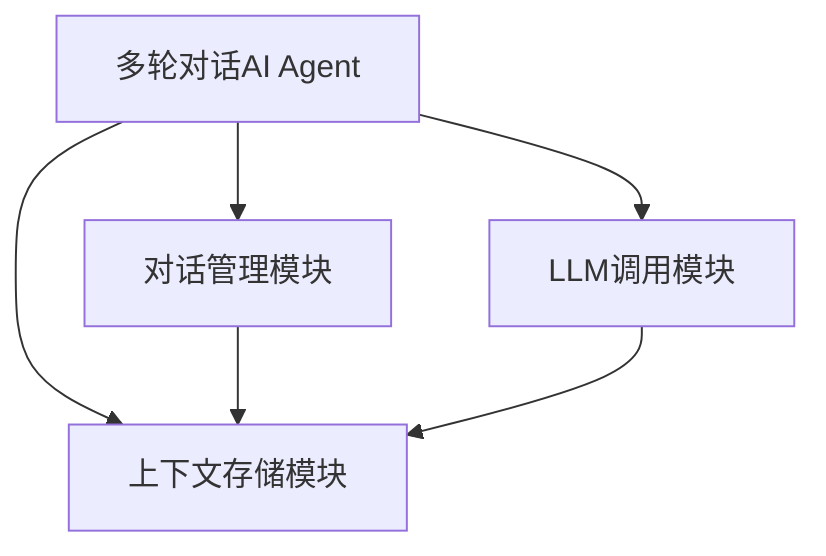
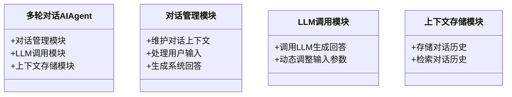

                 


# 多轮对话AI Agent：提升LLM的长期交互能力

> 关键词：多轮对话AI Agent，LLM，长期交互，上下文管理，对话历史，动态调整机制

> 摘要：本文详细探讨了多轮对话AI Agent的设计与实现，重点分析了如何通过提升LLM的长期交互能力来增强对话系统的智能性和连贯性。文章从背景介绍、核心概念、算法原理、系统架构到项目实战，全面阐述了多轮对话AI Agent的构建过程，并结合实际案例，深入解析了其在不同场景下的应用与优化方法。

---

# 第一部分：多轮对话AI Agent的背景与概念

## 第1章：多轮对话AI Agent的背景介绍

### 1.1 问题背景

#### 1.1.1 当前人机交互的挑战

随着人工智能技术的快速发展，人机交互已成为各类应用中的核心需求。然而，现有的自然语言处理（NLP）模型在应对多轮对话时仍存在诸多挑战：

- **上下文理解不足**：模型难以保持对话的连贯性，容易忽略之前的对话历史。
- **动态调整能力有限**：面对复杂或变化的对话场景，模型的响应往往不够灵活。
- **长期记忆缺失**：模型无法有效存储和利用长期对话历史，导致对话体验断层。

#### 1.1.2 多轮对话的核心问题

多轮对话的核心问题在于如何在多个交互轮次中保持对话的连贯性和智能性。具体问题包括：

- 对话历史的有效管理与检索。
- 动态调整生成内容以适应对话上下文。
- 长期记忆的构建与应用。

#### 1.1.3 LLM在对话中的作用

大语言模型（LLM）通过其强大的语料库和生成能力，为多轮对话提供了基础支持。然而，LLM本身并不具备对话管理的能力，需要借助外部机制来提升其在多轮对话中的表现。

---

### 1.2 问题描述

#### 1.2.1 多轮对话的定义与特点

多轮对话是指用户与系统之间进行的多轮交互，每一轮交互都依赖于之前的对话历史。其特点包括：

- **上下文依赖性**：每一轮对话都与之前的对话内容相关。
- **动态变化性**：对话的主题和用户需求可能随着轮次变化。
- **长期记忆需求**：系统需要存储和利用多轮对话的历史信息。

#### 1.2.2 LLM在对话中的局限性

尽管LLM在文本生成方面表现出色，但在多轮对话中仍存在以下局限：

- **缺乏上下文记忆**：模型无法主动存储对话历史。
- **生成内容的连贯性不足**：模型可能忽略之前的对话内容，导致回答不相关。
- **动态调整能力有限**：模型难以根据对话进展实时调整生成策略。

#### 1.2.3 提升LLM长期交互能力的必要性

为了充分发挥LLM的潜力，必须通过外部机制（如AI Agent）来弥补其在多轮对话中的不足，从而提升系统的长期交互能力。

---

### 1.3 问题解决

#### 1.3.1 多轮对话AI Agent的定义

多轮对话AI Agent是一种智能体，负责管理对话的上下文、存储对话历史，并根据当前对话状态动态调整LLM的生成内容。其核心目标是通过外部机制弥补LLM的局限性，提升对话的连贯性和智能性。

#### 1.3.2 多轮对话AI Agent的核心目标

- **上下文管理**：维护对话的上下文信息，确保每一轮对话都基于之前的对话历史。
- **动态调整**：根据对话进展实时调整生成策略，确保生成内容的相关性和连贯性。
- **长期记忆**：存储和利用多轮对话的历史信息，提升系统的智能性。

#### 1.3.3 提升LLM长期交互能力的关键技术

- **对话上下文管理**：通过数据结构存储对话历史，并根据需要检索相关信息。
- **LLM的动态调用**：根据对话上下文动态调整LLM的输入，以生成更相关的回答。
- **状态管理与推理**：基于对话上下文进行状态推理，实时调整对话策略。

---

### 1.4 边界与外延

#### 1.4.1 多轮对话的边界条件

- **对话轮次限制**：系统支持的最大对话轮次。
- **上下文存储容量**：系统存储对话历史的最大长度。
- **对话主题约束**：系统支持的对话主题范围。

#### 1.4.2 LLM的适用范围与限制

- **适用范围**：文本生成、问答、对话等任务。
- **限制**：缺乏上下文记忆能力，需要外部机制辅助。

#### 1.4.3 多轮对话AI Agent的扩展场景

- **跨渠道对话**：支持通过不同渠道（如文本、语音）进行对话。
- **多用户支持**：同时管理多个用户的对话。
- **复杂场景处理**：应对复杂对话主题和用户需求变化。

---

### 1.5 概念结构与核心要素组成

#### 1.5.1 多轮对话AI Agent的组成

- **对话管理模块**：负责维护对话的上下文信息。
- **LLM调用模块**：根据对话上下文调用LLM生成回答。
- **上下文存储模块**：存储和检索对话历史信息。
- **状态推理模块**：基于对话上下文进行状态推理，调整生成策略。

#### 1.5.2 核心要素的定义与关系

- **对话上下文**：当前对话的状态信息，包括用户意图、对话历史等。
- **LLM调用策略**：根据对话上下文动态调整LLM的输入参数。
- **状态推理机制**：基于对话上下文进行状态推理，确保生成内容的相关性。

#### 1.5.3 概念结构图



---

## 第2章：多轮对话AI Agent的核心概念与联系

### 2.1 核心概念原理

#### 2.1.1 多轮对话的上下文管理

多轮对话的关键在于上下文管理。系统需要维护对话的上下文信息，包括用户意图、对话历史等。通过上下文管理，系统能够理解当前对话的背景，并生成相关的回答。

#### 2.1.2 对话历史的存储与检索

对话历史的存储与检索是多轮对话的核心技术。系统需要将每一轮对话内容存储在数据库或缓存中，并根据需要检索相关信息。存储的内容通常包括用户输入、系统回答、时间戳等。

#### 2.1.3 LLM的动态调整机制

为了提升LLM的长期交互能力，系统需要根据对话上下文动态调整LLM的输入参数。例如，可以调整LLM的温度参数或输入的历史对话内容，以生成更相关的回答。

---

### 2.2 核心概念属性特征对比

#### 2.2.1 对比表格：多轮对话与单轮对话的特征对比

| 特性               | 单轮对话             | 多轮对话             |
|--------------------|----------------------|----------------------|
| 对话轮次           | 1轮                 | 多轮                 |
| 上下文依赖性       | 无                  | 有                  |
| 动态调整能力       | 无                  | 有                  |
| 长期记忆需求       | 无                  | 有                  |

#### 2.2.2 对比表格：LLM与传统NLP模型的性能对比

| 特性               | LLM                  | 传统NLP模型          |
|--------------------|----------------------|----------------------|
| 文本生成能力       | 强                   | 弱                   |
| 对话连贯性         | 好                   | 差                   |
| 动态调整能力       | 需外部机制           | 较强                |

---

### 2.3 ER实体关系图架构

#### 2.3.1 实体关系图：用户、对话历史、LLM模型的关系

```mermaid
erd
    用户 --> 对话历史: 发起对话
    对话历史 --> LLM模型: 提供上下文
    LLM模型 --> 用户: 生成回答
```

#### 2.3.2 实体关系图：对话上下文与系统状态的关系

```mermaid
erd
    对话上下文 --> 系统状态: 维护状态
    系统状态 --> 对话上下文: 动态调整
```

---

## 第3章：多轮对话AI Agent的算法原理

### 3.1 对话管理与上下文推理

#### 3.1.1 对话上下文的表示与存储

对话上下文通常以JSON格式存储，包括用户输入、系统回答、时间戳等信息。例如：

```json
{
    "user_input": "今天天气怎么样？",
    "system_response": "今天天气晴朗。",
    "timestamp": "2023-10-01 12:00:00"
}
```

#### 3.1.2 对话历史的检索与分析

系统需要根据当前对话内容检索相关的对话历史，并分析其对当前对话的影响。例如，当用户问“明天天气怎么样？”时，系统需要检索最近的天气对话历史，以生成更相关的回答。

#### 3.1.3 对话状态的推理与更新

基于对话历史和当前输入，系统通过推理算法（如基于规则的推理或机器学习模型）生成对话状态，并实时更新对话上下文。

---

### 3.2 LLM的动态调整机制

#### 3.2.1 动态调整策略

系统可以根据对话上下文动态调整LLM的输入参数，例如：

- **输入历史对话内容**：将对话历史作为输入，供LLM生成更相关的回答。
- **调整温度参数**：根据对话的复杂性动态调整生成内容的随机性。

#### 3.2.2 动态调整的实现

通过在LLM的输入中加入对话历史，系统可以生成更连贯的回答。例如：

```python
# 示例代码：动态调整LLM输入
def generate_response(context, input_text):
    full_input = f"基于以下对话历史：{context}\n用户：{input_text}\n系统："
    response = llm.generate(full_input)
    return response
```

#### 3.2.3 动态调整的数学模型

动态调整LLM输入的过程可以看作是一个概率生成问题。假设对话历史为$H$，当前输入为$I$，生成的回答$R$的概率为：

$$ P(R|H, I) = P(R|I) \cdot P(H) $$

其中，$P(R|I)$是基于当前输入$I$生成回答$R$的概率，$P(H)$是对话历史$H$出现的概率。

---

## 第4章：多轮对话AI Agent的系统架构设计

### 4.1 系统功能设计

#### 4.1.1 领域模型设计



#### 4.1.2 系统架构设计

```mermaid
graph TD
    多轮对话AI Agent --> 对话管理模块
    多轮对话AI Agent --> LLM调用模块
    多轮对话AI Agent --> 上下文存储模块
    对话管理模块 --> 上下文存储模块
    LLM调用模块 --> 上下文存储模块
```

#### 4.1.3 系统接口设计

系统接口主要分为用户接口和内部接口：

- **用户接口**：接收用户输入，输出系统回答。
- **内部接口**：对话管理模块与LLM调用模块之间的接口。

---

### 4.2 对话管理模块的实现

#### 4.2.1 对话上下文的维护

对话管理模块负责维护对话上下文，包括用户输入、系统回答等信息。代码示例如下：

```python
# 示例代码：对话上下文维护
class DialogueManager:
    def __init__(self):
        self.context = []
    
    def add_to_context(self, input_text, response):
        self.context.append({
            "user_input": input_text,
            "system_response": response,
            "timestamp": datetime.now().isoformat()
        })
    
    def get_context(self):
        return self.context
```

#### 4.2.2 对话状态的推理

通过分析对话历史，系统可以推理出当前对话的状态。例如，当用户连续提问关于同一主题的问题时，系统可以推断出用户的需求。

---

### 4.3 LLM调用模块的实现

#### 4.3.1 LLM的动态调用

LLM调用模块可以根据对话上下文动态调整输入参数，生成更相关的回答。例如：

```python
# 示例代码：动态调整LLM输入
def generate_response(context, input_text):
    full_input = f"基于以下对话历史：{context}\n用户：{input_text}\n系统："
    response = llm.generate(full_input)
    return response
```

---

## 第5章：多轮对话AI Agent的项目实战

### 5.1 环境安装与配置

#### 5.1.1 安装Python与相关库

```bash
pip install python-dotenv openai transformers
```

#### 5.1.2 配置环境变量

```bash
export OPENAI_API_KEY="your_api_key"
```

---

### 5.2 系统核心实现

#### 5.2.1 对话管理模块的实现

```python
# 对话管理模块实现
class DialogueManager:
    def __init__(self):
        self.context = []
    
    def add_to_context(self, input_text, response):
        self.context.append({
            "user_input": input_text,
            "system_response": response,
            "timestamp": datetime.now().isoformat()
        })
    
    def get_context(self):
        return self.context
```

#### 5.2.2 LLM调用模块的实现

```python
# LLM调用模块实现
class LLMCaller:
    def __init__(self):
        self.llm = OpenAI()
    
    def call_llm(self, prompt):
        response = self.llm.generate(
            model="gpt-3.5-turbo",
            prompt=prompt,
            max_tokens=1000,
            temperature=0.7
        )
        return response.choices[0].message.content
```

---

### 5.3 代码应用解读与分析

#### 5.3.1 对话管理模块的代码解读

对话管理模块负责维护对话上下文，包括用户输入和系统回答。通过`add_to_context`方法，系统可以将每一轮对话内容存储到上下文中。`get_context`方法可以检索对话历史，供其他模块使用。

#### 5.3.2 LLM调用模块的代码解读

LLM调用模块通过`call_llm`方法调用LLM生成回答。输入的提示（prompt）可以包含对话历史，以生成更相关的回答。例如：

```python
context = dialogue_manager.get_context()
prompt = f"基于以下对话历史：{context}\n用户：{input_text}\n系统："
response = llmCaller.call_llm(prompt)
```

---

### 5.4 实际案例分析与详细讲解

#### 5.4.1 案例分析

假设用户进行以下对话：

1. 用户：今天天气怎么样？
2. 系统：今天天气晴朗。
3. 用户：明天天气怎么样？

系统通过对话管理模块维护对话上下文，并在第二轮对话中检索第一轮的对话历史，生成更相关的回答。

#### 5.4.2 详细讲解

通过对话管理模块，系统可以理解用户的意图，并根据对话历史生成合适的回答。例如，当用户询问明天天气时，系统可以根据之前的对话历史（今天天气晴朗）生成明天的天气预报。

---

### 5.5 项目小结

通过以上实现，我们可以看到多轮对话AI Agent的核心在于对话上下文的管理与利用。通过维护对话历史，系统可以生成更连贯的回答，提升用户体验。

---

## 第6章：总结与展望

### 6.1 最佳实践 tips

- **对话上下文管理**：确保系统能够存储和检索对话历史。
- **动态调整机制**：根据对话上下文动态调整LLM的输入参数。
- **状态推理**：通过分析对话历史，推理当前对话的状态，生成更相关的回答。

### 6.2 小结

通过本文的详细讲解，我们了解了多轮对话AI Agent的设计与实现过程。从背景介绍到系统架构设计，再到项目实战，我们全面探讨了如何提升LLM的长期交互能力。

### 6.3 注意事项

- **性能优化**：对话历史的存储和检索需要考虑性能问题。
- **安全性**：确保对话数据的安全性，避免隐私泄露。
- **可扩展性**：系统设计应具备良好的可扩展性，支持更多对话场景。

### 6.4 拓展阅读

- **相关技术**：研究其他对话管理技术，如基于规则的对话管理和基于模型的对话管理。
- **最新进展**：关注多轮对话领域的最新研究成果，如基于Transformer的对话模型。

---

通过以上内容，我们系统地探讨了多轮对话AI Agent的设计与实现，希望能为读者提供有益的参考和启发。

