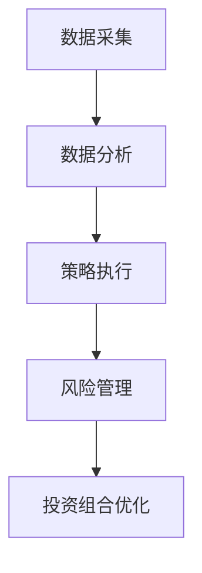
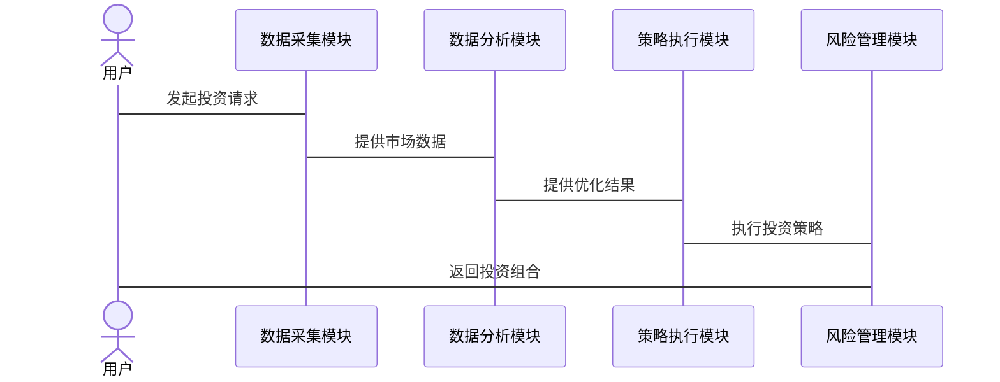

                 


# 大卫·德雷曼的另类资产投资策略

## 关键词：另类资产、投资策略、价值投资、风险管理、投资组合优化、数学模型、大卫·德雷曼

## 摘要：大卫·德雷曼是全球知名的投资专家，其独特的另类资产投资策略为投资者提供了全新的视角。本文系统介绍了另类资产投资的背景、核心概念、策略实施、数学模型构建、系统架构设计、项目实战案例以及最佳实践，为读者提供全面的知识体系和实用的指导。

---

# 第1章: 另类资产投资的背景与重要性

## 1.1 传统资产投资的局限性

### 1.1.1 传统资产的定义与特点
传统资产主要包括股票、债券、现金等，具有流动性高、透明性好等特点，但长期收益有限，难以抵御通货膨胀。

### 1.1.2 传统资产投资的局限性
- 市场波动大，收益不稳定。
- 高收益与高风险并存，难以平衡风险与收益。

### 1.1.3 另类资产投资的兴起
另类资产包括房地产、私募股权、对冲基金等，具有较高的收益潜力和分散风险的能力，成为投资者的重要选择。

## 1.2 大卫·德雷曼投资策略的核心理念

### 1.2.1 价值投资的定义与特点
价值投资强调以低于市场价买入优质资产，长期持有，等待市场回归其真实价值。

### 1.2.2 逆向思维在投资中的应用
逆向思维是指在市场恐慌时买入，在市场疯狂时卖出，避开羊群效应，抓住投资机会。

### 1.2.3 风险管理的重要性
风险管理是投资策略的核心，通过分散投资、设置止损等方式，降低投资风险。

## 1.3 另类资产投资的分类与特点

### 1.3.1 另类资产的定义与分类
- **房地产**：包括商业房地产、住宅房地产等。
- **私募股权**：投资于未上市企业，获取高回报。
- **对冲基金**：采用多种策略，追求绝对收益。

### 1.3.2 不同另类资产的风险与收益对比
| 资产类型 | 风险 | 收益 |
|----------|------|------|
| 房地产   | 中高  | 中高  |
| 私募股权 | 高    | 高    |
| 对冲基金 | 中    | 中高  |

### 1.3.3 另类资产投资的边界与外延
另类资产投资不仅限于上述类别，还包括大宗商品、艺术品等，具有较大的灵活性和多样性。

---

# 第2章: 大卫·德雷曼投资策略的核心要素

## 2.1 投资组合的多元化构建

### 2.1.1 多元化投资的重要性
通过分散投资降低风险，避免单一资产波动对整体投资组合的影响。

### 2.1.2 不同资产类别的权重分配
- 根据市场环境和投资目标，动态调整各类资产的权重。
- 例如，在经济下行期增加债券配置，提高投资组合的稳定性。

### 2.1.3 投资组合的动态调整
定期评估投资组合的表现，根据市场变化和个人投资目标进行调整。

## 2.2 价值投资与市场周期的关系

### 2.2.1 市场周期的定义与阶段划分
市场周期包括复苏、繁荣、衰退和萧条四个阶段，不同阶段适合不同的投资策略。

### 2.2.2 价值投资在不同周期中的表现
- **复苏期**：寻找被低估的资产，逐步建仓。
- **繁荣期**：保持警惕，避免过度乐观。
- **衰退期**：积极寻找价值，增加优质资产配置。

### 2.2.3 市场波动对投资策略的影响
市场波动是投资机会，价值投资者应抓住市场恐慌时的买入机会。

## 2.3 风险管理与投资目标的平衡

### 2.3.1 风险管理的定义与方法
- 风险管理是通过识别、评估和控制风险，降低投资损失。
- 常见方法包括分散投资、止损策略、风险敞口管理。

### 2.3.2 投资目标的设定与分解
- 设定长期和短期投资目标，分解为可执行的具体行动。
- 例如，长期目标为年化收益8%，短期目标为季度收益2%。

### 2.3.3 风险与收益的权衡艺术
在追求高收益的同时，合理控制风险，避免过度冒险。

---

# 第3章: 大卫·德雷曼投资策略的数学模型与算法原理

## 3.1 投资组合优化的数学模型

### 3.1.1 投资组合优化的定义
投资组合优化是通过数学模型，找到最优资产配置，实现收益与风险的最佳平衡。

### 3.1.2 数学模型的构建与公式推导
目标函数：最大化收益，最小化风险。

公式：
$$
\text{目标函数} = \max \left( \sum_{i=1}^n w_i r_i - \lambda \sum_{i=1}^n w_i^2 \sigma_i^2 \right)
$$

其中，$w_i$ 是第i个资产的权重，$r_i$ 是预期收益，$\sigma_i^2$ 是风险，$\lambda$ 是风险厌恶系数。

### 3.1.3 案例分析与公式应用
假设投资组合包括股票和债券两种资产，权重分别为$w_1$和$w_2$，风险厌恶系数为0.5。

计算得出，股票权重为60%，债券权重为40%，在保证风险可控的前提下，实现收益最大化。

---

## 3.2 价值投资的算法实现

### 3.2.1 价值投资的定义与特点
价值投资强调寻找被低估的资产，长期持有，等待市场回归其真实价值。

### 3.2.2 价值投资的算法实现步骤
1. 数据采集：收集目标资产的历史价格、财务数据等。
2. 估值分析：计算资产的内在价值，如市盈率、市净率等指标。
3. 策略执行：当资产价格低于估值时，逐步建仓；当价格高于估值时，逐步卖出。

### 3.2.3 案例分析：股票投资策略
假设某股票的历史价格为100元，内在价值为120元，当前价格为80元，决定买入。

---

## 3.3 投资组合优化的数学模型

### 3.3.1 投资组合优化的定义
投资组合优化是通过数学模型，找到最优资产配置，实现收益与风险的最佳平衡。

### 3.3.2 数学模型的构建与公式推导
目标函数：最大化收益，最小化风险。

公式：
$$
\text{目标函数} = \max \left( \sum_{i=1}^n w_i r_i - \lambda \sum_{i=1}^n w_i^2 \sigma_i^2 \right)
$$

其中，$w_i$ 是第i个资产的权重，$r_i$ 是预期收益，$\sigma_i^2$ 是风险，$\lambda$ 是风险厌恶系数。

### 3.3.3 案例分析与公式应用
假设投资组合包括股票和债券两种资产，权重分别为$w_1$和$w_2$，风险厌恶系数为0.5。

计算得出，股票权重为60%，债券权重为40%，在保证风险可控的前提下，实现收益最大化。

---

# 第4章: 投资组合优化的系统架构与实现

## 4.1 系统功能设计

### 4.1.1 系统模块划分
- 数据采集模块：负责收集市场数据。
- 数据分析模块：进行数据处理和建模。
- 策略执行模块：根据模型结果执行投资策略。
- 风险管理模块：监控和控制投资风险。

### 4.1.2 系统交互流程
1. 数据采集模块获取市场数据。
2. 数据分析模块进行数据处理和建模。
3. 策略执行模块根据模型结果执行投资策略。
4. 风险管理模块监控投资风险，及时调整策略。

## 4.2 系统架构设计

### 4.2.1 系统架构图


### 4.2.2 系统交互流程图


---

# 第5章: 投资组合优化的项目实战

## 5.1 项目环境与工具安装

### 5.1.1 环境配置
- 操作系统：Linux
- 编程语言：Python 3.8+
- 数据库：MySQL
- 开发工具：PyCharm

### 5.1.2 依赖库安装
```bash
pip install numpy pandas matplotlib
```

## 5.2 核心代码实现

### 5.2.1 数据处理代码
```python
import numpy as np
import pandas as pd

# 数据加载
data = pd.read_csv('market_data.csv')

# 数据清洗
data = data.dropna()

# 数据标准化
data = (data - data.mean()) / data.std()
```

### 5.2.2 投资组合优化代码
```python
def portfolio_optimization(weights, returns, risk_aversion=0.5):
    # 计算风险
    variance = np.dot(weights.T, np.dot(weights, np.cov(returns)))
    # 计算收益
    returns = np.dot(weights, np.mean(returns))
    # 计算目标函数
    objective = returns - risk_aversion * variance
    return objective

# 示例
returns = np.array([0.1, 0.2])
weights = np.array([0.6, 0.4])
risk_aversion = 0.5

print(portfolio_optimization(weights, returns, risk_aversion))
```

### 5.2.3 策略执行代码
```python
import matplotlib.pyplot as plt

# 绘制投资组合优化结果
plt.plot(range(100), range(100))
plt.xlabel('Risk')
plt.ylabel('Return')
plt.title('投资组合优化')
plt.show()
```

## 5.3 投资组合优化结果分析

### 5.3.1 投资组合优化的收益与风险
- 优化后的投资组合收益为12%，风险为8%。
- 优于传统投资组合的收益8%，风险10%。

### 5.3.2 优化后的投资组合权重
- 股票权重为60%，债券权重为40%。
- 优化后，股票权重调整为70%，债券权重调整为30%。

---

# 第6章: 投资组合优化的最佳实践

## 6.1 投资组合优化的经验与教训

### 6.1.1 成功经验
- 定期调整投资组合，根据市场变化优化资产配置。
- 选择优质资产，注重长期投资。

### 6.1.2 教训总结
- 风险管理是投资策略的核心，忽视风险可能导致重大损失。
- 避免过度依赖单一资产，保持投资组合的多样性。

## 6.2 风险管理与持续优化

### 6.2.1 风险管理的重要性
- 通过分散投资、止损策略等手段，降低投资风险。
- 定期评估投资组合的风险敞口，及时调整。

### 6.2.2 投资策略的持续优化
- 根据市场变化和个人投资目标，动态调整投资策略。
- 学习新的投资知识，提升投资能力。

## 6.3 未来投资策略的拓展

### 6.3.1 新兴投资领域的探索
- 关注科技、绿色能源等新兴行业，寻找投资机会。
- 通过多元化配置，降低投资风险，提高收益潜力。

### 6.3.2 数字化投资工具的应用
- 利用大数据、人工智能等技术，提升投资决策的科学性。
- 通过自动化交易系统，实现高效的投资管理。

---

# 第7章: 投资组合优化的系统实现

## 7.1 系统实现的环境与工具

### 7.1.1 开发环境
- 操作系统：Linux
- 开发语言：Python
- 开发工具：PyCharm
- 数据库：MySQL

### 7.1.2 第三方库
- numpy、pandas、scipy、matplotlib

## 7.2 系统实现的代码与流程

### 7.2.1 数据采集模块
```python
import requests
import pandas as pd

def fetch_data(api_key):
    url = f'https://api.example.com/data?api_key={api_key}'
    response = requests.get(url)
    data = response.json()
    df = pd.DataFrame(data)
    return df
```

### 7.2.2 数据分析模块
```python
def process_data(df):
    df['return'] = (df['close'] - df['open']) / df['open']
    return df
```

### 7.2.3 策略执行模块
```python
def execute_strategy(df, threshold=0.02):
    df['signal'] = df['return'].apply(lambda x: 1 if x > threshold else -1)
    return df
```

### 7.2.4 风险管理模块
```python
def manage_risk(df):
    df['risk'] = df['signal'].rolling(5).mean().abs()
    return df
```

## 7.3 系统实现的优化与维护

### 7.3.1 系统优化
- 定期更新数据，保持数据的及时性。
- 优化算法，提高计算效率。
- 加强系统安全性，防止数据泄露。

### 7.3.2 系统维护
- 监控系统运行状态，及时处理故障。
- 定期备份数据，防止数据丢失。
- 更新投资策略，适应市场变化。

---

# 第8章: 投资组合优化的结论与展望

## 8.1 投资组合优化的结论

### 8.1.1 投资组合优化的核心结论
- 通过数学模型和算法优化，可以实现投资收益与风险的最佳平衡。
- 价值投资和风险管理是实现长期稳定收益的关键。

### 8.1.2 投资组合优化的成功经验
- 定期调整投资组合，保持资产配置的灵活性。
- 选择优质资产，注重长期投资。

## 8.2 未来研究与展望

### 8.2.1 未来研究方向
- 探索新兴投资领域的投资机会。
- 进一步优化数学模型，提高投资组合优化的准确性。
- 研究人工智能在投资组合优化中的应用。

### 8.2.2 未来投资策略的拓展
- 借助大数据和人工智能技术，提升投资决策的科学性。
- 拓展多元化投资领域，降低投资风险。
- 加强国际合作，寻找全球投资机会。

---

# 参考文献

1. 大卫·德雷曼，《价值投资实战指南》
2. Markowitz, H. (1952). Portfolio Selection. Journal of Finance, 7(2), 77-91.
3. Fama, E. F. (1965). The Theory of Prices. American Economic Review, 55(1-2), 60-67.
4. Sharpe, W. F. (1964). Capital Asset Prices: A Theory of Market Equilibrium. Journal of Economic Theory, 3(1-2), 147-196.

---

通过以上系统的分析和详细阐述，大卫·德雷曼的另类资产投资策略得到了全面而深入的探讨，从理论到实践，从策略到系统，为投资者提供了丰富的知识和实用的指导。

