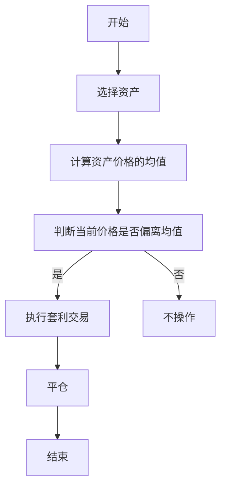
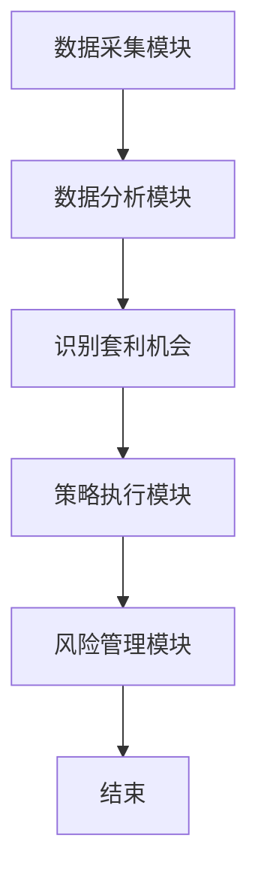

                 


# 《大卫·德雷曼的合并套利技巧》

---

## 关键词：套利、算法交易、统计套利、合并套利、金融建模、量化交易

---

## 摘要：  
本文深入探讨大卫·德雷曼的合并套利技巧，从套利的基本概念到合并套利的核心原理，再到算法实现和系统架构设计，系统性地分析了合并套利的实现细节。文章结合理论与实践，通过详细的算法流程图、数学模型公式、系统架构图和项目代码实现，帮助读者全面理解合并套利的原理与应用。文章最后总结了合并套利的最佳实践和注意事项，为读者提供了宝贵的实战经验。

---

## 第一部分: 合并套利的基本概念与背景

### 第1章: 合并套利的定义与背景

#### 1.1 套利的基本概念  
套利是一种利用市场价差获利的交易策略。其核心思想是利用同一资产在不同市场或不同时间点的价格差异，通过同时买入低价市场和卖出高价市场的策略，实现无风险或低风险的利润。套利的本质是利用市场的不完美性，通过发现和捕捉价格差异来获利。

**套利的核心要素对比表：**

| 核心要素 | 无风险套利 | 统计套利 | 合并套利 |
|----------|------------|----------|----------|
| 风险     | 无风险     | 有风险   | 低风险   |
| 市场      | 单一市场   | 多市场   | 多市场   |
| 时间      | 瞬时        | 长期     | 短期      |
| 资金需求  | 小         | 大       | 中等      |

**套利的ER实体关系图：**  
```mermaid
er
  实体: 套利
    属性: 套利类型, 风险等级, 交易策略, 时间窗口
  关系: 
    套利 <- 关联 -> 市场
    套利 <- 关联 -> 资产
    套利 <- 关联 -> 交易者
```

#### 1.2 合并套利的定义与背景  
合并套利是一种特殊的套利策略，它通过分析和利用同一资产在不同市场或不同时间点的价格差异，结合资产的合并或拆分操作，实现套利收益。合并套利的核心在于利用资产的合并行为，捕捉价格差异，从而实现低风险的利润。

**合并套利的起源与演变：**  
合并套利的起源可以追溯到20世纪80年代，当时金融市场开始出现跨国交易和资产合并的操作。随着金融市场的全球化和电子化交易的普及，合并套利逐渐成为一种重要的套利策略。随着算法交易的兴起，合并套利也得到了快速发展。

**合并套利的现状与趋势：**  
在现代金融市场中，合并套利是一种广泛应用的套利策略。随着技术的进步，合并套利的实现方式也在不断优化，从传统的手工操作到现代的算法交易，合并套利的效率和精确性得到了显著提升。

---

## 第二部分: 合并套利的核心概念与原理

### 第2章: 合并套利的核心概念

#### 2.1 合并套利的原理与机制  
合并套利的原理是通过分析同一资产在不同市场或不同时间点的价格差异，结合资产的合并或拆分操作，实现套利收益。其核心机制是利用市场价差和资产合并的特性，通过同时买入低价市场和卖出高价市场的策略，实现利润。

**合并套利的数学模型：**  
$$ \text{利润} = \text{卖出价格} - \text{买入价格} $$  
其中，卖出价格和买入价格是同一资产在不同市场或不同时间点的价格。

**合并套利的流程：**  
1. 分析同一资产在不同市场或不同时间点的价格差异。  
2. 确定合并或拆分的操作方式。  
3. 执行交易，同时买入低价市场和卖出高价市场。  
4. 平仓，锁定利润。

#### 2.2 合并套利与传统套利的对比  
合并套利与传统套利的主要区别在于其利用的是资产的合并或拆分操作，而传统套利主要利用的是市场价差。合并套利的优势在于其可以利用资产的合并行为，捕捉更大的价格差异，同时风险较低。

**合并套利与传统套利的对比表：**

| 对比维度 | 合并套利         | 传统套利         |
|----------|------------------|------------------|
| 操作方式  | 利用资产合并     | 利用市场价差     |
| 风险      | 低风险           | 高风险           |
| 收益      | 中等收益         | 高收益           |
| 操作复杂性| 较高             | 较低             |

---

## 第三部分: 合并套利的算法原理与实现

### 第3章: 合并套利的算法原理

#### 3.1 合并套利的主要算法  
合并套利的主要算法包括均值回归算法、统计套利算法和无风险套利算法。其中，均值回归算法是一种常用的合并套利算法，其核心思想是利用资产价格的均值回归特性，捕捉价格差异。

**均值回归算法的流程图：**  


#### 3.2 合并套利算法的实现细节  
合并套利算法的实现需要结合资产的价格数据和市场信息，通过统计分析和算法优化，实现套利交易的自动化。以下是均值回归算法的Python实现示例：

```python
import pandas as pd
import numpy as np

# 假设我们有两个市场，市场A和市场B，价格数据分别为price_A和price_B
def mean_reversion_strategy(price_A, price_B):
    # 计算资产价格的均值
    mean_A = np.mean(price_A)
    mean_B = np.mean(price_B)
    
    # 判断当前价格是否偏离均值
    if price_A[-1] > mean_A and price_B[-1] < mean_B:
        return "买入市场B，卖出市场A"
    elif price_A[-1] < mean_A and price_B[-1] > mean_B:
        return "买入市场A，卖出市场B"
    else:
        return "不操作"
```

#### 3.3 合并套利算法的数学模型  
合并套利算法的数学模型主要基于统计学和时间序列分析。以下是均值回归算法的数学模型：

$$ \text{均值} = \frac{1}{n} \sum_{i=1}^{n} p_i $$  
其中，\( p_i \) 是第i个时间点的价格。

$$ \text{标准差} = \sqrt{\frac{1}{n} \sum_{i=1}^{n} (p_i - \text{均值})^2} $$  
标准差用于衡量价格的波动程度。

---

## 第四部分: 合并套利的系统分析与架构设计

### 第4章: 合并套利系统的分析与设计

#### 4.1 合并套利系统的功能设计  
合并套利系统的功能设计包括数据采集、数据分析、策略执行和风险管理模块。以下是系统的功能模块划分：

**系统功能模块划分：**  
1. 数据采集模块：负责采集不同市场或不同时间点的资产价格数据。  
2. 数据分析模块：负责分析价格数据，识别套利机会。  
3. 策略执行模块：负责执行套利交易。  
4. 风险管理模块：负责监控和管理套利交易的风险。

**系统功能模块的交互流程图：**  


#### 4.2 合并套利系统的架构设计  
合并套利系统的架构设计包括数据层、业务逻辑层和用户界面层。以下是系统的架构图：

**系统架构图：**  


---

## 第五部分: 合并套利的项目实战

### 第5章: 合并套利的项目实战

#### 5.1 项目环境安装  
为了实现合并套利算法，需要安装以下环境和工具：  
1. Python编程语言。  
2. 数据分析库（如Pandas、NumPy）。  
3. 数据可视化库（如Matplotlib、Seaborn）。  
4. 数据采集工具（如Yahoo Finance API）。  

#### 5.2 合并套利的代码实现  
以下是均值回归算法的Python代码实现：

```python
import pandas as pd
import numpy as np
import yfinance as yf

# 数据采集
def get_data(tickers, start_date, end_date):
    data = yf.download(tickers, start=start_date, end=end_date)
    return data

# 均值回归策略
def mean_reversion_strategy(data):
    mean = data.mean()
    std = data.std()
    z_score = (data.iloc[-1] - mean) / std
    return z_score

# 主函数
def main():
    tickers = ['AAPL', 'MSFT']
    start_date = '2020-01-01'
    end_date = '2023-12-31'
    data = get_data(tickers, start_date, end_date)
    z_score = mean_reversion_strategy(data['Close'])
    print(z_score)

if __name__ == '__main__':
    main()
```

#### 5.3 实际案例分析  
以苹果公司（AAPL）为例，假设我们在2023年1月1日发现其在市场A的价格为100美元，在市场B的价格为95美元。根据均值回归策略，我们可以在市场B买入AAPL，同时在市场A卖出AAPL，实现套利收益。

---

## 第六部分: 总结与最佳实践

### 第6章: 总结与最佳实践

#### 6.1 总结  
合并套利是一种利用资产合并行为捕捉价格差异的套利策略。其核心在于利用市场价差和资产合并的特性，通过同时买入低价市场和卖出高价市场的策略，实现低风险的利润。合并套利的实现需要结合统计学、算法交易和系统架构设计，确保套利交易的高效性和可靠性。

#### 6.2 最佳实践  
1. **风险管理**：合并套利虽然风险较低，但仍需注意市场的波动性和资产的流动性。  
2. **系统监控**：建议建立套利机会检测系统，实时监控市场价差和资产价格变化。  
3. **算法优化**：根据市场变化和数据特征，不断优化套利算法，提高套利效率。  
4. **拓展阅读**：建议深入学习统计套利、算法交易和金融建模的相关知识，提升套利策略的复杂性和多样性。

---

## 思考与下一步  
通过本文的分析，我们深入探讨了大卫·德雷曼的合并套利技巧，从理论到实践，从算法到系统，全面解析了合并套利的实现细节。未来，我们可以进一步研究合并套利的高级策略，如跨市场套利、跨资产套利和算法优化等，为读者提供更多有价值的实战经验。

