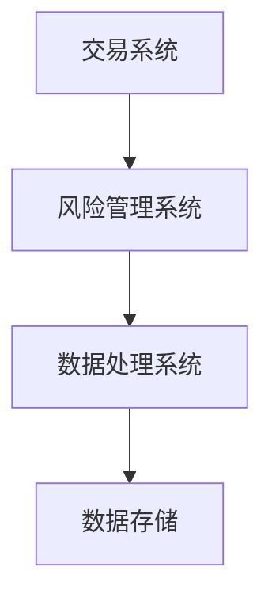
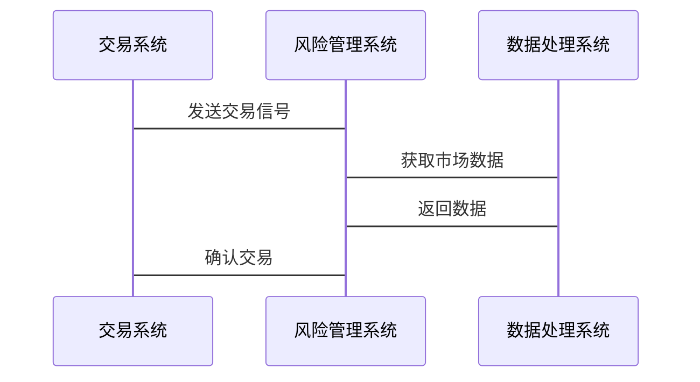

                 


# 大卫·德雷曼的对冲基金投资策略

## 关键词：对冲基金、统计套利、市场中性、风险管理、数学模型、投资策略、大卫·德雷曼

## 摘要：  
大卫·德雷曼是全球著名对冲基金经理，他的投资策略以统计套利和市场中性策略为核心，结合数学模型和算法，实现稳健的投资收益。本文深入分析了德雷曼策略的背景、原理、数学模型及其实现方法，帮助读者理解并掌握这一经典的对冲基金策略。

---

# 正文

## 第一部分: 背景介绍

### 第1章: 对冲基金的基本概念与行业背景

#### 1.1 对冲基金的定义与特点
对冲基金是一种通过杠杆操作和多样化的投资策略来实现高收益的私募投资基金。其特点包括：
- **杠杆操作**：通过借款放大投资收益。
- **多样化投资**：投资于多种资产类别，分散风险。
- **私募性质**：只向合格投资者开放，具有较高的准入门槛。
- **主动管理**：依赖专业团队的主动管理和策略执行。

#### 1.2 大卫·德雷曼及其投资策略
大卫·德雷曼是桥水基金的创始人，他的投资策略以**统计套利**和**市场中性策略**为核心。德雷曼通过数学模型和算法，捕捉市场中的套利机会，同时通过市场中性策略降低市场风险。

#### 1.3 对冲基金的行业背景
对冲基金行业起源于20世纪，随着金融市场的复杂化和投资者对更高收益的需求，对冲基金逐渐成为重要的投资工具。统计套利和市场中性策略在对冲基金中的广泛应用，使得对冲基金在市场波动中表现出更强的稳定性。

---

## 第二部分: 大卫·德雷曼对冲基金策略的核心原理

### 第2章: 统计套利与市场中性策略

#### 2.1 统计套利的基本原理
统计套利是一种基于统计学的方法，通过寻找资产价格的均值回归特性来获利。其核心假设是市场中的短期价格波动会导致资产价格偏离其合理价值，从而提供套利机会。

##### 2.1.1 统计套利的实现步骤
1. **数据收集**：收集相关资产的历史价格数据。
2. **计算价差**：计算资产之间的价差（Spread）。
3. **Z-score分析**：通过Z-score指标判断价差是否偏离正常范围。
4. **生成信号**：当价差超过一定阈值时，生成买入或卖出信号。

##### 2.1.2 统计套利的数学模型
$$ Z = \frac{Spread - Mean(Spread)}{Standard\ Deviation(Spread)} $$

#### 2.2 市场中性策略的实现方法
市场中性策略是一种通过抵消市场风险来实现收益的策略。其核心思想是通过做多和做空相关资产，使得组合的Beta值接近零。

##### 2.2.1 市场中性策略的实现步骤
1. **选择资产**：选择具有相关性的资产。
2. **计算配对**：计算资产之间的配对关系。
3. **构建组合**：通过做多和做空相关资产构建市场中性组合。
4. **风险控制**：通过调整组合的Beta值来控制市场风险。

##### 2.2.2 市场中性策略的风险管理
通过严格的风险控制和动态调整组合，市场中性策略能够在市场波动中保持稳定收益。

#### 2.3 德雷曼策略中的统计套利应用
德雷曼通过统计套利和市场中性策略的结合，实现了对冲基金的稳健收益。其策略的核心在于通过数学模型捕捉市场中的套利机会，并通过市场中性组合降低市场风险。

---

## 第三部分: 大卫·德雷曼策略的数学模型与算法实现

### 第3章: 统计套利的数学模型

#### 3.1 均值回归模型
均值回归模型是统计套利的核心模型之一。其基本假设是资产价格会回归其长期均值。

##### 3.1.1 均值回归模型的数学公式
$$ r_t = \alpha + \beta r_{t-1} + \epsilon_t $$

#### 3.2 股票配对交易策略
股票配对交易策略是一种典型的统计套利策略，其核心是通过配对交易来捕捉资产价格的短期波动。

##### 3.2.1 股票配对交易策略的数学模型
$$ z_t = \frac{p_t}{p_{t-1}} $$

#### 3.3 德雷曼策略的优化算法
德雷曼通过优化算法进一步提高统计套利策略的收益和风险比。

##### 3.3.1 最小二乘法的应用
最小二乘法是统计套利中常用的优化方法，用于估计资产价格的回归系数。

##### 3.3.2 线性回归模型的实现
$$ y = \beta x + \epsilon $$

### 第4章: 算法实现与代码解析

#### 4.1 统计套利算法的Python实现
##### 4.1.1 数据获取与预处理
```python
import pandas as pd

# 从数据库获取数据
data = pd.read_sql("SELECT * FROM stock_prices", con=engine)
```

##### 4.1.2 均值回归模型的代码实现
```python
def mean_reversion_strategy(prices):
    spread = prices['stock1'] - prices['stock2']
    z_score = (spread - spread.mean()) / spread.std()
    signal = np.where(z_score > 1, -1, np.where(z_score < -1, 1, 0))
    return signal
```

---

## 第四部分: 系统架构设计与项目实战

### 第5章: 系统架构设计

#### 5.1 系统功能设计
1. **交易系统**：实现统计套利和市场中性策略的交易功能。
2. **风险管理系统**：实时监控和管理市场风险。
3. **数据处理系统**：处理和存储大量市场数据。

#### 5.2 系统架构图


#### 5.3 系统接口设计
- **交易接口**：与交易系统对接，发送交易信号。
- **数据接口**：与数据源对接，获取实时市场数据。

#### 5.4 系统交互序列图


### 第6章: 项目实战

#### 6.1 环境安装
- 安装必要的Python库：`pandas`、`numpy`、`scipy`。

#### 6.2 核心实现源代码
```python
import numpy as np
import pandas as pd

def calculate_z_score(spreads):
    mean = spreads.mean()
    std = spreads.std()
    z_score = (spreads - mean) / std
    return z_score

def generate_signals(z_score):
    signal = np.where(z_score > 1, -1, np.where(z_score < -1, 1, 0))
    return signal
```

#### 6.3 案例分析
通过实际市场数据，分析德雷曼策略的实现效果，并验证其在不同市场环境下的表现。

#### 6.4 优化与调整
根据实际效果，优化算法参数，提高策略的收益和风险比。

---

## 总结

大卫·德雷曼的对冲基金投资策略以统计套利和市场中性策略为核心，结合数学模型和算法，实现了稳健的投资收益。本文通过详细分析德雷曼策略的背景、原理、数学模型及其实现方法，帮助读者全面理解这一经典的对冲基金策略。通过系统架构设计和项目实战，读者可以进一步掌握如何将这些策略应用于实际投资中。

