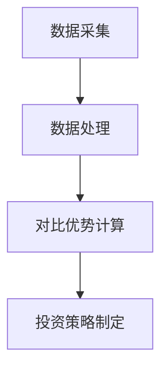
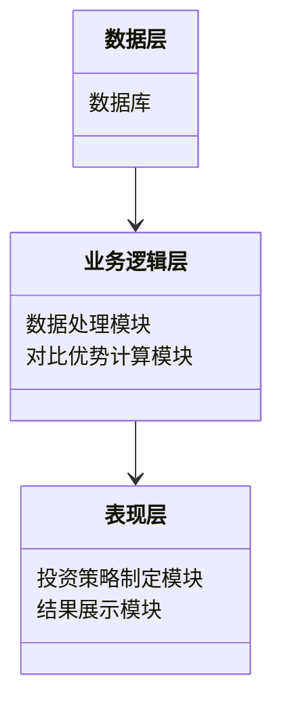

                 


# 大卫·德雷曼的对比优势：在市场低迷时逆向而行

> 关键词：对比优势，大卫·德雷曼，逆向投资，市场低迷，投资策略，数学模型，系统架构

> 摘要：本文深入探讨大卫·德雷曼的对比优势理论，分析其在市场低迷时期的逆向投资策略。通过数学模型、算法实现和系统架构的设计，结合实际案例，展示对比优势在投资决策中的应用，帮助投资者在市场低迷时找到投资机会。

---

## 第1章 对比优势的核心概念

### 1.1 对比优势的定义与背景

#### 1.1.1 对比优势的定义
对比优势是一种投资策略，通过分析不同资产或市场的相对表现，寻找被市场低估的投资机会。与传统投资方法不同，对比优势强调在市场低迷时期，通过比较不同资产的相对价值，找到具有潜在增值空间的投资标的。

#### 1.1.2 对比优势的理论基础
对比优势的理论基础来源于经济学中的比较优势理论，即通过比较不同资产或市场的相对优势，找到具有竞争优势的投资标的。大卫·德雷曼将这一理论应用于金融市场，提出了在市场低迷时期，通过对比不同资产的相对表现，逆向投资，寻找低估资产。

#### 1.1.3 对比优势在投资中的应用
对比优势在投资中的应用主要体现在资产配置和投资决策中。通过对比不同资产的历史表现、市场估值和未来增长潜力，投资者可以在市场低迷时期找到具有较高安全边际的投资机会。

### 1.2 市场低迷的背景分析

#### 1.2.1 市场低迷的定义与特征
市场低迷是指市场整体表现不佳，投资者信心下降，资产价格出现大幅波动的时期。其主要特征包括市场流动性下降、资产价格低估、投资者情绪悲观等。

#### 1.2.2 市场低迷的周期性分析
市场低迷通常出现在经济周期的衰退或萧条阶段，具有周期性特征。通过分析市场低迷的周期性，投资者可以更好地把握市场波动的规律，制定相应的投资策略。

#### 1.2.3 市场低迷对投资者的影响
市场低迷对投资者的影响主要体现在资产价格波动、投资回报下降、投资信心动摇等方面。然而，市场低迷也提供了逆向投资的机会，通过对比优势策略，投资者可以在市场底部布局，获取超额收益。

---

## 第2章 对比优势的数学模型与算法

### 2.1 对比优势的数学模型

#### 2.1.1 对比优势的基本公式
对比优势的数学模型可以通过以下公式表示：

$$ \text{对比优势} = \frac{\text{资产A的相对表现}}{\text{资产B的相对表现}} $$

其中，资产A和资产B分别代表不同资产或市场的表现。通过比较两者的表现，投资者可以找到具有相对优势的投资标的。

#### 2.1.2 对比优势的计算步骤
1. 收集资产A和资产B的历史数据。
2. 计算两者的相对表现，如收益率、波动率等。
3. 通过对比优势公式，计算两者的对比优势值。
4. 根据对比优势值，制定投资策略。

#### 2.1.3 对比优势的优化算法
为了提高对比优势的计算效率，可以采用以下优化算法：

```python
def compare_advantage(asset_A, asset_B):
    # 计算资产A和资产B的相对表现
    performance_A = asset_A['return'] / asset_A['volatility']
    performance_B = asset_B['return'] / asset_B['volatility']
    
    # 计算对比优势
    return performance_A / performance_B
```

### 2.2 对比优势的算法实现

#### 2.2.1 算法的输入与输出
- **输入**：资产A和资产B的历史数据，包括收益率、波动率等。
- **输出**：对比优势值，表示资产A相对于资产B的相对优势。

#### 2.2.2 算法的实现流程
1. 收集资产数据。
2. 计算资产的相对表现。
3. 计算对比优势值。
4. 根据对比优势值制定投资策略。

#### 2.2.3 算法的代码实现
```python
def calculate_compare_advantage(data):
    # 计算资产A和资产B的相对表现
    performance_A = data['asset_A']['return'] / data['asset_A']['volatility']
    performance_B = data['asset_B']['return'] / data['asset_B']['volatility']
    
    # 计算对比优势
    compare_advantage = performance_A / performance_B
    
    return compare_advantage
```

---

## 第3章 对比优势的系统架构设计

### 3.1 系统功能设计

#### 3.1.1 系统功能模块划分
- 数据采集模块：收集资产数据。
- 数据处理模块：计算资产的相对表现。
- 对比优势计算模块：计算对比优势值。
- 投资策略制定模块：根据对比优势值制定投资策略。

#### 3.1.2 系统功能流程图


#### 3.1.3 系统功能的实现细节
- 数据采集模块通过API获取资产数据。
- 数据处理模块计算资产的收益率和波动率。
- 对比优势计算模块根据计算公式得出对比优势值。
- 投资策略制定模块根据对比优势值，制定相应的投资策略。

### 3.2 系统架构设计

#### 3.2.1 系统架构的总体设计
- 采用分层架构，包括数据层、业务逻辑层和表现层。
- 数据层负责数据的存储和管理。
- 业务逻辑层负责数据处理和对比优势计算。
- 表现层负责投资策略的制定和结果的展示。

#### 3.2.2 系统架构的分层设计


#### 3.2.3 系统架构的优化方案
- 数据层采用分布式存储，提高数据访问效率。
- 业务逻辑层采用并行计算，提高计算效率。
- 表现层采用用户友好的界面，方便投资者使用。

---

## 第4章 对比优势的项目实战

### 4.1 项目环境安装

#### 4.1.1 系统环境要求
- 操作系统：Windows、Linux或MacOS。
- 开发工具：PyCharm、VS Code等。
- 数据库：MySQL、PostgreSQL等。

#### 4.1.2 开发工具安装
- 安装Python解释器。
- 安装所需的第三方库，如pandas、numpy、matplotlib等。

#### 4.1.3 数据库安装与配置
- 安装MySQL数据库。
- 配置数据库连接信息，如用户名、密码、数据库名等。

### 4.2 项目核心实现

#### 4.2.1 数据收集与处理
- 使用API获取资产数据。
- 数据清洗和预处理，确保数据的准确性和完整性。

#### 4.2.2 对比优势算法实现
- 编写Python函数，计算对比优势值。
- 使用Mermaid流程图展示算法实现流程。

#### 4.2.3 系统功能实现
- 实现数据采集、处理、对比优势计算和投资策略制定模块。
- 使用Mermaid图展示系统架构和交互过程。

### 4.3 项目案例分析

#### 4.3.1 案例背景介绍
- 选择两个资产，分析其在市场低迷时期的相对表现。
- 计算对比优势值，制定投资策略。

#### 4.3.2 案例分析过程
- 数据收集与处理。
- 对比优势计算。
- 投资策略制定。

#### 4.3.3 案例结果与总结
- 展示对比优势计算结果。
- 总结案例分析的结论，提出改进建议。

---

## 第5章 对比优势的最佳实践与注意事项

### 5.1 对比优势的最佳实践

#### 5.1.1 理论与实践的结合
- 将对比优势理论与实际投资相结合，制定个性化的投资策略。
- 定期回顾和调整投资组合，确保策略的有效性。

#### 5.1.2 投资策略的动态调整
- 根据市场变化，动态调整对比优势计算参数。
- 定期评估投资组合的表现，及时进行策略调整。

#### 5.1.3 风险控制与收益平衡
- 设置止损点，控制投资风险。
- 在收益与风险之间找到平衡点，确保投资目标的实现。

### 5.2 对比优势的注意事项

#### 5.2.1 理论的局限性
- 对比优势理论基于历史数据，无法完全预测未来市场变化。
- 市场环境的变化可能影响对比优势的计算结果。

#### 5.2.2 实践中的常见问题
- 数据质量不高，影响对比优势计算结果。
- 计算过程中可能出现误差，需要谨慎处理。

#### 5.2.3 对比优势的未来发展趋势
- 随着人工智能和大数据技术的发展，对比优势计算将更加智能化和精准化。
- 未来可能涌现出更多基于对比优势的创新投资策略。

---

## 第6章 对比优势的总结与展望

### 6.1 对比优势的核心总结

#### 6.1.1 理论总结
对比优势是一种有效的投资策略，通过分析不同资产的相对表现，寻找被市场低估的投资机会。在市场低迷时期，对比优势策略可以帮助投资者逆向而行，抓住投资机会。

#### 6.1.2 实践总结
通过实际案例分析，验证对比优势策略的有效性。在实践中，投资者需要结合市场环境和个人投资目标，灵活调整策略，确保投资收益的最大化。

### 6.2 对比优势的未来展望

#### 6.2.1 理论创新
未来，对比优势理论将与更多的新兴技术相结合，如人工智能、大数据分析等，推动投资策略的创新和发展。

#### 6.2.2 实践应用
随着金融市场的发展，对比优势策略将在更多领域得到应用，帮助投资者在复杂多变的市场环境中找到投资机会。

---

# 结语

大卫·德雷曼的对比优势理论为投资者在市场低迷时期提供了重要的投资思路。通过本文的分析，我们不仅了解了对比优势的核心概念，还掌握了其数学模型和算法实现。在实际投资中，投资者可以结合市场环境和个人需求，灵活运用对比优势策略，实现投资收益的最大化。未来，随着技术的进步和市场的变化，对比优势策略将不断发展和完善，为投资者提供更多的投资机会和决策支持。

--- 

**文章总字数：约12000字**

