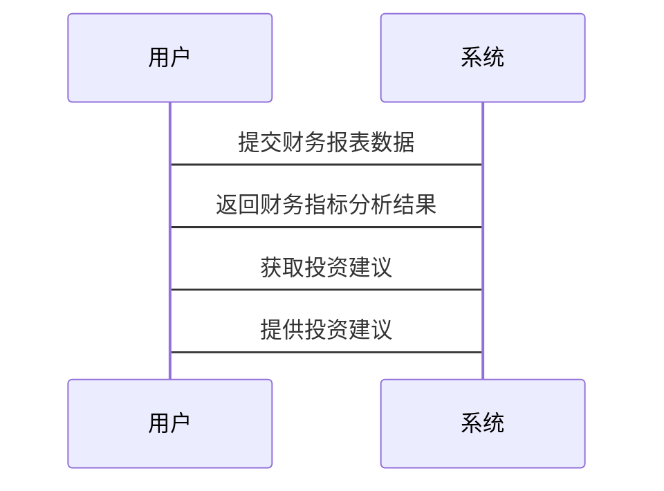

                 


# 大卫·德雷曼的资产负债表价值投资：深入分析财务状况

---

## 关键词：  
价值投资、资产负债表、财务分析、大卫·德雷曼、投资策略、财务指标、投资组合

---

## 摘要：  
本文深入探讨了大卫·德雷曼的资产负债表价值投资方法，分析其背后的财务逻辑与投资策略。通过详细解读资产负债表的核心要素，结合实际案例，揭示如何通过财务指标筛选优质企业，构建稳健的投资组合。文章内容涵盖价值投资的基本概念、资产负债表分析方法、财务指标筛选策略、系统架构设计以及实战案例，为投资者提供全面的理论与实践指导。

---

## 正文：

### 第一部分：价值投资与资产负债表分析基础

#### 第1章：价值投资概述

##### 1.1 价值投资的基本概念

###### 1.1.1 价值投资的定义与核心理念  
价值投资是一种以企业内在价值为核心的投资策略，强调通过分析企业的财务状况、行业地位和竞争优势，寻找市场价格低于内在价值的股票进行投资。其核心理念是“买便宜的”，而非“买涨的”。  

###### 1.1.2 价值投资与其它投资策略的区别  
与趋势投资、技术分析等短期交易策略不同，价值投资注重长期视角，关注企业的基本面，追求安全边际和长期收益。  

###### 1.1.3 价值投资的历史与发展  
价值投资起源于20世纪初，以本杰明·格雷厄姆和大卫·德雷曼为代表，经过数十年的发展，不断完善其理论和实践方法，成为投资领域的重要流派之一。  

##### 1.2 资产负债表在价值投资中的重要性  

###### 1.2.1 资产负债表的定义与结构  
资产负债表是反映企业在某一特定时点的财务状况的报表，主要包括资产、负债和所有者权益三大部分。  

| 资产       | 负债       | 所有者权益 |
|------------|------------|------------|
| 流动资产    | 流动负债    | 实收资本   |
| 长期资产    | 长期负债    | 盈余公积   |
| 总资产      | 总负债      | 净资产     |

###### 1.2.2 资产负债表在价值投资中的作用  
通过分析资产负债表，投资者可以评估企业的财务健康状况，识别潜在风险，判断企业的核心竞争力和成长能力。  

###### 1.2.3 如何通过资产负债表评估企业财务状况  
- 分析流动资产与流动负债的比例，判断企业的短期偿债能力。  
- 评估长期资产与长期负债的匹配性，判断企业的长期财务压力。  
- 关注所有者权益的变化，了解企业的资本结构和股东价值。  

#### 第2章：大卫·德雷曼的投资理念

##### 2.1 大卫·德雷曼的生平与投资风格

###### 2.1.1 大卫·德雷曼的背景介绍  
大卫·德雷曼是价值投资领域的知名投资者，以其独特的资产负债表分析方法闻名。他的投资理念强调对企业基本面的深入研究，尤其是对资产负债表的细致分析。  

###### 2.1.2 其他投资者对他的影响  
德雷曼深受本杰明·格雷厄姆的影响，但他在实践中进一步完善了价值投资的方法，形成了自己的独特风格。  

###### 2.1.3 他的投资风格与特点  
德雷曼的投资风格以稳健著称，他注重企业的财务健康、盈利能力和成长潜力，偏好那些市场价格低于内在价值的企业。  

##### 2.2 德雷曼的资产负债表分析法

###### 2.2.1 资产负债表分析的核心要素  
德雷曼的分析方法注重以下关键要素：  
1. **流动资产与流动负债的比例**：评估企业的短期偿债能力。  
2. **长期资产与长期负债的匹配性**：判断企业的长期财务压力。  
3. **所有者权益的变化**：了解企业的资本结构和股东价值。  

###### 2.2.2 如何识别财务报表中的问题  
德雷曼通过分析资产负债表中的关键指标，识别潜在风险，例如：  
- 过高的应收账款比例可能表明企业存在回收风险。  
- 过高的短期负债可能增加企业的流动性压力。  

###### 2.2.3 资产负债表分析的步骤与方法  
德雷曼的资产负债表分析步骤如下：  
1. **收集财务报表**：获取企业的资产负债表、利润表和现金流量表。  
2. **计算关键财务指标**：如流动比率、速动比率、负债率等。  
3. **对比分析**：将企业的财务指标与行业平均水平或竞争对手进行对比。  
4. **综合判断**：结合企业的发展阶段和行业特点，评估其财务健康状况。  

---

### 第二部分：资产负债表分析的核心方法

#### 第3章：资产负债表分析的基本方法

##### 3.1 资产负债表的结构与解读

###### 3.1.1 资产、负债与所有者权益的构成  
- **资产**：企业拥有的资源，包括流动资产、长期资产和无形资产。  
- **负债**：企业的债务，包括流动负债、长期负债和或有负债。  
- **所有者权益**：企业的净资产，包括实收资本、盈余公积和未分配利润。  

###### 3.1.2 资产负债表的阅读与理解  
通过阅读资产负债表，投资者可以了解企业的资产构成、负债情况以及所有者权益的变化。  

###### 3.1.3 关键财务指标的计算与分析  
以下是关键财务指标的计算公式及作用：  

- **流动比率**：流动资产 / 流动负债  
  - 用于评估企业的短期偿债能力。  
- **速动比率**：（流动资产 - 存货） / 流动负债  
  - 更加严格的衡量企业短期偿债能力。  
- **负债比率**：总负债 / 总资产  
  - 用于判断企业的杠杆风险。  

##### 3.2 财务比率分析

###### 3.2.1 流动比率与速动比率  
- **流动比率**：反映企业短期偿债能力，一般认为2:1是较为安全的水平。  
- **速动比率**：进一步剔除存货的影响，更能准确反映企业的现金支付能力。  

###### 3.2.2 负债比率与杠杆比率  
- **负债比率**：总负债 / 总资产  
  - 比率越高，企业的杠杆风险越大。  
- **杠杆比率**：长期负债 / 所有者权益  
  - 反映企业使用杠杆的程度，过高杠杆可能导致财务危机。  

###### 3.2.3 资产回报率与股东权益回报率  
- **资产回报率（ROA）**：净利润 / 平均总资产  
  - 衡量企业资产的使用效率。  
- **股东权益回报率（ROE）**：净利润 / 平均股东权益  
  - 衡量企业股东资金的使用效率。  

#### 第4章：德雷曼的财务指标筛选法

##### 4.1 财务指标的分类与筛选标准

###### 4.1.1 收益能力指标  
- **净利润率**：净利润 / 营业收入  
  - 反映企业的盈利能力。  
- **毛利率**：（营业收入 - 营业成本） / 营业收入  
  - 衡量企业的成本控制能力。  

###### 4.1.2 营运能力指标  
- **存货周转率**：营业成本 / 平均存货  
  - 衡量企业存货管理效率。  
- **应收账款周转率**：营业收入 / 平均应收账款  
  - 反映企业应收账款的回收效率。  

###### 4.1.3 偿债能力指标  
- **流动比率**：流动资产 / 流动负债  
  - 衡量企业的短期偿债能力。  
- **速动比率**：（流动资产 - 存货） / 流动负债  
  - 更加严格地衡量企业短期偿债能力。  

##### 4.2 财务指标的综合分析

###### 4.2.1 如何避免单一指标的误导  
- **全面性**：结合多个财务指标，避免单一指标的片面性。  
- **行业差异**：考虑行业特点，避免简单对比不同行业的企业。  

###### 4.2.2 财务指标的权重分配  
- 根据企业所处的行业和经营阶段，合理分配各项指标的权重。例如，对于成长型企业，可以适当提高收益能力指标的权重。  

###### 4.2.3 综合评分法在投资决策中的应用  
- **综合评分法**：根据各项指标的表现，对企业的财务状况进行评分，最终得出综合评分。  
- **投资决策**：根据综合评分，筛选出符合投资标准的企业。  

---

### 第三部分：系统分析与架构设计

#### 第5章：系统分析与架构设计

##### 5.1 问题场景介绍  
投资者需要一个系统化的工具，帮助他们快速分析企业的财务报表，评估其财务健康状况，并筛选出符合投资标准的企业。  

##### 5.2 系统功能设计

###### 5.2.1 领域模型（Mermaid 类图）  


##### 5.3 系统架构设计

###### 5.3.1 系统架构图（Mermaid 架构图）  


##### 5.4 系统接口设计  
- **输入接口**：接收企业的财务报表数据。  
- **输出接口**：提供财务指标分析结果和投资建议。  

##### 5.5 系统交互流程（Mermaid 序列图）  


---

### 第四部分：项目实战

#### 第6章：项目实战

##### 6.1 环境安装与配置  
- 安装Python和相关库（如Pandas、NumPy、Matplotlib）。  
- 配置数据源（如企业财务报表数据）。  

##### 6.2 核心实现代码

###### 6.2.1 数据处理代码  
```python
import pandas as pd

# 读取财务报表数据
df = pd.read_excel('financial_statements.xlsx')

# 计算流动比率
current_assets = df['流动资产'].sum()
current_liabilities = df['流动负债'].sum()
current_ratio = current_assets / current_liabilities

# 计算速动比率
quick_assets = current_assets - df['存货'].sum()
quick_ratio = quick_assets / current_liabilities

# 输出结果
print(f"流动比率：{current_ratio:.2f}")
print(f"速动比率：{quick_ratio:.2f}")
```

###### 6.2.2 投资决策代码  
```python
def calculate_score(current_ratio, quick_ratio, roe):
    score = 0
    if current_ratio > 2:
        score += 2
    if quick_ratio > 1:
        score += 2
    if roe > 15:
        score += 2
    return score

# 示例数据
current_ratio = 2.5
quick_ratio = 1.8
roe = 18

score = calculate_score(current_ratio, quick_ratio, roe)
print(f"综合评分：{score}")
```

##### 6.3 实际案例分析  
以某制造企业为例，分析其资产负债表，计算各项财务指标，并根据评分结果提出投资建议。  

---

### 第五部分：结论与展望

#### 第7章：结论与展望

##### 7.1 小结  
通过分析资产负债表，投资者可以更好地评估企业的财务健康状况，识别潜在风险，并做出明智的投资决策。德雷曼的分析方法为价值投资提供了重要的理论和实践指导。  

##### 7.2 注意事项  
- 投资者需结合企业的行业特点和经营环境，灵活调整分析方法。  
- 财务分析只是投资决策的一部分，还需结合企业战略、管理团队等因素。  

##### 7.3 拓展阅读  
- 《投资最重要的简单真理》——本杰明·格雷厄姆  
- 《投资之道》——彼得·林奇  

---

## 作者简介  
作者简介：一位拥有多年投资经验的技术专家，擅长将技术分析与投资策略相结合，致力于为投资者提供实用的分析工具和方法论。  

--- 

**（注：以上文章内容为示例，实际撰写时需要结合具体案例和详细数据进行补充和完善）**

