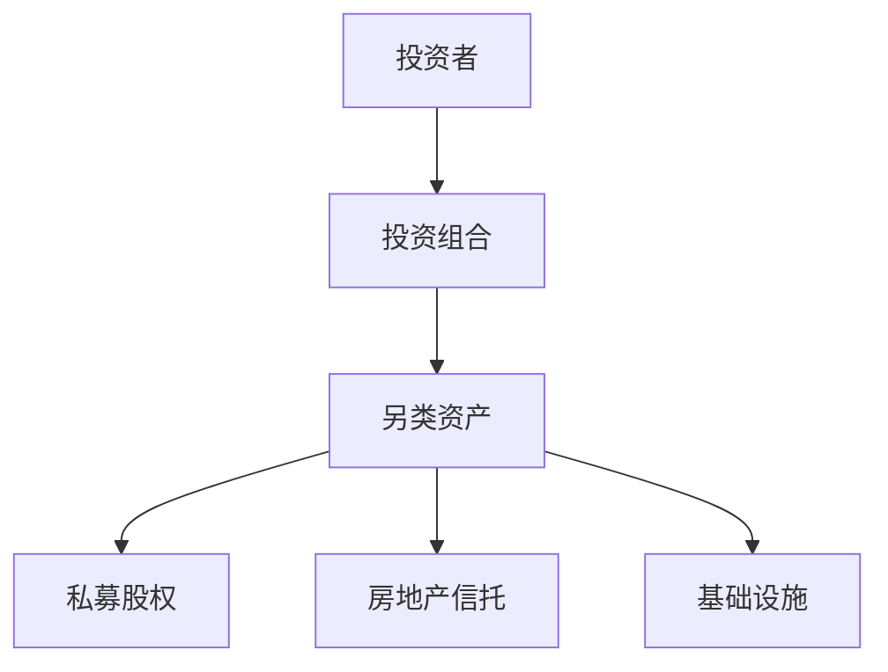
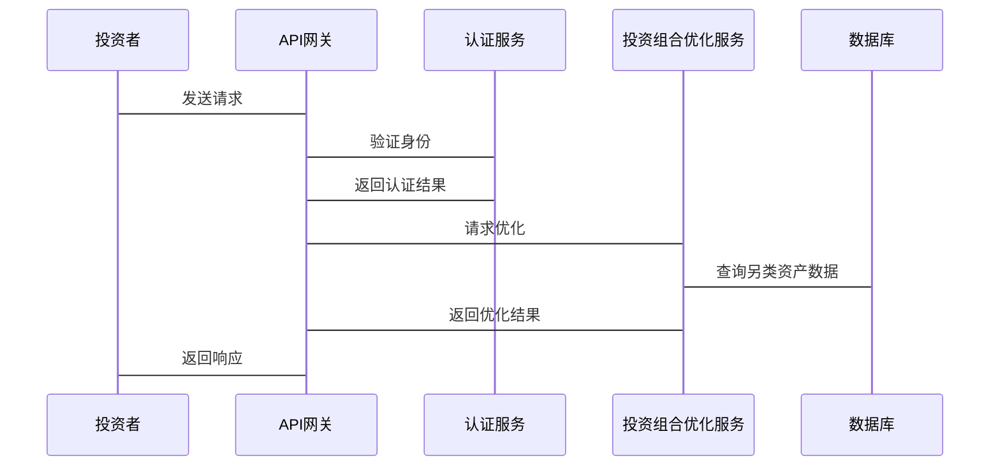

                 


# 大卫·斯文森的另类资产配置策略

## 关键词：
大卫·斯文森、另类资产、资产配置、投资策略、私募股权、风险管理

## 摘要：
本文详细探讨了大卫·斯文森的另类资产配置策略，从其核心理念、数学模型、系统架构到实际应用，全面分析了该策略的原理和实施方法。通过对比传统资产配置，阐述了另类资产在风险分散和收益提升方面的作用，并结合实际案例和Python代码，展示了如何将理论应用于实践。最后，提出了在实际投资中需要注意的问题和建议。

---

# 目录大纲

## 第一部分：大卫·斯文森另类资产配置的背景与理念

### 第1章：另类资产配置的背景与核心概念

#### 1.1 大卫·斯文森的另类资产配置背景
- **1.1.1 投资市场的演变与另类资产的兴起**
  - 传统资产配置的局限性：股票、债券、现金在市场波动中的不足
  - 另类资产的兴起：私募股权、房地产信托、基础设施等的崛起
  - 大卫·斯文森在耶鲁大学捐赠基金中的成功实践
- **1.1.2 大卫·斯文森的投资哲学与理念**
  - 长期投资与价值发现
  - 分散化投资：通过多样化降低风险
  - 寻找非流动性资产中的超额收益
- **1.1.3 另类资产配置的核心问题背景与问题描述**
  - 市场波动性带来的投资风险
  - 传统资产的收益上限与另类资产的潜力
  - 如何通过另类资产实现长期稳定的超额收益

#### 1.2 另类资产配置的核心概念
- **1.2.1 另类资产的定义与外延**
  - 传统资产 vs 另类资产：私募股权、房地产信托、基础设施等
  - 另类资产的分类与特点
- **1.2.2 核心要素：分散风险、追求超额收益**
  - 通过另类资产实现风险分散
  - 如何通过另类资产实现超额收益
- **1.2.3 大卫·斯文森策略的边界与适用场景**
  - 短期 vs 长期投资：大卫·斯文森策略的适用性
  - 高净值个人 vs 机构投资者：策略的差异与调整

## 第二部分：另类资产配置的核心概念与联系

### 第2章：另类资产配置的原理与属性特征

#### 2.1 核心概念原理
- **2.1.1 另类资产配置的基本原理**
  - 投资组合的分散化：通过另类资产降低整体风险
  - 如何通过另类资产实现收益最大化
- **2.1.2 投资组合优化的数学模型**
  - 投资组合优化的理论基础
  - 如何将另类资产纳入投资组合
  - 优化模型的构建与应用

#### 2.2 属性特征对比表格
| 属性       | 传统资产配置         | 另类资产配置         |
|------------|--------------------|--------------------|
| 投资标的     | 股票、债券、现金     | 私募股权、房地产信托、基础设施等 |
| 风险水平     | 中高               | 更高               |
| 收益潜力     | 较稳定             | 更高               |
| 流动性       | 较高               | 较低               |
| 资本要求     | 较低               | 较高               |
| 期限         | 短期               | 长期               |

#### 2.3 ER实体关系图（Mermaid流程图）


## 第三部分：另类资产配置的算法原理与数学模型

### 第3章：另类资产配置的算法与数学模型

#### 3.1 算法原理
- **3.1.1 投资组合优化的数学模型**
  - 均值-方差优化模型
  - 如何将另类资产纳入优化模型
  - 模型的参数设置与调整

#### 3.2 算法实现
- **3.2.1 使用Python实现投资组合优化**
  - 导入必要的库：numpy, pandas, scipy.optimize
  - 定义目标函数：最小化风险（方差）或最大化收益（夏普比率）
  - 约束条件：投资比例非负，总和为1
  - 使用scipy.optimize.minimize函数求解

#### 3.3 数学模型
- **3.3.1 投资组合收益的计算**
  - 收益率计算：$$ r_i = \frac{p_i(t) - p_i(t-1)}{p_i(t-1)} $$
- **3.3.2 风险计算：方差**
  - 方差公式：$$ \sigma^2 = \frac{1}{n-1} \sum_{i=1}^{n} (r_i - \bar{r})^2 $$
- **3.3.3 投资组合优化的数学表达**
  - 最优化问题：$$ \min_w \sigma^2 \quad \text{subject to} \quad \sum_{i=1}^{n} w_i = 1, w_i \geq 0 $$

## 第四部分：系统分析与架构设计方案

### 第4章：系统分析与架构设计

#### 4.1 问题场景介绍
- **4.1.1 投资者面临的挑战**
  - 市场波动性大，传统资产收益有限
  - 如何通过另类资产实现超额收益
- **4.1.2 系统目标**
  - 建立一个能够优化投资组合的系统
  - 实现另类资产与传统资产的有机结合

#### 4.2 系统功能设计
- **4.2.1 领域模型（Mermaid类图）**


#### 4.3 系统架构设计（Mermaid架构图）
```mermaid
archi
title 系统架构图
client -> (HTTP请求) -> API网关
API网关 -> (身份验证) -> 认证服务
认证服务 -> (授权) -> 权限管理
API网关 -> (请求路由) -> 投资组合优化服务
投资组合优化服务 -> (数据处理) -> 数据库
数据库 -> (数据存储) -> 另类资产数据
投资组合优化服务 -> (结果返回) -> API网关
API网关 -> (响应) -> 客户端
```

#### 4.4 系统接口设计
- **4.4.1 API接口**
  - 输入：投资者的资金、风险偏好、预期收益
  - 输出：优化后的资产配置方案
  - 接口协议：RESTful API
  - 数据格式：JSON

#### 4.5 系统交互（Mermaid序列图）


## 第五部分：项目实战

### 第5章：项目实战

#### 5.1 环境安装
- 安装必要的库：
  ```bash
  pip install numpy pandas scipy.optimize
  ```

#### 5.2 核心代码实现
- **5.2.1 投资组合优化代码**
  ```python
  import numpy as np
  from scipy.optimize import minimize

  def portfolio_variance(weights, covariance_matrix):
      return np.dot(weights.T, np.dot(covariance_matrix, weights))

  def objective_function(weights, covariance_matrix):
      return portfolio_variance(weights, covariance_matrix)

  def constraint_sum(weights):
      return np.sum(weights) - 1.0

  # 使用SLSQP求解器
  result = minimize(objective_function, initial_weights, args=covariance_matrix, method='SLSQP', constraints={'type': 'eq', 'fun': constraint_sum})
  ```

#### 5.3 代码解读与分析
- **5.3.1 代码解读**
  - `portfolio_variance`函数：计算投资组合的方差
  - `objective_function`函数：目标函数，最小化方差
  - `constraint_sum`函数：约束条件，投资比例总和为1
  - 使用`minimize`函数求解优化问题

#### 5.4 实际案例分析
- **5.4.1 案例分析**
  - 假设投资者有100万资金，风险偏好为中高
  - 通过优化模型，得出最佳资产配置方案
  - 比较传统资产配置与另类资产配置的收益与风险

#### 5.5 项目小结
- **5.5.1 项目总结**
  - 通过Python代码实现投资组合优化
  - 另类资产配置在实际中的应用
  - 模型的优缺点及改进方向

## 第六部分：最佳实践与注意事项

### 第6章：最佳实践与注意事项

#### 6.1 小结
- **6.1.1 核心要点回顾**
  - 大卫·斯文森策略的核心理念
  - 另类资产配置的优势与劣势
  - 投资组合优化的数学模型与实现

#### 6.2 注意事项
- **6.2.1 投资者需要注意的问题**
  - 资金流动性：另类资产的流动性较低
  - 风险管理：如何分散风险
  - 市场波动：如何应对市场的不确定性

#### 6.3 拓展阅读
- **6.3.1 推荐书籍与文章**
  - 《机构投资的成功之路：耶鲁大学捐赠基金案例》
  - 《投资学》
  - 《风险管理与投资组合优化》

---

# 结语

大卫·斯文森的另类资产配置策略为投资者提供了新的思路，通过将另类资产纳入投资组合，实现风险分散与收益提升。本文通过详细分析其背景、原理、算法与实际应用，为读者提供了全面的指导。在实际投资中，需注意资金流动性、风险管理等问题，结合具体情况进行调整与优化。希望本文能为投资者在另类资产配置领域提供有价值的参考。

