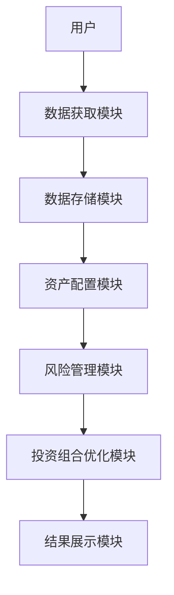

                 


# 《大卫·斯文森的基金会投资模式：长期价值投资的典范》

## 关键词：大卫·斯文森，基金会投资，长期价值投资，资产配置，风险管理，投资组合优化，系统架构设计

## 摘要：大卫·斯文森是全球著名的投资专家，他的基金会投资模式以长期价值投资为核心，强调资产配置和风险管理。本文将详细分析斯文森的投资理念、策略、风险管理方法，以及如何通过数学模型和系统架构设计实现投资目标。通过实际案例和系统设计，展示如何在实践中应用斯文森的基金会投资模式。

---

## 第一章: 大卫·斯文森及其投资模式背景介绍

### 1.1 大卫·斯文森的生平与成就

#### 1.1.1 斯文森的教育与职业背景
- 斯文森在耶鲁大学获得经济学学士和硕士学位。
- 他在耶鲁大学捐赠基金的管理中取得了卓越成绩，使其成为全球最大的大学捐赠基金之一。

#### 1.1.2 斯文森在耶鲁大学的影响力
- 他如何通过长期价值投资策略使捐赠基金实现稳健增长。
- 他的投资理念对全球机构投资者的影响。

### 1.2 基金会投资模式的背景

#### 1.2.1 基金会投资的基本概念
- 基金会的定义及其投资目标。
- 基金会投资与个人投资的区别。

#### 1.2.2 美国基金会投资的历史发展
- 历史背景：从早期的保守投资到现代的多样化投资。
- 大卫·斯文森如何推动这一变革。

### 1.3 斯文森投资模式的核心理念

#### 1.3.1 长期价值投资的定义
- 长期投资与短期投资的对比。
- 价值投资的核心要素。

#### 1.3.2 基金会投资的独特性
- 资金的长期性与稳定性。
- 投资目标与风险承受能力的匹配。

---

## 第二章: 资产配置与投资策略

### 2.1 资产配置的基本原理

#### 2.1.1 不同资产类别的风险与收益
- 股票、债券、房地产、私募股权等资产的风险收益特征。
- 资产多样化的原理与效果。

#### 2.1.2 资产配置的动态调整
- 如何根据市场变化调整资产配置。
- 动态再平衡的策略与实施。

### 2.2 斯文森的长期投资策略

#### 2.2.1 长期投资的核心要素
- 长期视角下的资产配置策略。
- 如何在长期投资中平衡风险与收益。

#### 2.2.2 资产配置的数学模型
- 使用数学模型分析资产配置的最优解。
- 通过公式计算不同资产的权重。

---

## 第三章: 风险管理与投资组合优化

### 3.1 风险管理的理论与实践

#### 3.1.1 风险的定义与分类
- 市场风险、流动性风险、信用风险等。
- 如何量化不同风险的大小。

#### 3.1.2 风险管理的目标与方法
- 风险最小化与收益最大化的平衡。
- 如何通过分散投资降低风险。

### 3.2 斯文森的风险管理策略

#### 3.2.1 投资组合的风险分析
- 如何评估投资组合的整体风险。
- 风险指标（如VaR、CVaR）的计算方法。

#### 3.2.2 风险调整后的收益评估
- 如何在考虑风险的情况下评估收益。
- 风险调整后的收益模型。

---

## 第四章: 投资组合优化的数学模型

### 4.1 数学模型的建立

#### 4.1.1 资产配置的优化问题
- 优化目标：最大化收益，最小化风险。
- 约束条件：资金分配、风险承受能力等。

#### 4.1.2 使用Python实现投资组合优化
- 使用Python的优化库（如scipy.optimize）进行投资组合优化。
- 代码示例：
  ```python
  import numpy as np
  from scipy.optimize import minimize
  
  # 假设mu为资产期望收益，cov为协方差矩阵
  def portfolio_return(weights, mu):
      return np.dot(weights.T, mu)
  
  def portfolio_risk(weights, cov):
      return np.sqrt(weights.T @ cov @ weights)
  
  # 最小化风险，约束条件：sum(weights) = 1
  def optimize_portfolio(mu, cov):
      n = len(mu)
      constraints = [{'type': 'eq', 'fun': lambda w: sum(w) - 1}]
      result = minimize(portfolio_risk, np.ones(n)/n, args=cov, constraints=constraints)
      return result.x
  ```

---

## 第五章: 系统分析与架构设计

### 5.1 系统架构设计

#### 5.1.1 项目介绍
- 系统目标：构建一个基于斯文森投资模式的投资决策系统。
- 系统功能：数据获取、资产配置、风险管理、投资组合优化等。

#### 5.1.2 系统架构的Mermaid图


#### 5.1.3 系统功能模块的详细设计
- 数据获取模块：从市场数据源获取实时数据。
- 数据存储模块：将数据存储在数据库中，便于后续处理。
- 资产配置模块：根据风险偏好进行资产分配。
- 风险管理模块：评估投资组合风险，调整配置。

---

## 第六章: 项目实战

### 6.1 环境安装

#### 6.1.1 安装必要的Python库
- NumPy、Pandas、Matplotlib、scipy.optimize等。

#### 6.1.2 数据源获取
- 从Yahoo Finance获取市场数据。

### 6.2 核心代码实现

#### 6.2.1 资产配置模块的实现
- 使用Python代码实现资产配置的优化。

#### 6.2.2 风险管理模块的实现
- 计算VaR、CVaR等风险指标。

### 6.3 案例分析

#### 6.3.1 实际案例
- 使用斯文森的方法优化一个简单的投资组合。

#### 6.3.2 结果分析
- 对比不同配置下的收益与风险。

---

## 第七章: 总结与展望

### 7.1 总结
- 大卫·斯文森投资模式的核心要素。
- 数学模型与系统架构在投资中的重要性。

### 7.2 展望
- 未来投资模式的发展趋势。
- 如何将新技术（如AI）应用到投资决策中。

---

## 参考文献
1. 大卫·斯文森的著作《机构投资的创新之路》
2. 《投资学》（书籍）
3. 相关学术论文和研究报告

