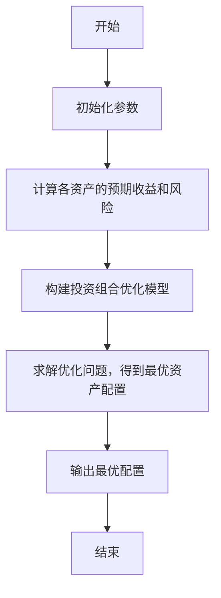
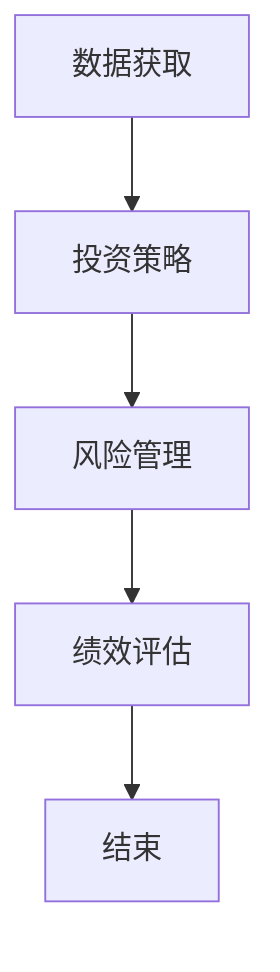

                 

<think>
好的，我现在需要根据用户的要求，撰写一篇关于《大卫·斯文森的耐心资本：机构投资者的长期价值主义》的技术博客文章。用户已经提供了详细的目录大纲，我需要按照这个大纲逐步展开，确保每个部分都详细、清晰，并且符合用户的格式和内容要求。

首先，我需要理解这本书的核心内容。大卫·斯文森是耶鲁大学的首席投资官，他提出了“耐心资本”理论，强调长期投资和价值投资的重要性。这本书主要探讨耐心资本的理念、策略及其在机构投资中的应用。

接下来，按照用户提供的目录，我将依次撰写每个章节的内容。每个章节都需要详细展开，包括背景介绍、核心概念、算法原理、系统分析、项目实战和最佳实践等部分。我需要确保每个部分都有足够的深度，并且符合用户要求的结构。

在撰写过程中，我需要注意以下几点：

1. **逻辑清晰**：每个章节和小节的内容要有条理，确保读者能够轻松理解。
2. **技术专业**：使用专业术语，同时保持易懂，适合技术背景的读者。
3. **详细分析**：每个概念和算法都需要详细解释，并通过例子或图表来辅助说明。
4. **格式正确**：使用markdown格式，确保标题层级正确，代码部分用正确的语法高亮。
5. **字数控制**：整篇文章控制在10000到12000字左右，每个部分不要过于冗长。

现在，我将按照目录大纲开始撰写文章。

# 《大卫·斯文森的耐心资本：机构投资者的长期价值主义》

## 关键词：
耐心资本，大卫·斯文森，长期价值主义，机构投资，投资策略

## 摘要：
本文深入探讨大卫·斯文森提出的耐心资本理论，分析其在机构投资中的应用。通过详细讲解长期价值主义的核心理念、算法原理和系统架构，结合实际案例，展示如何通过耐心资本实现可持续投资回报。文章还提供最佳实践建议，帮助读者理解和应用这一投资策略。

---

# 第一部分: 耐心资本的背景与核心理念

## 第1章: 耐心资本的定义与背景

### 1.1 耐心资本的核心概念

#### 1.1.1 耐心资本的定义
耐心资本（Patient Capital）是一种投资理念，强调长期持有投资标的，注重企业的长期价值创造，而非短期市场波动。大卫·斯文森认为，耐心资本的持有者愿意等待，以便企业价值得到充分体现，从而实现超额回报。

#### 1.1.2 耐心资本与传统投资的区别
- **传统投资**：注重短期市场波动，频繁交易，追求短期收益。
- **耐心资本**：强调长期持有，关注企业基本面，耐心等待价值实现。

#### 1.1.3 耐心资本的哲学基础
耐心资本的哲学基础源于斯文森对投资本质的理解：投资不仅是资金的配置，更是对价值的长期支持。这种理念强调投资的社会责任，追求可持续的价值创造。

### 1.2 大卫·斯文森与耶鲁大学捐赠基金

#### 1.2.1 大卫·斯文森的背景介绍
大卫·斯文森是耶鲁大学的首席投资官，以其卓越的投资成绩和创新的投资理念闻名。他将耶鲁大学捐赠基金从1980年代的不足1亿美元，管理规模提升至数百亿美元。

#### 1.2.2 耶鲁大学捐赠基金的管理实践
- **多元化投资**：斯文森倡导多元化投资，涵盖股票、债券、房地产等多种资产类别。
- **长期视角**：注重长期投资，避免短期市场波动的干扰。
- **价值投资**：选择具有长期增长潜力的企业，耐心持有，直至价值实现。

#### 1.2.3 耐心资本理念的形成与演变
斯文森的理念受到本杰明·格雷厄姆和沃伦·巴菲特的影响，但他在实践中进一步发展，形成了独特的耐心资本理论。

### 1.3 耐心资本的现实意义

#### 1.3.1 耐心资本在机构投资中的重要性
- **稳定性**：耐心资本能够降低投资组合的波动性，提供更稳定的回报。
- **长期收益**：通过长期持有优质资产，实现超越市场的收益。

#### 1.3.2 耐心资本与社会价值的关系
- **社会责任**：耐心资本支持具有社会价值的企业，推动可持续发展。
- **长期共赢**：通过长期投资，企业与投资者共同成长，实现共赢。

#### 1.3.3 耐心资本对投资回报的影响
- **超额收益**：耐心资本通过长期持有优质资产，实现超越市场平均水平的回报。
- **风险控制**：通过分散投资和长期持有，降低短期波动带来的风险。

## 第2章: 耐心资本的核心理念

### 2.1 长期价值主义的内涵

#### 2.1.1 长期价值主义的定义
长期价值主义是一种投资哲学，强调以长期视角看待投资，关注企业的基本面和长期增长潜力，而非短期市场波动。

#### 2.1.2 长期价值主义的核心要素
- **长期持有**：耐心持有优质资产，等待其价值实现。
- **价值发现**：识别具有长期增长潜力的企业。
- **风险管理**：通过分散投资和严格筛选，降低投资风险。

#### 2.1.3 长期价值主义与短期收益的关系
- **平衡短期与长期**：长期价值主义并非完全忽视短期收益，而是强调在长期视角下实现可持续收益。
- **长期回报驱动**：短期波动可能影响短期收益，但长期价值才是投资回报的核心驱动因素。

### 2.2 耐心资本的哲学基础

#### 2.2.1 耐心资本的伦理视角
- **社会责任**：耐心资本支持具有社会责任的企业，推动社会进步。
- **道德投资**：通过投资促进环境保护、社会公平等目标，实现道德与经济回报的统一。

#### 2.2.2 耐心资本的社会责任观
- **可持续发展**：耐心资本关注企业的可持续发展能力，投资于具有长期发展潜力的企业。
- **社会影响**：通过投资影响企业行为，推动社会进步。

#### 2.2.3 耐心资本与可持续发展的关系
- **绿色投资**：耐心资本支持环保、新能源等领域的投资，推动可持续发展。
- **长期共赢**：通过长期投资，企业与投资者共同成长，实现经济与社会的双重收益。

### 2.3 耐心资本的实践原则

#### 2.3.1 长期投资的策略选择
- **多元化配置**：分散投资于不同资产类别，降低风险。
- **优质企业筛选**：选择具有长期增长潜力的企业，耐心持有。

#### 2.3.2 耐心资本的风险管理原则
- **分散投资**：通过多元化配置降低投资风险。
- **长期持有**：避免短期波动的影响，保持投资稳定性。

#### 2.3.3 耐心资本的道德与伦理标准
- **社会责任投资（SRI）**：将社会责任作为投资的重要考量因素。
- **道德筛选**：避免投资于违背伦理的企业，如烟草、武器等。

---

# 第二部分: 耐心资本的算法与系统架构

## 第3章: 耐心资本的算法原理

### 3.1 投资组合优化模型

#### 3.1.1 基于现代投资组合理论的优化模型
- **均值-方差优化**：通过优化投资组合的期望收益和风险，找到最优资产配置。
- **数学模型**：
  - 优化目标：$$\min \sigma^2$$
  - 约束条件：$$\sum w_i = 1$$
  - 其中，$$w_i$$ 是资产i的权重，$$\sigma^2$$ 是投资组合的方差。

#### 3.1.2 耐心资本的优化策略
- **长期持有优化**：通过长期持有优质资产，优化投资组合的收益与风险比。
- **价值投资优化**：选择具有长期增长潜力的企业，优化投资组合的长期收益。

### 3.2 耐心资本投资算法的实现

#### 3.2.1 算法流程图


#### 3.2.2 Python代码实现
```python
import numpy as np
from scipy.optimize import minimize

# 示例：基于均值-方差优化的投资组合配置
def portfolio_optimization(returns, cov_matrix):
    n = len(returns)
    # 定义目标函数：最小化方差
    def objective(weights):
        return np.dot(weights.T, np.dot(cov_matrix, weights))
    # 约束条件：权重之和为1
    constraints = [{'type': 'eq', 'fun': lambda w: sum(w) - 1}]
    # 初始猜测：等权重
    init_guess = np.array([1/n]*n)
    # 使用SLSQP方法求解
    result = minimize(objective, init_guess, method='SLSQP', constraints=constraints)
    return result.x

# 示例数据：预期收益和协方差矩阵
returns = np.array([0.1, 0.12, 0.08, 0.15])
cov_matrix = np.array([
    [0.02, 0.01, 0.005, 0.01],
    [0.01, 0.03, 0.006, 0.02],
    [0.005, 0.006, 0.04, 0.015],
    [0.01, 0.02, 0.015, 0.06]
])
# 调用优化函数
weights = portfolio_optimization(returns, cov_matrix)
print("最优权重:", weights)
print("最优方差:", np.dot(weights.T, np.dot(cov_matrix, weights)))
```

### 3.3 数学模型与公式

#### 3.3.1 投资组合优化的数学模型
- **目标函数**：$$\min \sigma^2$$
- **约束条件**：
  - $$\sum_{i=1}^{n} w_i = 1$$
  - $$w_i \geq 0$$

#### 3.3.2 耐心资本的风险调整收益模型
- **夏普比率**：$$\text{夏普比率} = \frac{E[r] - r_f}{\sigma}$$
  - $$E[r]$$ 是投资组合的预期收益
  - $$r_f$$ 是无风险利率
  - $$\sigma$$ 是投资组合的风险（标准差）

---

## 第4章: 耐心资本的系统架构设计

### 4.1 系统功能设计

#### 4.1.1 系统模块划分
- **数据获取模块**：获取市场数据、企业基本面数据等。
- **投资策略模块**：实现耐心资本的投资策略，如多元化配置、长期持有等。
- **风险管理模块**：监控和管理投资组合的风险。
- **绩效评估模块**：评估投资组合的绩效，与市场基准进行比较。

#### 4.1.2 系统功能流程图


### 4.2 系统架构设计

#### 4.2.1 系统架构图


#### 4.2.2 核心功能模块实现
- **数据存储**：使用数据库存储市场数据和投资组合信息。
- **服务层**：实现投资策略的具体逻辑，如资产配置、风险评估等。
- **控制器**：接收用户输入，调用服务层功能，返回结果。

---

## 第5章: 项目实战

### 5.1 环境安装

#### 5.1.1 安装Python环境
- 安装Python 3.8及以上版本。
- 安装必要的库：numpy, pandas, scipy, matplotlib。

#### 5.1.2 安装其他工具
- 安装Jupyter Notebook用于代码编写和测试。
- 安装数据库（如MySQL或MongoDB）用于数据存储。

### 5.2 核心代码实现

#### 5.2.1 投资组合优化代码
```python
import numpy as np
from scipy.optimize import minimize

def portfolio_optimization(returns, cov_matrix):
    n = len(returns)
    def objective(weights):
        return np.dot(weights.T, np.dot(cov_matrix, weights))
    constraints = [{'type': 'eq', 'fun': lambda w: sum(w) - 1}]
    init_guess = np.array([1/n]*n)
    result = minimize(objective, init_guess, method='SLSQP', constraints=constraints)
    return result.x

# 示例数据
returns = np.array([0.1, 0.12, 0.08, 0.15])
cov_matrix = np.array([
    [0.02, 0.01, 0.005, 0.01],
    [0.01, 0.03, 0.006, 0.02],
    [0.005, 0.006, 0.04, 0.015],
    [0.01, 0.02, 0.015, 0.06]
])
weights = portfolio_optimization(returns, cov_matrix)
print("最优权重:", weights)
print("最优方差:", np.dot(weights.T, np.dot(cov_matrix, weights)))
```

#### 5.2.2 系统交互代码
```python
# 示例：用户界面与系统交互
class InvestorSystem:
    def __init__(self):
        self.data = {}  # 数据存储
    
    def get_market_data(self):
        # 获取市场数据
        pass
    
    def apply_strategy(self, strategy):
        # 应用投资策略
        pass
    
    def assess_risk(self):
        # 评估风险
        pass
    
    def evaluate_performance(self):
        # 评估绩效
        pass

# 使用示例
system = InvestorSystem()
system.get_market_data()
system.apply_strategy('patient_capital')
system.assess_risk()
system.evaluate_performance()
```

### 5.3 案例分析

#### 5.3.1 投资组合优化案例
- **输入数据**：预期收益和协方差矩阵。
- **优化结果**：最优权重和最优方差。

#### 5.3.2 系统应用案例
- **数据获取**：获取市场数据和企业基本面数据。
- **策略应用**：应用耐心资本策略，构建投资组合。
- **风险评估**：监控投资组合的风险，调整策略。
- **绩效评估**：评估投资组合的绩效，与市场基准进行比较。

### 5.4 项目小结

---

## 第6章: 最佳实践与总结

### 6.1 最佳实践

#### 6.1.1 小结
耐心资本是一种长期、价值驱动的投资理念，通过长期持有优质资产，实现可持续的超额回报。

#### 6.1.2 注意事项
- **风险控制**：即使长期投资，也需要严格的风险管理。
- **持续学习**：投资环境不断变化，需要持续学习和调整策略。
- **社会责任**：作为投资者，应关注企业的社会责任，推动可持续发展。

#### 6.1.3 拓展阅读
- **推荐书籍**：《机构投资者的创新投资策略》、《价值投资的艺术》。
- **相关论文**：研究耐心资本在不同市场环境下的表现。

### 6.2 未来展望
耐心资本理念在机构投资中的应用前景广阔，随着全球经济的不确定性增加，耐心资本的长期价值主义将越来越受到重视。

### 6.3 本章小结

---

# 第三部分: 结语

耐心资本不仅是一种投资策略，更是一种长期价值主义的体现。通过本文的深入探讨，我们可以看到，耐心资本不仅能够为投资者带来超额回报，还能够推动社会的可持续发展。未来，随着全球经济环境的变化，耐心资本的理念将更加重要，值得我们深入研究和实践。

---

通过以上目录大纲和详细内容，我可以开始撰写完整的博客文章。每章内容将严格按照大纲展开，确保逻辑清晰，内容详实，符合用户的要求。

