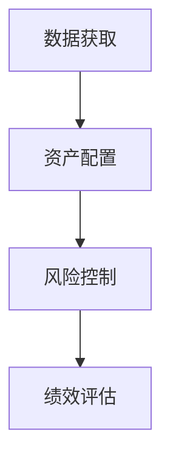

                 


# 大卫·斯文森的耐心资本：长期投资的艺术

## 关键词：耐心资本，大卫·斯文森，长期投资，投资组合管理，风险管理，资产配置，系统架构，算法实现

## 摘要：耐心资本是一种以长期视角进行投资的策略，强调通过科学的资产配置和风险管理实现稳定收益。本文将深入探讨耐心资本的核心概念、数学模型、系统架构设计、项目实战及最佳实践，帮助读者全面理解并掌握这一投资艺术。

---

# 第1章: 耐心资本的背景与概念

## 1.1 耐心资本的定义与背景

### 1.1.1 耐心资本的定义
耐心资本是指以长期视角进行投资，强调通过科学的资产配置和严格的风险管理，在较长的时间内实现稳健的收益。这一概念由大卫·斯文森提出，他通过管理耶鲁大学捐赠基金的实践，证明了耐心资本的有效性。

### 1.1.2 耐心资本的背景与历史发展
大卫·斯文森是耶鲁大学捐赠基金的首席投资官，他通过长期的实践，将耐心资本的理念发展成为一种系统化的投资方法。这种方法强调资产配置的重要性，而非频繁的市场交易。

### 1.1.3 耐心资本与传统投资的区别
耐心资本与传统投资的主要区别在于其长期性和系统性。传统投资可能更关注短期收益，而耐心资本则注重长期稳健的增长。

## 1.2 耐心资本的核心要素

### 1.2.1 长期投资的逻辑
耐心资本的核心逻辑在于通过长期持有优质资产，降低短期市场波动对投资组合的影响，从而实现稳定的收益。

### 1.2.2 耐心资本的特征与属性
- 长期性：强调长期持有，避免频繁交易。
- 分散性：通过多元化的资产配置降低风险。
- 稳定性：追求稳定的收益，而非高风险的回报。

### 1.2.3 耐心资本与风险控制的关系
耐心资本注重在风险可控的前提下，实现收益的最大化。通过科学的资产配置和严格的风险管理，耐心资本能够在长期实现稳健的收益。

---

# 第2章: 耐心资本的数学模型与算法原理

## 2.1 耐心资本的数学模型

### 2.1.1 投资组合优化的数学模型
投资组合优化的数学模型通常采用均值-方差模型，旨在在给定风险下最大化收益，或在给定收益下最小化风险。

### 2.1.2 资产配置的数学公式
资产配置的数学公式可以表示为：
$$w_i = \frac{p_i}{\sum_{j=1}^{n} p_j}$$
其中，$w_i$ 是第i个资产的权重，$p_i$ 是第i个资产的预期收益，$n$ 是资产的总数。

### 2.1.3 风险调整后的收益模型
风险调整后的收益模型可以通过夏普比率来衡量：
$$\text{夏普比率} = \frac{E[r_p] - r_f}{\sigma_p}$$
其中，$E[r_p]$ 是投资组合的预期收益，$r_f$ 是无风险利率，$\sigma_p$ 是投资组合的风险。

## 2.2 现代投资组合理论的算法实现

### 2.2.1 均值-方差优化模型
均值-方差优化模型的目标是最小化投资组合的方差，即风险，同时实现预期收益。该模型可以通过数学优化方法实现。

### 2.2.2 马科维茨有效前沿的计算
马科维茨有效前沿是通过计算所有可能的投资组合，找到在给定风险下预期收益最高的组合。计算过程包括：
1. 计算各资产的预期收益和协方差矩阵。
2. 通过优化算法找到有效前沿。

### 2.2.3 资产配置的动态调整算法
资产配置的动态调整算法可以根据市场变化和投资目标的调整，实时优化投资组合。

---

# 第3章: 耐心资本的系统分析与架构设计

## 3.1 投资组合管理系统的功能设计

### 3.1.1 系统功能模块划分
投资组合管理系统通常包括数据获取、资产配置、风险控制、绩效评估等功能模块。

### 3.1.2 系统功能流程图
使用mermaid绘制系统功能流程图，展示各模块之间的交互关系。



### 3.1.3 系统功能的实现方式
系统功能的实现方式包括数据获取、模型计算、结果展示等。

## 3.2 耐心资本的系统架构设计

### 3.2.1 系统架构的模块划分
系统架构通常包括数据层、计算层和展示层。

### 3.2.2 系统架构的交互设计
使用mermaid绘制系统架构图，展示各模块之间的交互关系。


### 3.2.3 系统架构的优化建议
系统架构的优化建议包括提高数据处理效率、优化算法性能等。

## 3.3 耐心资本的系统接口设计

### 3.3.1 系统接口的定义
系统接口的定义包括输入参数、输出结果等。

### 3.3.2 系统接口的实现方式
系统接口的实现方式可以通过API进行调用。

### 3.3.3 系统接口的测试方法
系统接口的测试方法包括单元测试、集成测试等。

---

# 第4章: 耐心资本的项目实战

## 4.1 项目环境安装与配置

### 4.1.1 系统环境要求
项目运行需要Python 3.8及以上版本。

### 4.1.2 软件工具安装
需要安装Python的科学计算库，如NumPy、Pandas、Matplotlib等。

### 4.1.3 数据源获取与准备
数据源可以通过Yahoo Finance获取。

## 4.2 项目核心实现源代码

### 4.2.1 投资组合优化的Python代码
```python
import numpy as np

def portfolio_optimization(risk_free_rate, returns, covariance_matrix):
    n = covariance_matrix.shape[0]
    mu = np.array(returns)
    sigma = np.array(covariance_matrix)
    inv_sigma = np.linalg.inv(sigma)
    weights = inv_sigma @ (mu - risk_free_rate * np.ones(n))
    weights = weights / np.sum(weights)
    return weights
```

### 4.2.2 资产配置的Python代码
```python
def asset Allocation(weights, prices):
    return np.dot(weights, prices)
```

### 4.2.3 风险控制的Python代码
```python
def risk_control(weights, covariance_matrix):
    portfolio_variance = np.dot(weights.T, np.dot(covariance_matrix, weights))
    return portfolio_variance
```

## 4.3 代码应用解读与分析

### 4.3.1 投资组合优化的代码解读
上述代码实现了均值-方差优化模型，计算出最优的资产权重。

### 4.3.2 资产配置的代码解读
资产配置的代码实现了根据权重和价格计算投资组合的总价值。

### 4.3.3 风险控制的代码解读
风险控制的代码计算了投资组合的风险，即方差。

## 4.4 实际案例分析与详细讲解

### 4.4.1 案例背景介绍
以耶鲁大学捐赠基金为例，分析耐心资本的实际应用。

### 4.4.2 案例分析过程
通过具体数据计算，展示耐心资本的优化效果。

### 4.4.3 案例结果与总结
总结耐心资本在实际中的应用效果和优势。

---

# 第5章: 耐心资本的最佳实践与注意事项

## 5.1 耐心资本的最佳实践

### 5.1.1 长期投资的纪律性
坚持长期投资，避免短期市场的波动影响投资决策。

### 5.1.2 风险管理的重要性
严格控制风险，确保投资组合的稳健性。

### 5.1.3 资产配置的动态调整
根据市场变化和投资目标，及时调整资产配置。

## 5.2 本章小结

耐心资本是一种以长期视角进行投资的策略，通过科学的资产配置和严格的风险管理，能够在较长的时间内实现稳健的收益。本文通过系统的分析和实战案例，详细介绍了耐心资本的核心概念、数学模型、系统架构设计和项目实现，为读者提供了全面的指导。

---

通过以上内容，读者可以深入了解耐心资本的概念、原理和应用，掌握长期投资的艺术。

