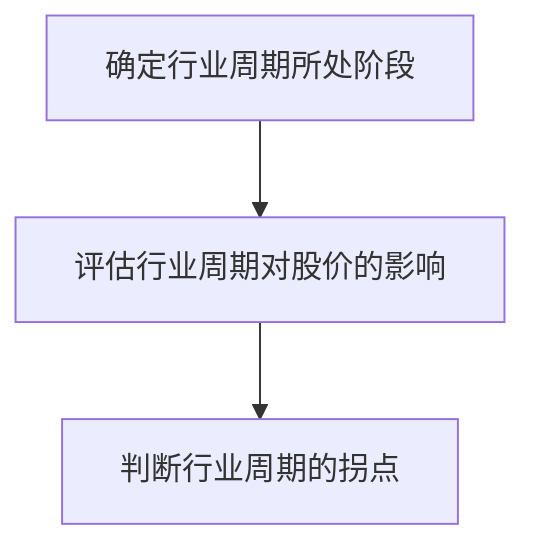

                 

# 大卫·温特斯的周期性价值投资：把握行业起落节奏

## 关键词
- 周期性价值投资
- 行业周期
- 经济周期
- 大卫·温特斯
- 投资策略

## 摘要
周期性价值投资是一种结合经济周期和行业周期分析的投资策略，通过识别行业周期的波动规律，把握投资机会。本文将深入探讨大卫·温特斯的周期性价值投资方法，分析其核心概念、工具、策略，并通过实例说明如何在实际投资中应用这些方法。

---

## 第一部分: 周期性价值投资的背景与核心概念

### 第1章: 周期性价值投资的定义与重要性

#### 1.1 什么是周期性价值投资
周期性价值投资是一种结合经济周期和行业周期分析的价值投资策略。它通过分析行业周期的波动，找到在特定周期阶段中具有投资价值的资产。

**周期性价值投资的核心要素：**
- 经济周期的阶段分析
- 行业周期的波动规律
- 估值指标与周期性行业的匹配

**周期性价值投资与传统价值投资的区别：**
- 传统价值投资注重长期基本面分析，周期性价值投资则强调周期性行业的波动性。
- 传统价值投资较为静态，周期性价值投资动态调整投资策略。

#### 1.2 周期性价值投资的重要性
周期性价值投资的重要性体现在以下几个方面：
1. **经济周期对投资的影响：** 经济周期的波动直接影响市场的整体表现，投资者需要根据经济周期调整投资策略。
2. **行业周期对投资决策的指导作用：** 不同行业在经济周期中的表现差异显著，周期性价值投资能够帮助投资者选择在特定周期阶段中表现优异的行业。
3. **把握行业起落节奏的意义：** 通过分析行业周期，投资者可以在行业低谷时买入，在行业高点时卖出，从而实现超额收益。

---

### 第2章: 经济周期与行业周期的基础知识

#### 2.1 经济周期的定义与阶段划分
经济周期是指经济活动的波动，通常分为四个阶段：衰退、复苏、过热和滞胀。

**经济周期的阶段划分：**
1. **衰退阶段：** 经济增长放缓，企业盈利下降。
2. **复苏阶段：** 经济逐渐恢复，企业盈利开始回升。
3. **过热阶段：** 经济增长过快，可能出现通胀压力。
4. **滞胀阶段：** 经济增长停滞，通胀高企。

#### 2.2 行业周期的定义与特征
行业周期是指行业内企业盈利和股价的波动规律，通常与经济周期密切相关。

**行业周期的特征：**
1. **波动性：** 行业周期性行业的收益和股价波动较大。
2. **周期性行业的典型案例：** 如能源、材料、汽车制造等行业。

#### 2.3 行业周期分析的工具与方法
行业周期分析的工具包括财务指标分析、行业数据对比等。

**行业周期分析的关键指标：**
- 市盈率（P/E）
- 市净率（P/B）
- 股息率
- 财务杠杆与流动性指标

---

### 第3章: 大卫·温特斯的周期性价值投资方法

#### 3.1 大卫·温特斯的投资理念
大卫·温特斯是一位著名的周期性投资者，他的投资理念基于对经济周期和行业周期的深入研究。

**温特斯的投资哲学：**
1. **周期性行业的投资机会：** 温特斯认为，周期性行业的投资机会在于其收益和估值的双重波动。
2. **低估值与高收益的结合：** 温特斯注重寻找在行业低谷时估值低，但在行业复苏时收益增长快的公司。

#### 3.2 温特斯的行业周期分析方法
温特斯的行业周期分析方法包括定量分析和定性分析。

**定量分析：**
- 利用财务指标和行业数据预测行业周期的拐点。
- 通过回归分析确定行业周期对股价的影响。

**定性分析：**
- 行业政策变化
- 行业供需关系
- 行业竞争格局

#### 3.3 温特斯的选股标准与投资组合管理
温特斯的选股标准包括以下几个方面：
1. **估值指标：** 选择市盈率低、市净率低的公司。
2. **行业周期：** 选择处于行业低谷阶段的公司。
3. **财务健康：** 公司财务状况健康，负债率低。

**投资组合管理：**
- 分散投资，避免过度集中
- 动态调整，根据周期变化调整持仓
- 风险管理，设置止损点

---

### 第4章: 周期性分析的核心指标与模型

#### 4.1 周期性分析的关键指标
周期性分析的关键指标包括市盈率（P/E）、市净率（P/B）、股息率等。

**市盈率（P/E）：** 
市盈率=股价/每股收益
$$ P/E = \frac{股价}{每股收益} $$

**市净率（P/B）：** 
市净率=股价/每股净资产
$$ P/B = \frac{股价}{每股净资产} $$

#### 4.2 周期性分析的数学模型
周期性分析的数学模型包括行业周期拐点预测模型和投资组合收益预测模型。

**行业周期拐点预测模型：**
通过回归分析和时间序列分析，预测行业周期的拐点。

$$ y_t = \beta_0 + \beta_1 x_t + \epsilon_t $$

**投资组合收益预测模型：**
利用CAPM模型，预测投资组合的收益。

$$ R_i = R_f + \beta_i (R_m - R_f) $$

---

### 第5章: 行业周期分析的实战技巧

#### 5.1 行业周期分析的步骤与流程
行业周期分析的步骤包括：
1. 确定行业周期所处阶段
2. 评估行业周期对股价的影响
3. 判断行业周期的拐点

**步骤流程图：**

#### 5.2 行业周期分析的误区与注意事项
行业周期分析的误区包括：
1. 过度依赖短期数据
2. 忽略行业政策变化
3. 忽视风险管理

---

## 第二部分: 实战分析与策略优化

### 第6章: 投资策略与风险管理

#### 6.1 投资策略
1. **周期性行业的选择：** 选择在经济周期中收益波动较大的行业。
2. **估值指标的应用：** 通过估值指标筛选出具有投资价值的公司。
3. **分散投资：** 通过分散投资降低风险。

#### 6.2 风险管理
1. **止损策略：** 设置止损点，避免亏损过大。
2. **仓位管理：** 根据市场情况动态调整持仓比例。

---

### 第7章: 项目实战与案例分析

#### 7.1 项目实战
**项目目标：** 利用大卫·温特斯的周期性价值投资方法，选择具有投资价值的公司。

**项目步骤：**
1. 确定经济周期所处阶段。
2. 分析行业周期，选择处于低谷阶段的行业。
3. 通过估值指标筛选具有投资价值的公司。
4. 构建投资组合，并进行动态调整。

#### 7.2 案例分析
**案例：** 2020年新冠疫情对周期性行业的影响。

**分析：** 
- 疫情导致全球经济衰退，周期性行业如能源、材料等行业受到较大冲击。
- 在行业低谷时，一些公司估值较低，但在行业复苏时可能迎来反弹。

---

## 第三部分: 总结与展望

### 第8章: 总结与最佳实践

#### 8.1 总结
周期性价值投资是一种有效的投资策略，通过分析经济周期和行业周期，投资者可以在市场波动中找到投资机会。

#### 8.2 最佳实践
1. **持续学习：** 关注经济和行业动态，及时调整投资策略。
2. **风险管理：** 设置止损点，控制投资风险。
3. **长期视角：** 周期性价值投资需要耐心和长期视角。

---

通过以上分析，我们可以看到，周期性价值投资是一种结合经济周期和行业周期的策略，通过深入分析行业周期的波动规律，投资者可以在市场波动中找到投资机会。大卫·温特斯的周期性价值投资方法为我们提供了一个有效的框架，帮助我们在复杂的市场环境中做出明智的投资决策。

