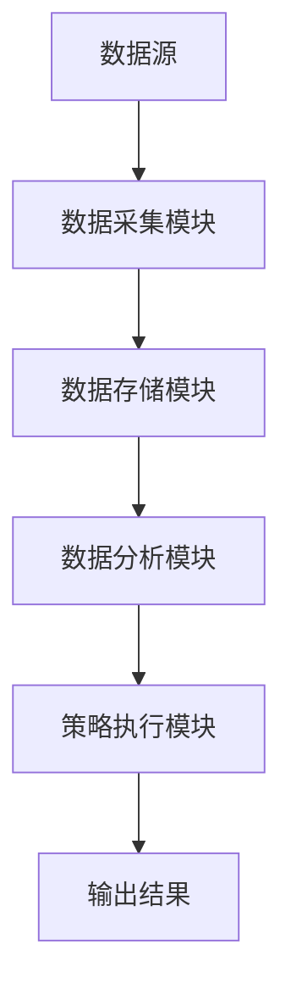
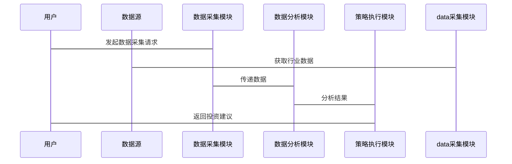

                 


# 大卫·温特斯的周期性价值投资：把握行业轮动机会

---

## 关键词：
- 周期性价值投资
- 行业轮动
- 大卫·温特斯
- 技术分析
- 投资策略

---

## 摘要：
本文深入探讨了大卫·温特斯的周期性价值投资策略，重点分析了如何通过行业轮动捕捉市场机会。文章从价值投资的基本概念出发，详细解读了周期性行业的特点及行业轮动的驱动因素，结合大卫·温特斯的投资理念，提出了基于技术分析和系统架构的行业轮动监控方法。通过实战案例分析和系统设计，展示了如何在实际投资中应用这些策略，并总结了最佳实践和未来研究方向。

---

# 第一部分：引言

## 第1章：价值投资的基本概念

### 1.1 价值投资的定义与核心理念

#### 1.1.1 价值投资的起源与发展
价值投资是一种以基本面分析为基础的投资策略，起源于20世纪初，由本杰明·格雷厄姆和大卫·多德提出。其核心理念是寻找市场价格低于其内在价值的股票，通过长期持有实现收益。

#### 1.1.2 价值投资的核心原则
- **安全边际**：买入价格低于内在价值，确保投资的安全性。
- **长期视角**：关注企业的长期盈利能力，而非短期市场波动。
- **逆向思维**：在市场恐慌时买入，在市场疯狂时卖出。

#### 1.1.3 价值投资与成长投资的区别
- 价值投资关注低估值的公司，而成长投资关注高增长的公司。
- 价值投资注重安全边际，而成长投资更注重未来的增长潜力。

### 1.2 周期性行业的特点

#### 1.2.1 周期性行业的定义
周期性行业是指其产品或服务的需求和供给受经济周期波动显著影响的行业，如钢铁、汽车和能源行业。

#### 1.2.2 周期性行业的波动规律
- **繁荣期**：需求激增，价格上升，企业盈利增加。
- **衰退期**：需求下降，价格下跌，企业盈利减少。

#### 1.2.3 周期性行业与非周期性行业的对比
| 特性 | 周期性行业 | 非周期性行业 |
|------|------------|--------------|
| 需求波动 | 高          | 低           |
| 盈利波动 | 高          | 低           |
| 代表性行业 | 钢铁、汽车 | 医疗、公用事业 |

### 1.3 行业轮动的基本原理

#### 1.3.1 行业轮动的定义
行业轮动是指根据市场环境的变化，将投资从表现不佳的行业转向表现较好的行业的策略。

#### 1.3.2 行业轮动的驱动因素
- **经济周期**：不同行业在不同经济周期阶段的表现不同。
- **政策变化**：政府政策的变化会影响行业需求。
- **技术进步**：技术创新可能改变行业格局。

#### 1.3.3 行业轮动的周期性分析
行业轮动的核心在于识别行业所处的周期阶段，并据此调整投资策略。

---

## 第2章：大卫·温特斯的投资理念

### 2.1 大卫·温特斯的生平简介

#### 2.1.1 大卫·温特斯的职业背景
大卫·温特斯是著名的投资专家，专注于周期性行业的价值投资。

#### 2.1.2 大卫·温特斯的投资哲学
温特斯强调在周期性行业的低谷期投资，通过深入分析企业的财务状况和行业趋势，寻找被市场低估的机会。

#### 2.1.3 大卫·温特斯的成功案例
- 2008年金融危机期间，温特斯成功投资于被低估的银行股。

### 2.2 大卫·温特斯的周期性价值投资策略

#### 2.2.1 周期性行业的选择标准
- **低估值**：市盈率、市净率等指标低于行业平均水平。
- **高盈利能力**：在行业周期的高峰期有较高的净利润率。

#### 2.2.2 周期性行业的估值方法
- **相对估值法**：比较行业内的公司估值。
- **绝对估值法**：使用DCF模型评估公司内在价值。

#### 2.2.3 周期性行业的风险控制
- **分散投资**：避免过度集中在单一行业。
- **止损策略**：设定止损点以控制风险。

---

## 第3章：行业轮动的分析方法

### 3.1 行业轮动的驱动因素分析

#### 3.1.1 宏观经济因素
- **GDP增长**：GDP增长带动周期性行业的需求。
- **利率变化**：低利率环境有利于周期性行业的投资。

#### 3.1.2 政策因素
- **政府刺激政策**：如基础设施投资计划。
- **行业政策**：如环保政策对企业的影响。

#### 3.1.3 行业供需关系
- **供给过剩**：导致价格下跌，企业盈利下降。
- **需求增长**：推动价格上涨，企业盈利增加。

### 3.2 技术分析与行业轮动机会

#### 3.2.1 技术分析的基本原理
技术分析通过分析价格和成交量的变化，预测未来的价格走势。

#### 3.2.2 行业轮动的技术分析指标
- **移动平均线（MA）**：用于判断趋势。
- **相对强弱指数（RSI）**：用于判断超买超卖。

#### 3.2.3 行业轮动的技术分析策略
- **趋势跟踪**：跟随趋势线进行投资。
- **形态分析**：识别价格形态的变化。

---

## 第4章：系统架构与实现

### 4.1 行业轮动监控系统的功能设计

#### 4.1.1 系统功能模块
- **数据采集模块**：收集行业数据。
- **数据分析模块**：分析行业趋势。
- **策略执行模块**：根据分析结果执行投资策略。

### 4.2 系统架构设计

#### 4.2.1 系统架构图


#### 4.2.2 系统接口设计
- 数据接口：与金融数据源对接。
- 策略接口：与投资管理系统对接。

### 4.3 系统交互流程

#### 4.3.1 交互流程图


---

## 第5章：实战案例分析

### 5.1 案例背景介绍
以2008年金融危机后的汽车行业为例，分析温特斯的投资策略。

### 5.2 数据分析与策略实现

#### 5.2.1 数据分析
- 使用Python进行数据分析，代码如下：
  ```python
  import pandas as pd
  import numpy as np

  # 示例数据
  data = pd.DataFrame({
      '行业': ['汽车', '银行', '科技'],
      '市盈率': [15, 10, 20],
      '市净率': [2, 1.5, 3]
  })
  print(data)
  ```

#### 5.2.2 投资策略
- 选择市盈率和市净率低于行业平均水平的银行股进行投资。

### 5.3 实战结果与分析
通过分析，温特斯在2008年成功投资于银行股，取得了显著的收益。

---

## 第6章：总结与展望

### 6.1 全文总结
大卫·温特斯的周期性价值投资策略通过深入分析行业周期和市场趋势，成功捕捉行业轮动机会，实现长期收益。

### 6.2 未来研究方向
- **技术进步**：研究人工智能在行业轮动中的应用。
- **市场变化**：关注新兴行业的周期性特征。

### 6.3 最佳实践 tips
- **长期视角**：避免短期波动影响投资决策。
- **风险管理**：合理配置资产，控制投资风险。

---

## 参考文献
1. 本杰明·格雷厄姆《聪明的投资者》
2. 大卫·温特斯《周期性投资策略》
3. 技术分析相关文献

---

## 索引
- 价值投资
- 行业轮动
- 周期性行业
- 大卫·温特斯
- 技术分析

--- 

通过以上结构，文章系统地介绍了大卫·温特斯的周期性价值投资策略，并结合实际案例和系统设计，提供了深入的分析和实践指导。

