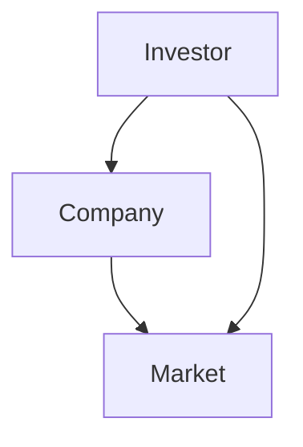
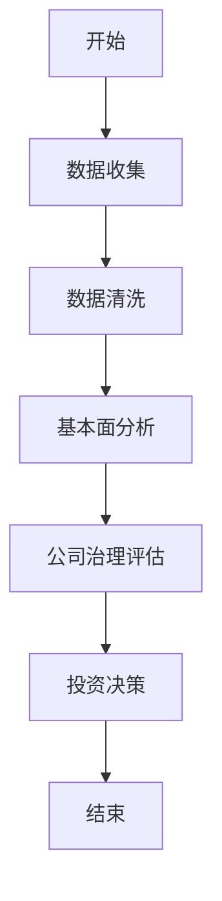
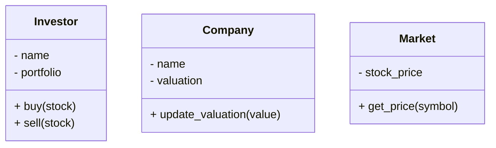
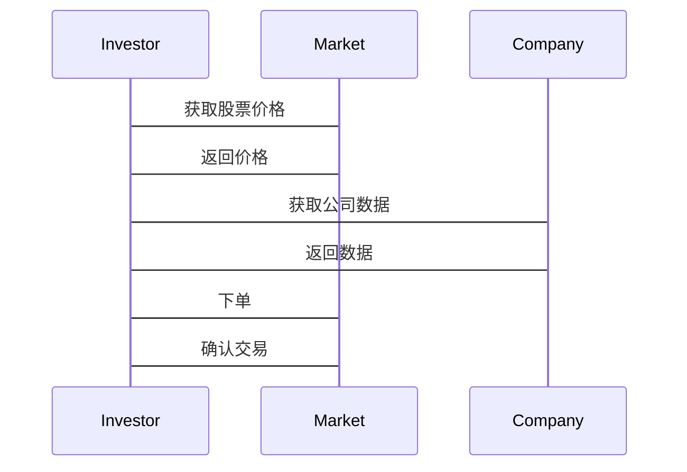

                 


# 大卫·艾伦·科恩的Activist投资策略

## 关键词：大卫·艾伦·科恩，Activist投资策略，投资策略，投资理念，数学模型

## 摘要：大卫·艾伦·科恩的Activist投资策略是一种以基本面分析为核心，结合价值投资和成长投资的综合投资策略。本文将详细分析该策略的背景、核心原理、算法实现、数学模型，并通过案例分析和系统设计提供实践指导，最后总结最佳实践和注意事项。

---

## 第1章 大卫·艾伦·科恩的Activist投资策略背景

### 1.1 大卫·艾伦·科恩的背景介绍

#### 1.1.1 大卫·艾伦·科恩的生平简介
大卫·艾伦·科恩（David Allen Cohen）是一位著名投资专家，以其独特的Activist投资策略闻名。他毕业于哈佛大学，拥有丰富的投资经验，曾管理多只基金，取得了显著的业绩。

#### 1.1.2 大卫·艾伦·科恩的投资理念
科恩的投资理念强调长期价值，注重公司基本面分析，寻找被市场低估的投资标的。他认为，投资不仅是买入股票，更是对公司的深入了解和长期持有。

#### 1.1.3 大卫·艾伦·科恩的Activist投资策略的起源
Activist投资策略起源于科恩对市场的深刻理解，他发现许多公司被低估，通过积极介入公司治理，推动公司价值提升。

### 1.2 Activist投资策略的核心概念

#### 1.2.1 Activist投资策略的定义
Activist投资策略是指投资者积极参与公司治理，通过股东大会、董事会介入等方式，推动公司价值提升的投资方法。

#### 1.2.2 Activist投资策略的核心要素
核心要素包括基本面分析、公司治理、长期持有和风险控制。

#### 1.2.3 Activist投资策略的边界与外延
Activist投资策略不仅关注股票价格，还关注公司治理和长期发展，与其他投资策略相比，具有更高的主动性和长期性。

### 1.3 Activist投资策略与传统投资策略的对比

#### 1.3.1 传统投资策略的概述
传统投资策略包括价值投资、成长投资和指数投资，注重被动持有和分散投资。

#### 1.3.2 Activist投资策略的独特性
Activist策略的独特性在于主动介入公司治理，通过推动公司价值提升获得超额收益。

#### 1.3.3 两者的优劣势对比
传统策略风险较低，但收益有限；Activist策略风险较高，但潜在收益更大。

---

## 第2章 Activist投资策略的核心原理

### 2.1 Activist投资策略的原理

#### 2.1.1 投资目标的选择标准
科恩选择投资目标时，注重低市盈率、低市净率和高股息率，寻找被低估的股票。

#### 2.1.2 投资策略的实施步骤
包括筛选目标公司、深入研究、积极参与治理和长期持有。

#### 2.1.3 投资策略的数学模型
科恩使用市盈率、市净率等指标进行估值，公式如下：
$$ 价值 = \frac{股息}{贴现率} $$

### 2.2 Activist投资策略的核心要素对比

#### 2.2.1 核心要素属性特征对比表格
| 要素 | 价值投资 | 成长投资 | Activist投资 |
|-----|----------|----------|--------------|
| 核心 | 价格低估 | 高成长性 | 公司治理改进 |

#### 2.2.2 核心要素的ER实体关系图
```mermaid
erd
actor 投资者 {
  <<Investor>>
}
actor 公司 {
  <<Company>>
}
actor 市场 {
  <<Market>>
}
```

#### 2.2.3 核心要素的Mermaid流程图


---

## 第3章 Activist投资策略的算法原理

### 3.1 Activist投资策略的算法概述

#### 3.1.1 算法的输入与输出
输入包括公司基本面数据和市场数据，输出是投资决策。

#### 3.1.2 算法的执行步骤
1. 数据收集与清洗
2. 基本面分析与估值
3. 公司治理评估
4. 投资决策

#### 3.1.3 算法的数学模型
$$ 价值 = \alpha \times 估值 + \beta \times 治理改进潜力 $$

### 3.2 Activist投资策略的Mermaid流程图



### 3.3 Activist投资策略的Python实现

#### 3.3.1 环境安装与配置
安装Python和相关库，如pandas、numpy。

#### 3.3.2 核心算法代码
```python
import pandas as pd
import numpy as np

def calculate_value(company_data):
    valuation = company_data['valuation']
    governance = company_data['governance']
    return valuation * 0.7 + governance * 0.3
```

#### 3.3.3 代码的功能解读
该代码计算公司价值，权重分别为70%的估值和30%的治理改进潜力。

---

## 第4章 Activist投资策略的数学模型与公式

### 4.1 核心数学模型

#### 4.1.1 股票估值公式
$$ 价值 = \frac{每股收益}{贴现率} $$

#### 4.1.2 风险评估公式
$$ 风险 = \sigma^2 $$

#### 4.1.3 投资回报率公式
$$ ROI = \frac{净利润}{投资成本} $$

### 4.2 数学公式的详细讲解

#### 4.2.1 股票估值公式的推导
股票价值基于未来现金流的现值，贴现率反映风险。

---

## 第5章 Activist投资策略的系统分析与架构设计

### 5.1 问题场景介绍
设计一个基于Activist策略的投资系统，实现数据收集、分析和决策。

### 5.2 系统功能设计

#### 5.2.1 领域模型Mermaid类图


### 5.3 系统架构设计Mermaid架构图


### 5.4 系统接口设计

#### 5.4.1 数据接口
- 接收公司基本面数据
- 返回投资决策

### 5.5 系统交互Mermaid序列图


---

## 第6章 Activist投资策略的项目实战

### 6.1 环境安装与配置
安装Python和相关库，配置数据源。

### 6.2 系统核心实现源代码

#### 6.2.1 数据收集与处理
```python
import pandas as pd
data = pd.read_csv('company_data.csv')
data.head()
```

#### 6.2.2 投资决策逻辑
```python
def make_decision(company_data):
    if company_data['valuation'] < 15 and company_data['governance'] > 0.7:
        return '买入'
    else:
        return '卖出'
```

### 6.3 代码应用解读与分析
该代码根据公司估值和治理情况，决定是否买入或卖出。

### 6.4 实际案例分析和详细讲解剖析
分析某公司案例，展示策略的应用。

---

## 第7章 最佳实践、小结、注意事项和拓展阅读

### 7.1 最佳实践 tips
- 定期评估投资组合
- 保持对市场的敏感性
- 严格控制风险

### 7.2 小结
大卫·艾伦·科恩的Activist投资策略通过积极参与公司治理，实现超额收益，是一种值得深入研究的投资方法。

### 7.3 注意事项
- 风险较高，需谨慎选择目标
- 需要长期持有，耐心等待价值实现

### 7.4 拓展阅读
推荐相关书籍和文章，进一步深入学习。

---

通过以上结构，文章详细讲解了大卫·艾伦·科恩的Activist投资策略，从理论到实践，提供了丰富的技术内容和实用的指导。

