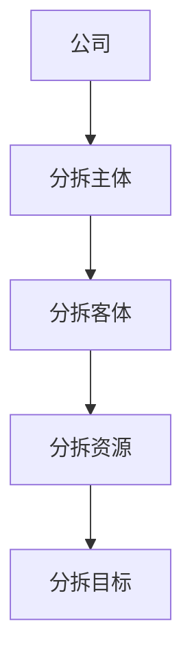
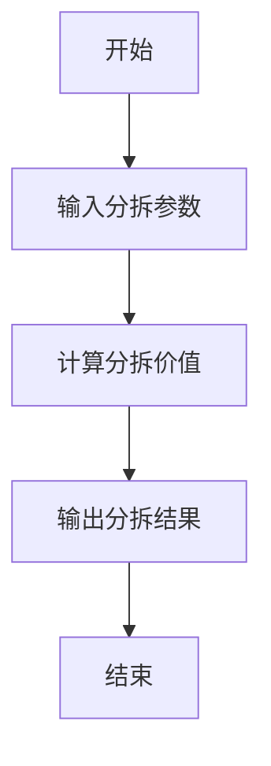
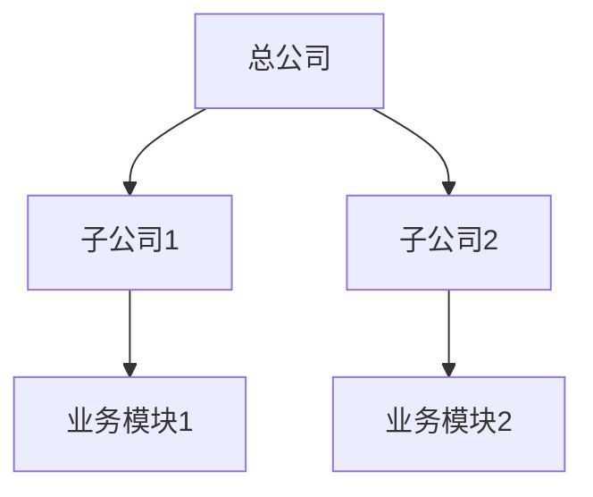

                 

# 大卫·艾伦·科恩的公司分拆价值释放策略

## 关键词：公司分拆、价值释放、大卫·艾伦·科恩、企业战略、分拆策略、企业架构、系统优化

## 摘要：本文探讨了大卫·艾伦·科恩提出的公司分拆价值释放策略，通过详细分析分拆的定义、背景、核心概念、算法原理、系统架构及实际案例，揭示了分拆如何优化企业结构和释放潜在价值。文章结合理论与实践，为读者提供了全面的理解和深入的见解。

---

# 第1章: 公司分拆的定义与背景

## 1.1 公司分拆的定义
### 1.1.1 分拆的定义与基本概念
公司分拆是指将一个企业分解为两个或多个独立的实体，每个实体独立运营，以实现更高的效率、灵活性和价值。分拆的核心在于优化企业结构，释放各部分的潜力。

### 1.1.2 分拆的类型与特点
分拆可以分为战略分拆、运营分拆和税务分拆。战略分拆旨在优化业务组合，运营分拆关注提高效率，税务分拆则侧重于税负优化。

### 1.1.3 分拆与企业价值的关系
分拆能够通过专业化经营和资源配置优化，提升整体企业价值。分拆后的子公司可能因独立运营而释放更大的潜力。

## 1.2 公司分拆的背景与趋势
### 1.2.1 全球化与企业分拆的兴起
全球化推动了企业的多元化扩张，分拆成为优化全球布局的重要手段。

### 1.2.2 数字化时代的企业分拆特点
数字化时代，企业更倾向于通过分拆实现灵活创新和快速响应。

### 1.2.3 分拆在企业战略中的地位
分拆是企业战略的重要组成部分，常用于应对市场变化和优化资产配置。

## 1.3 大卫·艾伦·科恩的分拆策略
### 1.3.1 大卫·艾伦·科恩的简介
大卫·艾伦·科恩是企业分拆领域的权威，提出了系统化的分拆策略。

### 1.3.2 分拆策略的核心思想
科恩强调分拆的目的是释放各业务单元的潜力，而非单纯追求短期收益。

### 1.3.3 分拆策略的创新性与实践性
科恩的策略结合了理论与实践，注重分拆后的协同效应和长期价值。

---

# 第2章: 分拆的核心概念与联系

## 2.1 分拆的核心概念
### 2.1.1 分拆的主体与客体
主体是分拆的企业，客体是被分拆的业务单元。

### 2.1.2 分拆的驱动因素
包括战略调整、效率提升和价值释放。

### 2.1.3 分拆的目标与边界
目标是优化结构，边界在于明确分拆后的独立性。

## 2.2 分拆的核心要素
### 2.2.1 分拆的组织架构
分拆后的企业需重新设计组织架构，确保高效运作。

### 2.2.2 分拆的资源分配
资源需合理分配，确保各业务单元独立运营。

### 2.2.3 分拆的协同效应
分拆后的协同效应是释放价值的关键。

## 2.3 分拆与企业价值的关系
### 2.3.1 分拆对企业价值的影响
分拆可能提升整体价值，但也需考虑短期调整成本。

### 2.3.2 分拆与股东价值的关系
分拆通过优化资产配置，提升股东价值。

### 2.3.3 分拆的长期与短期价值
分拆的短期成本可能影响价值，但长期来看能释放更大潜力。

## 2.4 分拆的ER实体关系图

---

# 第3章: 分拆的算法原理与数学模型

## 3.1 分拆的算法原理
### 3.1.1 分拆的优化算法
使用动态规划优化分拆过程，确保资源合理分配。

### 3.1.2 分拆的决策树模型
通过决策树分析分拆的可行性，选择最优方案。

### 3.1.3 分拆的动态规划方法
动态规划模型帮助确定分拆的最佳时机和方式。

## 3.2 分拆的数学模型
### 3.2.1 分拆的价值评估模型
$$ V = \sum_{i=1}^{n} w_i x_i $$

### 3.2.2 分拆的权重分配公式
$$ w_i = \frac{x_i}{\sum_{j=1}^{n} x_j} $$

## 3.3 分拆的算法流程图

---

# 第4章: 分拆的系统分析与架构设计

## 4.1 分拆的系统分析
### 4.1.1 分拆的系统目标
确保分拆后系统高效运作，释放价值。

### 4.1.2 分拆的系统功能
包括业务模块划分、资源分配和协同管理。

### 4.1.3 分拆的系统约束
需考虑成本、时间和技术限制。

## 4.2 分拆的系统架构
### 4.2.1 分拆的模块划分
将企业划分为独立模块，每个模块负责特定功能。

### 4.2.2 分拆的系统架构图

## 4.3 分拆的系统接口设计
### 4.3.1 分拆的内部接口
各模块之间的交互接口。

### 4.3.2 分拆的外部接口
与外部系统如客户、供应商的接口。

---

# 第5章: 分拆的项目实战

## 5.1 分拆的环境配置
### 5.1.1 分拆的工具选择
选择合适的分拆工具和平台。

### 5.1.2 分拆的数据准备
收集和整理相关数据，为分拆提供支持。

## 5.2 分拆的代码实现
### 5.2.1 分拆的算法实现
编写代码实现分拆算法。

### 5.2.2 分拆的系统实现
开发分拆后的系统模块。

## 5.3 分拆的案例分析
### 5.3.1 分拆的环境配置
详细描述环境配置步骤。

### 5.3.2 分拆的代码实现
提供代码示例并解释其实现。

---

# 第6章: 分拆的最佳实践与总结

## 6.1 分拆的最佳实践
### 6.1.1 分拆的注意事项
确保分拆过程中的风险控制。

### 6.1.2 分拆的未来趋势
分拆将在数字化转型中发挥更大作用。

## 6.2 分拆的小结
分拆是优化企业结构的重要策略，需结合具体情况灵活运用。

## 6.3 分拆的注意事项
分拆需谨慎评估，确保长期价值。

## 6.4 分拆的拓展阅读
推荐相关书籍和资源，供读者深入学习。

---

通过以上详细的结构和内容安排，本文系统地探讨了大卫·艾伦·科恩的公司分拆策略，从理论到实践，为读者提供了全面的见解和实用的指导。

