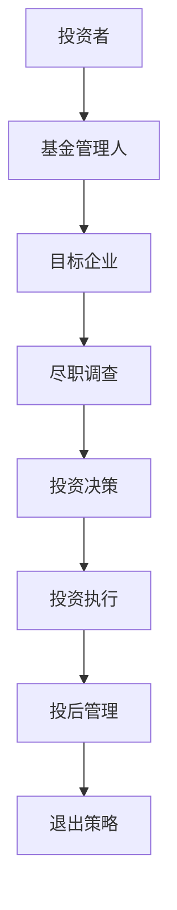

                 


# 大卫·艾伦·科恩的私募股权投资策略

## 关键词：
私募股权投资、大卫·艾伦·科恩、投资策略、风险控制、资产配置、市场分析、投资组合优化

## 摘要：
本文深入探讨了大卫·艾伦·科恩的私募股权投资策略，从理论基础到实际应用，结合系统架构设计和项目实战，全面解析了私募股权投资的核心原理和最佳实践。文章首先介绍了私募股权投资的基本概念和市场背景，随后详细分析了投资策略的分类与选择，接着从系统性角度探讨了投资风险的管理与对冲，最后通过实际案例展示了如何构建高效的投资组合并优化资产配置。本文旨在为读者提供一套完整的私募股权投资策略框架，帮助投资者在复杂多变的市场中做出明智决策。

---

## 目录大纲

### 第一部分: 私募股权投资概述

#### 第1章: 私募股权投资的背景与核心概念

- **1.1 私募股权投资的定义与特点**
  - 1.1.1 私募股权投资的定义
  - 1.1.2 私募股权投资的核心特点
  - 1.1.3 私募股权投资与公开市场的区别
- **1.2 私募股权投资的参与者与流程**
  - 1.2.1 投资者：LP与GP的角色
  - 1.2.2 管理机构：私募基金公司的运作模式
  - 1.2.3 投资流程：从尽职调查到投资决策
- **1.3 私募股权投资的市场分析**
  - 1.3.1 全球私募股权投资市场的现状
  - 1.3.2 中国私募股权投资市场的特点
  - 1.3.3 私募股权投资的主要驱动因素

#### 1.4 私募股权投资的核心概念与联系

- **1.4.1 核心概念的术语说明**
  - 私募基金（Private Fund）
  - 有限合伙人（LP）
  - 普通合伙人（GP）
  - 投资组合（Portfolio）
- **1.4.2 问题背景与问题描述**
  - 私募股权投资的核心挑战：信息不对称、高风险、高回报
  - 投资者与管理人的目标一致性问题
- **1.4.3 问题解决与边界外延**
  - 通过合同和治理机制解决目标一致性问题
  - 私募股权投资的边界：资金募集、投资决策、投后管理
  - 概念的外延：从单一投资到组合投资
- **1.4.4 核心要素组成与ER实体关系图**
  - 投资者、基金管理人、目标企业之间的关系
  - 用Mermaid绘制的ER图

```mermaid
er
  作用域: 私募股权投资
  actor 投资者: {
    关系: 股东
    属性: 投资金额、投资期限、期望回报率
  }
  actor 基金管理人: {
    关系: 受托管理
    属性: 管理规模、管理团队、历史业绩
  }
  actor 目标企业: {
    关系: 投资目标
    属性: 企业价值、成长潜力、风险水平
  }
```

---

### 第二部分: 私募股权投资策略的核心原理

#### 第2章: 私募股权投资的策略框架

- **2.1 投资策略的分类与选择**
  - 2.1.1 股权投资的四种主要策略
    - 股权投机：短期价格波动套利
    - 股权投资：长期价值创造
    - 控股型投资：战略整合
    - 股权套利：利用市场套利机会
  - 2.1.2 不同策略的优劣势对比
    - 表格形式展示四种策略的对比分析
  - 2.1.3 策略选择的驱动因素
    - 市场周期、企业生命周期、投资者风险偏好
- **2.2 投资策略的系统优化**
  - 2.2.1 投资策略的动态调整机制
    - 根据市场变化和企业状况优化投资组合
  - 2.2.2 策略组合的协同效应
    - 多策略组合的风险分散与收益增强
- **2.3 私募股权投资的决策模型**
  - 2.3.1 基于DCF模型的企业估值
    - 现金流折现法的数学公式：$$DCF = \sum_{t=1}^{n} \frac{CF_t}{(1+r)^t} + \frac{TV}{(1+r)^n}$$
    - 示例：假设某企业的未来现金流为$100万，贴现率为10%，计算其DCF价值
  - 2.3.2 基于PE倍数的企业估值
    - PE倍数法的公式：$$PE = \frac{Market\,Value}{Earnings}$$
    - 示例：某企业市盈率为20倍，净利润为500万，计算其市场价值
  - 2.3.3 基于行业对标的企业估值
    - 行业对标法的步骤：选取可比公司，计算平均PE、PB等指标

#### 第3章: 私募股权投资的系统分析与架构设计

- **3.1 投资目标的系统分解**
  - 3.1.1 企业基本面分析
    - 财务指标：ROE、毛利率、资产负债率
    - 市场地位：市场份额、竞争对手分析
  - 3.1.2 行业竞争分析
    - 行业生命周期：导入期、成长期、成熟期、衰退期
    - 五力模型：波特的五力分析
  - 3.1.3 宏观经济环境分析
    - 经济周期：复苏期、繁荣期、衰退期、萧条期
    - 政策环境：税收政策、行业监管
- **3.2 投资组合的系统优化**
  - 3.2.1 投资组合的风险分散原理
    - 马科维茨的均值-方差模型
    - 投资组合优化的数学公式：$$\text{minimize } \sigma^2 \text{ subject to } \mu \geq \text{target return}$$
  - 3.2.2 投资组合的收益最大化原理
    - 资本资产定价模型（CAPM）的应用
    - 投资组合收益的计算公式：$$E[R_p] = \sum w_i E[R_i]$$
  - 3.2.3 投资组合的动态调整机制
    - 定期再平衡策略
    - 根据市场变化调整权重
- **3.3 投资风险的系统管理**
  - 3.3.1 系统性风险与非系统性风险的区分
    - 系统性风险：市场风险、利率风险
    - 非系统性风险：企业特定风险、行业风险
  - 3.3.2 风险对冲策略的设计
    - 使用衍生品对冲：期货、期权
    - 通过分散化降低非系统性风险
  - 3.3.3 风险预警机制的构建
    - KPI监控：VaR、CVaR
    - 风险触发点的设置

#### 3.4 私募股权投资的架构设计

- **3.4.1 投资架构的模块划分**
  - 资金募集模块
  - 投资决策模块
  - 投后管理模块
- **3.4.2 投资架构的流程设计**
  - 用Mermaid绘制的流程图展示投资流程



---

### 第三部分: 私募股权投资的项目实战与最佳实践

#### 第4章: 项目实战

- **4.1 环境安装与数据准备**
  - 安装Python环境
  - 数据源：历史市场数据、企业财务数据
- **4.2 投资组合优化的Python实现**
  - 使用SciPy或NumPy进行优化计算
  - 示例代码：

```python
import numpy as np
import scipy.optimize as optimize

# 示例：简单投资组合优化
def portfolio_return(weights, returns):
    return np.sum(weights * returns)

def portfolio_risk(weights, returns, cov_matrix):
    return np.sqrt(np.dot(weights.T, np.dot(cov_matrix, weights)))

def optimization_function(weights, returns, cov_matrix, target_return):
    return portfolio_risk(weights, returns, cov_matrix)

# 约束条件
def constraint(weights):
    return np.sum(weights) - 1.0

# 使用SciPy进行优化
bounds = [(0.0, 1.0) for _ in range(len(returns))]
result = optimize.minimize(optimization_function, [1.0 / len(returns)] * len(returns), 
                            args=(returns, cov_matrix), method='SLSQP', 
                            constraints={'type': 'eq', 'fun': constraint})
```

- **4.3 代码应用解读与分析**
  - 解释上述代码的逻辑和应用场景
  - 讨论优化结果的实际意义
- **4.4 实际案例分析**
  - 以某行业为例，展示如何通过上述方法构建投资组合
  - 分析优化结果与实际市场表现的匹配度
- **4.5 项目小结**
  - 总结项目实施过程中的关键点和经验教训

#### 第5章: 最佳实践与小结

- **5.1 最佳实践 tips**
  - 定期再平衡投资组合
  - 保持分散化投资
  - 重视投后管理与风险监控
- **5.2 小结**
  - 本文总结了大卫·艾伦·科恩的私募股权投资策略，从理论到实践，为读者提供了一套完整的投资框架
- **5.3 注意事项**
  - 投资者需根据自身风险承受能力调整策略
  - 严格遵守相关法律法规
  - 保持对市场的持续关注与学习
- **5.4 拓展阅读**
  - 推荐相关书籍和学术论文
  - 提供进一步学习的资源和渠道

---

通过以上内容，读者可以全面理解大卫·艾伦·科恩的私募股权投资策略，并能够将其应用于实际投资中。

