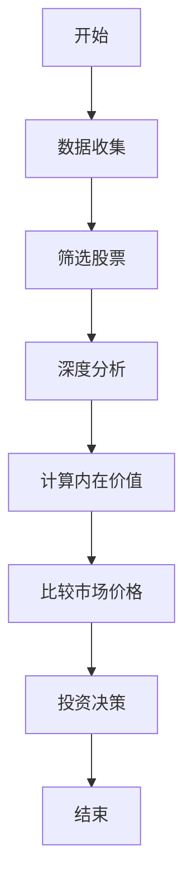
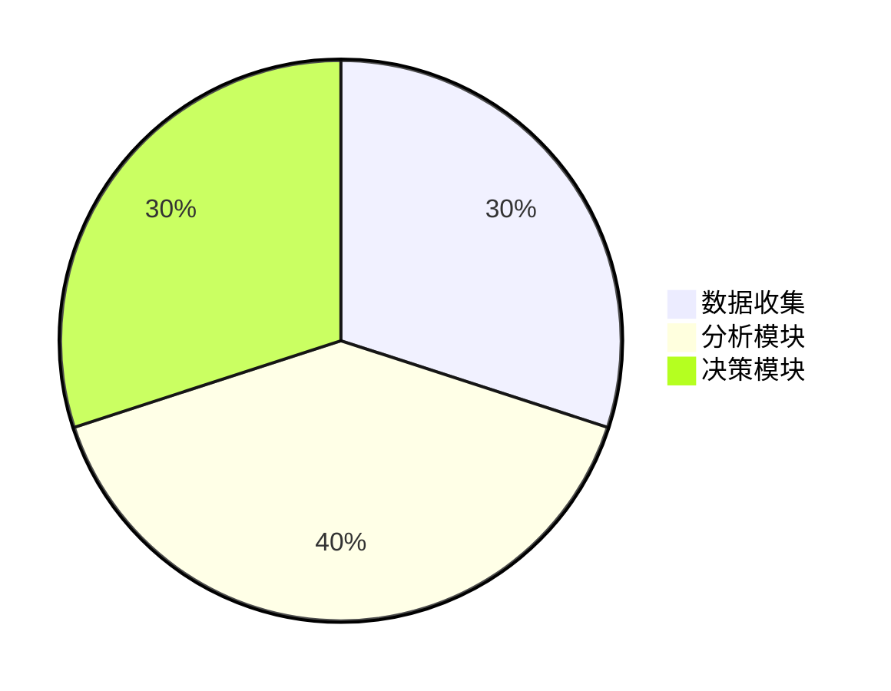

                 


# 《大卫德雷曼的价值投资实务》

## 关键词：价值投资，基本面分析，内在价值，安全边际，投资组合，风险管理

## 摘要：  
价值投资是一种基于对企业内在价值深刻理解的投资策略，通过分析企业的财务状况、行业地位和未来前景，寻找市场低估的股票进行长期投资。本文系统地介绍了价值投资的核心理念、理论基础、分析方法、数学模型、系统设计和实际案例，帮助投资者在复杂多变的市场中做出明智的投资决策。

---

# 第1章: 价值投资的背景与核心理念

## 1.1 价值投资的基本概念与历史发展

### 1.1.1 价值投资的定义  
价值投资是一种以企业内在价值为核心的投资策略，旨在通过分析企业的财务状况、行业地位和未来前景，寻找市场价格低于内在价值的股票进行投资。

### 1.1.2 价值投资的核心理念  
- **长期投资**：关注企业的长期价值，而非短期价格波动。  
- **安全边际**：买入价格低于内在价值，以降低投资风险。  
- **基本面分析**：通过对企业财务报表和行业环境的分析，评估其内在价值。

### 1.1.3 价值投资与其它投资策略的对比  
| 投资策略 | 核心理念 | 适用场景 | 优缺点 |
|----------|----------|----------|--------|
| 技术分析 | 研究价格和成交量 | 短期价格波动预测 | 易受市场情绪影响，风险较高 |
| 成长投资 | 寻找高成长企业 | 高成长行业 | 风险较高，波动较大 |
| 价值投资 | 寻找低估企业 | 稳定行业 | 风险较低，回报稳定 |

## 1.2 价值投资的历史发展

### 1.2.1 价值投资的起源  
价值投资的理论基础可以追溯到本杰明·格雷厄姆和戴维·多德的工作，他们在20世纪初提出了“安全边际”和“内在价值”的概念。

### 1.2.2 价值投资的发展历程  
- **20世纪初**：格雷厄姆和多德的理论形成。  
- **20世纪中叶**：巴菲特继承并发扬价值投资理念。  
- **21世纪**：价值投资在全球范围内广泛应用，尤其在新兴市场中表现突出。

### 1.2.3 价值投资在现代投资中的地位  
价值投资是投资领域的重要流派之一，尤其适合于风险承受能力较低的投资者。

## 1.3 价值投资的哲学基础

### 1.3.1 市场有效性的假设  
市场并非总是有效，价格波动可能反映短期市场情绪而非企业的真实价值。

### 1.3.2 投资者心理与行为分析  
投资者的非理性行为（如恐惧和贪婪）可能导致市场低估或高估某些股票。

### 1.3.3 长期投资与复利效应  
通过长期持有优质股票，投资者可以享受复利效应，实现财富的稳步增长。

---

# 第2章: 价值投资的理论基础与数学模型

## 2.1 价值投资的理论基础

### 2.1.1 股票的内在价值  
股票的内在价值是基于企业未来现金流的现值。计算公式为：  
$$ V = \frac{CF}{r - g} $$  
其中，\( V \) 是内在价值，\( CF \) 是未来现金流，\( r \) 是折现率，\( g \) 是增长率。

### 2.1.2 市场价值与内在价值的关系  
- 当市场价格 < 内在价值时，股票具有投资价值。  
- 当市场价格 > 内在价值时，股票被高估，应避免投资。

### 2.1.3 价值投资的数学模型  
价值投资的数学模型主要用于计算内在价值和安全边际。  
$$ \text{安全边际} = \text{内在价值} - \text{市场价格} $$

## 2.2 价值投资的数学模型

### 2.2.1 内在价值的计算公式  
$$ V = \sum_{t=1}^{n} \frac{CF_t}{(1 + r)^t} $$  
其中，\( CF_t \) 是第 \( t \) 年的现金流，\( r \) 是折现率，\( n \) 是预测年数。

### 2.2.2 市盈率与市净率的计算  
- 市盈率（P/E）= 市场价格 / 每股收益  
- 市净率（P/B）= 市场价格 / 每股净资产

### 2.2.3 投资组合的收益与风险模型  
价值投资注重分散投资，通过投资组合降低风险。  
$$ \text{投资组合收益} = \sum_{i=1}^{n} w_i \times R_i $$  
其中，\( w_i \) 是第 \( i \) 只股票的权重，\( R_i \) 是第 \( i \) 只股票的收益率。

---

# 第3章: 价值投资的核心算法与流程

## 3.1 价值投资的算法概述

### 3.1.1 基于基本面分析的算法  
- 数据收集：收集企业的财务报表、行业数据等。  
- 筛选股票：通过市盈率、市净率等指标筛选低估股票。  
- 深度分析：评估企业的财务状况、行业地位和未来前景。  

### 3.1.2 基于估值分析的算法  
- 计算内在价值：使用现金流折现法计算企业的内在价值。  
- 比较市场价格与内在价值：确定是否低估。  

### 3.1.3 基于风险控制的算法  
- 分散投资：通过投资多个行业和公司降低风险。  
- 定期调整：根据市场变化和企业情况调整投资组合。

## 3.2 价值投资的流程图  



---

# 第4章: 价值投资的系统分析与架构设计

## 4.1 价值投资系统的功能设计

### 4.1.1 数据收集模块  
- 从数据库或API获取企业的财务数据、市场数据等。  

### 4.1.2 分析模块  
- 使用Python进行基本面分析和估值计算。  

### 4.1.3 决策模块  
- 根据分析结果生成投资建议。  

## 4.2 价值投资系统的架构设计  



---

# 第5章: 价值投资的项目实战

## 5.1 实战环境安装

### 5.1.1 安装Python和相关库  
- 使用Anaconda安装Python和pandas、numpy等库。  

## 5.2 核心代码实现

### 5.2.1 数据分析代码  

```python
import pandas as pd
import numpy as np

# 假设df是包含股票数据的DataFrame
df['市盈率'] = df['股价'] / df['每股收益']
df['市净率'] = df['股价'] / df['每股净资产']
```

### 5.2.2 内在价值计算代码  

```python
def calculate_intrinsic_value(现金流, 折现率, 增长率):
    return sum(cash_flow / (1 + 折现率)**t for t in range(len(cash_flow)))

现金流 = [100, 120, 140]
折现率 = 0.1
增长率 = 0.05
内在价值 = calculate_intrinsic_value(现金流, 折现率, 增长率)
print(内在价值)
```

## 5.3 实战案例分析

### 5.3.1 案例分析  
以某公司为例，计算其内在价值，并与市场价格进行比较，确定是否低估。

---

# 第6章: 价值投资的最佳实践

## 6.1 小结  
价值投资是一种长期有效的投资策略，关键在于对企业内在价值的准确评估和市场的耐心等待。

## 6.2 注意事项  
- 避免追涨杀跌，保持理性。  
- 定期审视投资组合，及时调整。  
- 避免过度分散投资，集中投资于优质企业。  

## 6.3 拓展阅读  
推荐阅读《聪明的投资者》（本杰明·格雷厄姆）和《巴菲特致股东的信》。

---

# 结语  
价值投资不仅是一种投资策略，更是一种生活态度。通过深入理解企业的内在价值，投资者可以在复杂的市场中找到真正的投资机会，实现财富的稳健增长。

