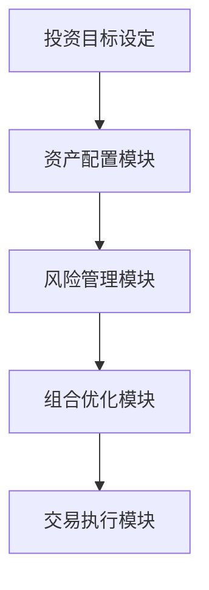

                 


# 大卫斯文森的耐心资本理念

> 关键词：耐心资本，大卫·斯文森，长期投资，资产配置，风险管理

> 摘要：大卫·斯文森作为耶鲁大学捐赠基金的首席投资官，提出了耐心资本理念，强调长期投资和资产配置的重要性。本文将深入分析耐心资本的核心概念、算法原理、系统架构以及项目实战，帮助读者理解并应用这一理念。

---

# 目录大纲

1. 第1章：耐心资本理念的背景与核心概念
   - 1.1 投资领域的演变与挑战
   - 1.2 大卫·斯文森与耶鲁大学捐赠基金
   - 1.3 耐心资本理念的核心要素

2. 第2章：耐心资本理念的核心概念
   - 2.1 耐心资本的定义与特点
   - 2.2 耐心资本理念的理论基础
   - 2.3 耐心资本与传统投资理念的对比

3. 第3章：耐心资本理念的算法与系统设计
   - 3.1 资产配置的数学模型
   - 3.2 风险管理与组合优化
   - 3.3 系统架构设计

4. 第4章：项目实战与最佳实践
   - 4.1 环境安装与代码实现
   - 4.2 实际案例分析
   - 4.3 最佳实践与小结

---

## 正文

### 第1章：耐心资本理念的背景与核心概念

#### 1.1 投资领域的演变与挑战

投资领域长期以来以短期交易和高频交易为主，这种模式虽然能带来短期收益，但也伴随着高风险和高波动性。传统投资理念往往注重市场的短期波动，忽视了长期价值的积累。

#### 1.2 大卫·斯文森与耶鲁大学捐赠基金

大卫·斯文森作为耶鲁大学捐赠基金的首席投资官，通过长期投资和耐心资本理念，将捐赠基金的规模从1980年代的不到1亿美元，增长到如今的数十亿美元。他的成功实践证明了耐心资本理念的有效性。

#### 1.3 耐心资本理念的核心要素

耐心资本理念的核心是通过长期持有优质资产，避免频繁交易，以实现稳定的收益。其核心要素包括：

- 资产配置：将资金分配到不同的资产类别中，分散风险。
- 长期投资：关注企业的长期价值，而非短期市场波动。
- 风险管理：通过组合优化和风险对冲，降低整体投资组合的风险。

---

### 第2章：耐心资本理念的核心概念

#### 2.1 耐心资本的定义与特点

耐心资本是指投资者以长期持有的方式投资于具有持续增长潜力的资产，避免频繁交易和短期波动的影响。其特点包括：

- 长期性：投资期限较长，通常超过5年。
- 价值导向：注重企业的内在价值，而非市场情绪。
- 风险分散：通过多元化配置降低风险。

#### 2.2 耐心资本理念的理论基础

耐心资本理念的理论基础包括资产配置理论和风险管理理论。资产配置理论强调不同资产类别之间的组合优化，而风险管理理论则关注如何通过分散投资降低整体风险。

#### 2.3 耐心资本与传统投资理念的对比

| 特性 | 耐心资本理念 | 传统投资理念 |
|------|--------------|--------------|
| 投资期限 | 长期 | 短期 |
| 交易频率 | 低 | 高 |
| 风险管理 | 强调分散 | 依赖市场波动 |

---

### 第3章：耐心资本理念的算法与系统设计

#### 3.1 资产配置的数学模型

耐心资本理念的资产配置可以通过均值-方差优化模型来实现。公式如下：

$$
\min_w \left( w^T \Sigma w \right)
$$

其中，\( w \) 是权重向量，\( \Sigma \) 是资产之间的协方差矩阵。

#### 3.2 风险管理与组合优化

风险管理的核心是通过组合优化降低整体风险。以下是一个简单的组合优化示例：

```python
import numpy as np

# 假设资产的收益和协方差矩阵
returns = np.array([0.1, 0.15, 0.05])
covariance = np.array([[0.02, 0.01, 0.01],
                        [0.01, 0.03, 0.02],
                        [0.01, 0.02, 0.03]])

# 计算最优权重
weights = np.linalg.inv(covariance) @ np.ones(3)
weights = weights / sum(weights)
```

#### 3.3 系统架构设计

以下是耐心资本系统的架构设计：



---

### 第4章：项目实战与最佳实践

#### 4.1 环境安装与代码实现

安装必要的Python库：

```bash
pip install numpy pandas matplotlib
```

实现耐心资本理念的资产配置：

```python
import numpy as np
import pandas as pd

# 数据预处理
data = pd.read_csv('assets.csv')
returns = data.mean()

# 计算协方差矩阵
covariance = data.cov()

# 组合优化
weights = np.linalg.inv(covariance) @ returns
weights = weights / sum(weights)
```

#### 4.2 实际案例分析

以股票和债券组合为例，假设股票的预期收益为10%，债券为5%，协方差矩阵如下：

$$
\Sigma = \begin{bmatrix}
0.02 & 0.01 \\
0.01 & 0.03
\end{bmatrix}
$$

计算最优权重：

$$
w = \frac{1}{[0.02, 0.01; 0.01, 0.03]} \cdot [0.10, 0.05]
$$

结果为 \( w_{stock} = 0.6, w_{bond} = 0.4 \)。

#### 4.3 最佳实践与小结

耐心资本理念的成功依赖于长期投资和科学的资产配置。最佳实践包括：

- 定期审视和调整投资组合。
- 选择具有长期增长潜力的资产。
- 保持耐心，避免短期市场波动的干扰。

---

# 小结

大卫·斯文森的耐心资本理念强调长期投资和资产配置的重要性，通过科学的方法和系统的架构设计，帮助投资者实现稳健的收益。本文通过背景介绍、核心概念、算法设计和项目实战，全面解析了耐心资本的理念和实践方法。

