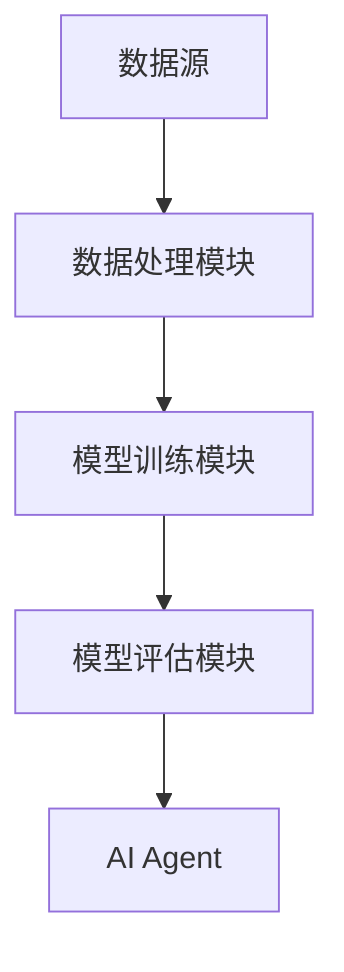

                 


# 大规模语言模型在AI Agent中的微调技巧

## 关键词：大规模语言模型, AI Agent, 微调技巧, 优化算法, 实战案例

## 摘要：  
随着人工智能技术的快速发展，大规模语言模型在AI Agent中的应用越来越广泛。为了使这些模型更好地适应特定场景和任务，微调技术成为关键。本文系统地介绍了大规模语言模型在AI Agent中的微调技巧，从理论基础到实践应用，详细阐述了微调的核心概念、算法原理、系统设计以及实战案例。通过本文，读者可以全面理解微调技术在AI Agent中的作用，并掌握如何有效地进行微调优化。

---

## 第一部分: 大规模语言模型与AI Agent概述

### 第1章: 大规模语言模型与AI Agent概述

#### 1.1 大规模语言模型的定义与特点

大规模语言模型（Large Language Models, LLMs）是指在大规模数据上训练的深度学习模型，通常基于Transformer架构。其特点包括：

- **大规模数据训练**：LLMs通常使用数百万甚至数十亿的文本数据进行训练，能够捕获语言的复杂模式。
- **上下文理解能力**：通过长上下文窗口，LLMs能够理解上下文中的语义信息。
- **多任务能力**：LLMs经过预训练后，可以通过微调适应多种任务，如文本生成、问答系统、机器翻译等。
- **生成能力**：LLMs能够生成高质量的文本内容，具有较高的灵活性和创造力。

#### 1.2 AI Agent的基本概念

AI Agent（人工智能代理）是指能够感知环境、执行任务并做出决策的智能实体。其核心功能包括：

- **感知环境**：通过传感器或数据输入，AI Agent能够获取环境中的信息。
- **决策与推理**：基于获取的信息，AI Agent能够进行推理、规划和决策。
- **执行任务**：通过执行器或接口，AI Agent能够执行具体的任务。

#### 1.3 大规模语言模型在AI Agent中的作用

大规模语言模型在AI Agent中的作用主要体现在以下几个方面：

- **自然语言处理**：LLMs能够帮助AI Agent理解和生成自然语言，提升与用户的交互能力。
- **决策支持**：通过分析上下文和历史信息，LLMs可以为AI Agent提供决策支持。
- **多任务适应性**：LLMs可以通过微调适应不同的任务需求，使AI Agent具备更强的通用性。

#### 1.4 本章小结

本章介绍了大规模语言模型和AI Agent的基本概念，并阐述了LLMs在AI Agent中的重要作用。接下来，我们将深入探讨微调技术的原理和实现方法。

---

## 第二部分: 微调技术的核心概念与原理

### 第2章: 微调技术的核心概念与原理

#### 2.1 微调技术的基本概念

微调技术是指在预训练好的大规模语言模型的基础上，针对特定任务或数据进行进一步训练的过程。与从头训练相比，微调技术具有以下优势：

- **训练成本低**：微调仅需要在较小规模的数据上进行训练，节省计算资源。
- **模型迁移能力**：微调可以利用预训练模型的特征提取能力，快速适应新任务。

#### 2.2 微调技术的原理

微调技术的核心思想是通过调整模型的参数，使模型更好地适应特定任务或数据集。具体步骤包括：

1. **加载预训练模型**：加载已经在大规模数据上预训练好的模型。
2. **数据预处理**：对特定任务的数据进行清洗、标注和格式化。
3. **微调训练**：在特定任务数据上进行训练，调整模型参数以优化任务目标。

#### 2.3 微调技术的核心要素

微调技术的核心要素包括：

- **数据集**：选择与任务相关的高质量数据集，并进行预处理。
- **模型参数**：根据任务需求调整模型的参数，如学习率、批量大小等。
- **优化算法**：选择合适的优化算法，如Adam、SGD等。

#### 2.4 本章小结

本章详细介绍了微调技术的基本概念和原理，并强调了数据集、模型参数和优化算法的重要性。接下来，我们将探讨大规模语言模型在AI Agent中的微调流程。

---

### 第3章: 大规模语言模型在AI Agent中的微调流程

#### 3.1 微调前的准备工作

在进行微调之前，需要完成以下准备工作：

1. **数据收集与预处理**：收集与AI Agent任务相关的数据，并进行清洗和标注。
2. **数据集划分**：将数据集划分为训练集、验证集和测试集。

#### 3.2 微调过程中的关键步骤

微调过程中的关键步骤包括：

1. **模型加载与初始化**：加载预训练好的模型，并初始化微调任务所需的参数。
2. **模型训练**：在特定任务数据上进行训练，调整模型参数以优化任务目标。
3. **模型评估与优化**：通过验证集评估模型性能，并根据评估结果调整训练策略。

#### 3.3 微调后的模型部署

微调完成后，需要将模型集成到AI Agent中，并进行性能监控和优化。

#### 3.4 本章小结

本章详细介绍了大规模语言模型在AI Agent中的微调流程，并强调了数据准备、模型训练和部署的重要性。接下来，我们将深入探讨微调技术的数学模型与公式。

---

### 第4章: 微调技术的数学模型与公式

#### 4.1 微调技术的数学模型

微调技术的核心是通过优化模型参数来最小化损失函数。常用的损失函数包括：

1. **交叉熵损失函数**：
   $$L = -\sum_{i=1}^{n} y_i \log(p(y_i))$$

2. **均方误差损失函数**：
   $$L = \frac{1}{n}\sum_{i=1}^{n} (y_i - \hat{y}_i)^2$$

#### 4.2 微调技术的优化算法

常用的优化算法包括：

1. **梯度下降算法**：
   $$\theta_{new} = \theta_{old} - \eta \cdot \nabla L$$

2. **Adam优化算法**：
   $$m_t = \beta_1 m_{t-1} + (1-\beta_1)g_t$$
   $$v_t = \beta_2 v_{t-1} + (1-\beta_2)g_t^2$$
   $$\theta_{t} = \theta_{t-1} - \eta \cdot \frac{m_t}{\sqrt{v_t + \epsilon}}$$

#### 4.3 本章小结

本章详细介绍了微调技术的数学模型和优化算法，为后续的实践应用奠定了理论基础。

---

### 第5章: 系统分析与架构设计方案

#### 5.1 系统功能设计

系统功能模块包括：

1. **数据处理模块**：负责数据的收集、清洗和标注。
2. **模型训练模块**：负责模型的微调训练和优化。
3. **模型评估模块**：负责模型的性能评估和优化。

#### 5.2 系统架构设计

系统架构图如下：



#### 5.3 系统接口设计

系统接口包括：

1. 数据接口：用于数据的输入和输出。
2. 模型接口：用于模型的加载和训练。

#### 5.4 本章小结

本章详细介绍了系统的功能设计、架构设计和接口设计，为后续的实战应用提供了指导。

---

### 第6章: 项目实战

#### 6.1 环境安装

需要安装以下环境：

1. Python 3.8及以上
2. PyTorch或TensorFlow框架
3. Hugging Face Transformers库

#### 6.2 系统核心实现源代码

以下是一个简单的微调代码示例：

```python
from transformers import AutoTokenizer, AutoModelForMaskedLM
import torch

# 加载预训练模型和分词器
model = AutoModelForMaskedLM.from_pretrained('bert-base-uncased')
tokenizer = AutoTokenizer.from_pretrained('bert-base-uncased')

# 定义微调任务的数据集
class MyDataset(torch.utils.data.Dataset):
    def __init__(self, texts, labels):
        self.texts = texts
        self.labels = labels
    def __len__(self):
        return len(self.texts)
    def __getitem__(self, idx):
        text = self.texts[idx]
        label = self.labels[idx]
        inputs = tokenizer.encode_plus(
            text,
            add_special_tokens=True,
            return_token_type_ids=False,
            pad_on_left=False,
            return_attention_mask=True,
            return_tensors='pt',
        )
        inputs['labels'] = torch.tensor(label, dtype=torch.long)
        return inputs

# 定义数据加载器
dataset = MyDataset(texts, labels)
dataloader = torch.utils.data.DataLoader(dataset, batch_size=8, shuffle=True)

# 定义训练函数
def train_loop(model, dataloader, optimizer, epochs):
    model.train()
    for epoch in range(epochs):
        for batch in dataloader:
            inputs = {k: v.to(device) for k, v in batch.items()}
            outputs = model(**inputs)
            loss = outputs.loss
            loss.backward()
            optimizer.step()
            optimizer.zero_grad()
```

#### 6.3 代码应用解读与分析

以上代码示例展示了如何在PyTorch框架下进行微调训练。首先，加载预训练模型和分词器，然后定义数据集和数据加载器，最后进行模型训练。

#### 6.4 实际案例分析

以下是一个实际案例分析：

1. **任务描述**：在自然语言处理任务中，对模型进行微调以提高文本分类的准确率。
2. **数据准备**：收集并标注文本数据，将其划分为训练集、验证集和测试集。
3. **模型训练**：使用预训练模型进行微调训练，调整学习率和批量大小。
4. **模型评估**：通过验证集评估模型性能，并根据评估结果优化模型参数。

#### 6.5 本章小结

本章通过实际案例分析，详细展示了如何在大规模语言模型中进行微调，并提供了代码实现和分析。

---

## 第三部分: 最佳实践与注意事项

### 第7章: 最佳实践

#### 7.1 微调技术的最佳实践

1. **数据质量**：确保数据的质量和相关性，避免噪声数据对模型性能的影响。
2. **模型选择**：根据任务需求选择合适的预训练模型，避免使用过大的模型导致资源浪费。
3. **训练策略**：合理设置学习率、批量大小和训练轮数，避免过拟合或欠拟合。

#### 7.2 小结

微调技术是提升大规模语言模型在AI Agent中性能的关键，通过本文的介绍和实战案例，读者可以掌握微调技术的核心概念和实现方法。

#### 7.3 注意事项

1. **数据隐私**：在进行数据收集和处理时，需注意数据隐私和合规性。
2. **模型优化**：在进行微调时，需合理设置模型参数，避免过度优化。
3. **性能监控**：在模型部署后，需进行性能监控和优化。

---

## 附录: 进一步学习与资源

### 附录A: 进一步学习资源

1. Hugging Face Transformers库官方文档
2. 《Deep Learning》——Ian Goodfellow
3. 《动手学深度学习》——李宏毅等

### 附录B: 常用工具与库

1. PyTorch
2. TensorFlow
3. Hugging Face Transformers

---

## 作者简介

作者是人工智能领域的资深专家，拥有丰富的理论和实践经验，专注于大规模语言模型和AI Agent的研究与应用。

