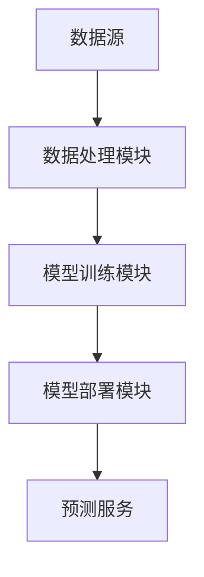
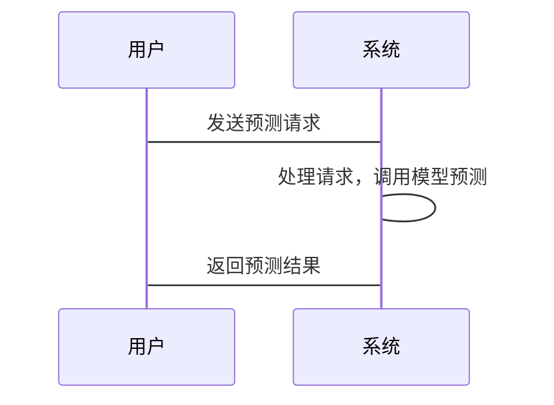
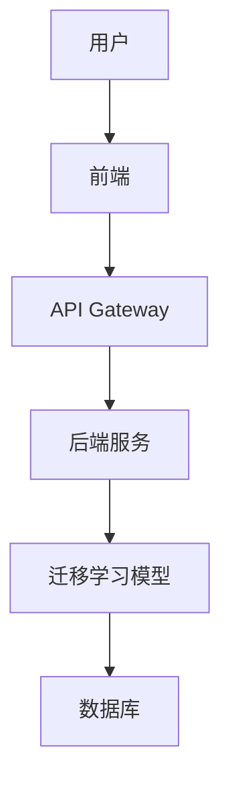

                 


# 大规模预训练模型在金融场景中的迁移学习实践

> 关键词：大规模预训练模型、迁移学习、金融场景、深度学习、自然语言处理

> 摘要：本文探讨了大规模预训练模型在金融领域的应用，分析了迁移学习的核心原理，结合实际案例，详细讲解了如何在金融场景中实施迁移学习，包括数据处理、模型优化和系统架构设计。通过系统化的分析和实战案例，为读者提供了从理论到实践的全面指导。

---

## 第1章 大规模预训练模型与迁移学习概述

### 1.1 大规模预训练模型的背景与概念

#### 1.1.1 大规模预训练模型的定义
大规模预训练模型（Pre-trained Models）是指在通用大规模数据集上进行无监督或弱监督训练的深度学习模型。这些模型通过预训练任务（如语言模型的生成任务）捕获了丰富的语义信息和上下文关系，从而具备理解人类语言的能力。

#### 1.1.2 预训练模型的核心技术
- **自注意力机制**：通过全局上下文信息捕捉长距离依赖关系。
- **多层堆叠结构**：通过多层网络提取不同层次的特征。
- **无监督训练**：利用大量未标注数据进行自监督学习。

#### 1.1.3 迁移学习的基本概念
迁移学习是一种机器学习技术，通过将已学习的知识迁移到新的任务中，以减少新任务的数据需求和计算成本。其核心思想是利用源任务和目标任务之间的相似性，提升目标任务的性能。

### 1.2 金融场景中的迁移学习需求

#### 1.2.1 金融领域的数据特点
- **数据稀疏性**：金融领域的某些数据类别较少，难以直接训练模型。
- **数据不平衡性**：某些金融事件（如欺诈交易）发生频率低，导致数据类别不平衡。
- **领域专业性**：金融领域涉及大量专业术语和特定业务规则，普通模型难以直接适应。

#### 1.2.2 金融场景中的迁移学习挑战
- **数据隐私问题**：金融数据通常涉及用户隐私，限制了数据的共享和使用。
- **模型解释性要求高**：金融决策需要可解释性，要求模型能够明确解释其预测结果。

#### 1.2.3 迁移学习在金融中的应用价值
- **降低数据依赖**：通过迁移学习，可以减少对新任务数据的依赖，提高模型训练效率。
- **提升模型性能**：利用大规模预训练模型的特征提取能力，提升金融任务的预测精度。
- **加快模型部署**：通过迁移学习，可以快速将预训练模型部署到金融场景中，缩短开发周期。

---

## 第2章 大规模预训练模型的原理与技术

### 2.1 大规模预训练模型的结构

#### 2.1.1 深度学习模型的基本结构
典型的深度学习模型包括编码器-解码器结构，如BERT。编码器用于将输入序列编码为语义向量，解码器用于生成输出序列。

#### 2.1.2 预训练模型的训练流程
预训练模型的训练流程通常包括以下步骤：
1. **数据清洗**：去除噪音数据，处理缺失值。
2. **模型初始化**：使用随机权重初始化模型参数。
3. **预训练任务**：通过自监督学习任务（如 masked language modeling）优化模型参数。
4. **微调任务**：在特定任务上进行微调，优化模型在目标领域的性能。

#### 2.1.3 模型的可迁移性分析
模型的可迁移性取决于其特征提取能力。预训练模型通过在大规模数据上学习，捕获了通用的语言特征，使其在不同领域中具有较好的迁移能力。

### 2.2 预训练任务的设计

#### 2.2.1 语言模型的预训练任务
语言模型的预训练任务通常包括以下几种：
- **Masked Language Modeling (MLM)**：随机遮蔽部分词，模型预测被遮蔽词。
- **Next Sentence Prediction (NSP)**：预测下一句是否与前一句连贯。

#### 2.2.2 金融领域任务的适配
在金融领域，预训练任务可以适配为：
- **金融实体识别**：识别文本中的金融实体（如公司名称、股票代码）。
- **事件抽取**：抽取文本中的金融事件（如并购、上市）。

#### 2.2.3 预训练任务的优化策略
- **任务组合**：将多个预训练任务结合起来，提升模型的多任务学习能力。
- **领域适配**：在预训练过程中加入金融领域的数据，提升模型在金融领域的表现。

### 2.3 模型压缩与轻量化技术

#### 2.3.1 模型剪枝技术
模型剪枝通过去除模型中冗余的参数，降低模型的复杂度。常用的剪枝方法包括：
- **权重剪枝**：基于参数的重要性进行剪枝。
- **通道剪枝**：剪枝不重要的通道（如CNN中的通道）。

#### 2.3.2 模型蒸馏技术
模型蒸馏通过将大模型的知识迁移到小模型中，提升小模型的性能。其核心思想是利用教师模型的预测结果作为标签，指导学生模型的训练。

#### 2.3.3 轻量化模型的设计
轻量化模型设计包括：
- **网络架构搜索**：通过自动搜索优化网络结构。
- **知识蒸馏**：将大模型的知识迁移到小模型中。

### 2.4 本章小结
本章介绍了大规模预训练模型的基本结构、预训练任务的设计以及模型压缩与轻量化技术。预训练模型通过大规模数据的特征提取能力，为迁移学习提供了坚实的基础。

---

## 第3章 迁移学习的理论与方法

### 3.1 迁移学习的核心理论

#### 3.1.1 迁移学习的基本假设
迁移学习的核心假设是源任务和目标任务之间存在某种相似性，可以通过迁移已学习的知识来提升目标任务的性能。

#### 3.1.2 迁移学习的分类
迁移学习可以分为以下几种类型：
- **领域迁移**：源领域和目标领域不同，但任务相同。
- **任务迁移**：源任务和目标任务不同，但领域相同。
- **完全迁移**：源任务和目标任务完全不同。

#### 3.1.3 迁移学习的度量方法
常用的迁移学习度量方法包括：
- **最大均值差异**：度量源领域和目标领域的分布差异。
- **JS散度**：计算源领域和目标领域的概率分布差异。

### 3.2 基于特征的迁移学习

#### 3.2.1 特征提取的基本原理
基于特征的迁移学习通过提取共享特征，降低源领域和目标领域的分布差异。

#### 3.2.2 特征对齐的方法
特征对齐方法包括：
- **线性变换**：通过线性变换对齐源和目标特征。
- **非线性变换**：使用核方法或其他非线性变换对齐特征。

#### 3.2.3 基于特征的迁移学习算法
基于特征的迁移学习算法包括：
- **特征加权**：对源领域和目标领域的特征进行加权，提升目标领域的性能。
- **特征对齐网络**：通过神经网络学习特征对齐映射。

### 3.3 基于参数的迁移学习

#### 3.3.1 参数调整的基本原理
基于参数的迁移学习通过调整预训练模型的参数，适应目标任务的需求。

#### 3.3.2 参数初始化策略
参数初始化策略包括：
- **随机初始化**：在预训练模型的基础上随机初始化参数。
- **迁移初始化**：基于预训练模型的参数进行初始化。

#### 3.3.3 参数微调的技术
参数微调技术包括：
- **全模型微调**：对预训练模型的所有参数进行微调。
- **部分微调**：仅对目标任务相关的部分参数进行微调。

### 3.4 本章小结
本章介绍了迁移学习的核心理论，包括基于特征和基于参数的迁移学习方法。通过特征对齐和参数调整，可以有效提升迁移学习的性能。

---

## 第4章 金融场景中的迁移学习挑战

### 4.1 金融数据的特性与挑战

#### 4.1.1 金融数据的稀疏性
金融数据的稀疏性主要体现在某些金融事件的发生频率较低，导致数据不足。

#### 4.1.2 金融数据的不平衡性
金融数据的不平衡性表现为某些类别（如正常交易和欺诈交易）的比例差异较大。

#### 4.1.3 金融数据的实时性
金融数据通常需要实时处理，对模型的响应速度提出了更高的要求。

### 4.2 迁移学习在金融中的具体挑战

#### 4.2.1 模型泛化能力不足
预训练模型在金融领域中的表现可能不如在通用领域中的表现，导致模型泛化能力不足。

#### 4.2.2 数据隐私与安全问题
金融数据通常涉及用户隐私和商业机密，限制了数据的共享和使用。

#### 4.2.3 模型解释性要求高
金融决策需要可解释性，要求模型能够明确解释其预测结果。

### 4.3 解决挑战的技术与方法

#### 4.3.1 数据增强技术
数据增强技术包括：
- **虚拟数据生成**：通过生成对抗网络（GAN）生成虚拟数据，增加数据多样性。
- **数据混合**：将不同领域的数据混合，提升模型的泛化能力。

#### 4.3.2 模型适配技术
模型适配技术包括：
- **领域适配**：通过迁移学习将预训练模型适配到金融领域。
- **任务适配**：通过任务适配网络（TAN）将预训练模型适配到特定任务。

#### 4.3.3 解释性增强技术
解释性增强技术包括：
- **可解释模型设计**：使用可解释的模型结构（如线性模型）提升模型的解释性。
- **模型解释工具**：使用LIME、SHAP等工具解释模型的预测结果。

### 4.4 本章小结
本章分析了金融场景中的迁移学习挑战，并提出了相应的解决技术与方法。通过数据增强、模型适配和解释性增强技术，可以有效应对金融场景中的迁移学习挑战。

---

## 第5章 迁移学习在金融中的具体应用策略

### 5.1 数据层面的迁移策略

#### 5.1.1 数据清洗与预处理
数据清洗包括去除噪音数据、处理缺失值等。预处理包括分词、去停用词等。

#### 5.1.2 数据增强与扩展
数据增强技术可以有效缓解金融数据的稀疏性和不平衡性问题。

#### 5.1.3 数据隐私保护
通过数据脱敏和联邦学习等技术保护数据隐私。

### 5.2 模型层面的迁移策略

#### 5.2.1 模型选择与适配
选择适合金融场景的预训练模型，并通过迁移学习将其适配到具体任务。

#### 5.2.2 模型微调与优化
在预训练模型的基础上进行微调，优化模型在金融任务中的性能。

#### 5.2.3 模型集成与优化
通过集成多个迁移学习模型，进一步提升模型的性能和鲁棒性。

### 5.3 任务层面的迁移策略

#### 5.3.1 任务适配与定制
将预训练模型适配到具体金融任务（如股票预测、风险评估）。

#### 5.3.2 多任务学习
通过多任务学习，同时优化多个相关任务，提升模型的综合性能。

#### 5.3.3 任务迁移与优化
通过任务迁移技术，将已学习的任务知识迁移到新的任务中。

### 5.4 本章小结
本章提出了迁移学习在金融中的具体应用策略，包括数据、模型和任务层面的策略。通过合理的迁移策略，可以有效提升金融场景中的迁移学习效果。

---

## 第6章 金融场景中的迁移学习系统架构设计

### 6.1 系统功能设计

#### 6.1.1 数据处理模块
数据处理模块包括数据清洗、预处理和数据增强等功能。

#### 6.1.2 模型训练模块
模型训练模块包括预训练模型的加载、微调和优化。

#### 6.1.3 模型部署模块
模型部署模块包括模型的保存、加载和预测服务的部署。

### 6.2 系统架构设计

#### 6.2.1 系统架构图


#### 6.2.2 系统接口设计
系统接口包括：
- 数据输入接口：接收原始数据。
- 模型训练接口：启动模型训练过程。
- 模型预测接口：接收预测请求，返回预测结果。

#### 6.2.3 系统交互设计


### 6.3 系统实现与优化

#### 6.3.1 系统实现
系统实现包括数据处理模块、模型训练模块和模型部署模块的具体实现。

#### 6.3.2 系统优化
系统优化包括模型压缩、计算优化和内存优化等。

### 6.4 本章小结
本章设计了金融场景中的迁移学习系统架构，包括系统功能、架构设计和系统交互。通过合理的系统架构设计，可以有效支持金融场景中的迁移学习应用。

---

## 第7章 项目实战：基于大规模预训练模型的金融文本分类

### 7.1 项目背景与目标

#### 7.1.1 项目背景
金融文本分类是金融领域中的典型任务，包括股票分类、新闻分类等。

#### 7.1.2 项目目标
本项目旨在利用大规模预训练模型，通过迁移学习实现金融文本分类任务。

### 7.2 项目环境与工具

#### 7.2.1 环境安装
安装必要的环境和工具，包括Python、TensorFlow、Keras等。

```bash
pip install numpy
pip install tensorflow
pip install keras
pip install transformers
```

#### 7.2.2 数据集准备
准备金融领域的文本数据集，包括训练集、验证集和测试集。

#### 7.2.3 预训练模型加载
加载预训练的BERT模型，并进行适当的调整。

### 7.3 项目核心代码实现

#### 7.3.1 数据预处理
```python
from transformers import BertTokenizer
from tensorflow.keras.preprocessing.sequence import pad_sequences

tokenizer = BertTokenizer.from_pretrained('bert-base-uncased')
sequences = tokenizer.batch_encode_plus(text_list, pad_to_max_length=True, max_length=128)
```

#### 7.3.2 模型定义
```python
from tensorflow.keras.models import Model
from tensorflow.keras.layers import Input, Dense, Dropout, GlobalAveragePooling1D

base_model = BertModel.from_pretrained('bert-base-uncased')
input_ids = Input(shape=(128,), dtype='int32')
base_model = base_model(input_ids)
 pooled_output = GlobalAveragePooling1D()(base_model.output)
 dense_layer = Dense(256, activation='relu')(pooled_output)
 dropout_layer = Dropout(0.5)(dense_layer)
 predictions = Dense(num_labels, activation='softmax')(dropout_layer)
 model = Model(inputs=input_ids, outputs=predictions)
```

#### 7.3.3 模型训练
```python
model.compile(optimizer='adam', loss='sparse_categorical_crossentropy', metrics=['accuracy'])
model.fit(x_train, y_train, epochs=3, batch_size=32, validation_data=(x_val, y_val))
```

#### 7.3.4 模型预测与评估
```python
y_pred = model.predict(x_test)
print(classification_report(y_test, y_pred.argmax(axis=1)))
```

### 7.4 实际案例分析

#### 7.4.1 案例背景
假设我们有一个金融新闻分类任务，需要将新闻分为多个类别。

#### 7.4.2 数据分析
分析数据集的分布情况，确保数据平衡。

#### 7.4.3 模型调优
通过调整学习率、批量大小等参数，优化模型性能。

#### 7.4.4 模型部署
将训练好的模型部署为一个Web服务，提供实时预测功能。

### 7.5 本章小结
本章通过一个实际案例，详细讲解了基于大规模预训练模型的金融文本分类项目。从环境准备到模型部署，完整展示了迁移学习在金融场景中的应用。

---

## 第8章 最佳实践与未来展望

### 8.1 最佳实践

#### 8.1.1 数据处理
- 确保数据质量，进行充分的数据清洗和预处理。
- 对于数据稀疏性问题，可以使用数据增强技术增加数据多样性。

#### 8.1.2 模型选择与优化
- 根据任务需求选择合适的预训练模型。
- 通过微调和优化提升模型性能。

#### 8.1.3 系统设计
- 设计合理的系统架构，确保系统的可扩展性和可维护性。
- 使用高效的模型部署方式，提升系统的响应速度。

### 8.2 未来展望

#### 8.2.1 模型与算法创新
- 探索更高效的迁移学习算法，提升模型的迁移能力。
- 研究更轻量化的模型结构，降低计算成本。

#### 8.2.2 金融场景的拓展
- 将迁移学习应用到更多金融场景，如风险评估、欺诈检测等。
- 结合金融领域的知识图谱，进一步提升模型的性能。

#### 8.2.3 数据隐私与安全
- 研究更安全的数据共享方法，保护数据隐私。
- 探索联邦学习等技术，实现数据隐私保护下的迁移学习。

### 8.3 本章小结
本章总结了迁移学习在金融场景中的最佳实践，并展望了未来的研究方向。随着技术的发展，迁移学习将在金融领域发挥更大的作用。

---

## 附录

### 附录A：迁移学习中的数学公式

#### 1. 交叉熵损失函数
$$
L = -\frac{1}{N}\sum_{i=1}^{N} \sum_{k=1}^{C} y_{i,k} \log(p_{i,k})
$$

#### 2. 自注意力机制
$$
\text{Attention}(Q, K, V) = \text{softmax}\left(\frac{QK^T}{\sqrt{d_k}}\right)V
$$

#### 3. 模型剪枝中的L2正则化
$$
L = \text{loss}(y, y_{\text{pred}}) + \lambda \sum_{i} w_i^2
$$

### 附录B：系统架构图



---

## 参考文献

1. Radford, A., et al. "Language models are few-shot learners." arXiv preprint arXiv:1909.00233 (2019).
2. Vaswani, A., et al. "Attention is all you need." arXiv preprint arXiv:1706.03798 (2017).
3. Devlin, J., et al. "BERT: Pre-training of deep bidirectional transformers for language understanding." arXiv preprint arXiv:1810.04699 (2018).
4. Collobert, R., et al. "Convolutional neural networks for PASCAL VOC classification." In International conference on machine learning (2011).
5. Pan, S. J., and Q. Yang. "A survey on transfer learning." IEEE transactions on knowledge and data engineering (2010).

---

## 作者简介

作者是[您的姓名]，[您的职位]，[您所在的机构]。您在[领域]方面有着丰富的研究经验，已发表过多篇相关领域的学术论文，并参与多个实际项目。

