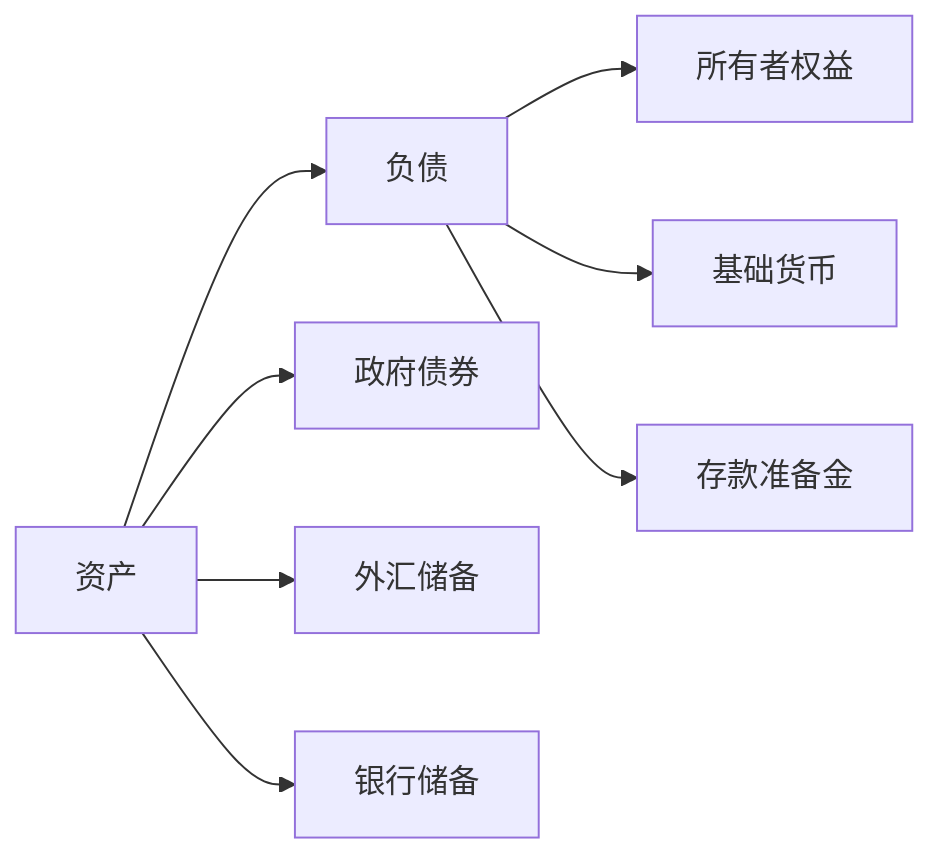

                 


# 央行资产负债表扩张对股市估值的影响

## 关键词：央行资产负债表，股市估值，货币政策，资产定价，量化宽松

## 摘要：本文从央行资产负债表的扩张机制出发，分析其对股市估值的影响路径，结合数学模型和实际案例，探讨货币政策与资本市场之间的深层联系，为投资者提供理论支持和实践指导。

---

# 第一部分: 央行资产负债表扩张的背景与机制

## 第1章: 央行资产负债表概述

### 1.1 央行资产负债表的基本结构

#### 1.1.1 资产负债表的定义与组成
央行资产负债表由资产、负债和所有者权益三部分组成，其中资产包括外汇储备、政府债券、银行储备等，负债主要包括央行发行的货币、银行存款准备金等。通过Mermaid流程图可以清晰展示央行资产负债表的结构：



#### 1.1.2 央行资产负债表的核心要素
央行资产负债表的核心要素包括：
- **资产端**：政府债券、外汇储备、银行储备等。
- **负债端**：基础货币、存款准备金、政府债务等。

#### 1.1.3 央行资产负债表的经济功能
央行通过调整资产负债表实现货币政策目标，包括调节货币供应量、影响利率水平、维护金融稳定等。

### 1.2 央行资产负债表的扩张机制

#### 1.2.1 货币政策工具的运用
央行通过公开市场操作、再贷款、再贴现等工具实现资产负债表的扩张。例如，公开市场操作中，央行通过买入政府债券增加资产端，同时增加基础货币供给。

#### 1.2.2 公开市场操作的原理
公开市场操作是央行调节货币供应量的主要工具，通过买卖政府债券影响市场利率和流动性。

#### 1.2.3 再贷款与再贴现政策
再贷款和再贴现政策通过向商业银行提供低息贷款，增加商业银行的可贷资金，从而间接扩张信贷规模。

## 第2章: 央行资产负债表扩张的理论基础

### 2.1 货币供给与需求理论

#### 2.1.1 货币需求的凯恩斯模型
凯恩斯模型认为，货币需求与利率和收入水平相关，公式为：$$ L = L_0 + L_1Y - L_2i $$。

#### 2.1.2 货币供给的商业银行与央行机制
货币供给由央行和商业银行共同决定，公式为：$$ M = M_0 + M_1 \times \text{基础货币} $$。

#### 2.1.3 货币市场均衡的IS-LM模型
IS-LM模型描述了产品市场和货币市场的均衡状态，其中LM曲线表示货币市场均衡，公式为：$$ M/P = L(r, Y) $$。

### 2.2 资本资产定价模型（CAPM）

#### 2.2.1 CAPM的基本假设
CAPM假设市场是完全竞争的，投资者风险偏好一致，公式为：$$ E(r_i) = r_f + \beta_i (E(r_m) - r_f) $$。

#### 2.2.2 CAPM的数学公式与推导
CAPM的核心公式推导基于无风险资产和市场组合的最优配置，公式为：$$ E(r_i) = \beta_i \times \text{市场风险溢价} + r_f $$。

#### 2.2.3 CAPM在股市估值中的应用
通过CAPM可以估算股票的预期收益率，从而评估其估值是否合理。

### 2.3 资产重定价理论

#### 2.3.1 资产重定价的定义与机制
资产重定价是指市场参与者根据新信息调整资产价格的过程，通常由央行货币政策变化引发。

#### 2.3.2 货币政策对资产价格的影响路径
货币政策通过影响利率、流动性和市场情绪间接影响资产价格。

#### 2.3.3 资产重定价的短期与长期效应
短期效应包括资产价格的快速调整，长期效应包括经济结构调整和市场参与者行为变化。

## 第3章: 央行资产负债表扩张对股市估值的影响路径

### 3.1 利率渠道

#### 3.1.1 利率的传导机制
央行通过调整利率影响企业和个人的借贷成本，进而影响投资和消费。

#### 3.1.2 利率下降对股市估值的提升作用
低利率环境降低了企业的融资成本，提升了企业盈利能力和股票估值。

#### 3.1.3 利率渠道的局限性
利率渠道的有效性取决于市场对利率变化的敏感性和央行政策的可信度。

### 3.2 资产重定价渠道

#### 3.2.1 资产重定价的理论基础
资产重定价理论认为，央行货币政策变化会导致市场参与者调整资产价格。

#### 3.2.2 央行扩表对资产价格的直接影响
通过购买资产或改变市场流动性，央行直接影响资产价格。

#### 3.2.3 资产重定价的市场反馈效应
市场参与者对央行扩表的预期会进一步推动资产价格调整。

### 3.3 预期渠道

#### 3.3.1 市场参与者对央行政策的预期
市场参与者对央行未来政策的预期会影响当前的资产定价。

#### 3.3.2 预期对股市估值的双重影响
正面预期会提升估值，负面预期会降低估值。

#### 3.3.3 预期渠道的动态调整过程
市场预期会随着央行政策的变化而动态调整。

---

# 第二部分: 央行资产负债表扩张的量化分析

## 第4章: 央行资产负债表扩张的量化分析

### 4.1 货币政策与股市估值的计量模型

#### 4.1.1 多因素回归模型的构建
构建包含货币政策、经济指标和市场变量的回归模型，公式为：$$ r_i = \beta_0 + \beta_1 M_t + \beta_2 Y_t + \epsilon $$。

#### 4.1.2 资产定价模型的实证检验
通过实证检验验证CAPM模型的有效性，公式为：$$ E(r_i) = \beta_i \times \text{市场风险溢价} + r_f $$。

#### 4.1.3 货币政策对股市收益的影响系数
通过回归分析确定货币政策变量对股市收益的具体影响系数。

### 4.2 资本资产定价的数学模型

#### 4.2.1 CAPM的扩展与应用
扩展CAPM模型，加入央行资产负债表扩张的相关变量，公式为：$$ E(r_i) = r_f + \beta_i (E(r_m) - r_f) + \gamma \times \text{资产负债表扩张因子} $$。

#### 4.2.2 货币政策变量的引入与估计
通过向模型中引入央行资产负债表扩张变量，估计其对股市估值的影响。

#### 4.2.3 实证结果的解释与分析
解释实证结果，验证央行资产负债表扩张对股市估值的影响是否显著。

### 4.3 资产重定价的动态模型

#### 4.3.1 动态随机一般均衡模型（DSGE）
DSGE模型用于分析央行资产负债表扩张对资产价格的动态影响，公式为：$$ E_t [P_{t+1}] = \alpha P_t + \beta M_t + \gamma \epsilon_t $$。

#### 4.3.2 资产重定价的时变特征
通过时变系数模型分析资产重定价的动态特征。

#### 4.3.3 货币政策冲击的脉冲响应分析
通过脉冲响应分析央行资产负债表扩张对股市估值的短期和长期影响。

---

# 第三部分: 央行资产负债表扩张的国际经验与启示

## 第5章: 央行资产负债表扩张的国际经验与启示

### 5.1 美联储的量化宽松政策

#### 5.1.1 2008年金融危机后的量化宽松
美联储通过多次量化宽松政策，显著扩张资产负债表，稳定金融市场。

#### 5.1.2 日本央行的长期量化宽松
日本央行通过持续的量化宽松政策应对通货紧缩压力，但效果有限。

#### 5.1.3 欧洲央行的资产购买计划
欧洲央行通过购买主权债券和私人部门资产，缓解债务危机。

### 5.2 量化宽松政策的国际经验

#### 5.2.1 对股市估值的直接影响
量化宽松政策通过增加流动性，提升股市估值。

#### 5.2.2 对经济基本面的影响
量化宽松政策通过刺激经济增长间接影响股市估值。

#### 5.2.3 对市场预期的影响
量化宽松政策通过影响市场预期，推动资产价格重定价。

### 5.3 对中国央行资产负债表扩张的启示

#### 5.3.1 中国央行资产负债表的特点
中国央行资产负债表以外汇储备为主，信贷资产为辅。

#### 5.3.2 中国央行资产负债表扩张的路径
通过降准、降息、公开市场操作等工具实现资产负债表扩张。

#### 5.3.3 对股市估值的潜在影响
中国央行资产负债表扩张可能通过降低融资成本、增加流动性等途径影响股市估值。

---

## 第6章: 结论与展望

### 6.1 主要结论
- 央行资产负债表扩张通过利率、资产重定价和预期渠道影响股市估值。
- 量化宽松政策在不同国家和经济环境下的效果存在差异。
- 未来研究应结合微观市场结构和投资者行为，深入分析央行资产负债表扩张的影响机制。

### 6.2 投资建议
- 投资者应关注央行货币政策变化，合理配置资产。
- 在央行资产负债表扩张周期中，成长性较高的股票可能表现较好。
- 注意防范政策退出带来的市场波动风险。

### 6.3 研究的局限性与未来方向
- 当前研究主要基于理论模型和实证分析，未来可结合实验经济学方法进一步验证。
- 需要进一步研究央行资产负债表扩张对不同类型资产的影响差异。

### 6.4 注意事项
- 投资需谨慎，理性分析市场风险。
- 本文仅为理论探讨，实际投资需结合市场环境和专业分析。

### 6.5 拓展阅读
- 《货币主义与通货膨胀》
- 《资产定价理论》
- 《中央银行学》

---

# 附录: Python代码实现

### 附录A: 资产定价模型的代码实现

```python
import numpy as np
import pandas as pd

# 数据加载与预处理
data = pd.read_csv('market_data.csv')
data = data[['returns', 'risk_free', 'market_returns']]
data = data.dropna()

# 回归模型构建
from sklearn.linear_model import LinearRegression
model = LinearRegression()
X = data[['risk_free', 'market_returns']]
y = data['returns']
model.fit(X, y)

# 结果分析
print('回归系数:', model.coef_)
print('截距:', model.intercept_)
```

### 附录B: 资产重定价模型的代码实现

```python
import numpy as np

# DSGE模型参数设置
params = {
    'alpha': 0.5,
    'beta': 0.3,
    'gamma': 0.2,
    'sigma': 0.1
}

# 模型模拟
def simulate_policy_shock(params):
    # 初始化变量
    P = np.zeros(100)
    M = np.zeros(100)
    epsilon = np.random.normal(0, params['sigma'], 100)
    
    for t in range(100):
        if t == 0:
            P[t] = params['alpha'] * P[t-1] + params['beta'] * M[t] + params['gamma'] * epsilon[t]
        else:
            P[t] = params['alpha'] * P[t-1] + params['beta'] * M[t] + params['gamma'] * epsilon[t]
        M[t] = M[t-1] + np.random.normal(0, params['sigma'], 1)
    
    return P

# 生成脉冲响应
P = simulate_policy_shock(params)
print('资产价格变化:', P)
```

---

以上为完整的技术博客文章大纲和内容，涵盖了从理论到实践的全过程，结合了专业术语和实际案例，适合对货币政策和金融市场感兴趣的读者阅读。

