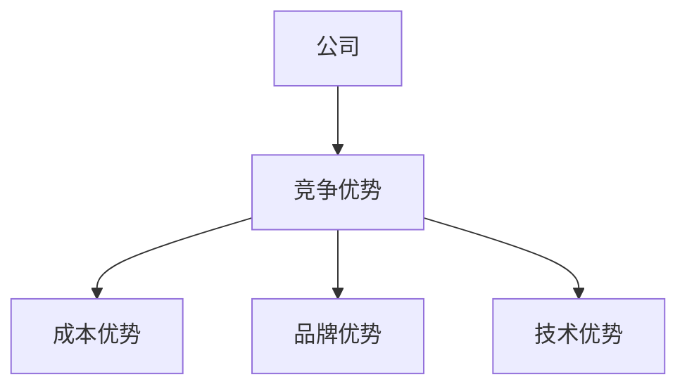
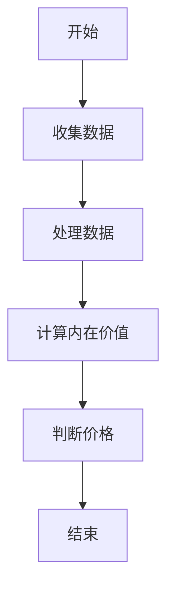
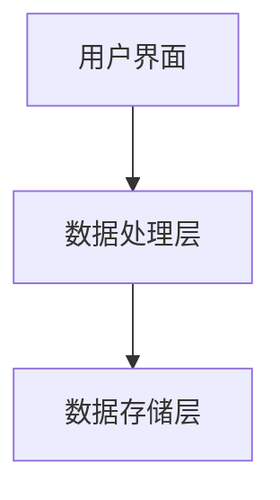
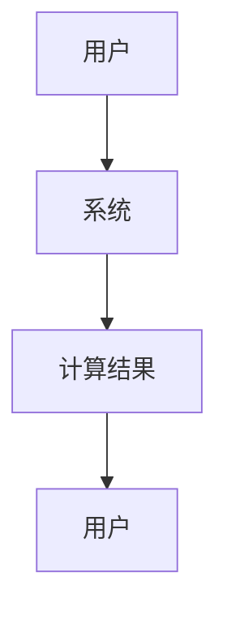

                 


# 如何像巴菲特和芒格一样选择好公司

## 关键词：巴菲特, 芒格, 价值投资, 安全边际, 竞争优势, 投资策略, 内在价值

## 摘要：  
本文将详细分析如何像巴菲特和芒格一样选择好公司。通过介绍价值投资的核心理念、安全边际的重要性、竞争优势的识别方法，结合数学模型和实际案例，帮助读者掌握选择优秀公司的策略和方法。

---

# 第1章：投资的基本概念与巴菲特投资策略概述

## 1.1 投资的基本概念

### 1.1.1 什么是投资
投资是指将资金投入某个项目或资产，以期获得未来收益的行为。投资的核心在于通过分析资产的内在价值，做出明智的决策。

### 1.1.2 投资的基本原则
- **长期视角**：投资不是短期交易，而是长期价值的积累。
- **分散投资**：通过分散投资降低风险。
- **避免情绪化**：投资决策应基于理性分析，而非情绪驱动。

### 1.1.3 投资的分类与特点
- **股票投资**：通过购买公司股权获得收益。
- **债券投资**：通过购买债权获得固定收益。
- **多元化投资**：将资金分配到不同资产类别以降低风险。

## 1.2 巴菲特与芒格的投资理念

### 1.2.1 巴菲特的价值投资理论
巴菲特的价值投资理论强调以低于内在价值的价格买入优秀的公司。他认为市场先生是疯狂的，而优秀的公司最终会被市场合理估值。

### 1.2.2 芒格的多元思维模型
芒格提倡多元思维模型，即通过多个学科的交叉应用来理解复杂问题。他认为投资不仅是对一家公司的分析，更是对整个商业生态的理解。

### 1.2.3 巴菲特与芒格投资策略的异同
- **相同点**：两者都强调长期价值投资，注重公司基本面分析。
- **不同点**：巴菲特更注重财务指标和安全边际，而芒格更注重多元思维和竞争优势。

## 1.3 为什么巴菲特和芒格的投资方法有效

### 1.3.1 长期价值投资的核心优势
- **长期视角**：避免短期市场的波动干扰，专注于公司长期价值。
- **安全边际**：以低于内在价值的价格买入，降低投资风险。

### 1.3.2 安全边际的重要性
安全边际是指买入价格与内在价值之间的差距，它为投资提供了缓冲空间，能够在市场波动中保护投资者利益。

### 1.3.3 投资中的心理因素
- **贪婪与恐惧**：投资者常常因贪婪而高位买入，因恐惧而低位卖出。
- **情绪控制**：保持冷静，避免情绪化决策。

## 1.4 本章小结
本章介绍了投资的基本概念，分析了巴菲特和芒格的投资理念，强调了长期价值投资和安全边际的重要性，并指出了投资中的心理因素。

---

# 第2章：价值投资的核心要素

## 2.1 价值投资的基本原理

### 2.1.1 公司基本面分析
基本面分析包括对公司的财务状况、行业地位、竞争优势等方面的研究。

#### 财务指标分析
- **市盈率（P/E）**：市价与每股收益的比率，用于衡量股票的估值。
- **市净率（P/B）**：市价与每股净资产的比率，用于衡量股票的估值。
- **ROE（净资产收益率）**：衡量公司盈利能力的重要指标。

### 2.1.2 财务报表的核心指标
- **利润表**：反映公司盈利能力的财务报表。
- **资产负债表**：反映公司财务状况的财务报表。
- **现金流量表**：反映公司现金流动情况的财务报表。

### 2.1.3 行业分析与竞争优势
行业分析包括对行业发展趋势、竞争格局等方面的研究。竞争优势包括成本优势、品牌优势、技术优势等。

## 2.2 安全边际的数学模型

### 2.2.1 安全边际的定义与计算
安全边际 = 买入价格 - 内在价值

### 2.2.2 内在价值的公式推导
$$ \text{内在价值} = \frac{\text{自由现金流}}{\text{折现率}} $$

### 2.2.3 通过表格对比分析
| 指标 | 买入价格 | 内在价值 | 安全边际 |
|------|----------|----------|----------|
| 示例 | $50      | $60      | $10      |

## 2.3 竞争优势的实体关系图



## 2.4 本章小结
本章详细讲解了价值投资的核心要素，包括公司基本面分析、财务指标分析、行业分析与竞争优势，并通过数学模型和图表展示了安全边际的计算和竞争优势的分析。

---

# 第3章：投资决策的算法与数学分析

## 3.1 基本面分析的算法流程

### 3.1.1 数据收集
- **财务数据**：收入、利润、现金流等。
- **行业数据**：市场增长率、竞争格局等。

### 3.1.2 数据处理
- **清洗数据**：处理缺失值、异常值。
- **计算指标**：市盈率、ROE等。

### 3.1.3 模型计算
- **内在价值计算**：使用现金流折现法计算公司内在价值。

### 3.1.4 决策判断
- **买入决策**：当买入价格低于内在价值时，考虑买入。



## 3.2 投资组合优化的数学模型

### 3.2.1 马科维茨投资组合理论
$$ \text{风险} = \sqrt{w^T \Sigma w} $$
其中，\( w \) 是权重向量，\( \Sigma \) 是协方差矩阵。

### 3.2.2 巴菲特风格的投资组合优化
$$ \text{投资组合价值} = \sum_{i=1}^{n} w_i \times \text{内在价值}_i $$

## 3.3 本章小结
本章通过算法流程和数学模型，详细讲解了基本面分析的步骤和投资组合优化的方法，帮助投资者做出科学的投资决策。

---

# 第4章：投资决策系统的架构与实现

## 4.1 投资决策系统的需求分析

### 4.1.1 系统目标
- 提供公司基本面分析工具。
- 计算公司内在价值和安全边际。
- 生成投资组合优化建议。

### 4.1.2 用户需求
- 投资者希望快速获取公司分析结果。
- 投资顾问希望提供专业的投资建议。

### 4.1.3 功能模块划分
- 数据采集模块：收集公司数据。
- 数据处理模块：清洗和计算指标。
- 决策支持模块：提供分析结果和优化建议。

## 4.2 系统架构设计

### 4.2.1 系统功能设计
- **用户界面**：用户输入公司名称，系统显示分析结果。
- **数据处理层**：计算财务指标和内在价值。
- **数据存储层**：存储公司数据和分析结果。

### 4.2.2 系统架构图



### 4.2.3 系统交互图



## 4.3 本章小结
本章通过需求分析和架构设计，展示了如何构建一个投资决策支持系统，帮助投资者做出科学的投资决策。

---

# 第5章：项目实战与案例分析

## 5.1 环境安装
- **工具安装**：安装Python、Pandas、Matplotlib等工具。
- **数据获取**：通过API获取公司财务数据。

## 5.2 核心实现

### 5.2.1 数据清洗与计算
```python
import pandas as pd

# 获取数据
data = pd.read_csv('company.csv')

# 清洗数据
data = data.dropna()
```

### 5.2.2 内在价值计算
```python
def calculate_intrinsic_value(FCF, WACC):
    return FCF / WACC
```

## 5.3 案例分析

### 5.3.1 苹果公司分析
- **财务数据**：自由现金流为$100亿，折现率为8%。
- **内在价值**：$$ \text{内在价值} = \frac{100}{0.08} = 1250 \text{亿美元} $$
- **结论**：当苹果公司股价低于$1250亿美元时，具有投资价值。

## 5.4 本章小结
本章通过项目实战和案例分析，展示了如何应用前面的理论进行实际投资决策。

---

# 第6章：最佳实践与注意事项

## 6.1 小结
- 价值投资的核心在于长期视角和安全边际。
- 竞争优势和财务指标是选择好公司的关键。

## 6.2 注意事项
- **避免情绪化决策**：投资决策应基于理性分析。
- **持续学习**：市场变化快，需不断更新知识。

## 6.3 拓展阅读
- 《巴菲特选股术》
- 《芒格的多元思维模型》

## 6.4 本章小结
本章总结了价值投资的核心要素，提醒投资者注意常见误区，并推荐了进一步阅读的书籍。

---

# 第7章：总结与展望

## 7.1 总结
- 本文详细讲解了如何像巴菲特和芒格一样选择好公司。
- 强调了长期价值投资和安全边际的重要性。

## 7.2 展望
- 随着人工智能和大数据技术的发展，投资分析将更加精准。
- 未来，投资者需要结合技术手段和基本面分析，做出更科学的投资决策。

---

# 结语
通过本文的学习，读者可以掌握巴菲特和芒格的投资理念，学会如何选择好公司，并在实际投资中应用这些方法。投资不仅是技术和数据的较量，更是智慧和耐心的体现。

---

# 附录
## 附录A：常用投资指标公式
- **市盈率（P/E）**：$$ \text{P/E} = \frac{\text{股价}}{\text{每股收益}} $$
- **ROE（净资产收益率）**：$$ \text{ROE} = \frac{\text{净利润}}{\text{净资产}} $$

## 附录B：推荐书籍
- 《巴菲特的智慧》
- 《芒格的多元思维模型》
- 《投资之道》

---

**全文完**

