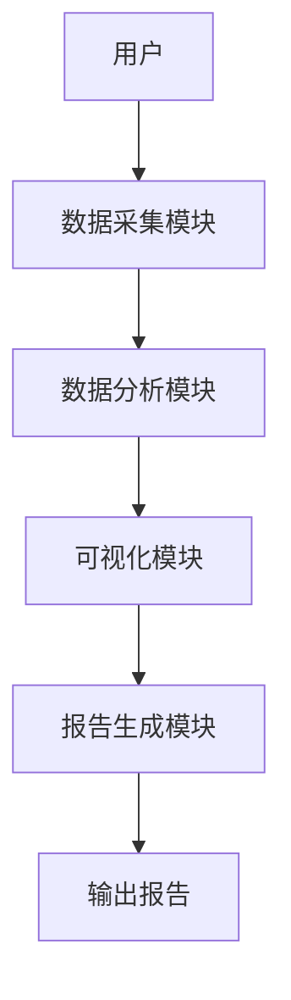

                 

# 如何像彼得·林奇一样分析行业趋势

## 关键词：
- 彼得·林奇
- 行业趋势分析
- 投资策略
- 基本面分析
- 经济周期
- 五力模型

## 摘要：
本文将详细探讨如何像彼得·林奇一样进行行业趋势分析。通过分析彼得·林奇的投资理念和方法，结合基本面分析、行业生命周期、竞争结构分析等工具，帮助读者掌握行业趋势预测的核心技巧。文章涵盖背景介绍、核心概念、数学模型、系统架构设计和项目实战，提供全面的指导和实用案例。

---

## 第1章：行业趋势分析的背景与重要性

### 1.1 背景介绍

行业趋势分析是投资者在做出决策前必须掌握的关键技能。本文将介绍彼得·林奇的投资理念，分析其如何通过基本面分析和行业趋势预测来选择投资标的。

#### 1.1.1 行业趋势分析的基本概念
行业趋势分析是对某一行业未来发展方向和变化的预测，帮助投资者识别投资机会和风险。关键概念包括行业生命周期、竞争结构和宏观经济影响。

#### 1.1.2 彼得·林奇的投资理念
彼得·林奇以基本面分析闻名，强调深入研究公司和行业基本面，寻找具有持续增长潜力的企业。他的方法包括行业生命周期分析、竞争结构分析和宏观经济因素评估。

---

## 第2章：彼得·林奇的行业趋势分析方法

### 2.1 行业生命周期分析

#### 2.1.1 行业生命周期的四个阶段
1. **导入期**：市场需求低，技术不稳定，企业竞争少。
2. **成长期**：需求增长快，企业数量增加，技术成熟。
3. **成熟期**：市场饱和，企业竞争激烈，增长放缓。
4. **衰退期**：需求下降，企业倒闭或转型。

#### 2.1.2 生命周期拐点的识别
通过分析行业收入增长率、市场份额变化和技术创新率，判断行业所处阶段。

---

### 2.2 行业竞争结构分析

#### 2.2.1 五力模型在行业分析中的应用
- **潜在进入者的威胁**：行业进入壁垒高低。
- **替代品的威胁**：替代品的可用性和价格。
- **供应商的议价能力**：供应商的集中度和替代产品。
- **购买者的议价能力**：买方的集中度和替代产品。
- **行业内竞争者的竞争程度**：行业内企业的数量和市场份额分布。

---

## 第3章：行业趋势预测的数学模型

### 3.1 时间序列分析模型

#### 3.1.1 时间序列分析的基本步骤
1. 数据收集与预处理。
2. 确定趋势、周期性和随机性成分。
3. 建立ARIMA模型或其他时间序列模型。
4. 进行预测并验证模型准确性。

#### 3.1.2 ARIMA模型公式
$$ ARIMA(p, d, q) $$
其中，p为自回归阶数，d为差分阶数，q为移动平均阶数。

---

## 第4章：行业趋势分析的系统架构设计

### 4.1 系统功能设计

#### 4.1.1 功能模块
- 数据采集模块：收集行业数据。
- 数据分析模块：应用数学模型进行趋势预测。
- 可视化模块：生成趋势图表。
- 报告生成模块：输出分析报告。

#### 4.1.2 系统架构图

---

## 第5章：项目实战：消费行业趋势分析

### 5.1 数据收集与预处理

#### 5.1.1 数据来源
- 公司财务报表。
- 行业报告和市场数据。

#### 5.1.2 数据清洗
- 处理缺失值。
- 异常值处理。

---

### 5.2 应用时间序列分析模型

#### 5.2.1 建立ARIMA模型
假设我们有消费行业的季度收入数据，经过差分后得到平稳序列，建立ARIMA(1,1,1)模型。

#### 5.2.2 预测结果
使用模型预测未来几个季度的收入，并与实际数据进行对比，评估模型准确性。

---

## 第6章：总结与展望

### 6.1 总结
彼得·林奇的行业趋势分析方法结合了基本面分析和数学模型，帮助投资者识别行业机会和风险。本文详细介绍了其方法，并通过案例展示了实际应用。

### 6.2 展望
未来，随着大数据和人工智能的发展，行业趋势分析将更加精准和高效。投资者可以利用新技术提升分析能力，捕捉更多投资机会。

---

## 最佳实践 Tips

1. **数据质量**：确保数据的准确性和完整性。
2. **模型选择**：根据行业特点选择合适的数学模型。
3. **持续学习**：关注行业动态和新技术发展。

通过本文的指导，读者可以像彼得·林奇一样，掌握行业趋势分析的核心技能，做出更明智的投资决策。

