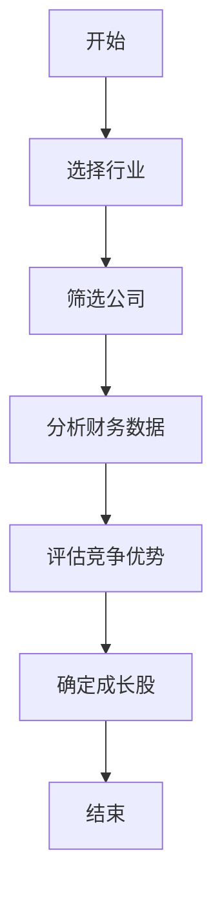

                 


# 如何像彼得·林奇一样发现成长股

## 关键词：
- 彼得·林奇
- 成长股
- 投资策略
- 财务分析
- 行业分析

## 摘要：
本文将详细介绍如何像彼得·林奇一样发现成长股。通过分析彼得·林奇的投资哲学、成长股的核心概念、筛选方法以及实际案例，帮助读者掌握成长股的投资策略。文章从理论到实践，结合数学模型和系统架构，提供全面的指导，帮助投资者在复杂的市场中找到优质的成长股。

---

## 第一部分：背景介绍

### 第1章：彼得·林奇与成长股投资概述

#### 1.1 彼得·林奇的投资哲学
彼得·林奇是全球最著名的基金经理之一，以其独特的成长股投资策略闻名。他强调深入研究公司基本面，寻找那些具备持续增长潜力的企业。林奇的成功不仅在于他的投资方法，更在于他对市场的深刻理解。

- **1.1.1 彼得·林奇的生平简介**
  彼得·林奇出生于1940年，曾在富达投资管理公司担任基金经理，管理麦哲伦基金，创造了令人瞩目的投资业绩，年化回报率超过29%。

- **1.1.2 林奇的投资理念与方法**
  林奇认为，投资成功的关键在于选择那些具有强大竞争优势、良好财务状况和巨大成长空间的公司。他强调长期持有，避免频繁交易。

- **1.1.3 林奇的成功案例与影响力**
  林奇管理的麦哲伦基金在任职期间取得了辉煌的业绩，他的投资理念影响了无数投资者，成为成长股投资的典范。

#### 1.2 成长股的定义与特点
成长股是指那些收入和利润持续增长，且未来增长潜力较大的公司股票。这些公司通常处于快速发展的行业，具备强大的竞争优势和良好的财务状况。

- **1.2.1 成长股的定义**
  成长股是指那些收入和利润持续增长，且未来增长潜力较大的公司股票。

- **1.2.2 成长股的核心要素**
  成长股的核心要素包括行业前景、财务状况、竞争优势和管理团队。

- **1.2.3 成长股与价值股的区别**
  成长股强调未来的增长潜力，而价值股强调当前的低估价格。成长股的风险通常较高，但潜在回报也更大。

#### 1.3 成长股投资的背景与意义
随着经济的发展和技术的进步，成长股投资变得越来越重要。通过投资成长股，投资者可以分享创新型企业的增长红利，实现资产的长期增值。

- **1.3.1 成长股投资的背景**
  随着科技和经济的发展，成长股投资逐渐成为主流。

- **1.3.2 成长股投资的意义**
  成长股投资是实现财富增长的重要途径，尤其在新兴行业和技术创新领域。

- **1.3.3 成长股投资的边界与外延**
  成长股投资不仅限于科技行业，还包括消费、医疗等多个领域。

---

## 第二部分：成长股的核心概念与联系

### 第2章：成长股的核心要素与分析框架

#### 2.1 成长股的核心要素
- **行业分析**
  行业是公司增长的基础。选择处于上升期的行业是发现成长股的第一步。

- **财务指标分析**
  财务数据是判断公司成长性的关键。重点关注收入增长率、净利润率等指标。

- **竞争优势分析**
  公司的竞争优势决定了其未来的增长潜力。强大的竞争优势是成长股的核心要素。

#### 2.2 成长股的分析框架
- **从行业到公司的分析框架**
  先分析行业趋势，再筛选出行业内具备竞争优势的公司。

- **财务数据与成长性的关联**
  通过财务指标分析公司盈利能力、成长性和财务健康状况。

- **竞争优势与成长空间的关系**
  竞争优势越强，公司的成长空间越大，投资价值越高。

---

## 第三部分：成长股的筛选方法与数学模型

### 第3章：成长股的筛选方法

#### 3.1 成长股的筛选标准
- **行业前景分析**
  选择处于增长期的行业，如科技、医疗、消费等领域。

- **财务指标筛选**
  重点关注收入增长率、净利润率、ROE等指标。

- **竞争优势评估**
  分析公司的市场地位、品牌、技术等竞争优势。

#### 3.2 成长股筛选的数学模型
- **市盈率（P/E）计算公式**
  $$ P/E = \frac{Price}{Earnings} $$
  市盈率反映了股票的估值，低市盈率可能意味着低估，但也要考虑公司的成长性。

- **市净率（P/B）计算公式**
  $$ P/B = \frac{Price}{Book\ Value} $$
  市净率用于评估股票相对于其账面价值的高低，通常用于判断股票是否被低估。

- **净资产收益率（ROE）计算公式**
  $$ ROE = \frac{Net\ Profit}{Total\ Equity} $$
  ROE衡量了公司使用股东资金的效率，高ROE通常意味着公司管理良好。

#### 3.3 成长股筛选的流程图


---

## 第四部分：成长股投资的系统分析与架构设计

### 第4章：成长股投资的系统分析

#### 4.1 行业趋势分析
行业趋势是成长股投资的基础。选择处于上升期的行业，如科技、医疗等。

#### 4.2 财务数据与成长性的关联
通过财务数据评估公司的盈利能力、成长性和财务健康状况。

#### 4.3 竞争优势评估
分析公司的竞争优势，如品牌、技术、市场地位等。

#### 4.4 投资组合优化
根据风险承受能力和收益目标，构建优化的投资组合。

#### 4.5 风险管理
设定止损点，分散投资，降低风险。

#### 4.6 系统架构设计
- **领域模型（Mermaid类图）**
  ```mermaid
  classDiagram
      class 成长股 {
          行业
          公司
          财务数据
          竞争优势
      }
      class 投资者 {
          投资组合
          风险管理
      }
      成长股 --> 投资者
  ```

- **系统架构图**
  ```mermaid
  graph LR
      I[投资者] --> A[行业分析]
      A --> B[公司筛选]
      B --> C[财务分析]
      C --> D[竞争优势评估]
      D --> E[投资决策]
      E --> F[投资组合管理]
  ```

---

## 第五部分：项目实战

### 第5章：成长股投资的实战案例

#### 5.1 微软（Microsoft）
- 行业：科技
- 财务数据：收入持续增长，ROE高
- 竞争优势：强大的生态系统和技术创新能力

#### 5.2 苹果（Apple）
- 行业：科技
- 财务数据：净利润率高
- 竞争优势：品牌影响力和产品创新

#### 5.3 亚马逊（Amazon）
- 行业：电子商务
- 财务数据：收入增长快
- 竞争优势：物流网络和技术优势

---

## 第六部分：总结与展望

### 第6章：成长股投资的总结与展望

#### 6.1 投资总结
- 成长股投资需要深入分析行业趋势、财务数据和竞争优势。
- 选择具备持续增长潜力的公司，长期持有。

#### 6.2 投资注意事项
- 风险管理：设定止损点，分散投资。
- 避免短期波动：关注长期增长，避免受短期市场波动影响。

#### 6.3 未来展望
- 随着科技和经济的发展，成长股投资将更加重要。
- 投资者需要不断学习和适应市场的变化。

---

## 结语
通过本文的学习，读者可以掌握彼得·林奇的成长股投资方法，学会如何筛选和分析成长股，构建优质的投资组合。投资成长股需要耐心、深入的研究和持续的学习，但回报也是巨大的。

---

## Tips：
- **深入研究**：成长股投资需要对行业和公司进行深入研究，避免盲目跟风。
- **风险管理**：合理控制风险，分散投资，避免过度集中。
- **长期持有**：成长股需要时间来体现价值，耐心是关键。

---

希望这篇文章能为您提供有价值的信息，帮助您更好地理解如何像彼得·林奇一样发现成长股。

